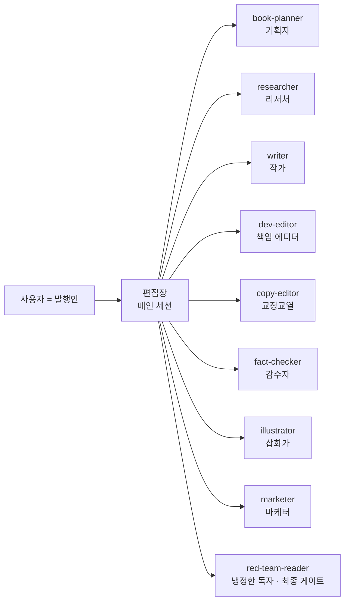

# bookuse — 1인 출판사 오케스트레이션

출판사의 지식산업 구조(기획 → 자료조사 → 집필 → 편집 → 교정 → 감수 → 삽화 → 마케팅)를 Claude Code의 서브 에이전트로 복제한 1인 출판 시스템. 목표는 하나: **AI 슬롭이 아닌, 독자가 돈값을 느끼는 책.**

## 구조



- **편집장(메인 세션)** 은 직접 쓰지 않고 위임·검수·상태 관리만 한다 (`CLAUDE.md`).
- **red-team-reader** 는 AI 슬롭 탐지 + 타깃 독자 빙의 평가를 하는 품질 게이트로, 이 에이전트의 반려는 편집장도 못 뒤집는다.
- 논픽션의 모든 사실 주장은 출처 있는 **자료카드** 없이는 책에 못 들어간다.

## 사용법

```
/book-plan 코딩 못 하는 마케터를 위한 AI 업무 자동화 (AI활용법)
   → 기획자가 기획안 작성, 냉정한 독자 심사 통과 후 books/<slug>/ 개설

/produce-chapter <slug> ch01
   → 조사→초고→퇴고→삽화까지 챕터 하나를 끝까지 생산 (워크호스)

/status
   → 전체 현황과 다음 할 일
```

세분 제어가 필요하면 단계별 커맨드를 쓴다:

| 커맨드 | 단계 | 투입 에이전트 |
|---|---|---|
| `/book-plan <주제>` | 기획 | book-planner → red-team-reader |
| `/research <slug> <ch>` | 자료조사 | researcher (챕터 병렬) |
| `/draft <slug> <ch>` | 초고 | writer |
| `/revise <slug> <ch>` | 퇴고 | dev-editor → writer → copy-editor → fact-checker → red-team-reader |
| `/illustrate <slug> <ch>` | 삽화 | illustrator |
| `/publish-prep <slug>` | 출간 준비 | dev-editor(통독) → fact-checker(전체) → marketer |
| `/status [slug]` | 현황 | — |

## 슬롭 방지 장치

1. **자료카드 강제** — 출처 없는 사실은 작가가 못 쓴다 (`[확인필요]`로만 표시 가능, 감수 전 해소 의무).
2. **슬롭 체크리스트** (`press/checklists/slop-checklist.md`) — "출처 없는 통계", "따라 할 수 없는 절차", "결론 없는 양시론" 등 하드 기준 6개 + 소프트 기준 10개를 기계적으로 검사.
3. **독립된 최종 게이트** — 만드는 에이전트와 평가하는 에이전트를 분리. 수정 루프는 최대 2회, 그 이상은 사용자에게 에스컬레이션.
4. **스타일가이드** (`press/style-guides/`) — 번역투·AI 문체 시그니처 금지 목록, 장르별(실용서/문학/AI활용법) 규범.

## 디렉터리

```
.claude/agents/    서브 에이전트 9종
.claude/skills/    파이프라인 슬래시 커맨드 8종
press/             스타일가이드 · 템플릿 · 체크리스트 (모든 책 공용)
books/<slug>/      책 한 권의 작업 공간 (STATUS.md가 현황판)
```

## 사람(발행인)이 하는 일

- 주제 결정, 에스컬레이션된 쟁점 판단, 최종 출간 결정
- 일러스트 브리프를 이미지 생성 AI에 넣기, 표지 디자인, ISBN 등 물리적 출간 절차
- 그리고 가장 중요한 것: **자기 경험을 재료로 넣기.** 에이전트는 출처 있는 사실만 다룬다. 책을 남과 다르게 만드는 1차 자료는 당신의 경험이다 — 집필 전에 작가에게 메모로 던져줘라.
