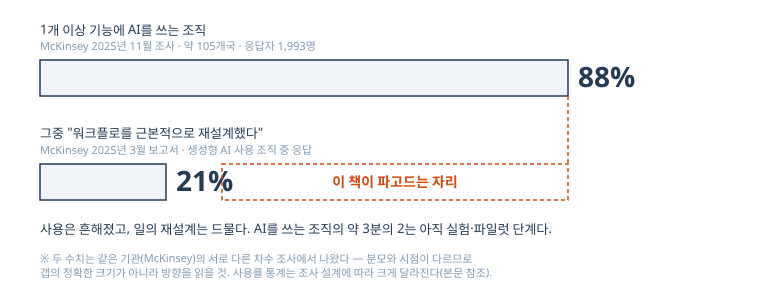
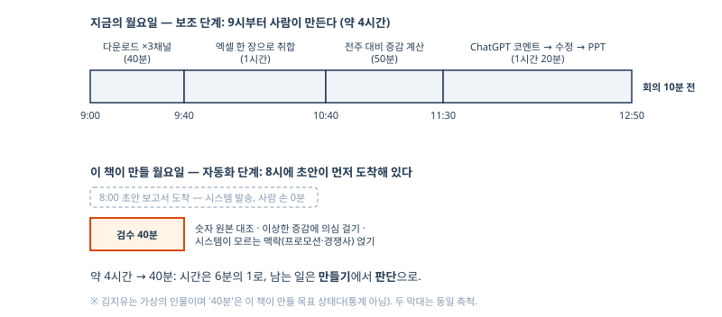
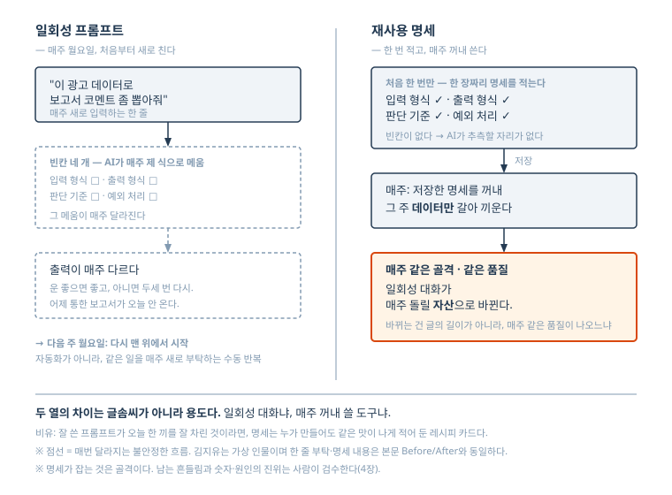
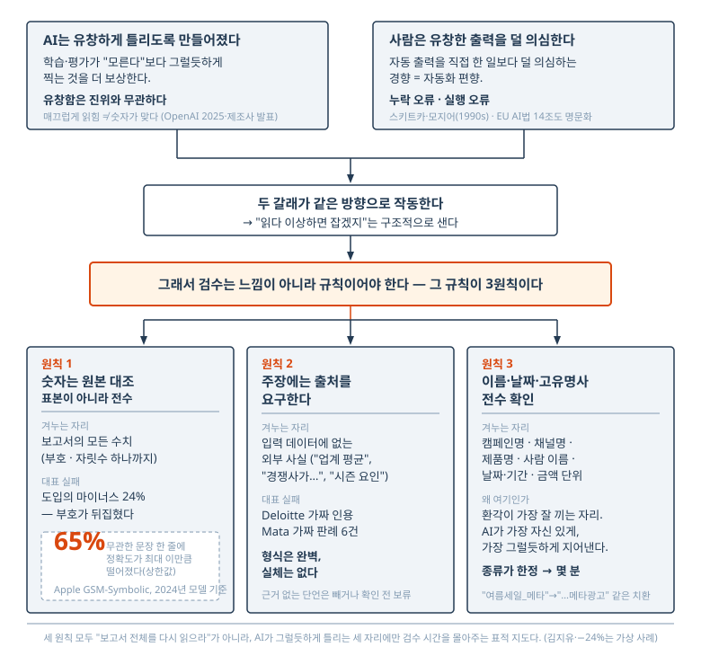
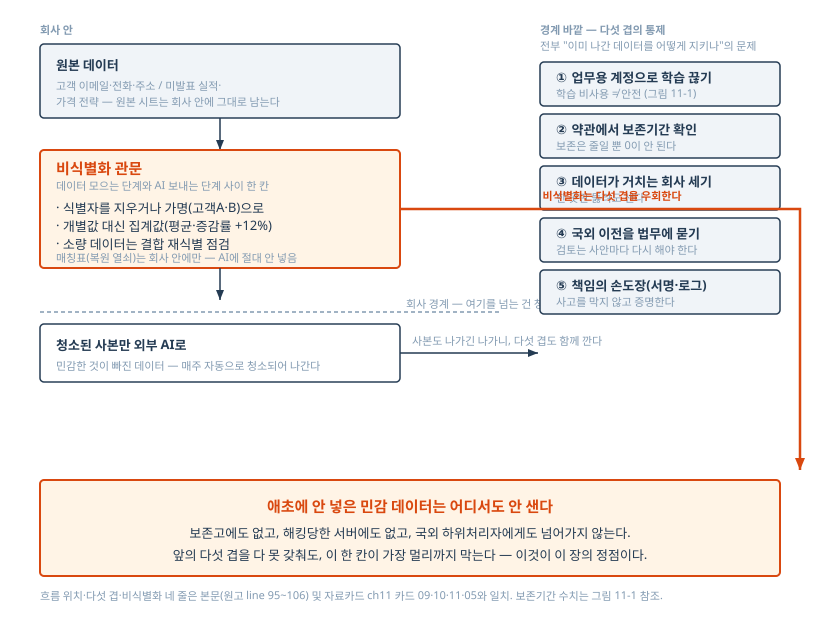

# 마케터의 월요일을 돌려드립니다
## — 코딩 못 하는 마케터를 위한 AI 업무 자동화 시스템

*(가제 — 최종 제목은 marketing/ 킷 참조)*

*2026년 6월 기준 / 조립일 2026-06-14*

---

# 머리말 — 월요일 4시간을 돌려드립니다

월요일 오전 9시. 당신은 메타 광고 관리자에 로그인하고, 기간을 지난주로 맞추고, 데이터를 내려받는다. 다음은 구글 애즈. 또 로그인하고, 또 기간을 맞추고, 또 내려받는다. 네이버 검색광고까지 마치면 파일 세 개가 쌓이고, 그걸 엑셀 한 장으로 합치고, 전주 대비 증감률을 계산하고, ChatGPT에 붙여넣어 코멘트 초안을 받고, 회사 PPT 템플릿에 옮긴다. 오후 1시 회의 10분 전에 겨우 끝난다. 4시간. 지난주 월요일과 똑같이, 그 전주 월요일과도 똑같이.

이 책은 그 월요일을 겨냥한다. 매주 돌아오는 그 4시간을 40분 검수로 바꾸는 것이 목표다. 만들기 4시간을, 시스템이 만들어 온 초안을 검수하는 40분으로.

## 이 책이 약속하는 것

이 책을 끝내면 당신은 반복 업무 세 가지를 돌아가는 시스템으로 직접 구축한 상태가 된다.

- **주간 광고 성과 보고서.** 흩어진 채널 데이터가 한 곳에 자동으로 모이고, 증감 분석과 보고서 초안, 발표용 슬라이드까지 만들어진다. 당신의 일은 숫자를 대조하고 코멘트를 다듬는 검수다.
- **경쟁사·트렌드 모니터링.** 매일 아침 동향 브리핑 한 통이 메신저나 메일로 도착한다.
- **콘텐츠 다채널 변환.** 원본 글 한 건을 넣으면 채널별 변형 초안이 나온다.

세 가지 모두 **코드 한 줄 없이** 만든다. 이 책은 코드를 가르치지 않는다. 당신이 직접 칠 코드는 한 줄도 없다.

한 가지는 분명히 해두자. 이 책은 "AI가 다 해준다"고 말하지 않는다. 시스템이 만들어 오는 것은 언제나 초안이고, 회사 밖으로 내보내기 전 사람이 마지막에 본다. 숫자는 원본과 대조하고, 그럴듯한 문장의 출처를 의심하고, 시스템이 모르는 맥락을 얹는 일은 당신의 몫으로 남는다. 4장 전체가 이 검수를 다루는 이유다. "사람이 마지막에 본다"는 이 책 전체의 안전장치다.

## 누구를 위한 책인가

엑셀 VLOOKUP까지는 한다. 코드는 못 읽는다. Python이라는 단어를 보면 창을 닫는다. 노코드 자동화 강의를 결제했다가 "웹훅"과 "API 키"가 쏟아지는 3강에서 멈춰본 적이 있다 — 강의가 도구 기능 순서로 흘러가서, 정작 내 업무가 언제 나오는지 끝까지 알 수 없었기 때문이다.

이 책은 그런 사람을 위해 썼다. 그래서 도구 기능 순서가 아니라 당신의 업무 순서로 간다. 주간 보고서, 경쟁사 모니터링, 콘텐츠 변환 — 당신이 매주 하는 일이 곧 목차다.

## 이 책을 읽는 법

세 부분으로 나뉜다.

- **1부 원리(1~4장).** 도구가 바뀌어도 남는 것. 무엇을 자동화할지 고르는 법, 매번 결과가 달라지는 문제를 입력 설계로 잡는 '업무 명세', 그리고 검수 체계. 절차가 아니라 판단 기준이다.
- **2부 절차(5~8장).** 위 세 프로젝트를 실제로 만든다. 2026년 6월 기준의 구체적인 절차이고, 각 장 첫머리에 "2026년 6월 기준" 버전 표시가 다시 나온다.
- **3부 운영(9~12장).** 만든 시스템을 굴리는 법. 세 자동화를 한 루틴으로 묶기, 깨졌을 때 30분 안에 원인 좁히기, 회사에서 잘리지 않는 보안 선 긋기, 그리고 도구가 낡았을 때 갈아타기.

순서대로 읽는 것을 권한다. 다만 보고서가 당장 급하면 5~6장부터 펴도 된다. 한 가지만 — 2부의 절차는 1부의 원리, 특히 3장의 업무 명세와 4장의 검수를 전제로 한다. 절차만 따라 하다 막히면 1부로 돌아오게 되어 있다.

## 시점에 관한 일러두기

본서의 도구·가격·화면은 2026년 6월 기준이다. AI 도구는 빠르게 바뀐다. 이 책이 쓴 도구도, 가격도, 버튼 위치도 당신이 읽는 시점에는 달라져 있을 수 있다.

그래서 이 책은 버튼이 아니라 원리를 가르친다. "왼쪽 위 파란 버튼"이 아니라 "값을 칸칸이 나눠 시트에 모은다"는 식으로. 버튼은 옮겨가도 동작의 개념은 남기 때문이다. 그리고 12장에 갈아타기 프로토콜을 두었다 — 이 책의 도구가 낡았을 때, 1부의 원리로 같은 시스템을 새 도구 위에 다시 짜는 법이다. 책의 휘발성을 책 안에서 정면으로 인정하는 장이다.

## "4시간 → 40분"에 관한 정직한 한 줄

이 책은 줄곧 "4시간을 40분으로"라고 말한다. 짚어둘 것이 있다. 이 수치는 약속이 아니라 목표다. 비교의 양쪽 — 자동화 전 4시간과 후 40분 — 은 모두 데이터 취합부터 분석, PPT 정리까지를 포함한 같은 범위로 잡았고, 실제 마케터를 대상으로 한 시간 측정이 지금도 진행 중이다. 당신의 업무 구성과 광고 계정 사정에 따라 당신의 숫자는 다를 수 있다. 어떤 채널은 자동 연결이 막혀 주 5분쯤 수동 단계가 남기도 한다(5장에서 그 경우를 정직하게 다룬다). 4시간이 40분이 안 되고 1시간 반에 멈춰도, 그 차이는 매주 돌아온다. 매주 돌아오기 때문에 만들 가치가 있다.

자, 월요일을 돌려받으러 가자.

---

# 차례

- 1장. 당신은 AI를 쓰고 있지만, 자동화는 아직 시작도 안 했다
- 2장. 자동화할 일 고르는 법 — 반복성×규칙성 매트릭스
- 3장. 프롬프트가 아니라 '업무 명세'를 써라
- 4장. 사람이 마지막에 본다 — 검증 체계 설계
- 5장. [프로젝트 1-A] 주간 성과 보고서: 데이터 취합 자동화
- 6장. [프로젝트 1-B] 주간 성과 보고서: 분석·초안·슬라이드 생성
- 7장. [프로젝트 2] 경쟁사·트렌드 모니터링 에이전트
- 8장. AI가 쓴 티, 우리 톤 아님, 저작권 — 콘텐츠 변환의 세 함정을 한 처방으로
- 9장. 세 자동화를 한 표로 묶는다 — 시스템이 아니라 운영을 통합한다
- 10장. 자동화가 깨지는 7가지 패턴과 응급 처치 — 보고서가 안 왔을 때 30분 안에 원인을 좁힌다
- 11장. 회사에서 잘리지 않는 자동화 — 보안·개인정보·책임
- 12장. 갈아타기 프로토콜 — 이 책의 도구가 낡았을 때

---

# 1장. 당신은 AI를 쓰고 있지만, 자동화는 아직 시작도 안 했다

월요일 오전 9시. 김지유는 노트북을 열고 메타 광고 관리자에 로그인한다. 보고 기간을 지난주 월요일부터 일요일로 맞추고 캠페인 성과 데이터를 내려받는다. 다음은 구글 애즈. 또 로그인하고, 또 기간을 맞추고, 또 내려받는다. 마지막으로 네이버 검색광고까지 마치면 바탕화면에 파일 3개가 쌓인다. 여기까지 40분. 오후 1시 팀 회의에 올라갈 주간 광고 성과 보고서의 첫 단계다.

파일 3개를 엑셀 한 장으로 합치는 데 1시간이 더 든다. 채널마다 열 이름이 다르고, 같은 '전환'도 집계 기준이 다르다. VLOOKUP으로 캠페인명을 맞추고 빠진 행을 찾아 메운다. 그다음은 전주 시트를 옆에 띄워놓고 ROAS와 CPA의 전주 대비 증감률을 계산하는 50분. 11시 반쯤 ChatGPT 차례가 온다. 정리한 숫자를 복사해 붙여넣고, 손에 익은 프롬프트를 친다. "아래는 지난주 광고 성과 데이터야. 전주 대비 증감을 중심으로 주간 보고서 코멘트 초안을 써줘." 나온 초안에서 어색한 문장을 고치고 틀린 숫자가 없는지 훑은 뒤, 회사 PPT 템플릿에 표와 코멘트를 옮겨 넣으면 12시 50분. 회의 10분 전이다. 4시간이 그렇게 갔다. 지난주 월요일과 똑같이, 그 전주 월요일과도 똑같이.

김지유는 가상의 인물이다. 이 책이 독자로 상정한 7년 차 퍼포먼스 마케터의 전형으로, 개발자 지원이 없는 중견 커머스 회사 마케팅팀에서 일하고, 엑셀 VLOOKUP까지는 하지만 코드는 못 읽는다. 인물은 지어냈지만 풍경은 지어낸 것이 아니다. Dropbox가 YouGov에 의뢰한 2025년 7개국 조사에서 한국 근로자의 66%는 정기적인 분석·보고서 작성에 매주 시간을 쓴다고 답했고, 68%는 행정·반복 업무에 주당 최대 10시간을 쓴다고 답했다. 매주 돌아오는 보고서 블록은 어느 마케팅팀에나 한 자리씩 있다.

여기서 짚어둘 것이 하나 있다. 김지유는 AI를 안 쓰는 사람이 아니다. ChatGPT 유료 구독자이고, 위 장면에도 AI가 등장했다. 노코드 자동화 강의를 결제했다가 "웹훅"과 "API 키"가 쏟아지는 3강에서 멈춘 적도 있다. 그러니 이 책은 "AI를 쓰세요"라고 권하는 책이 아니다. 당신은 이미 쓰고 있다. 문제는 다른 데 있다.

## 매주 같은 프롬프트를 매주 새로 치고 있다면

단서는 11시 반의 그 장면에 있다. 김지유가 친 프롬프트는 지난주의 것과 거의 같다. 바뀐 것은 붙여넣은 숫자뿐이다. 매주 같은 일을, 매주 같은 지시문으로, 매주 처음부터 시킨다. 이것은 자동화가 아니다. **수동 반복의 도구 교체**다. 손으로 쓰던 코멘트를 AI에게 받아 적게 했을 뿐, 일의 구조 — 사람이 데이터를 나르고, 사람이 시키고, 사람이 받아서 옮기는 구조 — 는 한 칸도 움직이지 않았다.

이렇게 쓰면 AI의 효과를 깎아내리는 말로 들릴지 모르니 데이터로 분명히 해두자. 한국은행이 2025년 8월 발표한 조사(BOK 이슈노트 2025-22호)에 따르면 한국 근로자의 51.8%가 업무에 생성형 AI를 쓴다. 미국(26.5%)의 약 2배다. 같은 조사는 생성형 AI 활용으로 근로시간이 주 평균 1.5시간 줄었다고 추정한다. 가속 효과는 실재한다. 김지유도 코멘트 초안에서 30분쯤 번다. 문제는 그 절약이 블록 안에서의 절약이라는 점이다. 4시간이 3시간 반이 될 뿐, 월요일마다 그 블록 앞에 앉아야 한다는 사정은 그대로다.

절반이 넘는 사람이 쓰는데 왜 일의 구조는 안 바뀔까. Microsoft와 LinkedIn의 2024년 「Work Trend Index」(31개국 지식근로자 3만 1,000명 조사)에 힌트가 있다. 업무에 AI를 쓰는 사람의 78%는 회사가 지급한 도구가 아니라 본인이 들고 온 도구를 쓴다. 2024년 초 조사라 지금 기준으로는 낡은 수치지만, 구조 하나는 선명하게 보여준다. AI는 시스템 차원이 아니라 개인의 책상 위로 들어왔다. 그리고 개인이 들고 온 도구는 개인의 손이 움직일 때만 작동한다. 손을 멈추면 같이 멈춘다.

마케터 직군으로 좁혀도 그림은 같다. Salesforce 「State of Marketing」 10판(2026년 초 발행, 26개국 마케팅 의사결정자 4,450명 조사)은 마케터의 75%가 AI를 도입했지만 활용은 여전히 일방향의 일반적인(generic) 캠페인 발송 수준에 머문다고 보고한다. 같은 조사에서 마케터들은 반복 작업을 AI 에이전트에 넘겨 주당 약 8시간을 회수할 것으로 기대한다고 답했다. 기대치이지 실측이 아니라는 점에 줄을 긋자. 도입은 이미 끝났는데 회수는 기대로 남아 있다. 그 사이에 무엇이 빠져 있는가.

## 보조, 위임, 자동화 — 일을 맡기는 세 가지 깊이

빠져 있는 것에 이름을 붙이려면 구분이 필요하다. 이 책은 AI에게 일을 맡기는 깊이를 보조, 위임, 자동화의 세 단계로 나눈다. 미리 말해두면 이 구분은 이 책의 발명품이 아니다. 인간공학에서는 파라수라만(Parasuraman) 연구진이 2000년에 자동화를 10개 수준으로 정식화한 이래, 자동화를 켜고 끄는 스위치가 아니라 정도의 문제로 다뤄왔다. Microsoft의 2025년 「Work Trend Index」도 '비서', '디지털 동료', '사람은 방향만 잡는 운영'이라는 거의 같은 3단계를 제시한다. 이 책은 그 전통을 코드 못 읽는 실무자용으로 단순화했을 뿐이다.

**보조**는 일의 주체가 여전히 사람인 단계다. 사람이 일을 시작하고 단계마다 끌고 가며, AI는 그중 한 토막을 빠르게 해준다. 카피 초안, 번역, 코멘트 초안. 김지유의 현재가 정확히 여기다.

**위임**은 일 묶음을 통째로 맡기고 결과를 검수하는 단계다. 사람이 "시작"을 누르면 취합, 증감 계산, 초안 작성이 한 흐름으로 끝나고, 사람은 나온 결과물을 검사한다. 시작은 사람이 하지만 과정에서는 손을 뗀다. 그래서 위임은 종착지라기보다 자동화 직전의 정거장이다. 시작 버튼 하나로 끝나는 일은, 그 버튼 누르기를 시스템에 맡기는 순간 자동화가 된다.

**자동화**는 시스템이 스스로 도는 단계다. 사람은 시작 버튼조차 누르지 않는다. 월요일 아침 8시, 시킨 적이 없는데 보고서 초안이 메일함에 도착해 있다. 사람의 일은 검수와 예외 처리다. 숫자가 이상한 주, 새 캠페인이 추가된 주, 연휴가 낀 주처럼 시스템이 처리 못 하는 상황에만 개입한다.

자율주행에 익숙하다면 그 틀을 빌려도 된다. 국제표준 SAE J3016은 운전 자동화를 여러 수준으로 나누지만, 진짜 구분선은 하나다. 사람이 운전하면서 도움을 받는가, 시스템이 운전하고 사람은 조건부로 개입하는가. 운전은 단일 과업이고 업무는 여러 과업의 묶음이라 1:1 대응은 아니지만, 던져야 할 질문은 같다. **지금 그 일은 누가 운전하고 있는가.**

김지유의 월요일을 세 단계에 올려보면 차이가 또렷해진다.

| 단계 | 월요일 오전의 모습 | 김지유의 역할과 시간 |
|---|---|---|
| 보조(현재) | 9시부터 직접 내려받고 합치고 계산한다. 코멘트 초안만 ChatGPT에 맡긴다. | 전 과정 운전 — 약 4시간 |
| 위임 | 데이터가 모인 시트에서 보고서 명세 하나를 실행하면 증감 분석과 초안까지 나온다. | 시작 버튼, 그리고 검수 |
| 자동화(이 책이 만들 상태) | 8시에 초안 보고서가 도착해 있다. 출근해서 숫자를 대조하고 코멘트를 다듬는다. | 검수와 예외 처리 — 40분이 목표 |

자기 업무가 어느 단계인지는 두 번 물으면 가려진다. 먼저, **내가 자리를 비워도 그 일이 시작되는가.** 아니라면 AI 덕에 아무리 빨라졌더라도 아직 자동화가 아니다. 이어서, **시작한 뒤의 과정을 내가 끌고 가는가.** 끌고 가면 보조, 시작 버튼만 누르고 검수로 건너뛰면 위임이다. 김지유의 보고서는 그가 연차를 내면 시작되지 않으니 자동화가 아니고, 9시부터 직접 내려받고 합치고 계산하니 위임도 아니다. 아직 보조다.

> [그림 1-1 | `art/ch01-fig01.mmd`] 내 업무가 어느 단계인지 가리는 두 가지 질문. 어떤 반복 업무든 이 두 질문에 차례로 답하면 보조·위임·자동화 중 한 칸에 떨어진다.

## 88%가 도입했고, 21%만 일을 다시 설계했다

개인의 책상에서 본 갭을 조직 단위에서 재면 숫자가 이렇게 나온다. McKinsey가 2025년 3월 발표한 글로벌 조사에서, 생성형 AI를 쓰는 조직 가운데 "워크플로를 근본적으로 재설계했다"는 응답은 21%였다. 같은 해 11월 후속 조사(약 105개국, 응답자 1,993명)에서는 조직의 88%가 1개 이상 기능에 AI를 쓰지만 약 3분의 2는 실험·파일럿 단계에 머물러 있었다. 사용률 수치야 조사 설계에 따라 크게 출렁이지만 — Gallup의 2025년 미국 조사는 주 몇 회 이상 쓰는 빈번 사용자를 직장인의 23%로 재고, Microsoft의 2024년 글로벌 조사는 지식근로자의 75%로 잡는다 — 어느 조사를 집어도 방향은 하나다. 사용은 흔해졌고, 일의 재설계는 드물다. 88과 21 사이의 그 공간이 이 책이 파고드는 자리다.



김지유는 이 통계의 개인 버전이다. 51.8% 안에 있고, 21%의 풍경 바깥에 있다. 이 책을 집어 든 당신의 좌표도 아마 비슷할 것이다.

## 일은 사라지지 않는다, 성격이 바뀐다

여기까지 읽고 "그럼 자동화하면 월요일 업무가 없어지는 건가"라고 기대했다면, 한 가지를 정확히 해두자. 없어지지 않는다. 바뀐다.

자동화 연구의 고전인 베인브리지(Bainbridge)의 1983년 논문 「Ironies of Automation」의 결론은 이렇다. 자동화는 사람의 일을 제거하기보다, 모니터링과 이상 상황 개입이라는 다른 종류의 일로 바꾼다. 그리고 자동화가 깊어질수록 남은 인간 역할의 숙련은 오히려 더 중요해진다. 40년 넘은 논문이지만 AI 자동화에 그대로 적용된다.

월요일 4시간의 정체는 만들기다. 내려받고, 붙이고, 계산하고, 옮긴다. 자동화 후의 40분은 검수다. 시스템이 만들어 온 초안에서 숫자를 원본과 대조하고, 이상한 증감에 의심을 걸고, 시스템이 모르는 맥락 — 이번 주 프로모션, 경쟁사 이슈 — 을 코멘트에 얹는다. 4시간이 40분이 된다는 것은 시간이 6분의 1로 준다는 뜻이면서, 동시에 일의 밀도가 올라간다는 뜻이다. 판단만 남기 때문이다. 그 40분을 어떻게 설계하는지, 검수를 건너뛰면 무슨 일이 생기는지는 4장에서 정면으로 다룬다. "사람이 마지막에 본다"는 이 책 전체의 안전장치다.



그러니 이 책의 약속을 정확한 문장으로 다시 쓰면 이렇다. 일을 없애주는 것이 아니라, 당신의 시간을 먹는 일의 성격을 만들기에서 판단으로 바꾼다. 사라지는 것은 다운로드와 복사-붙여넣기다. 남는 것은 7년 차의 눈이다.

## 이 책이 데려가는 곳

이 책은 3부로 간다. 1부(2~4장)는 도구가 바뀌어도 남는 원리다. 2장에서 자동화할 일과 하면 안 되는 일을 가르는 기준(반복성×규칙성 매트릭스)을 세우고, 3장에서 매번 결과가 달라지는 프롬프트 대신 재사용 가능한 '업무 명세'를 쓰는 법을 익히고, 4장에서 AI 산출물을 회사 보고서로 내보내기 전에 거치는 검증 체계를 만든다.

2부(5~9장)는 실제 구축이다. 경로는 보조, 위임, 자동화의 세 단계를 그대로 밟는다. 김지유의 주간 성과 보고서는 채널 데이터가 자동으로 모이는 통로를 만들고(5장), 명세 하나로 분석·초안·슬라이드까지 나오는 위임 상태를 거쳐, 월요일 8시에 도착하는 자동화로 올라간다(6장). 이어서 매일 아침 경쟁사·트렌드 브리핑이 도착하는 모니터링 에이전트를 세우고(7장), 콘텐츠 1건이 채널별 초안 3종으로 바뀌는 파이프라인을 만든 뒤(8장), 9장에서 셋을 하나의 주간 루틴으로 묶는다.

전부 코드 없이 간다. 김지유가 강의 3강에서 멈춘 이유는 강의가 도구 기능 순서로 진행되어 자기 업무가 언제 나오는지 알 수 없었기 때문이다. 그래서 이 책은 반대로 간다. 당신의 업무에서 출발해, 필요한 만큼만 도구를 부른다. 도구 화면이 등장하는 2부의 절차에는 장마다 2026년 6월이라는 기준 시점을 박아둔다. 절차는 낡는다 — 낡은 다음까지가 이 책의 범위다.

3부(10~12장)는 운영이다. 시스템은 만들 때가 아니라 굴릴 때 죽는다. 어느 월요일 보고서가 안 와 있을 때 30분 안에 원인을 좁히는 법(10장), 고객 데이터와 회사 기밀을 어디까지 AI에 넣어도 되는지(11장), 이 책의 도구가 낡았을 때 같은 시스템을 새 도구 위에 다시 짜는 법(12장)으로 끝난다.

끝까지 가면 남는 것은 두 가지다. 돌아가는 자동화 3종, 그리고 도구가 바뀌어도 다시 짤 수 있는 판단 기준.

## 오늘 할 일 — 새로 친 프롬프트 3개 찾기

다음 장으로 넘어가기 전에 10분짜리 과제가 있다. 형식적인 워크시트가 아니라 2장의 입력값이다. 2장에서 당신은 자기 업무 목록을 매트릭스에 올려 자동화 1순위 3개를 뽑는데, 그 목록의 씨앗이 여기서 나온다.

지난 한 달의 업무에서 **"매주(또는 매번) 거의 같은 프롬프트를 새로 친 일" 3개**를 적는다. 기억이 안 나면 쓰고 있는 AI 도구의 대화 목록을 위로 스크롤해보라. 비슷한 제목의 대화가 줄지어 있다면 그것이 후보다. 일마다 세 칸을 채운다.

1. 일의 이름 (예: 주간 광고 보고서 코멘트)
2. 매번 바뀌는 입력 (날짜와 숫자뿐인가, 매번 다른 판단이 필요한가)
3. 출력이 가는 곳 (보고서, 메일, SNS 게시물 등)

2번 칸이 "날짜와 숫자뿐"에 가까울수록 유력한 자동화 후보고, 매번 다른 판단이 필요할수록 사람 몫으로 남을 일이다. 이 감각을 기준으로 벼리는 것이 다음 장의 일이다. 김지유의 목록 맨 위에는 당연히 월요일의 그 보고서가 올라갔다. 당신의 맨 위에는 무엇이 있는가.

---

# 2장. 자동화할 일 고르는 법 — 반복성×규칙성 매트릭스

1장 끝에서 세 칸 — 이름, 입력, 출력 — 을 채워 적은 목록 3개를 꺼내자. 김지유의 목록은 이렇다. 주간 광고 보고서 코멘트 — 바뀌는 입력은 날짜와 숫자뿐, 출력은 팀 회의 PPT. 블로그 글의 인스타그램·뉴스레터용 변환 — 입력은 원본 글, 출력은 채널 3곳. 경쟁사 프로모션 정리 — 입력은 그 주에 잡힌 경쟁사 동향, 출력은 수요일에 공유하는 메모. 아직 안 적었다면 지금 적고 오는 쪽이 낫다. 이 장은 처음부터 끝까지 그 목록을 재료로 쓴다.

목록을 보고 있으면 충동이 온다. 셋 다, 내친김에 주간 업무 전부를 자동화하고 싶다. 그 충동 옆에 숫자 하나를 놓아두자. 컨설팅사 EY는 2016년 보고서에서 초기 RPA(robotic process automation, 정형 업무를 자동으로 처리하는 소프트웨어) 프로젝트의 30~50%가 실패한다고 추정했는데, 첫손에 꼽힌 원인은 기술 부족이 아니라 잘못된 일을 자동화 대상으로 고른 것이었다. 생성형 AI 이전, RPA 시대의 추정치라는 단서는 달아야 하지만 교훈의 방향은 지금도 같다. 자동화는 고르기에서 절반이 결정된다. 그래서 이 장은 도구를 한 번도 열지 않는다. 대신 질문 세 개를 세우고, 당신의 주간 업무 15개를 그 위에 올려, 자동화 1순위 3개를 뽑는다.

## 질문 세 개 — 반복 빈도, 규칙 명확성, 실패 비용

계보부터 밝혀두면, 이 세 축은 1장의 3단계처럼 이 책의 발명품이 아니다. RPA 연구를 이끈 레이시티(Lacity)와 윌콕스(Willcocks)는 2016년에 자동화에 적합한 일의 조건으로 규칙 기반일 것, 자주 수작업으로 수행될 것, 여러 시스템을 오가며 데이터를 옮기는 일일 것을 꼽았다. 마지막 항목을 그들은 "회전의자(swivel chair) 작업"이라고 불렀는데, 메타 광고 관리자에서 구글 애즈로, 네이버 검색광고로, 다시 엑셀과 PPT로 도는 김지유의 월요일이 정확히 그 자세다. 이 장의 세 축은 그 기준을 코드 못 읽는 실무자가 30분 안에 쓸 수 있게 고쳐 만든 것이다.

### 반복 빈도 — 다음 3개월 동안 몇 번 돌아오는가

판정 질문은 미래형이다. **이 일이 다음 3개월 동안 몇 번, 같은 모양으로 돌아오는가.** 자동화는 시스템을 만드는 시간을 선불로 내고 횟수로 회수하는 거래다. 만드는 데 3시간이 들고 회당 30분을 아낀다면 6번은 돌아야 본전이다. 김지유의 주간 보고서는 분기에 13번 돌아오니 선불 값을 하고도 남는다. 시즌 프로모션 기획은 분기에 1번 — 회수할 길이 없다.

애매할 때는 횟수보다 "같은 모양"인지로 가른다. 입력의 종류와 출력의 형식이 매번 같아야 같은 반복으로 친다. 김지유가 달마다 하는 이벤트 페이지 기획은 빈도만 보면 반복 같지만 매번 입력도 출력도 다르다. 반복이 아니라 닮은 일의 연속이다. 반면 보고서는 숫자만 갈아 끼운 같은 모양이다.

### 규칙 명확성 — A4 한 장 테스트

판정 질문: **이 일을 처음 보는 사람에게 A4 한 장짜리 지시문을 주고 내가 휴가를 가도, 같은 결과가 나오는가.** 적을 수 있으면 명확한 일이다. 1장 목록의 입력 칸에 "날짜와 숫자뿐"이라고 적은 일이 이 축의 "상", "매번 다른 판단"이라고 적은 일이 "하"다 — 판정은 1장에서 끝났고, 여기서는 이름만 얻는다. 김지유의 데이터 취합은 적힌다. "채널별 파일의 '전환' 열은 이 기준으로 통일하고, 캠페인명은 이 대조표로 맞춘다." 콘텐츠 채널 변환은 적다가 막힌다. 인스타그램용은 "가볍게", 뉴스레터는 "차분하게"라는 감이 그의 머릿속에만 있고, 종이에는 옮겨지지 않는다.

애매할 때는 예외의 빈도로 가른다. 2014년 펑(Fung)이 정리한 IT 프로세스 자동화 적합 기준에도 "예외 처리 필요성이 제한적일 것"이 들어 있다. 지난 한 달을 떠올려 "이번 건은 좀 다르게 처리했지"가 몇 번이었는지 세어 보라. 거의 매번 손맛이 들어갔다면, 그 일은 반복적이어도 아직 자동화감이 아니다.

규칙을 적지 않은 채 자동 시스템을 믿으면 무슨 일이 생기는지는 광고업계가 먼저 치렀다. 2017년 3월, 프로그래매틱(자동) 광고 게재 시스템이 주요 브랜드 광고를 극단주의 콘텐츠 영상 옆에 노출하고 있다는 보도가 나온 뒤 AT&T, Johnson & Johnson 등 약 250개 광고주가 유튜브 광고 집행을 중단하거나 동결했다. 광고주가 게재 위치 규칙을 명확히 정의하지 않은 채 자동 게재 시스템을 신뢰한 것이 사태의 구조적 원인으로 지목됐다. 1차 책임은 개별 마케터가 아니라 플랫폼의 게재 시스템에 있었지만, 교훈은 모든 자동화에 적용된다. "무엇은 안 된다"를 적지 않으면, 시스템은 그 빈칸을 제 나름의 최적화로 채운다.

업계의 공식 문서도 같은 자리에 선을 긋는다. Anthropic은 2024년 12월 기술 문서 「Building Effective Agents」에서 사람이 경로를 미리 정의하는 워크플로와 AI가 스스로 과정을 지휘하는 AI 에이전트를 구분하고, 단순한 워크플로로 충분한 일에 에이전트를 쓰지 말라고 권고했다. 규칙이 적히는 일에는 미리 짠 경로면 충분하다는 뜻이고, 뒤집으면 규칙을 못 적는 일에 더 똑똑한 도구를 붙이는 것은 답이 아니라는 뜻이다.

### 실패 비용 — 틀렸을 때 무엇을 잃는가

앞의 두 축이 "자동화가 되는가"를 묻는다면 셋째 축은 "자동화해도 되는가"를 묻는다. 판정 질문은 둘이다. **틀린 채로 돌면 내가 알아차리기 전까지 몇 번 반복되고, 결과를 되돌릴 수 있는가. 출력은 어디까지 가는가 — 내 화면에서 멈추는가, 회사 바깥까지 나가는가.**

첫 질문이 재는 것은 복구 비용이다. 2012년 8월 1일 미국 증권사 Knight Capital은 서버 8대 중 1대에 남은 구버전 코드 탓에 자동매매 시스템이 45분간 약 400만 건을 오발주했다. 회사는 세전 약 4억 4,000만 달러를 잃었고, 독립 회사로서의 생존이 사실상 끝났다. AI 사고가 아닌 배포 관리 실패였고 마케팅과는 규모가 다른 세계지만, 구조는 같다. 사람이 45분 동안 한두 번 저질렀을 실수를, 시스템은 45분에 400만 번 저지른다.

되돌릴 수 없는 일이면 비용은 한 단계 더 올라간다. Zillow는 주택 가치 평가 알고리즘에 기대 집을 대량으로 사고파는 Zillow Offers를 2021년 11월 접으면서 보유 주택 가치를 5억 달러 이상 감액하고 전사 인력의 약 25%(약 2,000명)를 줄였다. CEO 리치 바턴(Rich Barton)은 "관측된 오류율이 우리가 가능하다고 예상한 것보다 훨씬 변동성이 컸다"고 인정했다. 팬데믹 시기의 시장 급변과 공격적 매입이 겹친 결과라는 분석이 있으니 "AI가 틀려서 망했다"로 줄이면 부정확하다. 정확히는 예측이 빗나가는 영역에서 사람 검수 없이 거래가 자동 체결되게 만들었고, 그 매매는 되돌릴 수 없었다.

둘째 질문이 재는 것은 노출 범위다. 마케터에게 가장 가까운 사례는 2023년 2월의 Google이다. 챗봇 Bard의 공개 홍보 광고에 "제임스 웹 우주망원경이 태양계 밖 행성을 최초로 촬영했다"는 오답이 그대로 실렸다. 최초로 촬영한 것은 2004년 유럽남방천문대의 망원경이다. 오류가 공개 지적된 날 Alphabet 주가는 약 9% 내렸고 시가총액 약 1,000억 달러가 증발했다. 하락분 전부가 오답 한 줄의 값은 아니다 — 당일 경쟁사 발표가 겹쳤고, 시장이 반응한 것은 오답보다 준비 부족이라는 신호였다. 그래도 경로는 또렷하다. 검수 없는 AI 산출물이 광고라는 외부 자산에 실렸고, 회사는 그 값을 그날 치렀다. 외부로 나가는 콘텐츠는 이 축의 맨 위에 있다. 그래서 실패 비용이 애매할 때는 출력의 종착지로 가른다. 내 검수를 거쳐야만 나가면 "하", 시스템에서 곧장 바깥으로 가면 "상"이다.

실패 비용에는 장부에 잡히지 않는 둘째 성분이 있다. 신뢰다. 디트보스트(Dietvorst) 연구진의 2015년 실험에서 참가자들은 알고리즘이 인간 예측자보다 정확하다는 것을 확인한 뒤에도, 알고리즘이 틀리는 장면을 한 번 보고 나면 같은 실수를 한 인간보다 알고리즘에서 더 빨리 신뢰를 거뒀다. 김지유의 크기로 옮기면 이렇다. 자동 보고서의 숫자가 한 번 틀리면 팀장은 그다음 주부터 모든 자동 보고서를 의심하고, 절감한 시간은 전수 재검으로 돌아온다. 그 비용까지가 실패 비용이다. 같은 연구진의 후속 실험에서는 사람이 출력을 조금이라도 수정할 수 있으면 신뢰 이탈이 크게 줄었다. 검수는 장식이 아니라 해독제이고, 그 설계가 4장 전체의 주제다.

## 매트릭스 — 네 칸과 네 가지 처방

세 축을 한 장에 그린다. 가로축에 규칙 명확성, 세로축에 반복 빈도를 놓아 네 칸을 만들고, 실패 비용은 칸이 아니라 일마다 붙이는 표식(★)으로 얹는다. 이것이 반복성×규칙성 매트릭스다. 이름에 두 축만 들어간 이유는 실패 비용이 일의 위치가 아니라 취급 주의 딱지이기 때문이다.

> [그림 2-1 | `art/ch02-fig01.svg`] 반복성×규칙성 매트릭스. 가로축 규칙 명확성, 세로축 반복 빈도. 실패 비용이 큰 일에는 ★를 단다. 칸마다 처방이 다르다: 지금 자동화(오른쪽 위) / 명세부터 정비(왼쪽 위) / 보조로 충분(오른쪽 아래) / 건드리지 마라(왼쪽 아래).

오른쪽 위, 자주 돌아오고 규칙도 적히는 일은 지금 자동화한다. 김지유의 채널 데이터 취합과 증감 계산이 여기다. 매주 같은 모양에, 열 매핑 규칙까지 글로 적힌다.

왼쪽 위, 자주 돌아오지만 규칙이 애매한 일의 처방은 자동화 도구가 아니라 명세 정비다. 해머(Hammer)는 1990년 「Reengineering Work: Don't Automate, Obliterate」에서 낡은 프로세스를 그대로 소프트웨어에 박아 넣는 식의 자동화를 비판했다. 김지유 버전으로 줄이면, 엉망인 주간 보고 양식을 그대로 자동화하면 엉망이 매주 자동으로 도착한다. 애매함을 그대로 자동화하면 애매함까지 시스템에 굳는다. 이 칸의 일을 오른쪽으로 옮기는 작업이 3장이다.

오른쪽 아래, 규칙은 명확하지만 가끔 오는 일은 보조로 충분하다. 분기에 1번 쓰는 결산 코멘트라면 그때그때 AI에게 시키면 된다. 시스템을 만들 선불이 회수되지 않는다.

왼쪽 아래, 드물고 애매한 일은 건드리지 않는다. 대부분 그냥 사람의 일이고, 일부는 다음 절의 제외 목록에 속한다.

★는 두 가지로 작동한다. 같은 칸 안에서 순위를 뒤로 보내고, 출력이 검수 없이 외부로 직행하는 연결을 막는다. 1장에서 위임을 자동화 직전의 정거장이라고 불렀다. ★ 붙은 일은 그 정거장에 오래 세워 두는 일이다. 4장의 검증 체계를 갖추기 전에는 승급이 없다.

칸이 안 가려질 때의 마지막 요령은 쪼개기다. 일이 통째로 한 칸에 들어가지 않으면 동사 단위로 쪼개 다시 올린다. "경쟁사 모니터링"은 한 칸에 안 들어간다. 수집과 요약은 매주 같은 모양에 "정해 둔 경쟁 브랜드의 프로모션 공지를 가격·기간·채널 세 칸으로 옮긴다"고 규칙도 적히니 오른쪽 위로 가고, "우리도 할인에 들어갈까"라는 대응 결정은 매트릭스에 올라가지 않는다. Zillow의 교훈을 마케터 크기로 줄이면 정확히 이 분할이다. 모니터링은 자동화해도, 가격 대응은 사람 몫이다.

## 자동화하면 안 되는 일 — 못 해서가 아니다

매트릭스 밖에 남겨야 하는 일들이 있다. 김지유의 업무에서 고르면 광고비 증액·중단 결정, 대행사 수수료 협상, 고객 사과문, 팀원 성과 피드백, 장애가 터졌을 때의 공식 공지. 공통분모는 판단, 관계, 책임이다.

이 일들을 빼는 이유를 "AI는 판단을 못 하니까"로 적고 싶어진다. 그 논거는 오래가지 못한다. 클라인버그(Kleinberg) 연구진은 2018년 뉴욕시 보석 결정 75만여 건을 분석해, 머신러닝 예측을 따랐다면 같은 구금률에서 범죄를 최대 24.7% 줄일 수 있었다고 추정했다. 정책 시뮬레이션 추정치라는 한계는 있지만, 전형적인 판단 업무인 판사의 결정에서 알고리즘 예측이 사람을 앞선 것이다. 능력은 논거가 못 된다. 진짜 이유는 네 가지고, 넷 다 도구가 좋아져도 사라지지 않는다.

> [그림 2-2 | `art/ch02-fig02.mmd`] 판단·관계·책임 업무를 자동화에서 빼는 이유. "AI가 못 해서"라는 능력 논거는 기각되고, 책임 소재·상대의 수용성·법과 규범·복구 불가능성 네 가지가 그 자리를 대신한다.

가장 무거운 것은 책임이다. 2024년 2월 캐나다 브리티시컬럼비아주의 분쟁조정기관은 Air Canada 웹사이트 챗봇이 실재하지 않는 "사후 소급 신청 가능한 유족 할인"을 안내해 승객이 손해를 본 사건에서, "챗봇은 별개 주체이므로 회사 책임이 아니다"라는 항변을 기각하고 650.88 캐나다달러 배상을 명령했다. 웹사이트의 다른 페이지에 정확한 규정이 있었다는 사실도 면책 사유가 되지 못했다. 배상액은 작다. 비싼 것은 법리다. 자동화된 시스템의 출력은 곧 회사의 발화이고, 책임은 시스템에 넘어가지 않는다. 챗봇이 지어낸 할인 규정의 책임이 항공사에 남는다면, 자동 발송된 견적과 사과문과 약속의 책임은 당신 팀에 남는다.

상대의 수용성은 능력과 따로 작동한다. 카스텔로(Castelo) 연구진의 2019년 실험 6건에서 소비자는 객관적·정량적으로 보이는 과업에는 알고리즘을 신뢰했지만, 감정과 취향이 개입하는 주관적 과업에는 알고리즘의 능력이 충분해 보여도 신뢰를 유보했다. 생성형 AI 이전의 조사라 수용도가 달라졌을 수는 있어도 구조는 남는다. 거래처가 "이 사과문은 AI가 썼구나"라고 느끼는 순간, 글의 품질과 무관하게 관계 비용이 발생한다. 관계가 걸린 일의 자동화는 성능 문제이기 전에 수용성 문제다.

법과 규범도 같은 방향을 가리킨다. EU 인공지능법(2024년 제정)은 14조에서 고위험 AI 시스템에 인간 감독을 의무화하면서, 감독자가 시스템 출력에 자동으로 과잉 의존하는 경향, 곧 "자동화 편향"을 인지하고 있어야 한다고 법문에 적었다. 한국도 2026년 1월 22일 시행된 AI기본법이 고영향 AI 사업자에게 사람의 관리·감독 체계를 요구한다. 분명히 해두면, 주간 광고 보고서는 고위험 AI도 고영향 AI도 아니어서 이 법들은 당신의 자동화를 직접 규제하지 않는다. 인용하는 이유는 방향이다. 영향이 큰 결정일수록 사람을 빼지 말라는 요구가, 권고를 넘어 입법이 됐다.

마지막 이유는 복구 불가능성이다. 보고서 초안은 틀리면 고치면 되지만, 발송된 사과문과 끝난 협상과 체결된 거래에는 회수 버튼이 없다. 실패 비용 축의 두 질문에 "되돌릴 수 없다"와 "회사 바깥까지 간다"로 동시에 답하게 되는 일 — 그것이 판단·관계·책임 업무의 공통 구조이고, 이 일들이 자동화 줄의 맨 뒤가 아니라 줄 밖에 서는 이유다.

## 오늘 할 일 — 주간 업무 15개를 매트릭스에 올리기

30분짜리 과제다. 준비물은 1장의 세 칸 목록과 빈 종이(또는 시트) 한 장.

**1단계, 목록 15개.** 1장의 3개를 옮겨 적는 데서 시작해, 지난주 캘린더와 보낸 메일함, AI 도구의 대화 목록을 훑으며 "지난주에도 했고 다음 주에도 할 일"을 채운다. 대개 8~10개쯤에서 손이 멈춘다. 멈추면 보조 질문 넷을 쓴다. 매주 여는 파일은 무엇인가. 회의 전에 늘 만드는 것은 무엇인가. 휴가를 가면 남에게 부탁해야 하는 일은 무엇인가. "이건 내가 안 해도 되는데" 싶었던 일은 무엇인가. 그래도 12개라면 12개로 진행한다. 숫자가 아니라 망라가 목적이다.

**2단계, 세 질문.** 일마다 상/하로만 답한다. 다음 3개월 동안 같은 모양으로 몇 번 오는가 — 경계는 본전선인 분기 6회(선불 3시간을 회당 30분 절약으로 갚는 횟수), 격주보다 자주 오면 "상", 아니면 "하"다. A4 한 장으로 적어 넘길 수 있는가. 틀리면 되돌릴 수 있고, 출력은 어디까지 가는가. 답하다 보면 "중간"이라고 적고 싶은 일이 꼭 나오는데, 중간은 금지다. 애매하면 동사 단위로 쪼개 다시 묻고, 쪼개도 애매하면 세 질문 모두 자동화에 불리한 쪽 — 빈도와 규칙은 "하", 실패 비용은 "상" — 으로 적는다. 매트릭스에서 낙관은 비용이다.

**3단계, 배치와 ★.** 네 칸에 놓고 실패 비용이 큰 일에 ★를 단다. 김지유의 판은 이렇게 나왔다. 오른쪽 위에 데이터 취합·증감 계산과 경쟁사 동향 수집·요약. 왼쪽 위에 콘텐츠 채널 변환(어조 규칙이 머릿속에만 있다)과 보고서 코멘트(★ — 회의로 직행하는 출력이다). 줄 밖에 수수료 협상과 광고비 결정. 오른쪽 위 칸이 비어도 실패가 아니다. 왼쪽 위가 차 있다면 "지금 필요한 것은 도구가 아니라 명세"라는 진단을 얻은 것이고, 그 처방이 바로 다음 장이다.

**4단계, 1순위 3개.** 오른쪽 위에서 ★ 없는 일부터 3개를 고른다. 모자라면 왼쪽 위에서 "규칙을 글로 적을 수 있겠다" 싶은 일로 채운다. 김지유의 3개는 보고서 데이터 취합·증감 계산, 경쟁사 모니터링 수집·요약, 콘텐츠 채널 변환이고, 2부에서 만들 세 프로젝트(5~6장, 7장, 8장)가 정확히 이 셋이다. 15개 전부에 ★가 붙었다면 일이 아니라 출력의 종착지를 줄인다. "발송까지"가 아니라 "초안 생성까지"로 끊으면 ★가 떨어지는 일이 많다. 실패 비용은 일에 박힌 속성이 아니라, 출력을 어디서 멈추느냐의 함수다.

이제 손에 1순위 3개가 있다. 그중 하나쯤은 김지유의 콘텐츠 변환처럼, 규칙이 머릿속에만 있는 채로 왼쪽 위에서 끌어온 일일 것이다. 그 일을 오른쪽으로 옮기는 도구 — 매번 새로 치는 프롬프트를 대체하는 재사용 가능한 지시 문서가 업무 명세다. 3장은 그것을 쓰는 법이다.

---

# 3장. 프롬프트가 아니라 '업무 명세'를 써라

화요일 오후, 김지유는 같은 부탁을 두 번 했다. 월요일에 ChatGPT에 광고 데이터를 붙여넣고 "이 숫자로 보고서 코멘트 좀 뽑아줘"라고 친 게 첫 번째다. 결과가 마음에 들었다. 전주 대비 ROAS가 떨어진 캠페인을 먼저 짚고, 원인을 한 줄 달고, 다음 주 제안까지 세 문단으로 깔끔하게 왔다. 그날은 그대로 회의에 들고 갔다. 그런데 화요일에 다른 캠페인 데이터로 같은 말을 다시 쳤더니, 이번엔 칭찬부터 시작했다. "전반적으로 양호한 한 주였습니다." 떨어진 ROAS는 셋째 문단에 가서야 나왔고, 제안은 사라졌다. 김지유가 바꾼 건 숫자뿐이다. 부탁의 문장은 글자 하나 안 바꿨다. 그런데 어제의 그 보고서는 다시 오지 않았다.

이게 김지유가 AI를 "쓸 만은 한데 믿고 맡기진 못하는" 도구로 분류해 둔 이유다. 매주 월요일, 그는 어제 통한 프롬프트를 기억하지 못한 채 처음부터 다시 친다. 운이 좋으면 좋은 게 나오고, 아니면 두세 번 다시 시킨다. 자동화는커녕, 매주 같은 일을 매주 새로 부탁하는 수동 반복이다. 1장에서 이걸 보조라고 불렀다 — 시작도 품질 관리도 매번 사람이 손으로 끌고 가는 단계다.

2장 끝에서 김지유의 보고서 코멘트는 매트릭스의 왼쪽 위 칸에 ★를 달고 앉아 있었다. 자주 돌아오는데(분기 13번) 규칙이 머릿속에만 있고(어떤 캠페인을 먼저 짚을지 종이에 안 적혀 있다), 출력은 검수 없이 회의로 직행한다(★). 그 칸의 처방은 도구가 아니라 명세 정비였다. 이 장은 그 처방을 실행한다. 왼쪽 위에 갇힌 일을 오른쪽으로 — 매번 다른 결과가 나오는 일에서, 매주 같은 품질로 나오는 일로 — 옮기는 도구가 '업무 명세'다.

먼저 어제의 보고서가 왜 다시 안 왔는지부터 정확히 짚자. 김지유 탓이 아니다. 그리고 프롬프트를 더 잘 쓴다고 완전히 사라질 문제도 아니다. 이 두 가지를 정확한 수위로 이해해야, 명세가 무엇을 할 수 있고 무엇은 못 하는지가 보인다.

## 같은 걸 시켰는데 왜 다르게 나오나 — 흔들림은 버그가 아니다

답부터 말하면, AI는 매번 주사위를 다시 굴린다. 챗봇은 당신의 입력을 받아 다음에 올 단어를 하나 고르고, 그다음 단어를 또 고르고, 그렇게 한 단어씩 문장을 만든다. 이때 "가장 그럴듯한 단어"를 기계적으로 고르는 게 아니라, 그럴듯한 후보들 중에서 약간의 무작위성을 섞어 뽑는다. 이 무작위성의 세기를 조절하는 값을 temperature라고 부르는데, 이 값이 0보다 크면 같은 입력에도 매번 다른 출력이 나온다. 김지유가 화요일에 받은 다른 보고서는 오작동이 아니다. 설계대로 작동한 결과다.

여기서 흔히 두 갈래의 잘못된 결론으로 샌다. 첫째는 "그럼 AI는 원래 못 믿는 거네, 영원히 흔들리는 거네"라는 체념이다. 둘째는 정반대로, 어디서 주워들은 처방이다. "temperature를 0으로 맞추면 매번 똑같은 답이 나온대." 둘 다 틀렸다. 그리고 둘 다 김지유에게는 쓸모가 없다.

체념이 틀린 이유는 곧 보겠다. 먼저 처방부터 보자. temperature를 0으로 내리면 가장 확률 높은 단어만 고르게 되어 흔들림이 크게 줄어드는 건 맞다. 그런데 두 가지 함정이 있다. 하나, 김지유 같은 일반 사용자가 쓰는 ChatGPT·Claude·Gemini 웹 화면에는 그 손잡이가 없다. temperature는 개발자가 API로 도구를 부를 때 만지는 값이고, 보통 챗 화면에는 노출되지 않는다. 손잡이가 보이지 않는데 0으로 맞추라는 처방은 처방이 아니다.

둘, 더 중요한 함정이 있다. temperature를 0으로 둬도 출력이 완전히 똑같아지지는 않는다. 이건 직관에 어긋난다. 무작위성을 껐는데 왜 결과가 갈리나. 원인은 AI가 아니라 그 AI를 돌리는 서버 쪽에 있다. 2025년 9월 Thinking Machines Lab의 연구진은 그 원인을 이렇게 정리했다. 「Defeating Nondeterminism in LLM Inference」. 서버는 수많은 사용자의 요청을 한꺼번에 묶어 계산하는데, 그 묶음의 크기가 매 순간 달라진다. 같은 요청이라도 어떤 다른 요청들과 함께 묶여 계산되느냐에 따라 숫자 연산의 미세한 끝자리가 달라지고, 그 미세한 차이가 쌓여 어느 순간 다른 단어가 선택된다. 정리하면, 흔들림에는 두 겹이 있다. AI가 일부러 섞는 무작위성(이건 temperature로 줄일 수 있다)과, 서버 인프라에서 새어 나오는 흔들림(이건 일반 사용자가 끌 수 없다)이다.

이 연구진은 서버를 특수하게 손보면 흔들림을 비트 단위로 0까지 없앨 수 있다는 것도 보였다. 그러니 비결정성은 우주의 법칙 같은 게 아니다. 공학적으로 제거 가능한 문제다. 하지만 — 그리고 이게 김지유에게 중요한 결론이다 — 일반 사용자가 쓰는 상용 챗 서비스는 아직 그렇게 운영되지 않는다. 일부 추론 인프라가 결정적 출력 모드를 도입하기 시작했지만, 김지유가 쓰는 웹 화면에는 아직 닿지 않았다. 그러니 김지유가 어떤 손잡이를 만지든, 화요일의 다른 보고서는 또 온다.

> **2026년 6월 기준 메모.** 흔들림의 정도는 어느 서비스를 쓰느냐, 어떤 작업을 시키느냐, 그 시점에 서버가 얼마나 붐비느냐에 따라 다르다. 이 책은 특정 모델이 "몇 퍼센트 흔들린다"는 숫자를 쓰지 않는다. 그런 수치는 측정 환경에 따라 크게 달라지고 빠르게 낡는다. 대신 당신이 직접 자기 도구로 흔들림의 폭을 재는 법을 이 장 뒤에서 다룬다. 그게 어떤 벤치마크 숫자보다 당신에게 정확하다.

그래서 체념도 틀렸다. "영원히 못 믿는다"가 틀린 이유는, 흔들림이 0이냐 무한이냐의 문제가 아니라 폭의 문제이기 때문이다. 화요일의 보고서가 어제와 글자 하나 다르지 않게 나올 필요는 없다. 김지유에게 필요한 건 "어떤 캠페인이 나와도 떨어진 ROAS를 먼저 짚고, 원인을 달고, 제안으로 끝내는" 보고서다. 표현은 매번 조금 달라도 좋다. 골격만 흔들리지 않으면 쓸 수 있다. 흔들림을 0으로 만드는 게 아니라, 쓸 수 있는 범위 안으로 가두는 것 — 그게 명세가 하는 일이다.

핵심을 한 줄로 옮기면 이렇다. 흔들림은 당신 탓이 아니고, 프롬프트만 고친다고 완전히 사라지지도 않는다. 그러니 우리가 할 일은 두 가지로 나뉜다. 먼저 명세로 흔들림의 범위를 가두고(이 장), 그 범위 안에 남는 마지막 흔들림은 사람이 검수한다(4장). 화요일에 칭찬으로 시작한 보고서가 회의 자료로 그냥 나가지 않게 막는 마지막 관문이 검수이고, 그 관문을 설계하는 게 4장 전체의 주제다. 이 장은 그 앞 단계, 검수에 걸리는 일을 애초에 줄이는 단계다.

## 잘 쓴 프롬프트와 재사용 가능한 명세는 다른 물건이다

김지유가 월요일에 받았던 좋은 보고서는 잘 쓴 프롬프트의 결과였다. 잘 쓴 프롬프트는 한 번의 좋은 대화를 만든다. 명세는 다른 걸 만든다. 매주 돌려도 같은 골격으로 나오는 자산이다. 둘의 차이는 글솜씨가 아니라 용도다. 일회성 대화냐, 매주 꺼내 쓸 도구냐.



비유를 하나만 쓰자. 잘 쓴 프롬프트가 오늘 저녁 한 끼를 잘 차린 거라면, 명세는 누가 만들어도 같은 맛이 나게 적어 둔 레시피 카드다. 한 끼는 요리사의 그날 감으로 차릴 수 있다. 하지만 매주 같은 맛을 내려면, 그리고 요리사가 바뀌어도(다음 절에서 보겠지만 도구가 바뀌어도) 먹을 만하려면, 감을 종이에 옮겨야 한다. 김지유가 매주 월요일 새로 치는 한 줄짜리 부탁은 그날의 감이다. 그 감을 글로 굳힌 것이 명세다.

명세가 무엇을 글로 굳히는가. 이 책은 네 가지를 굳히라고 한다. 입력 형식 고정, 출력 형식 고정, 판단 기준 명문화, 예외 처리 지시. 여기에 더해 명세 맨 앞에는 "이 AI에게 무슨 역할을 맡기는지" 한 줄을 박는다. "너는 퍼포먼스 마케터의 주간 보고서 코멘트를 쓰는 보조자다" 같은 한 문장이다. 이건 너무 당연해 네 칸으로 따로 세지 않았을 뿐, 명세의 머리말로 항상 들어간다. 뒤에 싣는 명세 전문도 이 역할 한 줄로 시작한다. 미리 밝혀 두자면 이 네 가지는 이 책의 발명이 아니다. OpenAI와 Anthropic이 각각 공개한 프롬프트 작성 공식 가이드를 보면, 표현은 달라도 같은 구성요소를 권한다. 역할 부여, 명확한 지시, 원하는 출력 형식의 명시, 예시, 맥락. Anthropic은 프롬프트 엔지니어링(prompt engineering)을 아예 "원하는 출력을 일관되게 얻기 위해 모델에 주는 입력을 구조화하는 일"이라고 정의한다. 한 번 잘 쓰는 게 아니라 일관되게 얻는 것 — 정의 자체가 명세의 편이다. 이 책의 네 요소는 그 공식 골격을, 코드 못 읽는 마케터가 종이에 적을 수 있게 다시 짠 것이다. 하나씩 김지유의 보고서 코멘트로 풀어 보자.

**입력 형식 고정.** AI가 헷갈리는 첫째 이유는 들어오는 재료가 매번 다른 모양이기 때문이다. 월요일엔 메타 데이터를 표로 붙여넣고, 화요일엔 구글 데이터를 줄글로 요약해 넣었다면, AI는 매번 다른 형태의 입력을 매번 다르게 해석한다. 그래서 명세는 "내가 너에게 줄 재료는 항상 이 모양이다"를 먼저 못 박는다. 김지유의 경우 입력은 항상 "캠페인명, 채널, 이번 주 ROAS, 전주 ROAS, 이번 주 전환수, 전주 전환수"의 여섯 칸짜리 표다. 칸의 순서도 이름도 고정한다. 이렇게 하면 AI가 "ROAS가 어느 숫자인지" 매번 추측할 필요가 없다.

Anthropic 가이드에 비개발자에게 잘 통하는 한 줄이 있다. 당신의 프롬프트를, 맥락을 전혀 모르는 동료에게 그대로 보여줬을 때 그 동료가 헷갈린다면, 모델도 똑같이 헷갈린다는 것이다. 김지유가 "이 숫자로"라고만 쓴 부탁을 처음 보는 동료에게 건네면, 동료는 어느 게 이번 주고 어느 게 전주인지부터 되묻는다. 그 되물음의 자리가 바로 흔들림이 새어 들어오는 틈이다.

**출력 형식 고정.** 이게 화요일 보고서를 살리는 핵심이다. 비개발자가 출력 형식을 고정하는 방법은 딱 두 가지로, 둘 다 챗 화면에서 지금 바로 할 수 있다. 출력 양식을 프롬프트 안에 글로 박는 것, 그리고 원하는 출력의 예시를 한 개 같이 넣는 것. 이 둘이 당신의 무기다.

먼저 양식 박기. 김지유가 받고 싶은 건 항상 같은 골격이다. 그렇다면 그 골격을 부탁이 아니라 양식으로 박아 둔다. "ROAS가 전주 대비 떨어진 캠페인을 먼저, 오른 캠페인을 나중에. 각 캠페인은 한 줄: 캠페인명 — 변동(굵게) — 추정 원인. 마지막에 '다음 주 제안' 한 줄." 이렇게 출력의 칸을 미리 그려 주면, AI는 그 칸을 채우는 일만 한다. 칭찬으로 시작할 자리가 양식에 없으니 칭찬으로 시작하지 않는다.

둘째, 예시 동봉. 양식을 글로 적는 데 더해, 원하는 출력의 예시를 한두 개 같이 넣는다. "예를 들면 이런 식으로 나왔으면 한다"며 완성된 보고서 한 토막을 보여 주면, AI는 그 모양을 본떠 따라간다. 공식 가이드들도 이 예시 동봉(few-shot이라고 부른다)을 출력 형식·톤·구조를 가장 신뢰할 만하게 잡는 방법의 하나로 꼽는다. "양식을 글로 적고 + 예시를 한 개 붙인" 명세는 한 줄짜리 부탁과는 비교가 안 되게 골격을 잡아 준다. 이게 비개발자의 출력 형식 고정 = 양식 박기 + 예시 한 개라는 등식이고, 이 등식이 화요일 보고서를 회의에 들고 갈 수 있게 만든다.

방향이 맞다는 외부 증거도 있다. 개발자는 이 양식 고정의 강한 버전, 즉 API로 "출력은 반드시 이 틀에 맞춰라"를 기계적으로 강제하는 기능(스키마 강제, 또는 Structured Outputs)을 갖고 있다. OpenAI가 2024년 자사 평가에서 이 기능을 켜면 출력 틀 준수가 크게 올랐다고 보고한 바 있다. 핵심은 수치가 아니라 방향이다. 틀을 글로 박든 코드로 강제하든, 틀을 정해 주면 틀이 안정된다 — 개발자가 코드로 하는 일을 비개발자는 프롬프트 안에서 약한 버전으로 한다. 같은 방향의 두 손잡이일 뿐, 당신에게 없는 상위 도구가 아니다.

**판단 기준 명문화.** 화요일 보고서가 어제와 달랐던 진짜 이유가 여기 있다. "어떤 캠페인을 먼저 짚을 것인가"라는 판단을 김지유는 종이에 안 적었다. 안 적으면 AI가 매번 자기 기준으로 판단한다. 월요일엔 나쁜 소식을 앞세웠고, 화요일엔 좋은 소식을 앞세웠다. 둘 다 그럴듯한 판단이라 AI 입장에선 둘 다 정답이다. 명세는 이 판단을 빼앗아 글로 고정한다. "전주 대비 ROAS 변동이 가장 큰 캠페인부터, 절댓값 순으로. 단 하락은 상승보다 항상 먼저." 이렇게 적으면 어느 캠페인 묶음이 들어와도 순서가 정해진다. 2장에서 이 칸의 일을 왼쪽 위에서 오른쪽으로 옮기려면 "규칙을 글로 적을 수 있어야 한다"고 했는데, 판단 기준 명문화가 바로 그 적는 행위다.

판단 기준은 가능한 한 숫자로 적는다. "성과가 나쁜"은 사람마다 다르지만 "전주 대비 ROAS가 15% 이상 떨어진"은 누가 봐도 같다. "큰 변동"은 흔들리지만 "전주 대비 절댓값 20% 이상 변동"은 안 흔들린다. 모호한 형용사가 명세에 한 개 남을 때마다, AI가 자기 식으로 채울 빈칸이 한 개 늘어난다.

**예외 처리 지시.** 마지막 칸은 "정상이 아닌 입력이 들어왔을 때 어떻게 하라"는 지시다. 이게 없으면 AI는 빈칸을 제 나름의 최선으로 메운다. 2장에서 본 광고 게재 사고의 교훈이 여기 작은 규모로 다시 나온다. "무엇은 안 된다"를 안 적으면 시스템이 그 자리를 자기 최적화로 채운다. 김지유의 보고서에서 예외는 세 종류의 비정상 입력에 각각 대응을 지정한다. 전주 데이터가 없는 신규 캠페인, 전환수가 0이라 ROAS 계산이 깨지는 경우, 그리고 데이터가 아예 표 모양이 아니게 들어오는 경우다. 셋의 구체 처리 문구는 뒤에 싣는 명세 전문 예외 처리 칸에 그대로 있다. 셋 중 마지막이 특히 중요하다. AI가 깨진 입력을 억지로 분석해 그럴듯한 거짓 보고서를 만드는 걸 막는 안전장치이기 때문이다.

네 칸을 다 채우면, 한 줄짜리 부탁이 한 장짜리 문서가 된다. 길어진 게 핵심이 아니다. 길어서 좋은 게 아니라, 빈칸이 없어서 좋은 거다. AI가 자기 식으로 추측해 채울 자리를 하나씩 없앤 결과가 그 분량이다. 그리고 한번 적어 두면 매주 꺼내 쓴다. 일회성 대화가 매주 돌릴 자산으로 바뀌는 지점이 바로 여기다.

> [그림 3-2 | `art/ch03-fig02.mmd`] 명세 다섯 요소가 각각 어떤 빈칸(추측의 여지)을 닫는가 — 그리고 명세로도 끝내 못 닫는 두 자리(추정 원인·숫자 진위)는 4장 검수로 넘어간다.

다만 네 칸을 다 채워도 남는 게 있다. 형식은 고정해도 내용은 흔들린다. 떨어진 ROAS를 먼저 짚는 골격은 잡혀도, 그 원인을 "타깃 피로"로 적을지 "입찰 경쟁 심화"로 적을지는 회차마다 갈릴 수 있다. 변동률 계산이 맞는지, AI가 데이터에 없는 원인을 슬쩍 지어내지는 않았는지도 명세가 보장하지 못한다. 명세는 골격을 잡지, 내용의 진위를 검사하지 않는다. 그래서 명세를 다 짠 다음에도 사람의 검수가 남고(4장), 특히 숫자와 원인 진단은 사람이 본다.

## 명세가 탄탄하면 도구가 달라도 쓸 만하다 — 자기 도구로 검증하는 법

명세를 한 장 적고 나면 자연스러운 의심이 든다. "이거 ChatGPT에서는 되는데 Claude나 Gemini에서도 될까? 도구 바꾸면 또 처음부터 적어야 하나?" 이 의심에 답하는 게 이 절이다. 그리고 답하는 방식 자체가 당신이 평생 써먹을 기술이다. 어떤 책이 "이 도구가 제일 낫다"고 말해 주길 기다리지 말고, 당신 손으로 당신 명세를 당신 도구들에 넣어 보고 직접 판정하는 법.

이 책의 입장은 도구별 우열을 가리는 게 아니다. 그건 다음 달이면 낡는다. 이 책이 따져 보려는 가설은 하나다. 일관성의 일등 공신은 도구 선택이 아니라 명세의 품질일 가능성이 크다는 것. 명세가 탄탄하면 도구가 달라도 쓸 만하고, 명세가 부실하면 어느 도구에서도 흔들린다는 쪽이다. 다만 이건 주장으로 끝낼 게 아니라 당신 손으로 확인할 일이다 — 도구마다 명세를 받아 주는 정도가 다를 수도 있고, 그렇다면 그것 또한 당신이 알아야 할 정보다. 어느 쪽으로 드러나든, 명세라는 자산이 도구를 갈아탈 때 함께 옮겨 가는 출발점이라는 사실은 변하지 않는다(이 이식성이 12장 갈아타기 프로토콜의 핵심 근거가 된다).

이걸 말로만 주장하면 안 된다. 검증해야 한다. 검증 방법을 그대로 따라 할 수 있게 적는다. 이게 당신이 자기 도구로 검증하는 절차다.

**1단계, 명세 한 개를 고정한다.** 아래 절에서 김지유의 보고서 코멘트 명세 전문을 싣는다. 이것을 그대로 쓰거나 당신 업무 명세로 바꿔도 좋다. 핵심은 비교하는 동안 명세를 한 글자도 바꾸지 않는 것이다.

**2단계, 같은 명세 + 같은 데이터를 세 도구에 똑같이 넣는다.** ChatGPT, Claude, Gemini를 차례로 열고, 명세와 입력 데이터를 복사-붙여넣기로 동일하게 넣는다. 도구마다 프롬프트를 다르게 손보고 싶은 충동이 오는데, 참아야 한다. 손보는 순간 비교가 무너진다. 변수는 도구 하나여야, "도구를 바꿨더니 결과가 어떻게 다른가"를 잴 수 있다.

**3단계, 같은 도구에 같은 명세를 두세 번 반복해 넣는다.** 새 대화를 열어 한 도구에 같은 입력을 두세 번 넣는다. 회차마다 출력을 모두 저장한다. 이게 앞 절에서 말한 흔들림의 폭을 당신 눈으로 재는 단계다. 어떤 벤치마크 숫자보다 정확하다. 당신 명세, 당신 데이터, 당신이 쓰는 그 도구의 그날 흔들림이니까.

**4단계, 우열이 아니라 명세 준수로 채점한다.** 각 출력을 네 가지로만 본다. 출력 양식을 명세대로 지켰는가. 판단 기준(하락 먼저, 변동 절댓값 순)을 적용했는가. 예외(신규 캠페인, 전환 0)를 지시대로 처리했는가. 같은 도구 회차 간 차이가 "쓸 수 있는 범위" 안인가 — 즉 골격은 같고 표현만 다른 수준인가, 아니면 골격 자체가 흔들리나. 어느 도구가 더 매끄러운 문장을 쓰느냐는 채점하지 않는다. 그건 취향이고, 이번에 재는 건 명세가 흔들림을 가뒀느냐다.

채점할 때 출력마다 꼬리표를 단다. 도구 이름과 버전, 측정 날짜, 회차. AI 웹 화면은 자동으로 모델을 바꿔 응답하기도 하므로, 화면에 표시된 "사용 중인 모델"을 그대로 적어 둔다. 그래야 나중에 "그때 그 결과"를 재현하거나 의심할 수 있다.

이제 그 결과를 보여 줄 차례다. 여기서 이 책은 가짜 출력을 지어내 채우지 않는다. 아래는 발행인이 위 명세 전문과 여섯 칸 표를 실제로 넣어 받은 출력이다. 한 가지 정직하게 밝혀 둔다. 이 책이 처음에 잡은 계획은 세 도구를 다 돌리는 것이었지만, 실제로 잰 것은 두 도구다 — Gemini 3.5 Flash와 ChatGPT 무료 티어. Claude는 이번에 넣지 않았다. 그리고 일부러 각사의 비싼 플래그십이 아니라, 김지유 같은 사람이 실제로 매주 여는 무료·경량 화면으로 잰다. 돈 내고 최상위 모델을 켜는 마케터보다, 로그인해서 기본으로 주는 모델을 쓰는 마케터가 훨씬 많다. 그쪽 현실에서 명세가 버티는지가 김지유에게 진짜 질문이다.

넣은 입력은 위 명세 전문과 함께 다음 여섯 칸 표다. 여름세일_메타(이번 주 ROAS 2.1, 전주 3.1, 전환 80/120 → 약 -32%), 브랜드검색_네이버(이번 주 4.0, 전주 3.6, 전환 50/45 → 약 +11%). 받은 출력은 다음과 같다(전문, 받은 그대로).

```
[Gemini 3.5 Flash — 2026-06-13 측정]
- 여름세일_메타 — ROAS -32% — (추정) 타깃 피로 또는 소재 노후
- 브랜드검색_네이버 — ROAS +11% — (추정) 시즌 검색량 증가
다음 주 제안: 여름세일_메타 소재 2종 교체 후 재측정.
```

```
[ChatGPT 무료 티어 — 2026-06-13 측정. 무료 티어는 응답 모델명을 화면에 표기하지 않는다]
- 여름세일_메타 — ROAS -32.3% — (추정) 전환수가 전주 대비 감소(120→80)한 영향이 있었을 가능성
- 브랜드검색_네이버 — ROAS +11.1% — (추정) 전환수가 전주 대비 증가(45→50)한 영향이 있었을 가능성
다음 주 제안: 여름세일_메타의 집행 요소를 점검하고 변경 전후 ROAS 및 전환수 변화를 재측정한다.
```

먼저 같은 점부터 보자. 이게 이 절이 입증하려던 핵심이다. 두 출력은 골격이 똑같다. 하락한 캠페인(여름세일)을 먼저, 오른 캠페인(브랜드검색)을 나중에 놓았다. 각 줄에 변동률 숫자가 붙었고, 원인은 "(추정)"으로 달았으며, 마지막 줄은 둘 다 "다음 주 제안:"으로 끝났다. 인사말도 총평도 칭찬도 없다. 명세가 그린 칸을, 무료 화면의 경량 모델 두 개가 둘 다 채웠다. 화요일의 칭찬으로 시작하던 보고서는 두 도구 어디에서도 다시 오지 않았다. 명세 하나가 도구 두 개의 흔들림을 같은 골격 안에 가둔 것이다.

그런데 둘이 똑같지는 않다. 그리고 그 다른 자리가 이 절의 진짜 교훈이다. 두 도구는 명세를 다 따르되, 명세 안의 어느 규칙을 더 빡빡하게 지키느냐가 갈렸다.

첫째, 입력이 표가 아닐 때의 처리다. 명세 예외 처리 칸에는 "입력이 여섯 칸 표 형식이 아니면 분석을 멈추고 표로 맞춰 달라고만 답하라"는 규칙이 있다. 데이터를 마크다운 표가 아니라 줄글로 흘려 넣어 봤더니, Gemini는 이 규칙을 곧이곧대로 지켜 분석을 거부하고 "입력을 여섯 칸 표 형식으로 맞춰 주세요"라고 답했다. ChatGPT는 같은 줄글 입력을 관대하게 알아서 표로 해석해 그냥 분석해 버렸다. 어느 쪽이 옳다 그르다가 아니다. Gemini는 명세의 예외 규칙을 더 엄격히 지킨 것이고, ChatGPT는 그 규칙을 느슨하게 넘긴 것이다.

둘째, 정반대로 ChatGPT가 더 엄격한 규칙도 있다. 명세 판단 기준 4번은 "원인을 데이터만으로 말하고, 데이터에 없는 외부 사실(시즌, 경쟁사 동향 등)을 지어내지 말라"고 못 박았다. ChatGPT는 이걸 엄수했다. 원인을 "전환수가 120→80으로 줄어든 영향"처럼 표 안의 숫자에만 묶었다. 반면 Gemini는 "타깃 피로", "시즌 검색량 증가"처럼 표에 없는 외부 원인을 댔다 — 명세가 하지 말라고 적은 바로 그 자리에 발을 걸쳤다. 흥미로운 건 Gemini가 댄 그 원인이 우리가 명세에 넣은 출력 예시의 문구와 거의 같다는 점이다. 즉 Gemini는 판단 기준 4번의 금지보다 출력 예시의 모양을 더 충실히 본떴다.

정리하면 이렇다(채점은 우열이 아니라 명세 준수로만 한다).

| 채점 항목 | Gemini 3.5 Flash | ChatGPT 무료 티어 |
|---|---|---|
| 출력 형식(하락 먼저·변동률·추정·제안 한 줄) | 충족 | 충족 |
| 판단 기준 순서(하락 먼저, 절댓값 순) | 충족 | 충족 |
| 판단 기준 4번(외부 사실 지어내지 않기) | 미흡 — 표에 없는 외부 원인 제시 | 엄수 — 원인을 데이터에 묶음 |
| 예외 처리(표 아닌 입력 거부) | 엄수 — 분석 거부, 표 요청 | 미흡 — 알아서 처리 |

두 도구 다 회의에 들고 갈 만한 출력을 냈다. 한쪽이 크게 무너지지 않았으니 핵심 주장은 성립한다. 하지만 표가 말해 주듯, 같은 명세를 같은 무료 화면에서 돌려도 어느 칸을 빡빡하게 지키는지는 도구마다 갈린다. Gemini는 예외 규칙에 엄격하고 외부 원인 금지에 느슨했으며, ChatGPT는 정확히 그 반대였다.

여기서 이 절의 결론을 한 줄로 박는다. **명세가 탄탄하면 어느 도구든 쓸 만한 결과가 나온다 — 단, 도구마다 어느 규칙을 더 엄격히 지키는지가 다르니, 옮겨 가기 전 내 도구로 한 번 돌려 확인하라.** "도구는 아무거나 상관없다"가 아니다. 골격은 명세가 잡아 주지만, 명세의 어느 줄이 그 도구에서 헐겁게 지켜지는지는 직접 한 번 돌려 봐야 안다. 김지유에게 그건 위 4단계로 30분이면 끝나는 일이고, 그 30분이 "왜 이 도구는 표 아닌 입력도 그냥 분석해 버리지?" 같은 사고를 미리 잡아 준다.

실측 결과가 어느 쪽으로 나오든, 당신에게 남는 건 결론 한 줄이 아니다. 위 4단계 절차다. 2027년에 지금 세 도구의 이름이 다 바뀌어도, 새 도구를 쓰기 전에 당신은 이 절차로 30분이면 "내 명세가 이 도구에서도 흔들림을 가두나"를 직접 판정할 수 있다. 책이 알려 줄 수 없는 미래의 도구를, 책에서 배운 절차로 당신이 검증한다. 그게 도구 매뉴얼이 아닌 책이 줄 수 있는 것이다.

## 실전 — 빈약한 프롬프트를 명세로 키우기

이제 김지유의 한 줄짜리 부탁을 한 장짜리 명세로 키워 보자. 앞에서 네 칸을 따로따로 풀었으니, 여기서는 그것이 하나의 문서로 합쳐졌을 때 어떻게 생겼는지를 전문으로 싣는다. 이 책의 규칙상 모든 프롬프트는 전문을 싣는다. "이런 식으로 적으면 된다"가 아니라, 복사해 바로 쓸 수 있는 글자 그대로를 싣는다.

먼저 출발점, 김지유가 매주 월요일 새로 치던 한 줄이다.

```
[Before — 김지유가 매주 새로 치던 프롬프트]

이 광고 데이터로 주간 보고서 코멘트 좀 뽑아줘.
[여기에 그 주 데이터를 붙여넣음]
```

이 한 줄에 빠진 것을 앞 네 칸으로 짚으면 전부다. 입력이 어떤 모양인지 안 적혀 있고(입력 형식 없음), 어떤 골격으로 받고 싶은지 안 적혀 있고(출력 형식 없음), 무엇을 먼저 짚을지 안 적혀 있고(판단 기준 없음), 데이터가 깨졌을 때 어쩌라는 지시도 없다(예외 처리 없음). 빈칸 네 개를 매주 AI가 자기 식으로 메웠고, 그 메움이 매주 달랐다. 화요일의 칭찬으로 시작한 보고서는 그 빈칸의 산물이다.

같은 일을 명세로 키우면 이렇게 된다.

```
[After — 김지유의 주간 보고서 코멘트 명세 v1]
(2026년 6월 작성. 이 명세는 도구·시점과 무관한 자산으로 설계했고,
 도구별 동작 차이는 이 장 "자기 도구로 검증하는 법"의 4단계로 확인한다.)

# 역할
너는 퍼포먼스 마케터의 주간 광고 성과 보고서 코멘트를 작성하는
보조자다. 회의에서 팀장에게 보고할 코멘트 초안을 만든다.
판단이 필요한 곳에서 임의로 추측하지 말고, 아래 규칙을 따른다.

# 입력 형식 (내가 매번 이 모양으로 준다)
나는 다음 여섯 칸짜리 표를 붙여넣는다. 칸 순서와 이름은 고정이다.
| 캠페인명 | 채널 | 이번 주 ROAS | 전주 ROAS | 이번 주 전환수 | 전주 전환수 |
표가 아닌 형태로 들어오면 분석하지 말고 예외 처리 규칙으로 간다.

# 판단 기준 (어떤 캠페인을 먼저, 어떻게 다룰지)
1. 전주 대비 ROAS 변동을 절댓값으로 계산한다.
2. 출력 순서: 하락한 캠페인을 항상 먼저, 그 안에서 변동 절댓값이
   큰 순서로. 그다음 상승한 캠페인을 같은 방식으로.
3. "성과가 나쁘다/좋다" 같은 두루뭉술한 표현을 쓰지 말고
   변동률 숫자로 말한다.
4. 원인은 데이터만으로 단정하지 말고 "추정"임을 밝힌다.
   데이터에 없는 외부 사실(시즌, 경쟁사 동향 등)을 지어내지 않는다.

# 출력 형식 (항상 이 골격으로)
- 캠페인마다 한 줄: 캠페인명 — **전주 대비 변동률(굵게)** — 추정 원인
- 위 판단 기준의 순서대로 나열한다.
- 마지막 줄에 "다음 주 제안:"으로 시작하는 한 문장.
- 인사말, 총평, 칭찬으로 시작하지 않는다. 첫 줄부터 캠페인이다.

[출력 예시 — 이런 모양으로 나오면 된다]
- 여름세일_메타 — **ROAS -32%** — (추정) 타깃 피로 또는 소재 노후
- 브랜드검색_네이버 — **ROAS +11%** — (추정) 시즌 검색량 증가
다음 주 제안: 여름세일_메타 소재 2종 교체 후 재측정.

# 예외 처리
- 전주 ROAS 칸이 비어 있으면(신규 캠페인): 변동 계산을 건너뛰고
  캠페인명 옆에 "(신규)"로 표시, 원인 칸은 "측정 1주 누적 후 판단".
- 이번 주 전환수가 0이면: ROAS 대신 "전환 없음"으로 적고,
  그 줄을 "원인 점검 필요"로 끝낸다.
- 입력이 여섯 칸 표 형식이 아니면: 분석을 멈추고
  "입력을 여섯 칸 표 형식으로 맞춰 주세요"라고만 답한다.
```

이 명세를 처음 보는 사람에게 건네도 같은 골격의 보고서가 나온다. 그게 2장에서 말한 A4 한 장 테스트를 통과했다는 뜻이고, 이 일이 왼쪽 위에서 오른쪽으로 넘어왔다는 뜻이다. 매주 김지유가 하는 일은 이제 명세를 새로 쓰는 게 아니라, 저장해 둔 명세를 꺼내 그 주 데이터만 갈아 끼우는 것이다.

몇 가지 짚어 둘 게 있다. 첫째, 이 명세는 완성이 아니라 v1이다. 명세는 한 번 쓰고 끝나는 게 아니라, 돌려 보고 안 맞는 칸을 고쳐 가며 키운다. 둘째 주에 "신규 캠페인인데 변동률을 억지로 0%로 적더라" 같은 일이 생기면, 예외 처리 칸에 그 케이스를 한 줄 추가한다. 버전 번호를 붙여 두는 이유가 이것이다. 둘째, 이 v1 명세도 앞 절에서 말한 한계를 그대로 안고 있다. 골격은 잡아도 추정 원인의 표현과 숫자의 진위는 보장하지 못한다는 한계다. 이 명세에서 그게 어디 사는지만 짚어 두자. "(추정)"이라 적힌 원인 칸과 굵게 표시된 변동률 숫자 — 이 두 자리가 명세 뒤에서 사람이 눈으로 잡아야 하는 곳이다. 그 잡는 체계가 4장이다.

셋째, 이 v1 명세는 6장에서 실제 보고서 명세로 완성된다. 지금은 코멘트 한 토막만 다뤘지만, 6장에서는 같은 방식으로 데이터에서 증감 분석, 보고서 초안, 발표용 슬라이드까지 이어지는 명세를 짠다. 이 장의 v1은 그 출발점이다.

## 오늘 할 일 — 1순위 업무 하나를 명세 한 장으로 옮기기

2장에서 뽑은 자동화 1순위 3개 중 하나를 고른다. 특히 왼쪽 위에서 끌어온 일 — 규칙이 머릿속에만 있던 일 — 이 좋다. 그 일을 위 네 칸으로 적는다. 30분짜리 과제다.

**1단계, 한 줄로 적어 본다.** 지금 그 일을 AI에게 시킨다면 뭐라고 칠지, 평소 치던 대로 한 줄 적는다. 이게 당신의 Before다.

**2단계, 네 칸을 채운다.** 입력 형식(내가 매번 줄 재료의 모양), 출력 형식(받고 싶은 골격 + 예시 한 개), 판단 기준(무엇을 먼저, 어떻게 — 가능한 한 숫자로), 예외 처리(정상이 아닌 입력 세 가지와 각각의 처리). 한 칸이 안 채워지면, 그 칸이 바로 매번 결과가 흔들리던 빈칸이다.

**3단계, 같은 도구에 세 번 넣어 본다.** 새 대화로 같은 명세 + 같은 데이터를 세 번 넣고, 세 출력을 나란히 놓는다. 골격이 같고 표현만 다르면 합격이다. 골격이 흔들리면, 흔들린 자리에 대응하는 명세 칸을 더 구체적으로 고쳐 v2로 만든다.

**4단계(선택), 다른 도구에도 넣어 본다.** ChatGPT에서 만든 명세를 Claude나 Gemini에도 넣어 본다. 도구가 바뀌어도 골격이 잡히면, 당신은 도구가 아니라 명세를 가진 것이다. 그 명세는 다음에 어떤 도구로 갈아타도 함께 옮겨 간다.

이 과제를 마치면 손에 명세 한 장이 남는다. 한 줄짜리 부탁과 한 장짜리 명세의 차이는 글의 길이가 아니라, 매주 같은 품질이 나오느냐다. 다만 명세가 골격을 잡아 줘도 마지막 흔들림은 남고, 숫자와 사실의 진위는 명세가 검사하지 못한다. 그 마지막 관문 — 회사 보고서로 내보내기 전, 사람이 무엇을 어떻게 보는가 — 이 다음 장이다.

---

# 4장. 사람이 마지막에 본다 — 검증 체계 설계

오후 1시 7분, 팀 회의. 김지유가 띄운 주간 보고서 두 번째 슬라이드에서 팀장의 손가락이 멈춘다. "여름세일_메타 ROAS 전주 대비 플러스 24%? 지난주에 소재 다 내렸잖아." 김지유가 원본 시트를 연다. 24%가 아니다. 마이너스 24%다. AI가 코멘트를 쓰면서 부호를 뒤집었고, 굵게 처리된 그 숫자는 슬라이드까지 그대로 따라 올라갔다. 회의실 공기가 1초 멈춘다. 김지유는 그 1초 동안, 오전에 보고서가 8시에 도착해 있었을 때 "이번 주는 깔끔하네" 하고 숫자를 대조하지 않고 넘긴 자신을 떠올린다.

이 장면은 가상이다. 김지유는 1장부터 함께 온 가상의 인물이고, 위 회의도 지어낸 것이다. 그러나 같은 일이 정부 계약 현장에서 실제로 일어났다. 2025년, 컨설팅사 Deloitte 호주는 호주 정부 고용·노동관계부에 약 4억 7,000만 원 규모(A$440,000, 2026년 6월 환율 기준)의 보고서를 납품했다. 237쪽짜리였다. 그 안에 실재하지 않는 학술 인용, 존재하지 않는 전문가, 날조된 법원 판례 인용이 다수 섞여 있던 것을 시드니대 연구자 등이 적발했다. Deloitte는 보고서 작성에 생성형 AI를 썼음을 인정하고, 가짜 인용을 삭제한 수정본을 다시 내며 대금 일부를 환불했다. 주목할 것은 환불 액수가 아니다. 보고서의 핵심 결론과 분석 자체는 유지됐다는 점이다. 본문은 멀쩡한데, 그 본문을 떠받치는 근거 장치 — 인용과 출처 — 가 날조였다. 전문 컨설팅사가, 정부 고객에게, 검수를 건너뛴 채로.

이 장이 닫는 것은 그 빈틈이다. 1부의 세 장이 여기로 흘러왔다. 1장에서 자동화 후에 남는 40분의 정체가 검수라고 했고, 2장에서 한 번 틀린 자동 보고서는 그 뒤로 전수 재검을 부른다고 했고, 3장에서 명세로 골격을 잡아도 숫자와 사실의 진위는 명세가 검사하지 못한다고 했다. 세 복선의 끝에 같은 문장이 있다. 사람이 마지막에 본다. 이 장은 그 마지막 보기를 설계한다. 다만 한 가지를 먼저 못 박아야 한다. "마지막에 본다"가 "처음부터 다 다시 본다"가 되면, 4시간을 40분으로 줄인 1장의 약속이 그 자리에서 무너진다.

## 검수는 전수 재작업이 아니라 표적 검사다

검수라는 말을 들으면 머릿속에 그려지는 그림이 있다. AI가 만든 보고서를 첫 줄부터 마지막 줄까지 다시 읽고, 모든 숫자를 다시 계산하고, 모든 문장을 의심하는 그림. 그 그림대로 하면 40분은 다시 4시간이 된다. 자동화가 만들기를 없앴는데 검수가 만들기만큼의 시간을 도로 먹으면, 시스템을 짠 의미가 없다. 그러니 검수의 첫 설계 원칙은 무엇을 의심할지가 아니라 **무엇을 의심하지 않을지를 먼저 정하는 것**이다.

이게 직관에 어긋나게 들린다면, 평소 사람이 만든 보고서를 받았을 때를 떠올려 보라. 후배가 올린 주간 보고서를 받아도 당신은 전부를 다시 계산하지 않는다. 틀리면 가장 곤란한 곳 — 회의에서 팀장이 짚을 숫자, 외부로 나갈 문구 — 만 골라 본다. 검수는 새로운 기술이 아니라, 사람이 사람의 일을 받을 때 늘 하던 표적 검사다. AI의 산출물에도 같은 원리를 쓰되, 한 가지만 다르게 조정하면 된다. AI는 사람과 다른 자리에서, 다른 방식으로 틀리기 때문이다. 어디서 틀리는지를 알면 검사할 표적이 정해진다.

이 표적 검사라는 접근은 즉흥적인 절충이 아니다. 미국 국립표준기술연구소(NIST)가 펴낸 AI 위험관리 프레임워크(AI RMF)는 AI 운영에 사람의 감독을 핵심 기대사항으로 두면서, 모든 출력을 똑같이 보라고 하지 않는다. 대신 위험이 높은 용도일수록 최종 승인에 사람을 두고, 위험이 낮으면 주기적 검토로 운영하는 **위험기반 차등**을 권고한다. 표준 기구가 권하는 모범관행이지 마케터에게 강제되는 규제는 아니지만, 방향은 분명하다. 검수의 깊이는 산출물마다 다르게 가져간다. 2장에서 실패 비용 축으로 일을 줄 세웠던 그 기준이, 이 장에서는 검수의 우선순위 축으로 그대로 돌아온다. 틀리면 가장 비싼 것부터 본다.

표적 검사를 해야 할 이유는 시간을 아끼는 데서 끝나지 않는다. 더 큰 동기는 미래 쪽에 있다. 2장에서 본 신뢰 비용을 떠올려 보라. 자동 보고서의 숫자가 회의에서 한 번 틀리면, 팀장은 그다음 주부터 그 보고서를 의심한다. 도입의 마이너스 24%가 바로 그 한 번이다. 그 한 번 뒤로 "이 자동 보고서는 못 믿겠다"가 자리 잡으면, 절감했던 시간은 전수 재검이라는 형태로 도로 돌아온다. 그러니 검수를 빼먹는 것은 이번 주 40분을 버는 일이 아니라 미래의 4시간을 빌려 쓰는 일이다. 표적 검사는 두 시간을 동시에 지킨다. 이번 주의 40분을 4시간으로 되돌리지 않으면서, 검수를 끝까지 통과시켜 미래의 4시간이 돌아오지 않게 막는다. 검수가 가장 비싼 것부터 보는 이유가 여기에도 있다. 신뢰는 가장 비싼 숫자가 한 번 틀리는 데서 무너진다.

> [그림 4-1 | `art/ch04-fig01.mmd`] 같은 자동 보고서에서 갈리는 세 경로. 검수를 생략하면 미래의 4시간을 부르고, 전수 재검토는 이번 주 40분을 4시간으로 되돌린다. 표적 검사만이 두 시간을 동시에 지킨다.

표적을 좁히는 둘째 방법은 검수의 일부를 다시 AI에게 맡기는 것이다. 이 책이 "AI는 못 믿으니 사람이 다 봐라"가 아니라는 증거가 여기 있다. 검수에서 AI가 사람보다 빠르고 정확한 영역이 실재한다. 긴 문서 전체의 서식·형식 일관성 점검, 명백한 표기 불일치 찾기, 오타 잡기 같은 기계적 점검은 AI가 사람보다 낫다. 의료 영상 판독에서도 미세조정된 모델이 좌우 혼동 같은 특정 전사 오류 탐지를 향상시켰다는 연구가 있다. 반대로 전문 도메인 지식과 맥락 이해가 필요한 검수는 사람이 여전히 낫다. 그러니 "사람이냐 AI냐"가 아니다. 기계적 점검은 AI에게 1차로 맡겨 걸러내고, 사람은 틀리면 가장 비싼 고위험 항목 — 숫자, 출처, 고유명사 — 에 40분을 집중한다. 이 분업이 40분을 지키는 두 번째 장치다.

단, 여기에 단서 하나가 붙는다. AI에게 검수를 맡길 때 **자기 출력을 자기가 검수하게 두면 안 된다.** 같은 모델은 같은 환각(hallucination)을 다시 통과시킨다. 보고서를 쓴 도구와 다른 도구에 넣어 교차 점검하거나, 사람이 원본 데이터와 대조해야 한다. AI 검수도 결국 보조일 뿐, 최종 책임선은 사람에게 남는다. 그래서 "사람이 마지막에 본다"는 제목은 AI 검수를 끼워 넣은 뒤에도 그대로 유효하다.

## 왜 그럴듯한 오류가 더 위험한가

표적을 정하기 전에 한 가지를 이해하고 가야 한다. AI의 오류는 눈에 잘 안 띄는 모양으로 나온다. 그래서 검수를 느낌에 맡기면 새어 나간다.

앞의 Deloitte 사례에서 가짜였던 것은 본문이 아니라 인용이었다. 본문은 그럴듯하게 맞고, 출처만 날조였다. 형식은 완벽하고 실체는 없는 — 이것이 AI 오류의 전형이고, 더 오래된 실명 사례가 그 전형을 또렷이 보여준다. 2023년 미국 뉴욕남부연방지방법원에서, 한 사건의 변호사들이 ChatGPT로 작성한 법정 서면에 실재하지 않는 판례 6건을 인용했다(Mata v. Avianca). 가짜 판례들은 그럴듯한 사건명에 실재 판사 이름까지 붙이고, 가짜 인용문과 가짜 내부 인용까지 갖춰 진짜처럼 보였다. 형식은 완벽했고 실체는 전부 없었다. 법원은 변호사들에게 5,000 달러의 제재금을 부과했다. 다만 제재 사유는 AI 사용이 아니라 가짜임을 의심할 정황이 있었는데도 끝까지 진위를 호도한 행위였고, 법률 서면과 마케터의 보고서는 책임 강도가 다르다 — 여기서는 직접 유비가 아니라 "그럴듯한 거짓"의 전형으로만 읽는다. AI가 보고서에 단 "○○ 리서치 2025 조사에 따르면"이라는 한 줄이 바로 이 판례의 작은 버전일 수 있다. 형식은 완벽하고 실체는 없는.

왜 AI는 이렇게 자신 있게 틀리는가. OpenAI가 2025년에 낸 연구의 설명은, 비록 모델 제조사 본인의 것이라 자사 책임을 학습 관행으로 돌리는 측면이 있긴 하지만, 이렇다. 언어 모델이 환각하는 이유는 표준적인 학습·평가 방식이 "모른다"고 인정하는 것보다 그럴듯하게 찍는 것을 더 보상하기 때문이다. 모델은 시험을 잘 보도록 최적화돼 있어서, 불확실할 때 침묵하기보다 자신 있게 답을 지어내는 쪽이 점수에 유리하다. 별개로 환각 연구들이 공통으로 짚는 위험이 하나 더 있다. 유창하고 자신 있고 표면적으로 그럴듯한 출력은 오히려 검증을 단념시켜 과의존을 부른다는 것이다.

여기서 오해 하나만 끊고 가자. 유창함이 거짓의 신호는 아니다. 유창하면서 맞는 경우가 대다수다. 정확한 명제는 이것이다. **유창함은 진위와 무관하다.** 매끄럽게 읽힌다는 사실은 그 숫자가 맞다는 증거가 전혀 못 된다.

그런데 검수가 새는 진짜 원인은 모델 쪽에만 있지 않다. 사람 쪽에도 있다. 인간공학에는 자동화 편향(automation bias)이라는 오래된 개념이 있다. 스키트카(Skitka)와 모지어(Mosier) 연구진이 1990년대에 정립한 것으로, 사람은 자동화된 출력을 자기가 직접 한 일보다 덜 의심하는 경향이 있다. 이 편향은 두 가지 오류로 나타난다. 자동화가 놓친 문제를 사람도 따라 놓치는 누락 오류, 그리고 더 믿을 만한 다른 정보가 있는데도 자동화 권고를 따라 잘못 행동하는 실행 오류다. 이 편향이 실재한다는 것은 EU 인공지능법도 인정해서, 14조는 고위험 AI 감독자가 자동화 편향을 인지하고 있어야 한다고 법문에 적었다(2장에서 본 그 조문이다).

두 갈래를 합치면 검수가 왜 느낌으로 안 되는지가 분명해진다. AI는 유창하게 틀리도록 만들어졌고, 사람은 유창한 출력을 덜 의심하도록 편향돼 있다. 양쪽이 같은 방향으로 작동하니, "읽어 보고 이상하면 잡겠지"라는 검수는 구조적으로 샌다. 그래서 검수는 느낌이 아니라 규칙이어야 한다. 다음의 3원칙은 그 규칙이다.



같은 자동화 편향 연구가 해독제도 제시한다는 점은 그냥 넘기기 아깝다. 연구진은 교차검증할 자료가 손닿는 곳에 있을 때 두 오류가 가장 적었고, 결과에 대한 책임을 명확히 진 사람에게서 편향이 줄었다고 보고했다. 풀어 쓰면 이렇다. 원본 데이터를 옆 창에 띄워 두고 보면 그럴듯한 숫자가 그냥 통과되지 않고, "이 보고서의 책임은 나"라고 분명히 새기면 검수가 깐깐해진다. 3원칙은 바로 이 두 처방을 마케터의 책상 위에 구현한 것이다.

## 검수의 3원칙

3원칙은 외울 것이 아니라 검수할 표적을 정하는 지도다. 셋 다 "AI가 그럴듯하게 틀리는 자리"를 정확히 겨눈다. 순서대로 김지유의 보고서로 풀어 본다.

### 원칙 1 — 숫자는 원본 대조, 표본이 아니라 전수

도입의 그 마이너스 24%가 이 원칙의 자리다. AI가 보고서에 쓴 모든 수치는 원본과 하나씩 대조한다. 표본 추출이 아니다. 몇 개 찍어서 맞으면 나머지도 맞겠지, 가 가장 위험하다. 부호 하나, 자릿수 하나가 회의에서 터지는 그 숫자일 수 있기 때문이다.

이 원칙이 유난히 깐깐한 데는 기술적 이유가 있다. AI가 머릿속으로(텍스트를 생성하면서) 하는 산술은 생각보다 불안정하다. Apple 연구진이 2024년에 낸 GSM-Symbolic 벤치마크 연구에 따르면, LLM의 수학 추론은 진짜 논리 추론보다 확률적 패턴 매칭에 가까워서 입력의 사소한 변화에 민감하다. 문제 속 숫자만 바꿔도 성능이 떨어졌고, 정답과 무관하지만 그럴듯해 보이는 문장을 한 줄 끼워 넣었더니 최첨단 모델 전반에서 정확도가 최대 65%까지 떨어졌다. 이 65%는 상한값이고 2024년 모델 기준이라는 단서를 달아야 하며, "LLM은 추론을 못 한다"는 강한 결론에는 반박도 많다. 그래도 마케터에게 필요한 결론은 안전하게 남는다. AI가 텍스트로 계산해 내놓은 "전주 대비 +23%"는, 검증 전에는 믿을 수 없는 숫자다.

그런데 이 연구에는 결정적 단서가 하나 더 붙어 있다. 위 불안정은 모델이 **머릿속으로**, 즉 텍스트를 생성하면서 계산할 때의 이야기다. 모델이 계산을 스프레드시트나 코드 같은 외부 도구에 넘기면 산술 정확도는 크게 올라간다. 이 불안정의 근본 해법은 그러니까 따로 있다. 다만 그것은 검수가 아니라 생성 단계의 설계라서, 6장에서 보고서를 만들 때 처방으로 들어간다. 이 장의 처방은 그보다 좁다. **AI가 내놓은 모든 최종 숫자를 원본과 전수 대조한다.** 계산을 어디에 맡겼든, 그 숫자가 보고서에 옮겨 적히는 과정에서 다시 틀어질 수 있기 때문이다. 계산을 어디서 하느냐는 생성의 문제(6장), 결과가 맞느냐는 검수의 문제(이 장) — 별개의 방어선이고, 이 장이 책임지는 것은 뒤쪽이다.

전수 대조가 부담스럽게 들리겠지만, 자동화 편향 연구의 해독제가 여기서 시간을 줄여 준다. 원본을 옆 창에 띄워 두는 것이다. 김지유의 경우 자동 보고서를 검수할 때 데이터가 모인 원본 시트를 같은 화면 옆에 띄운다. 보고서의 숫자와 시트의 숫자를 나란히 놓고 훑으면, 따로 기억해 비교할 때보다 훨씬 빠르고 덜 샌다. 검수 시간을 줄이는 것은 의지가 아니라 배치다.

### 원칙 2 — 주장에는 출처를 요구한다

Deloitte의 가짜 인용, Mata의 가짜 판례가 이 원칙의 자리다. AI가 보고서에 단 단언 중 근거가 없는 것은 빼거나, 출처를 확인하기 전에는 내보내지 않는다. "업계 평균 ROAS가 어떻다", "경쟁사가 어떤 프로모션을 했다", "이 캠페인 하락은 시즌 요인이다" 같은, 입력 데이터에 없는 외부 사실이 보고서에 슬쩍 들어와 있다면 그것이 표적이다.

3장에서 김지유의 명세에 "데이터에 없는 외부 사실을 지어내지 않는다", 원인은 "추정임을 밝힌다"는 줄을 넣었던 것을 기억할 것이다. 명세가 그 빈칸을 줄이긴 한다. 하지만 명세는 골격을 잡지 진위를 보장하지 못한다고 3장 끝에서 분명히 했다. AI는 명세가 막아도 종종 그럴듯한 근거를 만들어 낸다. 그래서 명세(예방)와 검수(확인)는 한 쌍으로 작동한다. 명세로 출처 없는 단언을 줄이고, 그래도 남는 것을 검수에서 잡는다.

이 원칙의 무게는 출처가 죽은 링크냐 살아 있냐의 문제가 아니다. 검수 없이 내보낸 AI 산출물은 곧 회사의 공식 발화가 된다는 데 있다. 2장에서 본 Air Canada 사건 — 챗봇이 안내한 가짜 할인 규정의 책임이 항공사에 남은 그 사건 — 이 같은 자리를 가리킨다. 김지유의 보고서가 회의에서 인용한 "업계 평균"이 AI가 지어낸 숫자라면, 그 발언의 책임은 AI가 아니라 김지유에게 남는다. 출처를 요구하는 것은 까다로움이 아니라 책임의 방어선이다.

여기서 한 가지 균형을 잡자. "그럼 출처 기반으로 설계된 AI 도구를 쓰면 되지 않나"라는 반론이 가능하다. 그런데 Stanford 연구진이 2024년에 상용 법률 AI 도구들을 평가한 결과, 출처를 근거로 답하도록 설계된 전용 도구들조차 무시할 수 없는 비율로 환각을 냈다. 공급사들이 "환각 없음"이라고 광고한 도구들이었다. 환각 정의를 두고 공급사와 연구진 사이에 논쟁이 있었고 법률 도메인 결과라 마케팅에 그대로 일반화할 수는 없지만, 원리만은 안전하게 가져온다. 출처를 강제하는 설계는 도움이 되지만 충분하지 않다. 그래서 사람이 마지막에 본다.

### 원칙 3 — 이름·날짜·고유명사는 전수 확인한다

환각이 가장 잘 끼는 자리가 여기다. Mata 사건의 가짜 판례가 그럴듯했던 이유는 실재 판사 이름이라는 고유명사를 가짜 출처에 붙였기 때문이고, Deloitte의 가짜 인용이 그럴듯했던 이유는 실존 학자의 이름에 하지 않은 말을 귀속시켰기 때문이다. 고유명사는 AI가 가장 자신 있게, 가장 그럴듯하게 지어내는 항목이다.

마케터의 보고서에서 이 표적은 구체적이다. 캠페인명, 채널명, 제품명, 사람 이름, 날짜와 기간, 금액 단위. AI가 "여름세일_메타"를 "여름세일_메타광고"로 슬쩍 바꾸거나, "전주"를 "전월"로 옮기거나, 6월 둘째 주 데이터를 첫째 주라고 적는 일은 숫자 오류보다 눈에 덜 띄면서 회의에서 똑같이 곤란하다. 이 항목들도 표본이 아니라 전수다. 다행히 고유명사는 종류가 한정돼 있어 전수 확인의 부담이 숫자보다 작다. 보고서에 등장하는 고유명사 목록을 원본과 맞춰 보는 것은 대개 몇 분이면 끝난다.

세 원칙을 한 줄로 줄이면 이렇다. 숫자는 전수 대조, 주장은 출처 확인, 고유명사는 전수 확인. 셋 다 "AI가 그럴듯하게 틀리는 자리"를 겨눈 것이지, 보고서 전체를 다시 읽으라는 말이 아니다. 표적 검사라는 것은 이 세 자리에 검수 시간을 몰아주고, 나머지 — 문장의 매끄러움, 표현의 선택 — 는 의심하지 않는다는 뜻이다.

## 그런데 모델이 좋아지면 검수는 곧 필요 없어지나

정직하게 답해야 할 반론이 하나 있다. AI 환각은 줄어드는 추세다. OpenAI가 2025년 8월에 낸 GPT-5 시스템 카드에 따르면, 추론 모드의 GPT-5는 사실성 벤치마크에서 직전 모델 대비 사실 오류가 크게 줄었다. 제조사 자체 발표라 이해상충을 감안해 읽어야 하고 측정 시점도 못 박아야 하지만, 방향만은 분명하다. "AI는 늘 환각한다"는 단정은 시점을 못 박지 않으면 빠르게 낡는다. 모델은 좋아진다.

그렇다고 검수가 폐기되지는 않는다. 세 가지 이유에서다. 첫째, 줄었다는 것은 없어졌다는 뜻이 아니다. 같은 시스템 카드도 잔여 환각률을 보고한다. 5~6배 줄어도 0이 아닌 한, 그 0이 아닌 자리가 하필 회의에서 터지는 숫자일 수 있다. 둘째, 모델이 좋아질수록 틀리는 방식이 더 그럴듯해질 수 있다. 거친 오류는 눈에 띄지만, 정교한 오류는 검수를 더 어렵게 만든다. 앞서 본 "유창함은 진위와 무관하다"는 명제가 모델이 좋아질수록 더 무거워진다. 셋째, 모델이 아무리 좋아져도 책임은 사람에게 남는다. Air Canada도, Deloitte도, 책임을 진 것은 AI가 아니었다.

그래서 검수 체계는 모델 세대와 함께 버려지는 소모품이 아니라, 도구가 바뀌어도 옮겨 가는 이식 자산이다. 3장에서 업무 명세가 이식 자산이라고 했던 것과 같은 위상이다. 명세와 검수 체계 — 1부가 만든 이 두 자산은 2027년에 도구 지형이 바뀌어도 새 도구 위에 그대로 얹힌다. 이 점은 12장 갈아타기 프로토콜에서 다시 확인한다. 지금 단계의 결론은 이것이다. 모델은 좋아지지만, 좋아진다는 사실이 검수를 면제하지는 않는다.

## 검수 체크리스트 만들기 — 명세와 짝을 이루는 한 장

이제 손에 쥘 것을 만든다. 검수 체크리스트다. 핵심 설계는 하나다. **검수 항목은 3장의 업무 명세와 짝을 이룬다.** 명세의 각 칸이 "AI가 이렇게 해주길 바란다"는 예방이라면, 체크리스트의 각 항목은 "그렇게 됐는지 확인한다"는 검증이다. 명세를 만들 때 이미 검수 항목의 절반은 정해진 셈이다.

김지유의 보고서 명세(3장)를 그대로 짝지어 보자. 명세의 네 칸 중 검수가 필요한 자리는 진위와 정확성이 걸린 곳이고, 그 자리가 곧 3원칙의 자리와 겹친다.

| 명세의 칸 (3장, 예방) | 짝이 되는 검수 항목 (4장, 확인) | 3원칙 |
|---|---|---|
| 입력 형식 (여섯 칸 표) | 보고서의 모든 ROAS·전환수가 원본 시트와 일치하는가 | 원칙 1 |
| 판단 기준 (변동률·순서) | 변동률 계산과 부호가 맞는가 / 하락 먼저 순서가 맞는가 | 원칙 1 |
| 출력 형식 (추정 원인 칸) | "추정"으로 적힌 원인에 데이터에 없는 외부 사실이 단정으로 섞이지 않았는가 | 원칙 2 |
| 입력 형식 (캠페인명·채널) | 캠페인명·채널명·기간이 원본과 한 글자도 다르지 않은가 | 원칙 3 |

> [표 4-1 | `art/ch04-tbl01.md`] 업무 명세(3장)와 검수 체크리스트(4장)의 짝. 명세의 칸마다 짝이 되는 검수 항목이 나오고, 각 항목은 3원칙 중 하나에 속한다. 명세를 짤 때 검수 항목의 절반이 이미 정해진다.

체크리스트가 명세에서 자동으로 나온다는 것이 첫 번째 이득이라면, 두 번째 이득은 우선순위가 저절로 정해진다는 것이다. 항목을 줄 세우는 기준은 2장의 실패 비용 축, 그대로다. 김지유의 보고서라면, 회의에서 팀장이 짚을 핵심 숫자(원칙 1)와 외부로 인용될 출처(원칙 2)가 맨 위다. 캠페인명 오타(원칙 3)는 곤란하지만 회의를 무너뜨리지는 않으니 그다음이다. 문장이 어색한 것은 검수 대상이 아니라 취향이라 줄에서 빠진다. 시간이 부족한 월요일 아침이라면 위에서부터 보다가 끊으면 된다. 가장 비싼 것부터 봤으니, 끊긴 자리 아래는 틀려도 가장 싼 것들이다.

세 번째로, 체크리스트가 길어지지 않게 하는 규칙이 필요하다. 검수 항목을 자꾸 늘리면 체크리스트가 또 하나의 4시간이 된다. 길어지는 것을 막는 기준은 하나다. **자동화가 깨지는 지점만 검수한다.** 매번 안정적으로 맞게 나오는 항목은 체크리스트에서 뺀다. 가령 출력 양식(캠페인 한 줄 형식)은 명세로 거의 안정되니, 몇 주 돌려 보고 한 번도 안 틀렸다면 매주 확인하지 않아도 된다. 반대로 매주 한 번씩은 어긋나는 자리 — 부호, 신규 캠페인 처리, 외부 사실 혼입 — 는 체크리스트에 남긴다. 체크리스트는 고정된 문서가 아니라, 몇 주 돌리며 "여기는 늘 맞네"는 빼고 "여기는 자꾸 새네"는 더하면서 줄여 가는 살아 있는 한 장이다. 명세에 버전을 붙였듯 체크리스트도 버전을 붙인다.

한 가지 구분만 짚고 넘어가자. 이 장의 검수는 산출물의 **내용** 오류를 잡는 일이다. 보고서가 아예 도착하지 않거나, 데이터 연결이 끊겨 빈 보고서가 오는 것 같은 **시스템** 장애는 다른 문제다. 내용은 맞는데 안 왔거나, 왔는데 내용이 틀렸거나는 원인도 처치도 다르다. 시스템이 깨졌을 때 30분 안에 원인을 좁히는 법은 10장에서 따로 다룬다. 체크리스트에 "보고서가 왔는가"를 넣지 않는 이유가 이것이다. 그건 검수가 아니라 장애 대응이다.

## 오늘 할 일 — 1순위 업무 하나의 검수 체크리스트 한 장

3장에서 명세 한 장을 만들었을 것이다. 그 명세를 꺼낸다. 검수 체크리스트는 백지에서 쓰는 게 아니라 그 명세에서 뽑아내는 것이라, 30분이면 끝난다.

**1단계, 명세의 칸마다 "이게 됐는지 어떻게 확인하지"를 묻는다.** 입력 형식, 판단 기준, 출력 형식, 예외 처리 네 칸을 차례로 보며, 각 칸이 지켜졌는지 확인할 한 줄 질문을 만든다. 표 4-1이 본보기다. 모든 칸이 검수 항목이 되지는 않는다. 진위·정확성이 걸린 칸만 남기고, 단순 형식 칸은 다음 단계에서 걸러진다.

**2단계, 각 항목을 3원칙으로 분류한다.** 만든 질문이 숫자 대조(원칙 1)인지, 출처 확인(원칙 2)인지, 고유명사 확인(원칙 3)인지 표시한다. 세 원칙 어디에도 안 들어가는 항목 — "문장이 매끄러운가" 같은 것 — 은 검수가 아니라 취향이니 지운다. 이 분류가 당신의 검수를 "다 본다"에서 "이 세 자리를 본다"로 좁힌다.

**3단계, 실패 비용으로 줄 세운다.** 2장에서 쓴 질문을 다시 쓴다. 이 항목이 틀리면 무엇을 잃는가. 회의로 직행하거나 외부로 나가는 숫자·출처가 맨 위, 내 화면에서 고치면 그만인 것이 아래다. 시간이 모자라면 위에서부터 보다 끊는다는 전제로 줄을 세운다.

**4단계, 첫 줄에 "이 산출물의 책임은 나"라고 적는다.** 형식적으로 보이겠지만 그렇지 않다. 자동화 편향 연구가 보여준 그 해독제 — 책임을 명확히 진 사람에게서 편향이 줄었다는 — 를 체크리스트 머리에 박는 것이다. AI가 만들었어도, 회의에서 그 숫자를 말하는 사람은 당신이다.

이 네 단계를 마치면 명세 한 장과 짝을 이루는 검수 체크리스트 한 장이 손에 남는다. 둘을 함께 쓰면, 명세가 흔들림의 폭을 가두고 체크리스트가 그 안에 남은 진위 오류를 잡는다. 1장에서 약속한 40분의 정체가 바로 이 체크리스트를 돌리는 시간이다. 4시간이 40분이 되는 것은 만들기가 사라지고 이 한 장이 그 자리에 들어섰기 때문이다.

## 1부를 닫으며 — 원리는 끝났다

여기까지가 1부다. 도구가 바뀌어도 남는 것을 네 장에 걸쳐 세웠다. 1장에서 보조·위임·자동화로 일을 맡기는 깊이를 갈랐고, 2장에서 반복성×규칙성 매트릭스로 자동화할 일과 하면 안 되는 일을 가렸고, 3장에서 매번 흔들리는 프롬프트를 재사용 가능한 업무 명세로 굳혔고, 4장에서 그 산출물을 내보내기 전 사람이 표적 검사하는 검수 체계를 만들었다. 손에 남은 것은 네 가지다. 일을 보는 눈(보조·위임·자동화), 고르는 기준(매트릭스), 시키는 문서(명세), 확인하는 한 장(체크리스트).

이 넷은 김지유 한 사람의 도구가 아니라 2부의 모든 프로젝트에 깔리는 바닥이다. 2부에서 김지유의 실제 업무 세 종을 이 원리 위에 짓는다. 주간 성과 보고서가 채널 데이터를 자동으로 모으는 통로를 만들고(5장), 모인 데이터에서 분석·초안·슬라이드까지 나오는 보고서를 완성한다(6장 — 이 장에서 예고한 "계산은 스프레드시트에, 검수는 사람이"가 거기서 실제 설계로 들어간다). 이어 매일 아침 경쟁사 브리핑이 도착하는 모니터링 에이전트(7장)와, 콘텐츠 1건이 채널별 초안 3종이 되는 파이프라인(8장)을 세운다. 셋 다 만들고 나면, 9장에서 하나의 주간 루틴으로 묶는다.

그 모든 프로젝트의 마지막 단계에 같은 한 장이 들어간다. 검수 체크리스트다. 무엇을 자동화하든, 사람이 마지막에 본다. 그게 4시간을 40분으로 줄이고도 회의에서 부호가 뒤집힌 숫자가 터지지 않게 하는, 이 책 전체의 안전장치다. 원리는 끝났다. 이제 짓는다.

---

# 5장. [프로젝트 1-A] 주간 성과 보고서: 데이터 취합 자동화

월요일 오전 9시. 김지유는 메타 광고 관리자에 로그인해 기간을 지난주로 맞추고 캠페인 성과를 내려받는다. 9시 12분, 바탕화면에 첫 파일이 떨어진다. 구글 애즈로 넘어가 또 로그인하고 또 기간을 맞추고 또 내려받는다. 9시 26분, 두 번째 파일. 네이버 검색광고는 보고서 메뉴 위치가 또 바뀐 것 같아 잠깐 헤맨다. 9시 41분, 세 번째 파일. 파일 3개를 엑셀 한 장으로 합치기 시작한다. 채널마다 열 이름이 다르고, 메타의 '구매'와 네이버의 '전환수'가 같은 칸에 들어가야 한다. VLOOKUP으로 캠페인명을 맞추고, 안 맞는 행을 손으로 메운다. 10시 38분, 한 장으로 합쳐진 시트가 완성된다. 여기까지 1시간 38분. 1장에서 다운로드 40분에 합치기 1시간을 더해 약 1시간 40분으로 잡았던 그 토막을, 분 단위로 다시 잰 것이다. 월요일 4시간의 첫 토막이다.

이 1시간 38분에는 판단이 거의 없다. 로그인하고, 기간 맞추고, 내려받고, 열 이름을 맞춰 붙인다. 7년 차의 눈이 필요한 일은 단 하나도 없다. 김지유가 ROAS가 떨어진 캠페인을 알아보고 원인을 떠올리는 진짜 일은 데이터가 한 장에 모인 다음에야 시작된다. 그 앞의 1시간 38분은 데이터를 한곳으로 나르는 운반 노동이다. 이 장은 그 운반을 사람 손에서 떼어낸다. 끝까지 가면, 월요일 9시에 김지유가 열어야 할 것은 광고 관리자 세 개가 아니라 이미 데이터가 모여 있는 시트 한 장이다.

2부의 첫 장이다. 1부에서 세운 원리를 처음으로 실제 시스템에 박는다. 1장에서 갈랐던 보조·위임·자동화의 그 사다리를, 5장부터 한 칸씩 실제로 올라간다. 이 장이 올리는 것은 첫 칸 — 데이터가 사람 손 없이 모이는 통로다. 모인 데이터에서 분석·초안·슬라이드까지 나오는 다음 칸은 6장이 맡는다. 그러니 이 장의 약속은 정확히 하나다. **흩어진 채널 데이터가 한 곳에 자동으로 모이는 통로를, 코드 한 줄 없이 만든다.**

> **2026년 6월 기준.** 이 장의 절차는 2026년 6월에, 네이버 검색광고는 아임리포트 구글 시트 부가기능을 통해, 메타·구글은 로그인형 커넥터를 통해 실제로 연결해 본 결과를 적은 것이다. 도구 화면의 버튼 위치와 메뉴 이름은 바뀐다 — 특히 광고 관리자들의 UI는 분기마다 개편된다. 그래서 이 장은 "어느 버튼"보다 "무엇을 한다"를 적는다. 버튼이 옮겨가도 하는 일은 그대로다. 가격처럼 빨리 낡는 정보에는 시점을 한 번 더 박아 둔다.

## 왜 시트인가 — DB가 아니라 시트로 모으는 이유

연결 절차로 들어가기 전에 한 가지를 정해야 한다. 데이터를 어디로 모을 것인가. 답은 구글 스프레드시트다. 데이터베이스도, 전문 BI 도구도 아니다. 이건 타협이 아니라 페르소나에 맞춘 선택이고, 이유가 있다.

비개발자가 직접 들여다보고, 고치고, 동료와 나눌 수 있는 공용 데이터 허브는 시트가 거의 유일하다. 김지유는 VLOOKUP까지 한다. 시트에서는 4장에서 만든 검수가 그대로 작동한다. 자동으로 모인 숫자를 원본과 대조하려면 그 숫자가 눈에 보이는 칸에 들어와 있어야 하는데, 데이터베이스에 쌓인 데이터는 김지유가 열어 볼 수 없다. 시트는 열면 보인다. 보이면 검수할 수 있고, 검수할 수 있으면 회사 보고서로 내보낼 수 있다.

이 선택이 김지유 혼자만의 사정에 맞춘 것도 아니다. 광고 데이터를 자동으로 끌어오는 도구들 — 뒤에서 쓸 네이버용 부가기능도, 메타·구글용 커넥터도 — 은 약속이라도 한 듯 모두 구글 시트를 기본 도착지로 내놓는다. 비개발자가 만질 수 있는 허브가 시트뿐이라는 사정을 도구들도 알기 때문이다. 우리가 시트를 고르는 것은 생태계의 표준을 거스르는 게 아니라 따라가는 것이다.

물론 한계는 있다. 데이터가 수만 행으로 불어나면 시트는 느려지고 한계에 부딪힌다. 그때는 데이터베이스와 전문 BI 도구가 필요하고, 그건 다른 책의 영역이다. 김지유의 주간 보고서는 채널 몇 개에 캠페인 수십~수백 개, 한 주에 수백~수천 행 규모다. 이 규모에서는 시트가 가장 빠르고 가장 검수하기 좋다. 자기 데이터가 매주 수만 행씩 쌓이는 독자라면 이 장의 연결 원리는 그대로 쓰되 도착지만 바꿔 읽으면 된다.

## 취합은 수집이 아니라 분류표를 짜는 일

시트를 정했으니 이제 "그 시트를 어떤 모양으로 만들 것인가"가 남는다. 여기서 많은 사람이 자동화의 절반을 건너뛴다. 데이터를 끌어오는 도구만 붙이면 끝이라고 생각하는 것이다. 아니다. 끌어온 데이터가 **어떤 칸 구조에 떨어지느냐**가 그만큼 중요하다.

이 책을 쓰는 동안 나 자신이 데이터 취합을 자동화하면서 가장 또렷하게 깨달은 게 이것이다. 취합은 데이터를 한곳에 쌓는 단순 수집이 아니다. 흩어진 값을 내가 정한 칸들에 나눠 담는, 능동적인 설계다. 나만의 분류표를 짜는 일에 가깝다. 메타의 '구매'와 네이버의 '전환수'를 한 칸에 합칠지 따로 둘지, 날짜를 일별로 받을지 주별로 묶을지, 캠페인명을 채널 접두어 붙여 구분할지 — 이런 결정 하나하나가 분류표의 칸을 만든다. 그리고 이 칸 구조가 6장에서 그 위에 올릴 분석과 보고서의 모양을 미리 결정한다. 칸을 잘못 짜면, 데이터가 자동으로 모여도 6장에서 다시 손으로 옮겨야 한다.

도구가 데이터를 칸칸이 나눠 시트에 떨어뜨리는 그 동작의 원리를 한 번만 짚고 가자. 알면 분류표를 짤 때 감이 선다. 컴퓨터가 표 형태 데이터를 주고받는 가장 오래된 방식이 CSV다. 값들을 하나의 구분자 — 쉼표나 세미콜론, 탭 같은 한 글자 — 로 끊어서 늘어놓고, 그 구분자를 만날 때마다 값을 다음 칸으로 넘긴다. 줄이 바뀌면 다음 행으로 넘어간다. `여름세일,메타,3.2,2.8`이라는 한 줄은 쉼표 세 개를 기준으로 네 칸에 나뉘어 떨어진다. 구분자에 정해진 표준은 없어서, 주고받는 양쪽이 약속만 지키면 무엇이든 된다 — 숫자에 쉼표가 섞이는 데이터라면 쉼표 대신 세미콜론을 구분자로 쓰는 식이다.

여기서 분명히 해 둘 것이 있다. 당신이 이 구분자를 직접 다룰 일은 없다. 이어서 쓸 노코드 도구들이 "값을 끊어 칸에 넣는" 이 일을 속으로 대신 처리한다. 당신이 알아야 할 것은 동작의 이름이 아니라 결과다. 도구가 칸칸이 나눠 넣는다는 것, 그리고 그 칸을 어떻게 짤지는 도구가 아니라 당신이 정한다는 것. 분류표 설계가 자동화의 절반이라는 말이 이 뜻이다. 통로를 까는 것이 나머지 절반이고, 그게 이 장의 본론이다.

## 두 갈래로 갈라지는 연결 — 키를 발급하느냐, 로그인하느냐

채널 셋을 연결하는 방법은 하나가 아니다. 정확히 두 갈래로 갈린다. 이 갈림을 먼저 머리에 넣으면 나머지가 쉬워진다.

**네이버는 키를 발급해서 복사-붙여넣기 한다.** 네이버 검색광고 데이터를 외부 도구로 가져오려면, 네이버 쪽에서 발급해 주는 인증용 값 세 개를 받아 도구에 붙여넣어야 한다. 은행에서 OTP 카드를 발급받아 번호를 입력하는 것과 비슷하다. 키를 한 번 발급해 등록하면, 그다음부터 도구가 그 키로 매번 네이버에 신분을 증명하고 데이터를 받아 온다.

**메타와 구글은 키를 발급하지 않는다. 내 계정으로 로그인한다.** 이 두 채널은 도구 안에서 "메타 계정으로 로그인" 버튼을 누르고, 평소 페이스북·구글에 로그인하듯 로그인 창에서 권한을 한 번 허용하면 연결이 끝난다. 발급받아 붙여넣을 값이 없다. 우리가 웹사이트에 "구글로 로그인"하는 그 방식과 같다.

이 차이가 채널별 난도를 가른다. 메타·구글은 로그인 한 번이라 진입 장벽이 낮다. 네이버는 키 세 개를 발급해 옮겨 붙여야 하니 손이 더 간다. 그래서 이 장은 네이버에 가장 많은 지면을 쓴다. 네이버만 또박또박 넘기면, 메타·구글은 그 절반의 노력으로 따라온다.

왜 네이버만 다른가. 네이버 검색광고를 외부에서 가져오는 공식 통로는 인증을 까다롭게 설계해 두었다. 요청을 보낼 때마다 일회용 도장 같은 서명을 만들어 함께 보내야 하는 방식이다. 이 서명을 사람이 직접 만들려면 사실상 코드를 짜야 하고, 개발자들조차 자주 틀리는 단계다. 다행히 우리는 그 서명을 직접 만들지 않는다. 뒤에 쓸 부가기능이 키 세 개만 받으면 서명을 대신 만들어 준다. 당신이 만지는 것은 키 발급과 복사-붙여넣기까지이고, 어려운 부분은 도구가 가져간다. 이 분리가 "코드 한 줄 없이"를 네이버에서도 지키는 열쇠다.

> [그림 5-1 | `art/ch05-fig01.mmd`] 채널 연결의 두 갈래. 네이버는 키 3종을 발급해 복사-붙여넣기, 메타·구글은 내 계정으로 로그인. 갈래가 갈리는 지점이 채널별 난도 차이의 정체다.

## 네이버 연결 1단계 — 키 세 개를 발급한다

가장 손이 많이 가는 네이버부터, 무엇을 한다 → 무엇이 보인다 → 안 되면 어떻게 한다 순서로 간다.

**무엇을 한다.** 네이버 검색광고를 운영하는 계정으로 네이버 검색광고 관리시스템에 로그인한다. 상단 메뉴 가운데 '도구'를 찾아 들어가면 그 안에 'API 사용 관리'(API Manager)가 있다. 여기서 "네이버 검색광고 API 서비스 신청"을 한 번 완료한다. 평소 광고를 관리하던 그 화면 안에 있는 메뉴이지, 개발자 사이트 같은 별도 공간이 아니다.

**무엇이 보인다.** 서비스 신청을 마치면 같은 화면에서 값 세 개가 나온다. 고객 ID(CUSTOMER_ID), 액세스 라이선스, 비밀키다. 이 세 값을 받아 두는 것이 1단계의 전부다. 비밀키는 말 그대로 비밀번호 성격이라 화면을 떠나면 다시 보기 어려울 수 있으니, 나오는 그 자리에서 안전한 곳에 복사해 둔다. OTP 카드를 받았으면 번호를 흘리지 않고 챙겨 두는 것과 같다.

**안 되면 어떻게 한다.** 가장 흔한 막힘은 'API 사용 관리' 메뉴가 안 보이거나 발급이 막히는 경우다. 키 발급에는 광고 계정의 책임자(마스터) 수준 권한이 필요하다(2026년 6월 기준). 운영관리 권한만으로는 발급 메뉴가 안 보이거나 신청이 막힐 수 있다. 당신의 계정이 그 광고 계정의 책임자 권한이 아니거나, 대행사가 운영하는 계정에 권한만 받아 들어가 있다면 이 단계에서 막힌다. 이때는 광고 계정의 책임자 권한을 가진 사람 — 사내라면 계정 담당자, 대행을 쓴다면 대행사 — 에게 API 키 발급을 요청하면 된다. 발급받은 세 값을 전달받아 쓰면 결과는 같다.

이 1단계가 이 장에서 가장 어려운 대목이다. 여기만 넘으면 네이버의 나머지는 값을 옮겨 붙이는 일뿐이다.

## 네이버 연결 2단계 — 부가기능에 키를 붙여넣는다

키 세 개를 받았으니, 이제 그 키로 데이터를 끌어올 도구를 시트에 붙인다. 네이버 검색광고를 구글 시트에 자동으로 넣어 주는 부가기능 중 우리가 실제로 써 본 것은 아임리포트(I'm Report)다. 구글 시트의 확장 프로그램을 설치하는 마켓플레이스에서 "Naver Search Ads"로 검색하면 나오는, 한국형 부가기능이다.

**무엇을 한다.** 데이터를 모을 구글 시트를 하나 새로 만든다. 시트의 확장 프로그램(부가기능) 메뉴에서 마켓플레이스로 들어가 아임리포트를 설치한다. 설치하면 시트 메뉴에 아임리포트 항목이 생긴다. 그 안에서 네이버 키 입력 칸에 1단계에서 받은 세 값 — 고객 ID, 액세스 라이선스, 비밀키 — 을 그대로 붙여넣는다. 그다음 어떤 보고서를(검색어별·광고그룹별·캠페인별 성과) 어느 기간으로, 며칠 간격으로 가져올지 고른다.

**무엇이 보인다.** 연결이 맞으면 시트에 캠페인·광고그룹·검색어 성과가 칸칸이 채워진다. 클릭수·노출수·비용·전환수 같은 값이 행마다 들어찬다. 한 번 설정해 두면 그다음부터는 매일 아침 데이터가 자동으로 새로 갱신된다. 김지유가 월요일 9시에 직접 내려받던 그 네이버 파일이, 이제 시트의 한 탭에 매일 채워져 있는 상태가 된다. 당신이 손으로 한 일은 두 가지뿐이다. 설치 클릭, 그리고 키 세 개 붙여넣기. 서명을 만들고 네이버에 요청을 보내고 받아 적는 어려운 일은 전부 부가기능이 했다.

**안 되면 어떻게 한다.** 데이터가 안 들어오고 인증 오류가 뜨면, 십중팔구 키 세 개 중 하나를 잘못 붙여넣은 것이다. 가장 흔한 실수는 값을 복사할 때 앞뒤로 빈칸이 딸려 들어가거나, 액세스 라이선스와 비밀키를 서로 바꿔 넣는 것이다. 세 값을 다시 발급 화면에서 그대로 복사해 한 번 더 붙여넣어 본다. 그래도 안 되면 1단계의 권한 문제일 수 있으니 키가 유효한지 발급한 사람에게 확인한다. 데이터는 들어오는데 캠페인 일부가 빠져 보인다면, 보고서 종류나 기간 설정이 그 캠페인을 포함하지 않는 것이니 설정을 넓혀 다시 가져온다.

가격을 짚고 넘어가자. 아임리포트는 유료 구독형이다. 2026년 6월에 직접 확인한 기준으로 설치 후 14일은 무료로 모든 기능을 쓸 수 있고, 그 뒤로는 월 9,900원 수준이다. 다만 이런 작은 서비스의 가격과 무료 정책은 빨리 바뀌니 — 한동안 무료로 풀리기도 한다 — 현재 조건은 설치 화면에서 직접 확인하라. 무료로 쓸 수 있는 동안 한 채널을 끝까지 연결해 보고, 갱신이 안정적으로 도는지 확인한 다음 결제를 판단하면 된다. 이 경로가 부담스럽거나 막힌다면 그래도 길은 있다. 다음 절의 플랜 B가 그대로 대안이 된다.

> [그림 5-2 | `art/ch05-fig02.svg`] 네이버 연결의 두 단계. 1단계 = 광고시스템 '도구 > API 사용 관리'에서 키 3종 발급(당신이 만지는 어려운 단계). 2단계 = 부가기능 설치 후 키 3종 붙여넣기. 서명·요청·갱신은 부가기능이 처리한다.

## 분기 박스 — 아임리포트가 안 맞거나 죽으면 (플랜 B)

아임리포트 경로가 모두에게 맞는 건 아니다. 키 발급 권한을 끝내 못 받았거나, 회사가 외부 부가기능 설치를 막아 두었거나, 이 작은 서비스에 매달 구독료와 데이터 연결을 맡기는 게 불안할 수 있다. 무엇보다 아임리포트는 메타·구글 같은 큰 도구보다 작은 외부 서비스라, 가격이 바뀌거나 출간 후 서비스가 문을 닫을 위험이 더 높다(이런 외부 도구가 사라졌을 때 같은 시스템을 다시 짜는 법은 12장에서 정면으로 다룬다). 그래도 약속은 깨지지 않는다. 네이버만 수동으로 받는 플랜 B가 있다.

방법은 이렇다. 네이버만 주 1회 직접 다운로드한다. 네이버 검색광고 관리시스템의 보고서 메뉴에는 캠페인·광고그룹·키워드별 성과를 엑셀 형식으로 뽑는 맞춤 보고서 기능이 있다. 매주 쓸 보고서를 한 번 만들어 저장해 두면, 그다음부터는 저장해 둔 보고서를 열어 기간만 지난주로 바꿔 다운로드하면 된다. 이 다운로드 파일을 모으는 구글 시트의 '네이버 원본' 탭에 붙여넣는다. 메타·구글은 뒤에서 본 대로 자동으로 모이니, 손이 가는 건 네이버 이 한 채널, 주 1회뿐이다.

여기서 두 약속이 다 지켜지는지 따져 보자. 첫째, "코드 한 줄 없이"는 그대로다. 다운로드와 붙여넣기에 코드는 없다. 둘째, "검수 40분"은 어떤가. 플랜 B는 자동화 전체에 주 1회 약 5분짜리 수동 단계 하나를 더한다. 김지유의 월요일을 정직하게 다시 적으면, 자동 취합으로 1시간 38분이 사라진 자리에 네이버 다운로드 약 5분이 남는다. 1시간 38분이 5분이 된 것이지, 4시간이 그대로인 게 아니다. 6장의 분석·보고서까지 합쳐 검수 40분 안에 들어오는 데 이 5분은 지장이 없다. 플랜 B는 약속을 깎지 않는다. 자동화의 통로 한 토막을 사람 손으로 메울 뿐이다.

플랜 A와 플랜 B 중 무엇이 당신의 기본이 될지는 위 조건들로 갈린다. 키 발급 권한이 있고 외부 부가기능을 쓸 수 있다면 플랜 A가 손이 덜 간다. 둘 중 하나라도 막히면 플랜 B다. 둘 다 같은 시트에 같은 모양으로 데이터를 모으니, 6장 이후는 어느 쪽을 골랐든 똑같이 이어진다.

> [그림 5-3 | `art/ch05-fig03.svg`] 네이버 경로 분기. 키 발급 가능 + 부가기능 사용 가능이면 플랜 A(자동 갱신). 둘 중 하나라도 막히면 플랜 B(주 1회 약 5분 수동 다운로드 → 시트 붙여넣기). 양쪽 다 "코드 없이"·"검수 40분" 유지.

## 메타 연결 — 키 없이 로그인 한 번

네이버를 넘겼으면 메타는 가볍다. 키를 발급해 붙여넣을 일이 없기 때문이다.

**무엇을 한다.** 메타 광고 데이터를 구글 시트로 가져오는 노코드 경로는 여럿이지만, 동작은 한 모양이다. 노코드 자동화 도구(예: Make)에서 메타 광고 보고서를 시트로 보내는 공식 템플릿을 불러오거나, 구글 시트에 메타 광고용 로그인형 커넥터 부가기능을 설치한다. 그다음 "메타 계정으로 로그인" 버튼을 눌러 평소처럼 로그인하고, 데이터 접근을 한 번 허용한다. 마지막으로 어느 광고 계정의 어떤 지표를, 며칠 간격으로 시트에 채울지 고른다.

**무엇이 보인다.** 로그인과 권한 허용이 끝나면 시트에 메타 캠페인 성과가 채워진다. 한 번 갱신 주기를 정해 두면 그 주기마다 자동으로 새 데이터가 들어온다. 네이버처럼 키를 옮겨 붙이는 단계가 없다. 로그인 창에서 "허용"을 누른 순간 인증이 끝난다.

**안 되면 어떻게 한다.** 메타에서 막히는 자리는 서명이나 키가 아니라 계정 권한이다. 당신의 페이스북 계정이 그 광고 계정에 접근할 권한을 갖고 있어야 데이터가 보인다. 회사 광고 계정을 비즈니스 관리 도구로 운영한다면, 그 계정에서 당신에게 광고 계정 권한이 부여돼 있는지 먼저 확인한다. 권한이 없으면 로그인은 되는데 광고 계정 목록이 비어 보인다. 이때는 비즈니스 계정 관리자에게 자기 계정을 광고 계정에 추가해 달라고 요청하면 된다. 비즈니스 계정 권한에 따라 추가 승인 단계를 한 번 거쳐야 할 수도 있다. 메타는 광고 데이터를 가져오는 통로의 버전을 1년에 두세 번 갈아 끼우는 편이라, 한동안 잘 돌던 연결이 어느 날 끊길 수 있다. 그 끊김의 진단과 복구는 일상 운영의 문제라 10장에서 따로 다룬다. 이 장이 책임지는 건 최초 연결까지다.

## 구글 연결 — 메타와 같은 묶음

구글 광고도 메타와 같다. 키 발급 없이 구글 계정 로그인으로 연결한다. 메타에서 한 일을 채널만 바꿔 한 번 더 하는 것이라, 여기서는 다른 점만 짚는다.

**무엇을 한다.** 구글 광고를 지원하는 로그인형 커넥터(노코드 자동화 도구의 구글 광고 커넥터든, 구글 시트용 커넥터 부가기능이든)를 시트에 붙인다. "구글 계정으로 로그인"을 눌러 권한을 허용한다. 어느 광고 계정의 어떤 보고서를 며칠 간격으로 시트에 채울지 고른다.

**무엇이 보인다.** 메타와 같다. 로그인과 허용이 끝나면 구글 광고 성과가 시트에 채워지고, 정한 주기마다 자동으로 갱신된다.

**안 되면 어떻게 한다.** 막히는 자리는 메타와 같은 권한 쪽이다. 로그인한 구글 계정이 그 광고 계정에 접근 권한이 있는지 확인한다. 구글만의 함정이 하나 있다. 구글에는 광고 데이터를 시트로 보내는 공식 부가기능이 따로 있는데, 이건 2026년 6월 기준 영어 버전 구글 시트·미국에서만 제공돼 한국 계정의 한국어 시트로 설치하면 "이 앱은 당신의 국가에서 사용할 수 없습니다"가 뜬다. 시트 언어 전체를 영어로 바꿔 우회한 사례가 있으나 권할 일이 아니다. 이 메시지를 만났다면 당신이 잘못한 게 아니니, 위에 쓴 로그인형 커넥터 쪽으로 방향만 바꾸면 된다. 그래서 한국 독자의 기본 경로는 공식 부가기능이 아니라 메타와 똑같은 로그인형 커넥터다.

여기서 메타와 구글 두 채널을 함께 닫는다. 특정 커넥터 한 개를 콕 집어 추천하지 않는 데는 이유가 있다. 메타·구글용 로그인형 커넥터는 종류가 많고, 무료 한도·동시 지원 채널·결제 방식이 도구마다 다르며 자주 바뀐다. 도구 이름을 외우는 건 이 책에서 가장 빨리 낡는 지식이다. 외울 것은 도구 이름이 아니라 동작이다. 메타도 구글도 "로그인형 커넥터로, 계정 로그인 한 번에, 예약 갱신" — 두 채널이 정확히 한 묶음이다. 이 동작만 잡고 있으면 어떤 커넥터를 만나도 같은 자리에서 같은 일을 한다. 당신의 회사가 이미 쓰는 노코드 도구가 있다면 그 안의 커넥터부터 보는 게 빠르다.

## 채널 셋을 한 분류표로 — 자동화의 절반을 여기서 끝낸다

앞에서 "취합은 수집이 아니라 분류표를 짜는 일"이라며 자동화의 절반이 분류표 설계라고 했다. 그 절반을 여기서 실물로 만든다. 채널을 다 연결하면 시트에는 채널별 원본 탭이 생긴다 — 네이버 원본, 메타 원본, 구글 원본 탭이다. 그런데 여기서 멈추면 1장에서 김지유가 하던 그 합치기 노동이 그대로 남는다. 채널마다 열 이름이 다르고, 메타의 '구매'와 네이버의 '전환수'가 따로 놀기 때문이다. 그래서 채널별 원본 탭과 별도로, 세 채널이 한 모양으로 모이는 **합친 분류표 탭**을 하나 더 둔다. 이 탭이 이 장의 최종 산출물이고, 6장이 그 위에서 시작한다. 이 마지막 탭도 앞 채널들과 똑같이 무엇을 한다 → 무엇이 보인다 → 안 되면 어떻게 한다 순서로 만든다.

> [그림 5-4 | `art/ch05-fig04.svg`] 출력 탭을 '통합'으로 지정하면 함수 없이 한 탭에 모인다. 세 채널의 출력 자리를 채널 원본 탭이 아니라 같은 통합 탭으로 모으면 칸 정렬은 도구가 한다. 정렬까지가 5장, 계산·분석은 6장.

**무엇을 한다.** 시트에 탭을 하나 새로 만들어 '통합' 같은 이름을 붙이고, 첫 행에 보고서에 필요한 칸 이름을 적는다 — 캠페인명, 채널, 날짜(또는 주차), ROAS, CPA, 전환수 정도면 시작으로 충분하다. 이 칸 이름을 정하는 게 분류표를 짜는 그 판단이다. 메타의 '구매'와 네이버의 '전환수'를 같은 '전환수' 칸에 모을지, 채널 특성이 달라 따로 둘지를 여기서 정한다. 칸을 정했으면 각 원본 탭의 어느 값이 어느 칸으로 갈지를 한 번 연결한다. **연결은 다음 한 가지를 기본으로 한다 — 데이터를 끌어온 그 노코드 도구가 합친 탭으로 바로 데이터를 떨구도록, 도구의 출력 탭을 채널 원본 탭이 아니라 이 '통합' 탭으로 지정하고, 도구가 시키는 대로 도구의 칸 이름과 당신의 칸 이름을 짝지어 둔다.** 아임리포트도, 메타·구글 로그인형 커넥터도 "어느 시트 어느 탭의 어느 칸에 넣을지"를 고르는 자리가 있다. 거기서 세 채널을 모두 같은 '통합' 탭으로 보내면, 칸 정렬은 도구가 한다. 당신이 시트 안에서 함수를 거는 게 아니다 — 채널 연결 때 출력 자리를 한 탭으로 모으는 것뿐이다.

**무엇이 보인다.** 출력 탭을 통합 탭으로 모아 두면, 원본 탭이 매일 자동으로 갱신될 때 통합 탭도 같이 차오른다. 월요일 아침 김지유가 시트를 열면, 네이버·메타·구글 캠페인이 한 탭에 같은 칸 구조로 줄 맞춰 들어와 있다. 채널이 섞여도 ROAS 칸은 ROAS끼리, 전환수 칸은 전환수끼리 한 줄에 정렬돼 있다. 광고 관리자 셋을 열어 VLOOKUP으로 맞추던 그 한 장이, 이제 손대지 않아도 만들어져 있는 상태다.

**안 되면 어떻게 한다.** 가장 흔한 어긋남은 칸은 맞는데 값이 빈칸이거나 같은 캠페인이 두 줄로 중복되는 경우다. 빈칸은 보통 도구의 칸 짝짓기에서 그 채널의 어떤 지표를 통합 탭 칸에 연결하지 않았기 때문이다 — 짝짓기 설정으로 돌아가 비어 있는 칸을 어느 원본 값에 이을지 한 번 더 지정한다. 중복은 같은 캠페인명이 채널 접두어 없이 들어와 충돌할 때 생기니, 통합 탭에서 캠페인을 채널과 묶어 구분되게 칸을 짜 두면(예: 캠페인명 칸과 채널 칸을 함께 쓰면) 가라앉는다. 채널마다 들어오는 시점이 달라 한 채널이 늦게 차는 것은 고장이 아니라 갱신 주기 차이이니, 세 채널의 갱신 주기를 같게 맞춰 두면 한 탭이 한 번에 찬다.

> **엑셀 함수를 쓸 줄 아는 독자라면.** 위 기본 경로는 도구가 출력 탭으로 바로 떨구게 하는 방식이라 시트에 함수를 한 줄도 쓰지 않는다. 하지만 도구가 채널 원본 탭까지만 데려다주고 합치는 칸은 직접 짜고 싶다면 — 그리고 당신이 VLOOKUP을 쓸 줄 안다면 — 통합 탭의 각 칸에서 원본 탭을 참조해 끌어오는 방식으로도 같은 결과를 만들 수 있다. 어느 쪽이든 하는 일은 같다 — 값을 제 칸에 정렬해 모은다. 단 이건 함수를 아는 독자용 분기일 뿐, 기본 경로가 아니다. 1장이 없애겠다고 한 그 VLOOKUP 운반 노동을 합치는 단계에서 다시 떠안지 않으려고, 우리는 함수 없는 출력 탭 지정을 기본으로 둔다.

한 가지 선을 분명히 그어 둔다. 이 통합 탭은 **값을 제 칸에 정렬해 모으는 데까지**다. 전주 대비 증감을 계산하거나, 채널별 합계를 내거나, 평균 ROAS를 뽑는 일은 이 탭에서 하지 않는다 — 그건 6장이 이 탭을 입력으로 받아 하는 일이다. 5장의 통합 탭은 "흩어진 값을 한 모양으로 줄 세운 깨끗한 표"까지가 끝이고, 그 위에 계산과 분석을 올리는 건 다음 장의 몫이다. 그래서 칸을 잘 짜 두면 6장이 가벼워지고, 대충 짜 두면 6장에서 다시 손이 간다. 자동화의 절반을 여기서 끝내 두는 셈이다.

통합 탭까지 만들었다면 통로는 다 깔린 셈이다. 마지막으로 데이터의 성격 하나를 짚어 둔다. 광고 성과 데이터에는 보통 고객 개인정보가 들어 있지 않다. 캠페인 성과는 집계된 숫자다. 다만 전환 데이터에 구매자 정보 같은 개인 식별 정보가 섞여 시트로 딸려 들어오는 경우가 있다. 그런 데이터를 외부 도구와 시트에 어디까지 두어도 되는지는 보안과 개인정보의 문제라, 11장에서 회사 기준으로 판단하는 법을 다룬다. 이 장에서는 통로를 까는 데 집중하되, 끌어온 데이터에 개인정보가 섞여 있다면 6장으로 넘기기 전에 11장을 먼저 펴 보라는 표지만 세워 둔다.

## 오늘 할 일 — 자기 채널 한 곳을 실제로 연결한다

읽기만 하면 이 장은 1시간 38분을 돌려주지 못한다. 한 채널을 실제로 연결해야 통로가 생긴다. 그래서 오늘 할 일은 딱 하나다. **세 채널 중 가장 손쉬운 한 곳을, 자기 시트에 실제로 연결한다.**

가장 손쉬운 곳부터 고른다. 메타나 구글 광고를 운영 중이라면 거기서 시작하라. 로그인형 커넥터로 로그인 한 번이면 되니 진입 장벽이 가장 낮다. 메타·구글을 안 쓰고 네이버만 한다면 네이버로 시작하되, 키 발급(1단계)부터 막히면 무리하지 말고 플랜 B의 수동 다운로드 → 시트 붙여넣기로 통로 끝의 시트부터 만들어 둔다. 어느 쪽이든 오늘의 목표는 세 채널을 다 잇는 게 아니라, **한 채널의 데이터가 자기 시트의 칸에 실제로 떨어지는 것을 한 번 보는 것**이다.

순서는 이렇다. 첫째, 데이터를 모을 구글 시트를 하나 만들고 합친 분류표 탭에 들어갈 칸 이름을 먼저 적어 둔다(캠페인명·채널·날짜·ROAS·CPA·전환수 정도면 시작으로 충분하다). 둘째, 한 채널을 그 시트에 연결한다 — 메타·구글이면 로그인, 네이버면 키 3종 발급 후 붙여넣기(또는 플랜 B). 셋째, 데이터가 칸에 들어왔는지 눈으로 확인하고, 4장에서 만든 검수 감각으로 시트의 숫자 몇 개를 광고 관리자 원본과 대조해 본다. 자동으로 들어온 첫 숫자가 원본과 맞는지 한 번 맞춰 보는 이 확인이, 앞으로 매주 이 통로를 믿고 쓸 수 있는지를 정한다.

한 채널이 연결돼 칸에 떨어지는 걸 보고 나면, 나머지 두 채널은 같은 일의 반복이다. 그리고 세 채널이 한 분류표에 모이는 순간, 김지유의 월요일 9시는 달라진다. 광고 관리자 셋을 여는 대신, 이미 데이터가 모여 있는 시트 한 장을 연다. 1시간 38분의 운반 노동이 사라진 그 자리에서, 6장은 모인 데이터를 분석과 보고서와 슬라이드로 바꾸는 다음 칸을 올린다. 통로는 깔렸다. 이제 그 통로로 흐르는 데이터를 일하게 만들 차례다.

---

# 6장. [프로젝트 1-B] 주간 성과 보고서: 분석·초안·슬라이드 생성

월요일 오전 10시 40분. 5장의 통로가 다 깔린 김지유의 화면에는 통합 탭이 열려 있다. 네이버·메타·구글 캠페인이 한 탭에 줄 맞춰 들어와 있다 — 캠페인명, 채널, 주차, ROAS, CPA, 전환수가 칸칸이. 광고 관리자 셋을 열어 VLOOKUP으로 맞추던 1시간 38분이 사라진 자리다. 그런데 김지유는 아직 자리에서 못 일어난다. 시트에는 이번 주 숫자만 있다. 전주 대비 몇 퍼센트 떨어졌는지는 아직 어디에도 안 적혀 있고, 어느 캠페인이 왜 그랬는지 코멘트도 없고, 회의에 들고 갈 슬라이드는 빈 파일이다. 통합 탭은 깨끗한 표일 뿐, 보고서가 아니다. 김지유가 평소 여기서부터 회의 자료를 완성하는 데 쓰던 시간이 두 시간 남짓 — 증감을 계산하고, 코멘트를 쓰고, PPT로 옮기는 그 두 시간이다. 월요일 4시간 중 데이터를 나르는 첫 토막은 5장이 떼어냈다. 이 장이 떼어낼 것은 나머지, 모은 데이터를 보고서로 바꾸는 뒤 토막이다.

이 뒤 토막은 앞 토막과 결이 다르다. 데이터를 나르는 일에는 판단이 없었다(5장). 여기에는 판단이 있다. 어떤 캠페인을 먼저 짚을지, 하락을 어떻게 설명할지, 슬라이드에 무엇을 올릴지는 7년 차의 눈이 하던 일이다. 그래서 이 토막은 5장처럼 통째로 사람 손에서 떼어내지지 않는다. 떼어낼 수 있는 건 "만들기"다 — 증감을 계산하고, 초안을 쓰고, 슬라이드 골격을 채우는 일. 남겨야 하는 건 "검수"다 — 그 숫자가 맞는지, 그 코멘트가 데이터에 묶여 있는지 사람이 보는 일. 1장에서 그은 그 선이 여기서 실물이 된다. 이 장의 약속은 정확히 하나다. **모인 데이터에서 증감 분석 코멘트, 보고서 초안, 발표용 슬라이드까지 자동으로 생성되게 하고, 사람의 일은 검수로 좁힌다.**

> **2026년 6월 기준.** 이 장은 3장에서 만든 보고서 코멘트 명세 v1을 주간 보고서 전체 명세로 키우고, 그 출력을 슬라이드로 옮기는 데까지를 실제로 한 번 돌려 보고 적은 것이다. 슬라이드 변환에 쓰는 도구(Microsoft 365 Copilot, Google Workspace의 Gemini, Gamma 등)는 기능·메뉴·가격이 분기마다 바뀐다 — 특히 AI 슬라이드 도구의 가격은 가장 빨리 낡는 정보다. 그래서 이 장은 "어느 메뉴"보다 "무엇을 한다"를 적고, 가격은 시점을 박아 둔 뒤 직접 확인하라고만 한다. 어느 도구를 쓸지는 당신 회사가 켜 둔 환경에 따라 갈리는데, 그 갈림을 슬라이드 절에서 분기로 다룬다.

## 통합 탭은 깨끗한 표이지 보고서가 아니다 — 세 개의 빈자리

5장은 통합 탭을 "흩어진 값을 한 모양으로 줄 세운 깨끗한 표"까지 만들고 멈췄다. 거기서 멈춘 건 게으름이 아니라 설계다. 깨끗한 표 위에 올릴 것이 세 가지 남아 있고, 그 셋이 이 장의 차례다. 먼저 빈자리 셋이 무엇인지부터 또렷이 해 두자. 무엇을 채울지 알아야 명세를 어디까지 키울지가 정해진다.

첫째, 계산이 비어 있다. 통합 탭에는 이번 주 ROAS와 전주 ROAS가 따로 칸으로 들어와 있지만, 그 둘 사이의 증감률은 어디에도 없다. 전주 대비 몇 퍼센트인지, 목표 대비 어디쯤인지, 이번 주에 유독 튄 캠페인이 어느 것인지 — 이 숫자들이 다 빈칸이다. 둘째, 해석이 비어 있다. 증감률이 채워진다 해도 "여름세일_메타 ROAS -32%"라는 숫자만으로는 보고서가 아니다. 그 숫자가 무슨 뜻인지, 무엇을 먼저 봐야 하는지를 사람 말로 풀어 쓴 코멘트가 있어야 회의 자료가 된다. 셋째, 형식이 비어 있다. 코멘트가 다 쓰여도 그건 텍스트 초안이지 발표 자료가 아니다. 김지유의 월요일 4시간에는 "PPT 정리"가 들어 있다. 텍스트에서 멈추면 그 정리 시간이 그대로 남고, 약속이 깨진다.

이 세 빈자리를 채우는 일을 그냥 "AI에게 보고서 좀 만들어 줘"라고 한 덩어리로 맡기면 안 된다. 3장에서 본 그 화요일의 칭찬으로 시작하던 보고서가 그렇게 나온 결과다. 셋은 성격이 다르고, AI가 잘하는 정도도 다르다. 특히 첫째 계산은 AI에게 시키면 가장 위험한 자리다 — 왜 그런지는 이 장의 한가운데에서 따로 다룬다. 그래서 셋을 분리해 처리한다. 계산은 시트가 하고, 해석은 AI가 하고, 형식 변환은 슬라이드 도구가 한다. 이 분업이 이 장 전체의 골격이다.


3장에서 김지유의 코멘트 명세를 v1까지 짰고, 그 v1은 둘째 빈자리(해석) 한 토막만 다뤘다. 그때 명세 전문 끝에 "이 v1 명세는 6장에서 실제 보고서 명세로 완성된다"고 적어 두었다. 이 장이 그 약속을 지킨다. v1을 보고서 전체 명세로 키우되, 키우는 방향이 위 세 빈자리를 따른다. 다만 키우기 전에, 첫째 빈자리 — 계산 — 를 누가 맡을지부터 정해야 한다. 이 결정이 명세의 모양을 바꾸기 때문이다.

## AI에게 암산을 시키지 마라 — 계산은 시트가 한다

3장 끝에서 명세가 못 잡는 두 자리를 짚었다. 추정 원인의 표현과, 굵게 표시된 변동률 숫자의 진위였다. 4장은 그 둘을 검수의 표적으로 받았다 — 원본 대조로 숫자를 잡고, 출처 요구로 외부 사실을 잡았다. 그런데 4장 한가운데서 숫자에 대해 한 가지를 미뤄 두었다. 검수로 "결과가 맞는지"는 잡지만, 애초에 "계산을 어디서 하느냐"는 생성 단계의 문제라 6장으로 넘긴다고 했다. 미뤄 둔 그 처방을 지금 꺼낸다. 이 절이 이 장에서 가장 중요한 한 가지다.

먼저 문제부터 정확히 보자. AI에게 "전주 대비 증감률 계산해서 코멘트 써 줘"라고 시키면, AI는 그 증감률을 머릿속으로 — 정확히는 다음에 올 단어를 한 글자씩 뽑는 그 방식으로 — 계산한다. 그리고 그렇게 뽑은 숫자는 생각보다 자주 틀린다. 4장에서 인용한 Apple 연구진의 GSM-Symbolic 벤치마크가 이걸 보였다. LLM의 수학 추론은 진짜 논리 추론이라기보다 확률적 패턴 매칭에 가까워서, 입력의 사소한 변화에 흔들린다. 문제 속 숫자만 바꿔도 성능이 떨어졌고, 정답과 무관하지만 그럴듯해 보이는 문장을 한 줄 끼워 넣었더니 최첨단 모델 전반에서 정확도가 최대 65%까지 떨어졌다(4장에서 본 그 상한·시점 단서가 그대로 붙는다 — 자세한 풀이는 4장에 있다). 이게 무슨 뜻인가. AI가 보고서에 적어 준 "전주 대비 +23%"는, 그 옆 문장이 아무리 매끄럽게 읽혀도, 진짜 23%라는 보장이 없다는 뜻이다.

그러면 어떻게 하나. 4장에서는 "나온 숫자를 전수 대조하라"가 답이었다. 그건 검수 쪽 처방이고 여전히 유효하다. 하지만 검수만으로는 부족하다. AI가 틀린 숫자를 자꾸 뱉으면, 검수에서 매주 그걸 잡아 고치는 시간이 쌓인다. 더 나은 길은 애초에 AI에게 그 계산을 안 시키는 것이다. 같은 GSM-Symbolic 연구에 결정적 단서가 붙어 있었다. 위 불안정은 모델이 **머릿속으로** 계산할 때의 이야기이고, 모델이 계산을 외부 도구에 넘기면 산술 정확도는 크게 올라간다는 단서다.

이 단서를 정면으로 받친 연구가 따로 있다. 2023년에 나온 PAL이라는 접근인데, 핵심 진단이 이 장의 처방과 정확히 같다. 연구진은 LLM이 문제를 단계로 올바르게 나누고도 풀이 단계에서 논리·산술 오류를 낸다는 점을 짚었다 — "문제를 정확히 분해하고도, 푸는 부분에서 논리·산술 실수를 자주 한다"는 것이다. 그래서 이들은 분해(추론)는 LLM에 맡기되, 실제 계산은 LLM의 텍스트 생성이 아니라 결정적인 외부 계산기에 떠넘겼다. 그 결과 수학 문장제 벤치마크에서, 머릿속으로 단계를 밟아 푸는 방식보다 정확도가 15%포인트가량 올랐다(초기 연구 기준 수치다). 결론은 시점과 무관하게 남는다. **계산을 텍스트 생성에 맡기면 틀리고, 결정적인 계산 도구에 떠넘기면 정확해진다.**

여기서 한 가지 균형을 잡아야 한다. "그럼 계산은 무조건 도구에 맡기면 되겠네"로 단순화하면 안 된다. 2024년의 한 후속 연구는 계산을 도구에 맡길지 텍스트로 풀지가 과제와 모델에 따라 다르다는 것을 보였다. 수치·논리가 얽힌 과제에는 외부 계산이 유리하지만, AI 스스로 "이건 계산 도구를 써야지"를 판단하는 건 잘 못한다는 것이다. 어떤 모델은 중간 난도 문제를 굳이 머릿속으로 풀다 틀렸다. 이 단서가 우리에게 주는 교훈은 분명하다. AI에게 "알아서 계산해"라고 두면, AI가 도구를 쓸 자리에서 안 쓰고 암산하다 틀릴 수 있다. 그러니 **언제 계산을 도구에 맡길지를 AI의 즉흥에 맡기지 말고, 사람이 명세로 못 박아야 한다.** "이 칸은 AI가 계산하지 않는다"를 명세에 적는 것이다.

이 분업 — AI는 의도를 이해하고 사람 말로 풀어 쓰고, 정확한 계산은 결정적 도구가 한다 — 은 이 책의 발명이 아니라 AI 분석 자동화에서 자리 잡은 모범 패턴이다. 한 줄로 정리하면 이렇다. 다음에 올 단어를 예측하는 것과 실제로 계산하는 것은 다른 일이다. 그러니 잘하는 일을 각자에게 맡긴다.

문제는 PAL이 말하는 그 "외부 계산기"가 코드라는 점이다. PAL에서는 LLM이 직접 파이썬 코드를 써서 그 코드를 실행시킨다. 김지유는 코드를 못 읽는다. Python이라는 단어를 보면 창을 닫는다. 그래서 이 책은 그 "결정적 계산 도구"의 자리를 김지유가 이미 매일 쓰는 물건으로 바꾼다 — 스프레드시트의 수식이다. 증감률을 구하는 일을 AI에게 시키지 말고, 통합 탭에 수식 한 칸을 더해 시트가 계산하게 한다. 시트의 수식은 절대 패턴으로 추측하지 않는다. `=(이번주ROAS-전주ROAS)/전주ROAS`는 언제나 같은 답을 낸다. 우주가 두 번 끝나도 같은 답이다. PAL이 코드 인터프리터에게 맡긴 그 역할을, 김지유의 보고서에서는 익숙한 시트 수식이 대신한다. 코드 한 줄 없이, 같은 원리를 누린다.

구체적으로 무엇을 하는가. 5장에서 만든 통합 탭에 칸을 몇 개 더한다. 이번 주 ROAS와 전주 ROAS 옆에 "전주 대비 ROAS 증감률" 칸을 만들고 그 칸에 증감률 수식을 건다. 목표 ROAS를 관리하고 있다면 "목표 대비" 칸도 같은 식으로 더한다. 전환수도, CPA도 마찬가지다. 김지유가 VLOOKUP까지 한다면 이 수식들은 어렵지 않다 — 빼고, 나누고, 곱하는 사칙연산이 전부다. 어렵게 느껴진다면 시트에 "전주 대비 증감률 구하는 수식 알려 줘"라고 AI에게 물어 **수식 자체를 받는** 건 괜찮다. AI가 수식을 알려 주는 것과 AI가 숫자를 계산하는 것은 전혀 다른 일이다. 전자는 한 번 받아 시트에 박아 두면 그다음부터 계산은 시트가 결정적으로 하고, 후자는 매주 AI가 새로 암산하며 매주 틀릴 위험을 안는다. 받을 것은 숫자가 아니라 수식이다.

> [그림 6-2 | `art/ch06-fig02.mmd`] 두 갈래 길. 왼쪽 — AI에게 증감률을 시키면 매주 새로 암산하고 그럴듯하게 틀릴 수 있다(GSM-Symbolic). 오른쪽 — 시트 수식이 한 번에 결정적으로 계산하고, AI는 그 확정된 숫자를 받아 해석만 한다(시트 수식 = PAL의 결정적 계산기를 코드 없이 대신함).

정리하면 이 절의 처방은 한 문장이다. **증감률 같은 계산은 시트 수식이 하고, AI는 그 시트가 뽑아 준 확정된 숫자를 받아 해석·서술만 한다.** 통합 탭이 증감률까지 채워진 상태가 되면, AI에게 넘기는 건 "계산해"가 아니라 "이 숫자들을 읽고 코멘트를 써"가 된다. AI는 자기가 잘하는 일 — 어떤 캠페인을 먼저 짚을지 판단하고 사람 말로 풀어 쓰는 일 — 만 한다. 첫째 빈자리(계산)는 시트가 메웠다. 이제 둘째 빈자리(해석)를 채울 명세로 넘어간다.

## v1 명세를 보고서 전체 명세로 키운다

3장에서 김지유의 코멘트 명세 v1을 짰다. 그 v1은 캠페인별로 "캠페인명 — 변동률 — 추정 원인" 한 줄씩을 뽑고 마지막에 다음 주 제안 한 줄을 붙이는, 코멘트 한 토막짜리 명세였다. 회의 보고서는 그보다 크다. 한 주 전체를 요약하는 머리말이 있어야 하고, 전주 대비뿐 아니라 목표 대비도 봐야 하고, 유독 튄 캠페인을 따로 짚어야 한다. v1을 이 보고서 크기로 키운다. 키우는 일도 3장에서 쓴 그 네 칸 — 입력 형식, 판단 기준, 출력 형식, 예외 처리 — 을 다시 채우는 일이다. 새 도구가 아니라 같은 도구를 더 크게 쓰는 것이다.

키우는 방향은 앞 절의 결정이 정한다. 가장 큰 변화는 입력 형식이다. v1에서 AI에게 넘기던 입력은 이번 주·전주 ROAS가 따로 든 여섯 칸 표였다 — AI가 그 둘로 증감률을 계산해야 했다. 새 명세에서는 증감률을 시트가 이미 계산해 둔다. 그러니 AI에게 넘기는 입력 표에는 **증감률 칸이 이미 채워진 채로** 들어간다. 명세의 입력 형식 칸이 "이번 주 ROAS, 전주 ROAS, 전주 대비 증감률(시트가 계산함), 목표 대비(시트가 계산함)…"로 바뀐다. 그리고 판단 기준 칸에 한 줄을 못 박는다. **"증감률·증감폭을 직접 계산하지 마라. 입력 표에 든 계산된 값을 그대로 쓰고 해석만 하라."** 이 한 줄이 앞 절의 처방을 명세에 박는 자리다. 4장에서 명세의 예외 처리에 "무엇은 하지 마라"를 적으면 AI가 그 빈칸을 자기 식으로 안 메운다고 했는데, 계산 금지가 바로 그런 줄이다.

판단 기준은 v1보다 더 채운다. v1에는 "하락 먼저, 변동 절댓값 큰 순서로"만 있었다. 보고서는 세 가지 비교를 더 시킨다. 첫째, 전주 대비 — v1이 하던 것이다. 둘째, 목표 대비. 회사가 캠페인별·채널별 목표 ROAS나 목표 CPA를 잡아 두었다면, 전주보다 올랐어도 목표에 못 미치는 캠페인이 진짜 문제다. 판단 기준에 "목표 미달 캠페인은 전주 대비 상승했더라도 주의 항목으로 따로 묶어라"를 적는다. 셋째, 이상치 — 이번 주에 유독 튄 캠페인을 잡아내는 것이다. 다만 "유독 튄"을 AI의 감에 맡기면 매주 기준이 흔들린다. 3장에서 배운 대로 숫자로 적는다. "전주 대비 절댓값 50% 이상 변동했거나, 전환수가 전주의 두 배를 넘거나 절반 아래로 떨어진 캠페인을 '이상 신호'로 따로 표시하라." 이렇게 숫자로 적힌 이상치 기준은, 사람이 매주 눈으로 훑다 놓치는 캠페인을 AI가 기계적으로 집어 준다. 검수할 표적을 AI가 미리 줄 세워 주는 셈이다.

출력 형식도 보고서 크기로 키운다. v1의 캠페인 한 줄 묶음 위에, 한 주를 요약하는 머리말 한 단락을 얹는다. 단 이 머리말에 함정이 있다. "전반적으로 양호한 한 주였습니다" 같은 화요일의 그 칭찬이 다시 돌아올 자리가 바로 머리말이다. 그래서 머리말의 형식도 못 박는다. "머리말은 인사·총평 없이, 이번 주 주의 항목 개수와 이상 신호 캠페인 개수를 먼저 적고, 가장 큰 하락 캠페인 하나를 짚는 것으로 시작하라." 칭찬으로 시작할 칸을 양식에서 없애는 것이다. 그 아래에 v1의 캠페인 한 줄 묶음이 오고, 맨 아래에 다음 주 제안이 온다.

예외 처리는 v1의 세 가지(신규 캠페인, 전환수 0, 표 아닌 입력)를 그대로 가져오되, 키운 명세에 맞는 한 가지를 더한다. 목표 ROAS 칸이 비어 있는 캠페인의 처리다. 목표를 안 잡은 캠페인까지 AI가 억지로 목표 대비를 지어내면 안 되니, "목표 칸이 비어 있으면 목표 대비 평가를 생략하고 전주 대비만 적어라"를 더한다.

네 칸을 다 키우면 v1의 한 토막짜리 명세가 보고서 한 장짜리 명세가 된다. 길어진 게 핵심이 아니다 — 3장에서 말했듯 빈칸이 없어서 좋은 것이다. 아래에 키운 명세 전문을 싣는다. 이 책의 규칙대로, "이런 식으로 적으면 된다"가 아니라 복사해 바로 쓸 수 있는 글자 그대로를 싣는다. v1과 비교해 보면, 굵은 골격은 같고 위 결정들이 칸마다 들어간 것이 보일 것이다.

```
[김지유의 주간 보고서 명세 v2 — 3장 코멘트 명세 v1을 보고서 전체로 확장]
(2026년 6월 작성. 계산은 시트가 하고 AI는 해석만 한다는 6장의 분업을 명세에 박았다.
 도구별 동작 차이는 3장 "자기 도구로 검증하는 법"의 4단계로 확인한다.)

# 역할
너는 퍼포먼스 마케터의 주간 광고 성과 보고서 초안을 작성하는 보조자다.
회의에서 팀장에게 보고할 보고서 초안을 만든다. 판단이 필요한 곳에서
임의로 추측하지 말고, 아래 규칙을 따른다.

# 입력 형식 (내가 매번 이 모양으로 준다)
나는 다음 칸을 가진 표를 붙여넣는다. 칸 순서와 이름은 고정이다.
증감률과 목표 대비 칸은 내 시트가 이미 계산해 채운 값이다.
| 캠페인명 | 채널 | 이번 주 ROAS | 전주 ROAS | 전주 대비 증감률 |
  목표 ROAS | 목표 대비 | 이번 주 전환수 | 전주 전환수 |
표가 아닌 형태로 들어오면 분석하지 말고 예외 처리 규칙으로 간다.

# 판단 기준 (어떻게 분석할지)
1. 계산을 하지 마라. 증감률·증감폭·목표 대비는 입력 표에 든 계산된
   값을 그대로 쓰고 해석만 한다. 표에 없는 비율을 새로 계산하지 않는다.
2. 출력 순서: 하락한 캠페인을 먼저, 그 안에서 전주 대비 증감률
   절댓값이 큰 순서로. 그다음 상승한 캠페인을 같은 방식으로.
3. 목표 미달 캠페인(목표 대비가 음수)은 전주 대비 상승했더라도
   "주의 항목"으로 따로 묶어 표시한다.
4. 이상 신호: 전주 대비 절댓값 50% 이상 변동했거나, 이번 주 전환수가
   전주의 2배를 넘거나 절반 미만인 캠페인을 "이상 신호"로 표시한다.
5. "성과가 나쁘다/좋다" 같은 두루뭉술한 표현 대신 증감률 숫자로 말한다.
6. 원인은 데이터만으로 단정하지 말고 "추정"임을 밝힌다. 데이터에 없는
   외부 사실(시즌, 경쟁사 동향 등)을 지어내지 않는다.

# 출력 형식 (항상 이 골격으로)
[머리말] 인사·총평 없이 시작한다. 첫 문장에 이번 주 주의 항목 개수와
  이상 신호 캠페인 개수를 적고, 가장 큰 하락 캠페인 하나를 짚는다.
[캠페인별 코멘트] 캠페인마다 한 줄:
  캠페인명 — **전주 대비 증감률(굵게)** — (목표 미달이면 "주의",
  이상 신호면 "이상") — 추정 원인. 판단 기준 2~4의 순서대로 나열한다.
[다음 주 제안] 마지막에 "다음 주 제안:"으로 시작하는 한 문장.

[출력 예시 — 이런 모양으로 나오면 된다]
이번 주 주의 항목 2건, 이상 신호 1건. 가장 큰 하락은
여름세일_메타로 ROAS가 전주 대비 32% 떨어졌다.
- 여름세일_메타 — **ROAS -32%** — 이상 — (추정) 전환수가 전주 120→80으로 줄어든 영향
- 가을신상_구글 — **ROAS -8%** — 주의(목표 대비 -15%) — (추정) 목표 대비 -15%로 미달, 입력 표 안에서는 원인 단정 불가 — 점검 항목
- 브랜드검색_네이버 — **ROAS +11%** — (추정) 전환수가 전주 대비 늘어난 영향
다음 주 제안: 여름세일_메타 소재 2종 교체 후 재측정.

# 예외 처리
- 전주 ROAS 칸이 비어 있으면(신규 캠페인): 변동 해석을 건너뛰고
  캠페인명 옆에 "(신규)"로 표시, 원인 칸은 "측정 1주 누적 후 판단".
- 이번 주 전환수가 0이면: ROAS 대신 "전환 없음"으로 적고,
  그 줄을 "원인 점검 필요"로 끝낸다.
- 목표 ROAS 칸이 비어 있으면: 목표 대비 평가를 생략하고
  전주 대비만 적는다.
- 입력이 표 형식이 아니면: 분석을 멈추고
  "입력을 정해진 표 형식으로 맞춰 주세요"라고만 답한다.
```

이 명세가 v1과 다른 핵심은 두 군데다. 입력 표에 "전주 대비 증감률"과 "목표 대비" 칸이 시트 계산값으로 미리 들어온다는 것, 그리고 판단 기준 1번이 "계산을 하지 마라"로 못 박혔다는 것. 나머지는 v1의 골격을 보고서 크기로 늘린 것이다. 3장에서 v1을 처음 보는 사람에게 건네도 같은 골격이 나온다고 했는데, v2도 같다 — A4 한 장 테스트를 통과하는, 매주 꺼내 데이터만 갈아 끼우는 자산이다.

## 돌려 보면 어디를 검수해야 하는가

명세를 짰으니 돌려 봐야 한다. 그리고 검수해야 한다. v2 보고서 전체 명세(목표 대비·이상치·주의 태그까지)를 자기 도구에 실제로 넣으면 위 출력 형식의 골격을 따른 보고서가 나오고, 그것을 회의에 들고 가기 전에 검수한다. 그 출력은 당신의 도구와 당신의 캠페인 데이터에서만 나오는 것이라 여기 미리 박아 둘 수 없다 — 이 책은 지어낸 출력을 싣지 않는다. 그러니 v2 출력의 실물은 당신이 자기 데이터로 직접 돌려 받는 것이 맞다. 받았다면 아래 검수 원칙을 그대로 적용하면 된다.

대신 검수가 무엇을 표적으로 하는지는, 3장에서 발행인이 **실제로 실측한 출력**으로 그대로 보일 수 있다. 검수의 표적은 명세 버전이 v1이든 v2든 같은 곳에 있기 때문이다. 3장에서 실측한 v1 코멘트 명세(여름세일_메타/브랜드검색_네이버 두 캠페인)의 출력을 다시 꺼낸다. 이건 발행인이 v1 코멘트 명세를 Gemini 3.5 Flash와 ChatGPT 무료 티어에 실제로 넣어 받은 출력이다(2026-06-13 측정). 아래 블록의 출력 세 줄은 3장에서 받은 그대로이고, 헤더 끝의 "v1 코멘트 명세 입력"이라는 꼬리표만 이 장 맥락에 맞게 덧붙인 것이다 — "받은 그대로"는 출력 세 줄을 가리킨다.

```
[Gemini 3.5 Flash — 2026-06-13 측정 — v1 코멘트 명세 입력]
- 여름세일_메타 — ROAS -32% — (추정) 타깃 피로 또는 소재 노후
- 브랜드검색_네이버 — ROAS +11% — (추정) 시즌 검색량 증가
다음 주 제안: 여름세일_메타 소재 2종 교체 후 재측정.
```

이제 검수다. 여기가 4장이 살아 돌아오는 자리다. AI가 명세를 잘 따랐다고 그 출력을 그대로 회의에 들고 가면 안 된다. 무엇을 보는가. 4장의 3원칙이 그대로 표적을 정해 준다. 그리고 이 장에서 v2 명세에 "계산을 하지 마라"를 넣은 덕분에, 그중 하나가 가벼워진다.

원칙 1, 숫자. 증감률 숫자들 — 위 출력의 -32%, +11% — 이 4장이 가장 깐깐히 보라던 자리다. v1 명세에서는 AI가 전환수(80/120, 50/45)를 받아 증감률을 직접 계산했고, 그래서 그 계산이 맞는지가 가장 무거운 검수 항목이었다. v2 명세는 여기를 바꾼다. 증감률·목표 대비 칸을 시트 수식이 미리 계산해 입력에 넣어 주고, 판단 기준 1번이 "계산을 하지 마라"로 못 박는다. 그러면 검수의 무게가 바뀐다. v2에서는 "AI가 32%를 맞게 계산했나"를 의심할 필요가 없다 — 계산은 시트가 했고 시트는 틀리지 않는다. 대신 "AI가 시트의 값을 옮겨 적는 과정에서 부호나 자릿수를 바꾸지 않았나"만 본다. 4장 도입의 그 마이너스 24%가 플러스로 뒤집힌 사고가 바로 이 옮겨 적기 단계에서 났다. 계산을 시트에 맡겨도 옮겨 적기 오류는 남으니, 출력의 숫자가 시트의 숫자와 글자 그대로 같은지는 여전히 전수로 대조한다. 단 "계산이 맞나"라는 무거운 의심이 "옮겨 적기가 맞나"라는 가벼운 대조로 줄었다. 이게 계산을 시트에 떠넘긴 두 번째 이득이다 — 정확해지는 것에 더해, 검수가 가벼워진다.

원칙 2, 출처. 추정 원인 칸을 본다. 위 실측 출력에서 Gemini는 "타깃 피로 또는 소재 노후"와 "시즌 검색량 증가"를 댔다. 이 중 "시즌 검색량 증가"는 입력 데이터에 없는 외부 사실이다. 3장에서 봤듯이 명세 판단 기준이 "데이터에 없는 외부 사실을 지어내지 마라"고 못 박았는데도 새어 들어온 자리다 — 같은 입력을 받은 ChatGPT는 원인을 "전환수가 120→80으로 줄어든 영향"처럼 표 안의 숫자에만 묶어, 외부 사실을 대지 않았다. 명세가 막아도 도구에 따라 그럴듯한 외부 원인이 샌다. 명세는 예방이고 검수는 확인이라, 둘이 한 쌍으로 작동한다(4장). 김지유는 이 "(추정) 시즌 검색량 증가"를 회의에서 사실처럼 말하면 안 된다. 데이터로 뒷받침되는지 확인하거나, 추정임을 분명히 한 채로만 쓴다. v2 명세는 목표 대비·이상치까지 다루므로 원인 칸이 더 늘지만, 이 외부 사실 검수의 표적은 똑같다.

여기서 v2 명세가 v1에서 한 가지를 더 손봤다는 점을 짚어 둔다. 명세가 "외부 사실을 지어내지 마라"고 적어 놓고, 정작 그 명세 안의 출력 예시가 "(추정) 검색량 증가" 같은 외부 원인을 시범 보이면, 독자는 그 예시를 정답으로 본떠 규칙을 어기게 된다. 그래서 위 v2 명세의 출력 예시는 추정 원인을 모두 입력 표 안의 숫자에 묶어 적었다 — "전환수가 전주 120→80으로 줄어든 영향"처럼. 예시 자신이 판단 기준 6번을 지키게 만든 것이다. 명세는 규칙만 적는 게 아니라 예시까지 그 규칙을 따라야, AI가 본뜰 모범이 규칙과 어긋나지 않는다.

원칙 3, 고유명사. 캠페인명·채널명이 통합 탭의 원본과 한 글자도 다르지 않은지 본다. 위 출력의 "여름세일_메타", "브랜드검색_네이버"를 AI가 "여름세일메타"로 슬쩍 붙이거나 "브랜드검색_네이버"를 "브랜드검색네이버"로 늘리는 일이, 숫자 오류보다 눈에 덜 띄면서 회의에서 똑같이 곤란하다. 고유명사는 종류가 한정돼 있어 전수 확인이 몇 분이면 끝난다(4장). v2에서 캠페인이 더 늘어도 이 확인은 줄당 몇 초다.

정리하면, 검수는 명세가 v2로 커져도 면제되지 않는다. 다만 검수의 무게중심이 옮겨 간다. v2에 "계산을 하지 마라"를 넣은 순간, 계산 검증이라는 가장 무거운 항목이 시트로 넘어가 가벼워졌고, 남은 표적은 옮겨 적기·외부 사실·고유명사다. 4장에서 만든 검수 체크리스트가 v2 명세에 맞게 한 줄 바뀐다 — "증감률 계산이 맞는가"가 "증감률이 시트 값과 같게 옮겨졌는가"로. 둘째 빈자리(해석)는 명세와 검수로 채웠다. 이제 셋째 빈자리, 형식이다.

## 텍스트 초안에서 슬라이드로 — 회사 환경이 길을 가른다

코멘트 초안이 검수까지 끝났다고 약속이 지켜진 건 아니다. 김지유의 월요일 4시간에는 "PPT 정리"가 들어 있다. 텍스트에서 멈추면 그 정리 시간이 그대로 남는다. 그래서 이 장은 초안을 발표용 슬라이드로 옮기는 데까지 간다. 그런데 여기서 도구를 하나로 단정할 수 없다. 슬라이드 변환의 길은 당신 회사가 어떤 환경을 켜 두었느냐에 따라 갈린다. 갈림을 먼저 이해해야 자기 자리에 맞는 길을 고른다.

여기서 페르소나의 현실을 정직하게 짚어야 한다. 김지유는 ChatGPT 유료 구독자다. 하지만 그게 회사의 슬라이드 도구를 가졌다는 뜻은 아니다. 회사 PC에서 슬라이드를 자동 생성하는 AI를 쓰려면, 보통 회사가 그 기능을 켜 둬야 한다 — Microsoft 365 Copilot이든 Google Workspace의 Gemini든, 회사가 유료로 도입하고 IT가 켜 준 환경이라야 쓸 수 있다. 개인이 ChatGPT를 결제했다고 회사 PowerPoint 안에서 AI 슬라이드가 나오지는 않는다. 그래서 첫 갈림은 이것이다. 회사가 생산성 도구의 AI 기능을 켜 줬는가, 아닌가.

**갈래 ⓐ — 회사가 Copilot이나 Workspace의 Gemini를 켜 줬다면, 회사 표준 템플릿 안에서 채운다.** 이게 보고서에 가장 좋은 길이다. 회사 발표 자료에는 보통 정해진 마스터 템플릿이 있다 — 로고 위치, 색, 폰트, 표지 양식. AI가 그 표준 안에서 슬라이드를 채워 주면, 따로 옮길 일이 없다.

Microsoft 환경이라면 Microsoft 365 Copilot이 그 길이다. 2026년 6월 확인 기준, PowerPoint에서 Copilot에게 워드(.docx) 문서를 입력으로 주면 슬라이드 초안을 자동 생성한다. PowerPoint에서 새 발표 자료를 열고 Copilot의 "파일에서 발표 자료 만들기"를 골라 워드 파일을 지정하는 식이다. 회사 표준은 두 갈래로 반영된다. 하나는 조직이 이미 쓰는 기존 발표 자료(샘플 덱)를 참조해 그 구조·레이아웃을 따르는 것이고, 다른 하나는 브랜드 키트를 설정해 회사 색·폰트·톤을 입히는 것이다. 그래서 흐름이 자연스럽다 — 앞 절에서 검수까지 끝낸 코멘트 초안을 워드 문서로 정리한 뒤, Copilot에게 그 워드를 슬라이드로 바꾸게 한다. 단 확인일 기준으로 이 "파일에서 생성"은 워드 파일만 입력으로 받고 다른 형식은 "곧 지원" 상태였다. 워드로 정리해 넘기는 게 지금은 가장 매끄럽다.

Google 환경이라면 Google Slides의 Gemini가 같은 자리다. 2026년 6월 확인 기준, Google Slides에서 "슬라이드 만들기"를 고르고 "1분기 결과를 요약하는 다섯 장짜리 덱을 만들어 줘" 같은 프롬프트를 주면 테마에 맞춰 덱을 만든다. Gemini는 사용자의 Workspace 데이터(문서·시트)를 활용해 발표 자료를 만들고, 만든 뒤에도 프롬프트나 손으로 고칠 수 있다. Google은 이 도구의 설계를 한 문장으로 요약한다 — 디자인·서식은 Gemini가 맡고 사람은 내용에 집중한다는 것이다. 이 철학이 이 장의 분업과 정확히 같다. 형식은 도구가, 내용과 검수는 사람이.

여기서 두 도구의 공통 제약을 짚어 둔다. Copilot이든 Workspace의 Gemini든, 별도 유료 라이선스가 필요하고 그 라이선스를 회사가 켜 줘야 한다. 그리고 결과 품질은 회사가 가진 표준 덱이나 브랜드 키트의 품질에 기댄다 — 좋은 표준 템플릿이 있어야 좋게 나온다. 회사가 이 환경을 안 켜 줬다면, 다음 갈래로 간다.

**갈래 ⓑ — 회사가 AI 슬라이드 기능을 안 켜 줬다면, 독립 도구나 수동이다.** 회사 PowerPoint 안에서 AI가 안 돌아도 길은 있다. Gamma 같은 독립 AI 슬라이드 도구는 회사 환경과 무관하게 개인이 쓸 수 있다. 2026년 6월 확인 기준, Gamma는 주제·개요·소스 파일을 입력하면 약 90초 만에 발표 덱을 만든다. 검수 끝낸 코멘트 초안을 붙여넣으면 슬라이드 형태로 떨궈 준다. 무료 플랜이 있지만 한 번 쓰면 소진되는 크레딧 방식이라, 매주 보고서를 돌리려면 사실상 유료가 필요하다. 가격은 분기마다 바뀌니 — 2026년 6월 확인 기준으로 유료 티어가 월 몇 달러에서 시작했지만 이 수치는 곧 낡는다 — 쓰기 전 공식 가격 페이지에서 직접 확인한다.

단 갈래 ⓑ에는 갈래 ⓐ에 없는 단계가 하나 더 붙는다. Gamma는 자체 디자인 체계로 슬라이드를 만든다 — Copilot/Gemini가 회사 표준 안에서 채우는 것과 달리, Gamma는 자기만의 룩을 입힌다. 회사 보고서 표준이 엄격한 .pptx 마스터라면, Gamma로 만든 결과를 PowerPoint로 내보낸 뒤 회사 템플릿에 다시 옮겨야 할 수 있다. 브랜드 키트로 회사 색·폰트를 근사하게 맞출 수는 있지만, 회사 마스터와 정확히 일치하지는 않는다. 그래서 갈래 ⓑ는 "빠르게 보기 좋은 초안"이 필요할 때, 또는 회사 표준이 느슨해 Gamma 결과를 그대로 써도 될 때 맞는다. 회사 표준이 빡빡하면 갈래 ⓐ가 옮기는 수고가 없어 낫다. 둘 다 막히면 가장 단순한 길이 남는다 — 검수 끝낸 코멘트를 회사 PowerPoint 표준 템플릿에 손으로 옮기는 것이다. AI가 만들기를 다 한 코멘트를 칸에 붙여넣는 일이라, 백지에서 슬라이드를 짜던 것보다는 훨씬 짧다.

> [그림 6-3 | `art/ch06-fig03.svg`] 슬라이드 변환의 분기. 첫 갈림 — 회사가 AI 슬라이드 기능을 켰는가. ⓐ 켰으면 Copilot/Gemini로 회사 표준 안에서 채운다(옮길 일 없음). ⓑ 안 켰으면 Gamma 등 독립 도구(자체 디자인 — 회사 표준이 빡빡하면 다시 옮겨야) 또는 수동. 페르소나는 ChatGPT 구독자이지 회사 Copilot 보유자가 아닐 수 있음.

## 슬라이드는 완성품이 아니라 검수할 초안이다 — 정직한 한계

어느 갈래로 가든 분명히 해 둘 것이 있다. AI가 만든 슬라이드는 완성된 발표 자료가 아니라 검수하고 다듬을 초안이다. 이 장이 "버튼 한 번에 완벽한 PPT"를 약속한다고 읽히면, 그건 이 책이 가장 싫어하는 과장이다. AI 슬라이드 도구의 한계를 정직하게 짚는다.

AI 슬라이드 도구는 속도를 크게 줄이지만 품질을 보장하지 않는다. 대부분의 도구가 정해진 템플릿에 기대고, 공간 구성이나 타이포 위계 같은 고급 디자인 원칙을 깊이 따지지 않는다. 그래서 결과가 깔끔하기는 한데 어딘가 획일적으로 나오는 경향이 있다. 한 번에 전부 생성하는 방식이라 레이아웃을 골라 볼 여지가 적고, 슬라이드를 한 장씩 따로 처리해 덱 전체의 흐름이 매끄럽지 않을 때도 있다. AI는 특정 회사의 브랜드 정체성이 아니라 일반적인 "프로페셔널해 보이는" 미감을 향해 최적화하므로, 회사 브랜드 가이드와 어긋나기 쉽다. 청중이 "AI로 뽑은 티"가 나는 획일적 슬라이드를 알아보면, 발표자의 신뢰가 깎일 수도 있다. 여기서 한 가지는 정직하게 밝혀 둔다 — 이 한계의 정도를 숫자로 잰 믿을 만한 조사는 찾지 못했다. 그래서 "디자인이 획일적으로 나올 수 있다"는 경향까지만 말하고, "몇 퍼센트가 불만족" 같은 수치는 쓰지 않는다.

이 한계는 이 장의 약속과 충돌하지 않는다. 오히려 이 장의 프레임과 정확히 맞물린다. 이 장은 "AI가 완성된 발표 자료를 만든다"고 한 적이 없다. "검수하고 다듬을 초안을 자동으로 생성한다"고 했다 — 만들기에서 검수로. 그러니 디자인의 마지막 손질은 사람이 한다. 갈래 ⓐ라면 회사 표준이 대부분을 흡수하니 손질이 적고, 갈래 ⓑ라면 회사 템플릿으로 옮기거나 핵심 슬라이드만 다듬는다. 어느 쪽이든 이 손질은 백지에서 만드는 게 아니라 다 채워진 초안을 보정하는 일이라 짧다. 그 보정 시간은 1장에서 약속한 검수 40분 안에 들어간다.

그리고 한 가지 빈자리를 정직하게 표시해 둔다. 한국 회사의 .pptx 마스터에 Copilot이나 Gemini의 브랜드 키트가 얼마나 정확히 맞는지, 공개된 실측 자료는 찾지 못했다. 그러니 이건 누가 일러 줄 수 있는 수치가 아니다. 당신 회사 템플릿으로 한 번 변환해 보고, 어디가 어긋나는지 직접 확인하는 게 지금으로선 가장 정확하다. 그 한 번의 확인이, 매주 슬라이드 손질에 몇 분을 쓸지를 정한다.

## 비포/애프터 — 월요일이 "만들기 4시간"에서 "검수"로

5장과 6장을 합치면 김지유의 월요일 전체가 바뀐다. 두 장이 떼어낸 것을 한 타임라인에 올려 보자. 비포는 5장 도입에서 분 단위로 잰 그 월요일이다. 애프터는 5장의 자동 취합과 이 장의 자동 생성을 다 적용한 뒤다. PPT 변환을 별도 행으로 둔다 — 김지유의 4시간에 그게 들어 있었으니, 자동화 전후를 따로 봐야 약속의 측정 범위가 맞는다.

| 단계 | 비포 (자동화 전) | 애프터 (자동화 후) |
|---|---|---|
| 데이터 취합 (3채널 다운로드 + 합치기) | 약 1시간 38분 (5장 비포 기준) | 0분 (자동) — 플랜 B면 네이버 수동 약 5분 |
| 증감 계산 | 사람이 직접 | 0분 (시트 수식이 자동 계산) |
| 코멘트 작성 (해석) | 사람이 직접 | AI 자동 생성 |
| PPT 변환 | 사람이 직접 | AI/도구 자동 변환 (+ 디자인 손질) |
| 검수 (숫자·출처·고유명사 + 슬라이드 보정) | — (검수 단계 없음) | 이 자리에 사람의 시간이 모인다 |

> [그림 6-4 | `art/ch06-fig04.svg`] 월요일 타임라인 비포/애프터. 취합·계산·코멘트·PPT 변환 네 행이 "사람이 만들기"에서 "도구가 생성"으로 넘어가고, 사람의 시간은 맨 아래 검수 행으로 모인다. PPT 변환을 별도 행으로 둔 것은 측정 범위에 PPT가 포함됨을 못 박기 위해서다.

이 타임라인에서 한 가지를 정직하게 말해야 한다. 이 책의 컨셉은 "4시간을 40분으로"다. 그 40분이 위 표 맨 아래 검수 행이다. 그런데 "4시간→40분"이라는 그 숫자 자체는, 이 책을 쓰는 시점에 아직 단정할 수 없다. 그 수치의 유일한 근거는 실제 마케터가 이 워크플로를 따라 하며 비포/애프터 시간을 재는 실측인데 — 측정 범위에 PPT 정리 시간까지 포함해서 — 그 실측이 아직 끝나지 않았다. 공개된 통계로 메울 수도 없다. 시장 조사들은 "AI가 마케터의 주당 몇 시간을 아껴 준다"는 식의 전반적 절감은 보고한다 — 그 수치가 6시간에서 13시간까지 제각각인데, 미리 못 박아 둘 것이 있다. 이 6~13시간은 마케터가 AI를 쓰며 한 주 전체에서 아낀 시간의 추정치이지, 이 표가 다루는 "주간 광고 보고서의 취합+분석+PPT 정리"라는 한 과업의 비포/애프터가 아니다. 측정 범위가 다르므로 이 표의 "4시간→40분"의 근거가 될 수 없다. 우리 과업의 비포/애프터를 잰 공개 값은 없다.

그래서 이 장은 "4시간→40분"을 확정된 사실이 아니라 **목표**로 적는다. 확정된 것은 수치가 아니라 구조다. 만들기의 네 토막 — 취합·계산·코멘트·PPT — 이 사람 손에서 도구로 넘어갔고, 사람의 시간은 맨 아래 검수 한 자리로 모였다. 비포에 없던 검수 행이 애프터에 생긴 게 핵심이다. 시간이 사라진 게 아니라, 만들기에서 검수로 옮겨 갔다. 그 검수가 얼마나 걸리는지의 정확한 숫자는 당신이 자기 워크플로로 직접 잴 때 가장 정확하고, 이 책의 "40분"은 그 측정의 목표선이다. 4장에서 검수 40분이 이 책의 안전장치라고 했는데, 그 40분의 측정 범위가 바로 이 표 — 취합부터 PPT까지 — 전체다. PPT 변환을 별도 행으로 박아 둔 이유가 이것이다. 비포의 4시간에 PPT가 들어 있었으니, 애프터의 측정에도 PPT가 들어 있어야 같은 자를 댄 것이다.

## 오늘 할 일 — 자기 통합 탭에 보고서 명세를 돌려 본다

5장에서 자기 채널 한 곳을 시트에 연결했을 것이다. 그 시트의 통합 탭을 연다. 오늘 할 일은 그 위에 이 장의 분업을 한 번 돌려 코멘트 초안을 받아 보는 것이다. 30분짜리 과제다.

**1단계, 통합 탭에 증감률 칸을 더한다.** 이번 주 값과 전주 값 옆에 "전주 대비 증감률" 칸을 만들고 수식을 건다 — `=(이번주값-전주값)/전주값` 꼴이다. 목표를 관리한다면 "목표 대비" 칸도 더한다. 수식이 막히면 AI에게 "전주 대비 증감률 구하는 시트 수식 알려 줘"라고 물어 수식을 받아 박는다. 받을 것은 수식이지 숫자가 아니라는 것만 지킨다.

**2단계, v2 명세를 자기 칸에 맞춘다.** 위에 실은 명세 전문을 가져와, 입력 형식 칸의 표 머리를 자기 통합 탭의 실제 칸 이름으로 바꾼다. 판단 기준 1번("계산을 하지 마라")과 4번(이상 신호 기준 숫자)은 그대로 둔다. 이 두 줄이 이 장의 처방이 사는 자리다.

**3단계, 명세 + 증감률이 채워진 표를 AI에 넣는다.** 자기가 쓰는 도구에 명세와 통합 탭 데이터를 붙여넣어 코멘트 초안을 받는다. 받은 초안을 4장의 3원칙으로 검수한다 — 증감률이 시트 값과 같게 옮겨졌는지(원칙 1), 추정 원인에 데이터에 없는 외부 사실이 섞이지 않았는지(원칙 2), 캠페인명이 원본과 같은지(원칙 3).

**4단계(선택), 슬라이드로 한 번 옮겨 본다.** 회사가 Copilot이나 Workspace의 Gemini를 켜 줬다면 검수 끝낸 코멘트를 워드/문서로 정리해 슬라이드로 변환해 본다. 안 켜 줬다면 Gamma에 붙여넣어 본다. 어느 쪽이든 목표는 완성이 아니라, AI가 만든 슬라이드가 어디까지 쓸 만하고 어디를 손봐야 하는지를 자기 회사 표준으로 한 번 확인하는 것이다.

이 과제를 마치면 손에 두 가지가 남는다. 증감률이 시트 수식으로 채워진 통합 탭, 그리고 그 위에서 코멘트 초안을 뽑는 v2 명세다. 5장이 데이터를 모으는 통로였다면, 6장은 그 데이터를 보고서로 바꾸는 변환이다. 둘을 합치면 김지유의 월요일에서 "만들기"가 사라지고 그 자리에 "검수"가 들어선다. 통합 탭의 깨끗한 표가 회의 자료가 되기까지, 사람이 하는 일은 이제 만드는 게 아니라 보는 것이다.

주간 보고서 프로젝트는 여기서 닫힌다. 다음은 다른 업무다. 7장은 매일 아침 경쟁사 동향 브리핑이 메신저로 도착하는 모니터링 에이전트를 만들고, 8장은 콘텐츠 한 건이 채널별 초안 세 종이 되는 파이프라인을 세운다. 셋을 다 만들고 나면, 9장에서 이 보고서 시스템을 포함한 세 프로젝트를 하나의 주간 루틴으로 묶는다. 이 장에서 완성한 보고서 시스템 — 통합 탭, v2 명세, 검수 체크리스트, 슬라이드 변환 — 이 그 루틴의 첫 기둥으로 그대로 넘어간다.

---

# 7장. [프로젝트 2] 경쟁사·트렌드 모니터링 에이전트

수요일 오후 2시. 김지유는 경쟁사 세 곳의 웹사이트를 차례로 연다. 첫 번째 브랜드의 이벤트 페이지를 열어 지난주에 봤던 화면과 머릿속으로 비교한다. 배너가 바뀌었나? 할인율이 그대로인가? 새 상품 페이지가 올라왔나? 다음 브랜드로 넘어가 같은 일을 반복하고, 세 번째 브랜드는 인스타그램 피드까지 거슬러 올라가 프로모션 공지를 찾는다. 눈에 걸리는 변화를 메모장에 옮겨 적고, 가격 몇 개를 우리 상품과 비교하고, 수요일마다 팀 채널에 올리는 경쟁사 동향 메모로 정리한다. 다 끝나면 3시 반쯤이다. 1시간 30분. 그중 1시간 10분은 "지난주와 뭐가 달라졌나"를 사람 눈으로 대조하는 데 썼다. 정작 "그래서 우리는 어떻게 대응할까"를 생각한 시간은 20분 남짓이다.

이 1시간 10분이 이 장의 표적이다. 5장과 6장이 월요일의 보고서를 들어냈다면, 이 장은 수요일의 이 운반 노동을 들어낸다. 끝까지 가면, 김지유가 수요일 2시에 세 사이트를 일일이 열어 눈으로 훑는 대신, 아침에 메일이나 메신저에 경쟁사 동향 요약 한 통이 도착해 있게 만든다. 다만 미리 정직하게 못 박을 것이 하나 있다. 도착하는 것은 **요약**이지 **판단**이 아니다. "그래서 우리는 어떻게 대응할까"의 20분은 이 장이 들어내지 않는다 — 들어낼 수도 없고, 들어내서도 안 된다. 왜 그런지는 이 장 끝에서 분명해진다.

> **2026년 6월 기준.** 이 장이 다루는 예약 실행·심층 리서치·요약 기능은 2025년부터 2026년 사이에 가장 빠르게 추가되고 바뀐 영역이다. 기능 이름, 제공 플랜, 한도, 그리고 무엇보다 "예약과 리서치가 한 번에 묶이느냐"는 도구사가 분기마다 손대는 부분이다. 그래서 이 장은 "어느 버튼을 누른다"가 아니라 "정기 실행 + 요약 기준 + 도착 경로"라는 동작의 뼈대로 쓴다. 구체적인 설정 화면은 당신이 손댈 시점에 각 도구의 공식 도움말에서 직접 확인해야 한다. 본문에 적힌 기능 경계는 2026년 6월에 확인한 것이고, 그 사이 바뀌었을 수 있다는 전제로 읽기 바란다.

## 모니터링은 '수집'이 아니라 '기준'이다

연결 도구로 들어가기 전에, 이 장 전체를 떠받칠 한 문장을 먼저 세운다. **모니터링의 핵심은 무엇을 모으느냐가 아니라 무엇이 변하면 알림을 받을지 정하는 것이다.** 이걸 거꾸로 잡으면, 자동화를 아무리 잘 깔아도 매일 아침 쓸모없는 알림 더미를 받게 된다.

직관에는 어긋난다. 모니터링이라고 하면 "더 많이, 더 자주, 더 넓게 본다"가 떠오른다. 경쟁사를 셋 보던 걸 열로 늘리고, 주 1회 보던 걸 매시간으로 당기는 그림이다. 그런데 정보를 다루는 전문 분야는 정반대 순서로 일한다. 군사·안보 영역에서 쓰는 정보 순환(intelligence cycle) 모델은 수집이 아니라 **요구사항 정의**에서 시작한다. 의사결정자가 "무엇을 우선 알아야 하는가"를 먼저 정하고, 그 우선순위에 따라 수집 자원을 배분하고, 그제야 모은다. 정보 요구사항을 먼저 세우는 이유는 단순하다. 무엇이 중요한지 정하지 않고 모으면, 모을수록 중요한 것이 묻히기 때문이다. 이건 마케터에게 1:1로 적용되는 규칙이 아니라 정보 분야의 표준 모델을 빌려온 골격이지만, 방향은 그대로 가져올 수 있다. 전문 정보 분야조차 수집이 아니라 기준부터 정한다.

실무 쪽 근거도 같은 방향을 가리킨다. 경쟁 정보(competitive intelligence) 실무에서 정보 과부하에 대처하는 방법은 더 많이 모으는 게 아니라, 소스를 품질·신뢰도·빈도로 우선순위를 매기고 신호와 소음을 분리하는 것이다. 무엇이 의미 있는 변화인지를 정의하는 필터가 없으면, 자동 추적은 중복 가격 알림과 낡은 제품 정보와 거짓 신호를 쏟아내며 오히려 신뢰를 잃는다. 다 모으면 노이즈, 기준이 있어야 신호다.

이 골격은 이미 1부에서 깔아 둔 것이다. 2장에서 "경쟁사 모니터링"을 한 칸에 넣지 못하고 동사 단위로 쪼갰던 장면을 떠올려 보자. 수집과 요약은 매주 같은 모양이고 "정해 둔 경쟁 브랜드의 프로모션 공지를 가격·기간·채널 세 칸으로 옮긴다"고 규칙이 적히니 자동화 쪽으로 갔고, "우리도 할인에 들어갈까"라는 대응 결정은 매트릭스에 올라가지 않았다. 그 분할이 이 장의 출발점이다. 그리고 3장에서 흔들리는 출력을 '업무 명세'로 가두었던 그 작업이, 모니터링에서는 **트리거를 정의하는 일**로 모양만 바꿔 돌아온다. 모니터링의 명세는 세 가지를 글로 굳히는 것이다.

- **대상** — 무엇을 보는가. 경쟁 브랜드 몇 곳의 어느 페이지, 어떤 키워드, 어떤 피드.
- **트리거** — 무엇이 변하면 알림을 받는가. 가격이 바뀌면? 새 프로모션 공지가 뜨면? 특정 키워드가 새 기사에 등장하면? 아니면 변화 여부와 무관하게 "매일 아침 그날의 요약 한 통"인가.
- **브리핑 형식** — 어떤 모양으로 받는가. 무엇을 칸으로 받고, 무엇을 한 줄 요약으로 받고, 출처 링크는 어디에 붙는가.

이 세 가지를 정하지 않은 채 도구부터 깔면, 도구는 그 빈칸을 제 나름의 기준으로 채운다. 그 결과가 매일 아침 도착하는, 누구도 끝까지 읽지 않는 요약이다. 그래서 이 장도 2장·3장과 같은 순서를 따른다. 기준을 먼저 정하고, 도구는 그 기준을 실어 나르는 통로로만 쓴다.

## 지금 고를 길은 둘 — 그리고 한 도구로 다 되지 않는다

여기서 흔한 기대 하나를 먼저 정확한 수위로 깎아야 한다. "요즘 AI는 예약해 두면 매일 아침 깊이 있는 리서치 보고서를 알아서 만들어 보내준다더라"는 기대다. 절반만 맞다. 그리고 그 절반을 모르고 시작하면, 며칠 만에 "광고에서 본 그 기능이 왜 내 화면엔 없지"에서 막힌다 — 김지유가 n8n 강의 3강에서 멈췄던 바로 그 자리다.

2026년 6월 기준으로 확인한 사실은 이렇다. AI 챗봇의 예약 실행 기능과 심층 리서치 기능은, 적어도 ChatGPT에서는 한 흐름으로 묶이지 않는다. 구체적으로 보자.

ChatGPT에는 Tasks라는 예약 기능이 있다. 사용자가 정한 시각과 주기(매일·매주·매월·1회)에 지정한 프롬프트를 자동으로 실행하고, 결과를 새 대화로 남기며, 선택에 따라 이메일이나 푸시로 알려준다. 앱을 켜 두지 않아도 실행된다. 유료 플랜에서 제공되고, 동시에 활성화할 수 있는 작업은 최대 10개로 보도됐다(플랜·한도는 변동되니 쓸 시점에 재확인). "매일 추적 주제 뉴스 브리핑" 같은 정기 요약이 대표 용도로 안내된다 — 딱 우리가 만들려는 그것이다.

문제는 여기서 갈린다. ChatGPT의 Tasks는 웹 브라우징은 하지만, **심층 리서치(Deep Research)는 Tasks 안에서 실행되지 않는다.** 심층 리서치는 따로 호출하는 독립 기능이고, 플랜별로 월 사용 횟수에 한도가 있다. 즉 "매일 아침 자동으로 깊이 있는 리서치가 온다"를 ChatGPT 단독 예약으로 구현하는 것은 이 시점에 불가능하다. 예약이 해주는 것은 브라우징을 곁들인 일반 수준의 요약이지, 여러 출처를 파고들어 종합하는 심층 리서치가 아니다.

이게 도구의 결함이라는 말이 아니다. 기능 경계일 뿐이고, 도구사가 언제든 풀 수 있는 종류의 경계다. 이 책이 출간될 즈음엔 묶였을 수도 있다. 그러나 지금 우리가 배워야 할 것은 그 경계의 현재 위치가 아니라, **도구의 광고 문구를 곧이곧대로 옮겨 적지 않고 실제로 묶이는지 확인하는 습관**이다. "예약 + 심층 리서치"를 한 문장으로 약속하는 글은 많지만, 2026년 6월에 그 둘을 한 도구로 묶으려면 어디서 끊기는지를 직접 확인해야 한다. 이 확인 습관이 12장에서 도구가 낡았을 때 다시 짜는 능력의 뿌리가 된다.

그래서 이 장은 모니터링을 한 가지 경로로 단정하지 않는다. 다만 결론부터 못 박아 두자. **지금 당신이 실제로 고를 선택지는 둘이다 — 매일 아침 이 분야를 가볍게 훑고 싶으면 ⓐ(챗봇 예약), 경쟁사 페이지의 가격·프로모션을 칸으로 잡고 싶으면 ⓑ(노코드 자동화).** 깊이가 다를 뿐, 이 둘이 지금 손에 쥘 수 있는 길이다. 셋째 ⓒ(예약 안에 리서치까지 묶는 도구)는 매력적인 방향이지만 아직 도구 확인이 끝나지 않은 미래 경로라, 동급 선택지가 아니라 전망으로만 짚는다. 그러니 ⓐⓑ를 먼저 읽으며 "나는 어느 수위가 필요한가"만 가늠하면 된다.

> [그림 7-1 | `art/ch07-fig01.svg`] 모니터링 경로 선택. 지금 손에 쥘 수 있는 길은 둘 — ⓐ 챗봇 예약(가벼운 정기 브리핑) / ⓑ 노코드 자동화(가격·프로모션을 칸으로). ⓒ(예약 안에 리서치 결합)는 동급 선택지가 아니라 전망.

**경로 ⓐ — 챗봇 예약으로 얕은 정기 브리핑.** ChatGPT Tasks나 Gemini의 예약 작업(Scheduled actions)에 "이 주제·이 키워드의 어제 동향을 요약해 매일 아침 보내라"는 프롬프트를 걸어 두는 방식이다. 가장 손이 적게 간다. 도구 하나, 프롬프트 하나, 예약 하나면 끝난다. 대신 깊이가 얕다. 브라우징 기반 일반 요약 수준이고, 여러 출처를 교차해 종합하지는 않는다. "이 분야에 어제 무슨 일이 있었나"를 가볍게 훑는 용도로 맞다.

**경로 ⓑ — 노코드 자동화로 깊은 파이프라인.** Make나 Zapier 같은 노코드 자동화 도구로 "예약 트리거 → 소스 수집 → AI 요약·분류 → 메일/메신저 전송"을 블록으로 조립하는 방식이다. 손이 가장 많이 가지만 가장 멀리 간다. 어떤 소스를 모을지, 어떤 기준으로 요약·분류할지, 어디로 보낼지를 당신이 칸칸이 설계한다. Zapier는 경쟁사의 가격·제품·뉴스를 모아 예약 요약을 메일로 보내는 경쟁사 인텔리전스 자동화 레시피를 공식으로 제공한다 — 이 용도가 노코드 도구의 표준 사용처라는 뜻이다. 이 네 블록 중 마지막 — 계정에 로그인해 데이터 권한을 한 번 허용하는 로그인형 커넥터 — 은 5장에서 메타·구글을 연결할 때 이미 손에 익힌 동작이다. 그러나 앞의 셋, **정기 실행을 거는 예약 트리거, AI에 요약·분류를 시키는 블록, 결과를 메일이나 메신저로 내보내는 전송 블록은 이 장에서 처음 만난다.** 5장은 데이터를 시트로 끌어와 한 곳에 모으는 데까지였고, "정한 시각에 스스로 돌아 결과를 사람에게 보내는" 동작은 거기 없었다. 이 셋이 이 장이 새로 가르치는 부품이다. 다행히 셋 다 노코드 도구 안에서는 블록 하나씩이고, 5장에서 커넥터를 붙여 본 그 동작 — 코드 없이 블록을 잇는 것 — 의 연장이다.

**참고 — 이 둘을 한 도구로 합치려는 시도도 있다(ⓒ).** 일부 도구는 예약 작업 안에서 웹 리서치와 보고서 생성을 함께 수행하도록 안내한다. ⓐ의 한계(예약 따로, 리서치 따로)를 한 도구로 메우는 방향이다. 다만 정확한 제공 플랜·한도·"예약 안에서 리서치가 어디까지 결합되는가"의 범위는 도구마다 다르고, 빠르게 바뀐다. 그래서 이 장은 ⓒ를 동급 선택지로 권하지 않는다. 다만 한 가지는 가져가자. "ChatGPT는 예약과 리서치가 안 묶인다"를 "모든 AI가 안 묶인다"로 일반화하면 안 된다. 도구마다 결합 정도가 다르므로, 쓰려는 도구에서 직접 확인한다 — 그날 ⓒ가 동급 선택지로 올라설 수도 있다.

그러니 김지유의 선택은 절 앞에서 못 박은 그대로다 — 가볍게 훑으면 ⓐ, 칸으로 잡으면 ⓑ. 그의 수요일 메모처럼 "가격·기간·채널 세 칸"으로 정리되는 출력이 목표라면 종착지는 ⓑ다. 칸을 당신이 정할 수 있기 때문이다. 이 장의 실행 과제는 손이 가장 적게 드는 곳에서 시작하지만(뒤에서 다룬다), 가려는 방향은 처음부터 정해 두는 게 좋다.

## 도착 경로 — 절반은 익숙하고, 절반은 새 블록이다

브리핑이 매일 아침 어디로 도착하게 할 것인가. 노코드 자동화 도구에서는 마지막 블록으로 Gmail·Outlook 전송이나 Slack 전송을 붙인다. 이 전송 블록 자체는 이 장이 처음 소개하는 새 부품이다 — 5장에는 "결과를 사람에게 내보내는" 블록이 없었다. 정직하게 못 박자면, 데이터를 시트에 모으는 것과 모은 결과를 메일·메신저로 쏘는 것은 다른 동작이고, 후자는 여기서 처음 배운다. 다만 그 전송 블록을 켜는 마지막 손동작 — 받을 계정에 로그인해 권한을 한 번 허용하는 것 — 은 익숙하다. 5장에서 메타·구글을 연결할 때 키를 발급하지 않고 계정 로그인으로 권한을 허용했던 그 방식, 로그인형 커넥터가 여기서도 똑같이 작동한다. 그러니 새로 배우는 것은 "어떤 블록을 마지막에 붙이느냐"이고, 그 블록에 계정을 무는 방식은 5장에서 한 번 해 본 그대로다. 경로 ⓐ를 쓴다면 전송은 더 단순하다. 챗봇의 예약 기능이 결과를 이메일로 보내는 옵션을 자체적으로 가지고 있어서, 블록을 붙일 것 없이 알림 방식만 고르면 된다.

여기서 당신이 만지는 것이 무엇인지 분명히 해 두자. 코드가 아니다. 블록을 잇고, 요약을 시킬 때 쓸 지시문 — 3장에서 만든 그 명세 — 을 적고, 도착할 계정에 로그인하는 것이다. '에이전트를 만드는' 게 아니라 이미 있는 예약·요약·전송 기능을 당신 업무에 맞게 **설정하는** 것이다. 이 구분이 페르소나 가드레일이자, 이 장이 약속을 지키는 방식이다.

## 도착한 브리핑을 그대로 믿으면 안 되는 이유

이제 이 장에서 가장 비싼 한 문장으로 들어간다. **아침에 도착한 브리핑은 "받은 즉시 결정에 쓰는 것"이 아니라 "원문 링크로 확인한 뒤에 쓰는 것"이다.** 영어 보안 업계에서 이걸 verify then trust — 확인하고 나서 믿어라 — 라고 부른다. 모니터링에서 이 순서를 뒤집으면, 자동화가 절약해 준 시간보다 훨씬 비싼 값을 치를 수 있다. 경쟁사 정보는 틀리면 비싸기 때문이다.

왜 그냥 믿으면 안 되는지, 숫자로 보자. 2025년 BBC가 주도하고 EBU(유럽방송연맹)가 조율한 국제 연구 「News Integrity in AI Assistants」는 18개국 22개 공영미디어의 전문 기자들이 ChatGPT·Copilot·Gemini·Perplexity의 응답 3,000건 이상을 정확성·출처·맥락 기준으로 평가했다. 결과는 **AI 답변의 45%가 적어도 하나의 중대한 문제**를 안고 있었다. 20%는 환각이나 구버전 정보 같은 중대한 정확성 문제, 31%는 출처 문제, 14%는 맥락 부족이었다. 경미한 것까지 합치면 81%가 하나 이상의 문제를 보였다. 이 수치는 2025년에 그 시점의 도구 버전을 평가한 것이고, 평가 대상은 경쟁사 가격이 아니라 뉴스 요약이라는 단서를 달아야 한다. 모델은 계속 개선되고 있고, 도메인도 다르다. 그래도 방향은 가져올 수 있다. AI 요약은 상당한 비율로 출처와 맥락을 놓친다 — 그것도 매끄럽게 읽히는 문장 안에 숨겨서.

요약이 단지 빠뜨리기만 하는 게 아니라는 증거도 있다. 2025년 『Royal Society Open Science』에 실린 연구는 10개 주요 LLM이 만든 요약 4,900건을 원문과 비교했는데, LLM은 결론의 범위를 좁히는 단서를 빠뜨려 **원문보다 넓게 일반화하는 경향**을 보였다. 정확성을 명시적으로 지시해도 대부분의 모델이 과잉일반화했고, 사람이 쓴 요약과 직접 비교하면 LLM 요약은 **약 5배 더 자주** 광범위한 일반화를 포함했다. 주목할 점이 하나 더 있다. 신형 모델이 구형보다 일반화 정확성에서 더 나빴다. 이건 과학 논문 요약을 평가한 것이라 경쟁사 동향에 그대로 옮길 수는 없지만, 메커니즘은 옮길 수 있다. 요약은 단서와 범위를 깎아내며, 모델을 최신으로 바꾼다고 자동으로 해결되지 않는다. 경쟁사가 "일부 품목 한정 10% 할인"을 했는데 브리핑이 "전 품목 대대적 세일"로 옮겨 적는 그림이 정확히 이 과잉일반화다.

이건 새로운 위험이 아니라 4장에서 본 위험이 모니터링으로 자리를 옮긴 것뿐이다. 4장에서 두 가지를 못 박았다. AI는 유창하게 틀리도록 만들어졌고(유창함은 진위와 무관하다), 사람은 자동화된 출력을 자기가 직접 한 일보다 덜 의심하는 자동화 편향(automation bias)을 가지고 있다. 아침에 메신저로 도착한 깔끔한 요약은 이 둘이 가장 세게 겹치는 자리다. 매끄럽고, 자동으로 왔고, 출처 링크까지 달려 있어 더 그럴듯하다. 그래서 김지유가 그 요약을 회의에서 그대로 인용하면 — "경쟁사가 전 품목 세일 들어갔대요" — 5배 더 넓어진 일반화를 회사 의사결정에 그대로 입력하는 셈이 된다. 검수 없이 회의로 직행하는 자동 보고서의 위험(4장 도입의 그 마이너스 24%)과 같은 구조다.

처방도 4장의 검수 3원칙을 그대로 가져온다. 다만 모니터링용으로 무엇을 표적으로 삼을지가 조금 다르다.

- **숫자(가격·할인율·기간)는 원문과 대조한다.** 브리핑이 "30% 할인"이라 적었으면, 경쟁사 페이지를 직접 열어 30%인지 확인한다. 4장 원칙 1이 모니터링에서 향하는 표적이 가격 숫자다.
- **주장에는 출처를 요구한다.** "경쟁사가 신상품을 출시했다"는 한 줄에는 그 출처 링크가 있어야 하고, 그 링크가 실제로 그 내용을 담고 있어야 한다. 4장 원칙 2의 모니터링판이다.
- **고유명사(브랜드명·상품명·날짜)는 전수 확인한다.** 어느 경쟁사가, 어떤 상품을, 언제부터인지를 그대로 믿지 않는다. 4장 원칙 3 그대로다.

핵심은 이것이다. 모니터링 출력도 4장이 말한 검수 대상이다. 자동으로 도착했다는 사실은 정확하다는 보증이 전혀 아니다. 브리핑은 "어디를 확인해야 하는지 알려주는 색인"으로 받고, 결정에 쓰기 전에 원문을 연다. 이렇게 하면 자동화가 없애 주는 것은 "세 사이트를 일일이 열어 변화를 찾아내는" 탐색 노동이고, 남는 것은 "걸린 변화의 원문을 확인하고 대응을 판단하는" 핵심 노동이다. 정확히 이 자리가, 도입에서 말한 "수요일 1시간 10분은 들어내되 20분은 남긴다"의 경계다.

> [그림 7-2 | `art/ch07-fig02.mmd`] 브리핑을 다루는 순서. 자동 브리핑 도착 → (받은 즉시 결정하지 않고) 걸린 항목의 원문 링크 확인 → 대응 판단. 원문 확인 후 사용(verify then trust)이 4장 검수의 모니터링판이다.

## 책상에서 실제로 깨지는 네 모양 — 증상과 즉시 대응

바로 앞 절이 "왜 그냥 믿으면 안 되는가"의 원리와 근거였다면, 이 절은 그것이 책상 위에서 어떤 증상으로 나타나는지와, 증상을 봤을 때 그 자리에서 할 일이다. 모니터링이 깨지는 모양은 대략 넷인데, 앞의 셋은 앞 절(도착한 브리핑을 그대로 믿으면 안 되는 이유)에서 원리를 다 깔았으니 여기서는 증상과 한 줄 대응만 짚는다. 넷째 알림 피로는 앞 절에 없던 고유한 실패라 따로 무게를 둔다.

**1. 죽은 링크.** 증상: 브리핑에 달린 출처 링크를 눌렀더니 페이지가 없거나, 열려도 그 내용이 없다. 이건 앞 절 검수 원칙 2가 다룬 "출처 실재 확인"의 한 갈래지만, 모니터링 고유의 함정이 하나 더 있다. 링크가 죽는 경로가 둘로 합쳐진다는 것이다 — 하나는 출처 페이지가 삭제·이동된 진짜 link rot(Pew Research Center의 2024년 연구는 2013년 웹페이지의 38%가 2024년 현재 접근 불가라고 보고했다), 다른 하나는 AI가 존재하지 않는 URL을 그럴듯하게 지어낸 출처 환각(4장)이다. 둘 다 결과는 "출처가 있어 보이는데 열리지 않는" 상태로 같다. 대응: 링크가 안 열리거나 내용이 다른 항목은 확인 전까지 결정에 쓰지 않는다.

**2. 요약이 핵심을 깎아 부풀린다.** 증상: 경쟁사가 "VIP 한정, 주말까지 일부 품목 10%"를 공지했는데 브리핑은 "경쟁사 대형 할인 시작"으로 적는다. 앞 절에서 본 과잉일반화가 책상 위에 떨어진 모양이다(원리·근거는 앞 절). 대응: 단정적으로 읽히는 한 줄일수록 원문 범위를 의심하고 직접 연다. 생성 쪽에서는 요약 명세에 "조건·범위·기간을 빠뜨리지 말고 원문 표현 그대로 인용하라"를 넣어 둔다(3장 명세).

**3. 없는 프로모션을 지어낸다.** 증상: 경쟁사가 아무 일도 안 했는데 브리핑이 "신규 프로모션 론칭"이라고 적는다. 환각과 자동화 편향이 겹치는 자리로, 원리는 앞 절에서 짚었다. 대응 하나뿐이다 — 출처 원문 확인. 출처 링크가 없거나 열어도 그 프로모션이 없으면, 그 항목은 존재하지 않는 것으로 취급한다.

**4. 알림 피로.** 앞의 셋과 결이 다른, 앞 절에도 없던 고유한 실패이자 실무에서 가장 흔한 실패다. 너무 많은 알림은 알림이 없는 것과 같아진다. 보안 운영센터(SOC) 연구들은 상당 비율의 보안 알림이 조사되지 않고 방치된다고 보고한다(연구마다 편차가 크고, 한 집계는 알림의 62%가 무시된다고 했다). 알림의 상당수가 오탐이고, 보안 전문가의 일부는 "더는 신뢰하지 않는 알림은 무시한다"고 답했다. 이건 보안 맥락의 수치라 마케터에게 그대로 옮길 수는 없지만, 원리는 옮겨진다. 알림이 많고 부정확하면 사람은 곧 그것을 무시하기 시작한다. 경쟁사 열 곳에 트리거 스무 개를 걸어 두면, 첫 주에는 다 읽다가 둘째 주부터는 안 읽고, 셋째 주엔 메일 필터로 넘겨 버린다. 그러면 자동화를 깔기 전과 똑같아진다 — 아니, 더 나쁘다. 안 읽는 줄도 모르고 "모니터링은 돌고 있다"고 믿기 때문이다. 이 실패의 처방이 바로 이 장의 실행 과제이고, 모니터링이 "기준"인 이유의 결론이다. 적게, 정확하게, 무시하지 않을 만큼만.

## 한 줄 짚고 넘어갈 것 — 공개돼 있다고 마음대로 긁어도 되는 건 아니다

경쟁사 정보를 자동으로 모은다고 하면 따라오는 질문이 있다. "경쟁사 사이트는 공개돼 있는데, 그걸 자동으로 긁어 모아도 법적으로 괜찮나?" 이 장에서는 한 줄만 짚고, 깊이는 11장에서 다룬다. 다만 흔한 오해 하나는 정확한 수위로 막아 둘 필요가 있다. **"공개돼 있으니 마음대로 긁어도 된다"는 틀렸다.**

국내 독자에게 가장 직접적인 한 판례만 들어 두자. 한국 대법원은 공개 데이터 크롤링을 형사상 무죄로 본 적이 있다(2022년, 사건번호 2021도1533). 그러나 형사 무죄가 민사 면책은 아니다 — 같은 행위가 부정경쟁행위나 데이터베이스제작자 권리 침해로 다투어진 사례가 별도로 있고, 경쟁 관계에 있는 상대의 데이터를 무임승차로 사업에 쓰면 특히 그렇다. 미국에도 "공개 페이지 수집이 해킹법 위반은 아니어도 약관 위반·불법행위 책임은 별개"라고 본 판례가 있고, robots.txt 무시가 곧 불법은 아니지만 소송에서 불리한 정황이 될 수 있다는 점도 짚어 둘 만하다 — 이 미국 쪽 판례와 robots.txt 쟁점의 상세는 11장에서 다룬다.

결론은 한 문장이다. **기술적으로 긁을 수 있다는 것과 긁어도 된다는 것은 다른 문제다.** 공개돼 있어도 약관·관할 판례에 따라 리스크가 갈린다. 그리고 수집한 정보를 AI에 넣어 요약시키는 순간 그 데이터가 어디로 가는지는 또 별개의 문제다 — 노코드 도구는 통로일 뿐이고, 위험은 그 통로에 연결된 AI 쪽에서 생긴다. 이 두 가지(수집의 합법성, 입력 데이터의 행방) 모두 11장이 본격적으로 다룬다. 이 장에서 할 일은 단순하다. 시작은 경쟁사 공개 페이지처럼 분쟁 소지가 적은 소스로, 약관을 한 번 확인하고, 깊이 들어가기 전에 11장을 편다.

## 그래서 수요일 1시간 30분이 0이 되는가 — 아니다

이 장의 약속을 정직하게 닫는다. 모니터링을 세워도 수요일의 1시간 30분이 0이 되지는 않는다. 그렇게 약속하면 거짓말이다.

이유는 자동 모니터링이 잘하는 일과 못하는 일이 갈리기 때문이다. 자동 모니터링은 가격이 급락하는 것처럼 명백한 임계값 사건은 잘 잡는다. 그러나 더 큰 경쟁 전략의 변화를 예고하는 미묘한 신호 — 메시지 톤의 변화, 상품 설명 문구의 뉘앙스, 왜 그 변화가 지금 일어났는가에 대한 해석 — 는 놓치기 쉽다. AI는 대량의 패턴 기반 판단에 강하지만, 문화적 맥락과 뉘앙스의 해석은 사람이 필요하다. 이건 자동 모니터링을 부정하는 말이 아니라, 무엇을 자동에 맡기고 무엇을 사람이 볼지 역할을 나누라는 말이다. 2장에서 "모니터링은 자동화해도, 가격 대응은 사람 몫"이라고 했던 그 분할이 여기서 다시 확인된다.

그러니 정확한 약속은 이렇다. 자동화가 들어내는 것은 **수집·취합의 시간**이다 — 세 사이트를 일일이 열어 지난주와 대조하던 1시간 10분. 남는 것은 **해석·판단의 시간**이다 — 걸린 변화의 원문을 확인하고, 그것이 우리에게 위협인지 판단하고, 대응을 정하는 20분. 오히려 잘 만든 모니터링은 이 20분을 더 정확하게 쓰게 해 준다. 사람 눈으로 변화를 찾느라 지치기 전에, 판단할 거리를 정리된 형태로 책상 위에 올려 주기 때문이다. 시간은 줄지만 0은 아니고, 줄어든 만큼이 더 가치 있는 일로 옮겨 간다. 그게 이 장이 약속할 수 있는 전부이자, 약속해야 하는 전부다.

## 오늘 할 수 있는 것 — 경쟁사 1곳, 트리거 1개

이 장의 실행 과제는 일부러 작다. 그리고 작은 데는 이유가 있다 — 알림 피로다. 처음부터 경쟁사 열 곳에 트리거 스무 개를 걸면, 둘째 주부터 안 읽고 셋째 주엔 무시한다. 그러면 모니터링을 안 한 것만 못하다. 그래서 시작은 무시할 수 없을 만큼 작게 잡는다.

**경쟁사 1곳, 트리거 1개로 모니터링 하나를 세운다.** 절차는 이렇다.

1. **대상을 하나 고른다.** 가장 신경 쓰이는 경쟁 브랜드 한 곳, 그 안에서도 한 페이지나 한 키워드. "A브랜드의 이벤트/프로모션 페이지" 또는 "A브랜드 + 할인"이라는 키워드 한 묶음. 처음엔 RSS 피드가 있거나 페이지 구조가 단순한 소스가 다루기 쉽다.
2. **트리거를 하나 정한다.** "무엇이 변하면 알림을 받을지" 한 가지만. 새 프로모션 공지가 뜨면, 또는 변화 여부와 무관하게 "매일 아침 그 페이지의 어제 요약 한 줄". 둘 중 하나만 고른다.
3. **브리핑 형식을 한 문장으로 적는다.** 이게 3장의 명세다. 예: "어제 새로 올라온 프로모션이 있으면 가격·기간·대상 조건을 칸으로 적고, 각 항목에 출처 링크를 붙여라. 없으면 '변화 없음'이라고만 보내라. 조건·범위·기간은 원문 표현 그대로 인용하라." (이건 형식 예시다 — 당신의 업무에 맞게 고쳐 쓴다.)
4. **경로를 고른다.** 가볍게 시작하려면 챗봇 예약(경로 ⓐ)으로 프롬프트 하나를 걸고, 가격·기간을 칸으로 받고 싶으면 노코드 자동화(경로 ⓑ)로 예약·요약·전송 블록을 잇는다. ⓑ를 고르면 예약 트리거·요약 블록·전송 블록 셋은 이 장에서 처음 다루는 새 블록이지만, 노코드 도구 안에서는 블록 하나씩 골라 잇는 일이고, 그 손동작은 5장에서 커넥터를 붙여 본 그것과 같다.
5. **도착 경로를 연결한다.** 매일 아침 받을 메일이나 메신저 한 곳. 전송 블록을 붙이는 건 이 장이 새로 가르친 것이고, 거기에 받을 계정을 무는 마지막 손동작만 5장의 로그인형 커넥터 그대로다.
6. **첫 주는 검수만 한다.** 도착한 브리핑을 절대 그대로 회의에 들고 가지 않는다. 매일 원문 링크를 열어 ① 링크가 살아 있는지 ② 요약이 원문과 일치하는지 ③ 없는 프로모션을 지어내지 않았는지 확인한다. 일주일 확인하면 이 모니터링을 어디까지 믿어도 되는지 감이 잡힌다.

하나가 무시하지 않을 만큼 정확하게 돌기 시작하면, 그다음에 둘째를 늘린다. 이 순서를 거꾸로 — 많이 깔고 나중에 거른다 — 가면 알림 피로에 먼저 당한다. 모니터링이 수집이 아니라 기준이라는 이 장의 한 문장은, 결국 이 실행 과제 안에 들어 있다. 적게, 정확하게, 무시하지 않을 만큼만.

세 프로젝트 중 둘째가 돌기 시작했다. 9장에서 이 모니터링을, 5~6장의 보고서, 8장의 콘텐츠 변환과 함께 하나의 주간 운영 루틴으로 묶는다. 그 전에 8장에서 셋째 프로젝트 — 원본 글 한 건을 채널별 초안 세 개로 바꾸는 파이프라인 — 를 세운다.

---

# 8장. AI가 쓴 티, 우리 톤 아님, 저작권 — 콘텐츠 변환의 세 함정을 한 처방으로

수요일 저녁, 김지유(1장부터 함께 온 가상의 인물이다)는 블로그에 올린 신제품 소개 글 한 편을 인스타 카드뉴스용으로, 또 뉴스레터용으로 다시 쓰는 중이다. 원본은 한 편인데 채널이 셋이라 손은 세 번 간다. ChatGPT에 원본을 붙여넣고 "이걸 인스타용으로 짧게 바꿔줘"라고 친다. 결과가 1초 만에 온다. 빠르긴 빠른데, 읽다가 멈춘다. AI가 흔히 뱉는 그 들뜬 한 줄 — 이런 식이다 — "여러분의 일상에 새로운 활력을 불어넣어 줄 바로 그 제품, 지금 만나보세요!" (이 한 줄은 채록한 단일 출력이 아니라 패턴을 보여주기 위한 형식 예시다. 한국어 마케팅 글에서 AI가 실제로 어떤 단어로 들뜨는지의 실증 목록은 뒤에서 따로 다룬다.) 우리 브랜드는 한 번도 이렇게 들뜨게 말한 적이 없다. 게다가 어디서 많이 본 문장이다. 인스타를 내리다 보면 다른 회사 계정에서도 똑같은 톤이 흘러나온다. AI가 쓴 티가 난다. 그리고 마지막에 한 가지가 더 걸린다. 이 글, 그대로 올렸다가 어디서 베껴왔다는 말이 나오면 어쩌지. 우리가 쓴 게 맞긴 한 건가.

세 가지가 한꺼번에 걸렸다. 우리 톤이 아니고, AI 티가 나고, 권리가 불안하다. 콘텐츠를 다채널로 변환하는 작업에서 이 셋은 늘 같이 온다. 품질의 두 함정(우리 톤·AI 티)과 권리의 한 함정(저작권), 이게 이 장이 정면으로 다루는 세 함정이다. 여기에 하나가 더 따라붙는다. 빨리 많이 뽑는다고 그게 더 많이 읽히지는 않는다는 것 — 도달의 한계다. 세 함정에 도달이라는 또 하나의 한계까지, 이 장은 그 넷을 같은 자리에서 본다. 그리고 대부분의 "AI로 콘텐츠 빨리 뽑는 법"은 이것들을 다루지 않는다. 빨리 뽑는 법만 있고, 빨리 뽑은 게 왜 못 쓸 물건인지는 없다. 이 장이 프롬프트 모음집과 갈라서는 지점이 여기다. 이 장은 변환을 빠르게 하는 법을 알려주되, 그 빠른 출력이 그대로는 못 나간다는 사실에서 출발한다.

좋은 소식이 하나 있다. 세 함정은 따로 노는 게 아니라 같은 처방 하나로 묶인다. 브랜드 보이스가 안 맞는 것도, AI 티가 나는 것도, 권리가 약한 것도, 해법은 전부 **사람이 마지막에 손질하는 것**이다. 그리고 이건 이 책이 만든 처방이 아니다. 뒤에서 보겠지만 미국 저작권청도, 미국 법원도, 한국 문화체육관광부의 안내서도 같은 말을 한다 — AI가 단독으로 만든 산출물에는 권리가 약하고, 사람의 창작적 기여가 있어야 권리가 생긴다고. 품질의 문제(우리 톤·AI 티)와 권리의 문제(저작권)가, 우연히도 같은 한 동작에서 풀린다. 사람이 손질한다는 그 동작에서. 뒤에 따라붙는 도달의 한계마저 같은 곳을 가리킨다 — 거기서도 결론은 사람이 손질해 가치를 더하는 것이다.

> **2026년 6월 기준.** 이 장의 도구·노코드 경로·AI 모델 관련 서술은 2026년 6월 시점이다. 변환을 자동화하는 노코드 도구의 화면과 커넥터, AI가 남기는 "냄새" 단어, 텍스트 탐지기의 성능은 모델 세대와 서비스 약관에 따라 빠르게 바뀐다. 낡았을 때 같은 시스템을 다시 짜는 법은 12장에서 다룬다. 그리고 이 장의 저작권·표절 서술은 **법률 자문이 아니다.** 마케터가 알아야 할 일반 원칙 수준이며, 구체적인 분쟁이나 계약 사안은 변호사 검토가 필요하다.

이 장의 약속도 그래서 정직하게 적는다. 원본 1건을 넣으면 채널별 변형이 자동으로 나오는 파이프라인을 만든다. 다만 나오는 것은 완성된 콘텐츠 3종이 아니라 **검수하고 손질할 초안 3종**이다. '초안'이라는 단어를 약속에서 빼면 거짓말이 된다. 그 대신, 매주 백지에서 세 번 다시 쓰던 일이 검수하고 다듬는 일로 바뀐다. 1장의 말로 옮기면, 자동화가 없애는 것은 "백지에서 시작하는 시간"이지 "검수하는 시간"이 아니다. 무엇을 자동화가 하고 무엇을 사람이 하는지, 이 장 내내 그 선을 분명히 그어 둔다.

## 채널별 명세 — 변환의 품질은 도구가 아니라 명세에서 갈린다

김지유가 인스타용 변환에서 받은 그 들뜬 문장으로 돌아가자. 왜 그렇게 나왔나. 김지유가 시킨 말은 "인스타용으로 짧게 바꿔줘"가 전부였다. 짧게, 말고는 아무 기준도 없었다. AI는 빈칸을 자기 식으로 채운다 — 3장에서 본 그대로다. "인스타용"이라는 빈칸을 AI는 "인스타에서 흔히 보이는 들뜬 광고 톤"으로 메웠다. 김지유가 원한 톤이 아니라, AI가 학습한 데이터에서 인스타에 가장 흔했던 톤으로.

3장에서 매번 결과가 달라지는 문제를 명세로 잡았다. 콘텐츠 변환도 같은 일이다. "인스타용으로"는 부탁이고, 명세가 아니다. 명세는 채널마다 어조·길이·형식을 글로 못 박는다. 3장의 명세 4요소(입력 형식 고정, 출력 형식 고정, 판단 기준 명문화, 예외 처리 지시)를 콘텐츠 변환에 그대로 가져오되, 출력 형식 칸이 채널 수만큼 늘어난다고 보면 된다. 원본 입력은 하나, 출력 명세는 채널별로 셋.

채널 명세에서 글로 굳혀야 할 것은 크게 셋이다. 어조, 길이, 형식.

**어조.** 같은 사실을 어떤 목소리로 말하느냐다. 인스타에서 친근하게 말하던 브랜드가 뉴스레터에서 갑자기 딱딱해지면 같은 회사로 안 읽힌다. 그렇다고 셋이 똑같아도 안 된다 — 채널마다 독자가 그 글을 읽는 자세가 다르기 때문이다. 어조는 "친근하게"처럼 적으면 흔들린다. 3장에서 모호한 형용사는 AI가 자기 식으로 채울 빈칸이라고 했다. "친근하게"보다 "반말은 쓰지 않되 ~해요체로, 느낌표는 한 글에 최대 한 번, 이모지는 쓰지 않음"이 안 흔들린다. 어조를 행동 규칙으로 번역할수록 빈칸이 줄어든다.

**길이.** 채널마다 물리적 한계와 관습이 다르다. 인스타 카드뉴스 한 장에 들어갈 글자, 뉴스레터의 적정 분량, 블로그 본문의 길이는 같을 수 없다. 명세에 "인스타: 카드 1장당 40자 이내, 총 5장 이내" "뉴스레터: 제목 한 줄 + 본문 600자 내외 + 링크 한 개"처럼 숫자로 박는다. 숫자가 없으면 AI는 매번 다른 길이로 내놓는다.

**형식.** 그 채널 글의 골격이다. 인스타는 첫 카드가 후킹, 마지막 카드가 행동 유도라는 골격이 있다. 뉴스레터는 인사 — 본문 — 한 가지 행동 요청이라는 골격이 있다. 블로그는 소제목으로 나뉜 긴 글이다. 이 골격을 명세에 그려 주면 AI는 골격을 채우는 일만 한다. 3장에서 출력 형식 고정의 두 방법 — 양식을 글로 박기, 예시를 한 개 동봉 — 을 다뤘다. 채널 명세에서도 같다. 그 채널의 잘 나온 과거 글 한 편을 예시로 같이 넣으면, AI는 그 골격을 본떠 따라간다.

여기서 한 가지를 미리 못 박자. 예시로 넣을 글은 **우리 회사의 잘 쓴 글**이어야 한다. 남의 회사 콘텐츠나 특정 매체의 기사를 "이 톤으로 써줘"라며 예시로 넣으면, 뒤에서 다룰 표절 위험으로 곧장 들어간다. 예시 동봉은 톤을 잡는 가장 빠른 길이면서, 잘못 쓰면 권리 함정으로 가는 길이기도 하다. 이 연결은 브랜드 보이스 절과 저작권 절에서 다시 만난다.

명세를 채널별로 짜 두면, 변환은 도구를 바꿔도 버틴다. 노코드 도구로 자동화하든 챗 화면에서 손으로 하든, 변환 품질을 결정하는 것은 어느 도구를 쓰느냐가 아니라 채널 명세가 얼마나 정밀하냐다. 도구는 명세를 실어 나르는 그릇일 뿐이다. 3장에서 명세가 도구를 갈아탈 때 함께 옮겨 가는 자산이라고 했는데, 채널 명세도 같은 이식 자산이다.

> [그림 8-1 | `art/ch08-fig01.mmd`] 원본 1건이 채널별 명세 셋(인스타·블로그·뉴스레터)을 거쳐 변형 초안 셋으로 갈라지는 구조. 입력은 하나, 출력 명세는 채널 수만큼.

## 브랜드 보이스를 예시로 가르치는 법 — 그리고 그 한계

채널 명세가 "인스타는 짧게"를 잡는다면, 브랜드 보이스는 "우리답게"를 잡는 일이다. 둘은 다른 축이다. 길이와 골격을 다 맞춰도, 글을 읽었을 때 "이거 우리 회사 글 같지 않은데"가 남을 수 있다. 김지유가 받은 들뜬 문장이 바로 그것이었다 — 길이는 인스타에 맞았지만 목소리가 우리가 아니었다.

브랜드 보이스를 AI에게 주입하는 가장 빠른 방법은 3장에서 본 예시 동봉(few-shot)이다. 원하는 톤으로 쓴 우리 글 두세 편에서 다섯 편을 프롬프트에 같이 넣는 것이다. AI에게 "친근하게 써"라고 형용사로 지시하는 것보다, "우리는 이렇게 쓴다"며 실제 글을 보여주는 쪽이 훨씬 잘 통한다. AI는 그 예시에서 문장 길이, 자주 쓰는 어휘, 구두점 습관, 단락을 나누는 방식, 문장과 문장을 잇는 방식 같은 패턴을 읽어 흉내 낸다. 톤을 형용사로 설명하기는 어렵지만 예시로 보여주기는 쉽다 — 이게 예시 동봉이 브랜드 보이스 주입에서 강한 이유다.

예시를 고를 때 두 가지를 지킨다. 하나, 앞 절의 '우리 글로만' 규칙은 여기서도 그대로다. 둘 — 이쪽이 이 절에서 새로 더할 규칙인데 — 채널마다 톤이 다르다면 채널별로 다른 예시를 각각 넣는다. 인스타에서 우리가 쓰는 톤과 뉴스레터에서 우리가 쓰는 톤이 다르다면, 인스타 변환에는 인스타 예시를, 뉴스레터 변환에는 뉴스레터 예시를 묶어 준다. 같은 회사라도 채널마다 목소리의 결이 다르기 때문이다. 한 묶음의 예시로 세 채널을 다 커버하려 하면, AI는 세 톤을 평균 낸 어중간한 목소리를 내놓아 어느 채널에도 안 맞는 글이 된다.

여기까지는 잘 통한다. 이제 정직하게 한계를 적을 차례다. **예시를 넣어도 브랜드 보이스가 완벽하게 복제되지는 않는다.** 이건 프롬프트를 더 잘 써서 해결될 문제가 아니다. 2025년에 나온 한 연구 「Catch Me If You Can? Not Yet」는 LLM이 소수의 예시만으로 실제 저자의 암묵적인 문체를 얼마나 흉내 내는지 평가했는데, 결론은 제목 그대로다 — 아직 잘 못 한다. 일상 저자가 자기도 의식하지 못한 채 쓰는 문체의 미세한 특징까지는 예시 몇 개로 따라잡지 못한다는 것이다. 예시 동봉은 톤을 "근사"시킬 뿐, 똑같이 베껴 내지는 못한다.

오해는 끊고 가자. "그러니까 예시 넣어도 소용없다"가 아니다. 예시를 넣은 출력은 안 넣은 출력보다 톤 일관성이 분명히 낫다 — 개선 효과는 실재한다. 정확한 결론은 "안 된다"가 아니라 "근사하지만 완벽하진 않다"이다. 그리고 모델은 빠르게 좋아지고 있어서, 위 연구도 "2025년 시점의 평가"라는 단서를 달아 읽어야 한다. 다음 세대 모델은 더 잘 흉내 낼 수 있다.

하지만 — 그리고 이게 이 절의 결론이다 — 모델이 아무리 좋아져도 마지막 손질은 사라지지 않는다. 이유는 이 절 안에서 자립한다. 근사가 아무리 정밀해져도 "우리답지 않은 한 줄"은 남는다. 그 한 줄을 잡아내는 것은 탐지기도 다음 세대 모델도 아니라, 우리 톤을 아는 사람이다. 모델이 좋아질수록 손질의 양은 줄겠지만, "우리답지 않음"을 알아보는 일 자체는 우리 톤의 기준을 가진 사람만 할 수 있으므로 손질이 0이 되지는 않는다. 그러니 사람의 손질은 톤이 부족해서 하는 임시방편이 아니라, 품질로 보아 빠질 수 없는 단계다. 그리고 이 손질은 품질 하나로만 요구되는 게 아니다 — 뒤의 저작권 절에서, 같은 손질이 권리 쪽에서도 똑같이 요구된다는 또 하나의 이유를 댄다. 그 매듭은 거기서 짓는다.

## "AI가 쓴 티" 걸러내기 — 탐지기를 돌리지 마라

이제 김지유가 멈췄던 그 두 번째 지점이다. 어디서 많이 본 문장, AI가 쓴 티. 이걸 어떻게 걸러내나.

가장 먼저 떠오르는 답이 가장 틀린 답이다. "AI 텍스트 탐지기에 돌려서 점수가 높으면 다시 쓰면 되잖아." 안 된다. 탐지기로 AI 티를 판정하는 것은 이 장에서 가장 경계하는 함정이다. 근거가 분명하다.

OpenAI는 2023년 1월에 자사 AI 텍스트 분류기를 내놨다가, 같은 해 7월에 "정확도가 낮다"는 이유로 폐기했다. 자기가 만든 AI가 쓴 글을 자기가 만든 탐지기로도 제대로 못 잡았다는 뜻이다. 수치로 보면 이 분류기는 AI가 쓴 텍스트의 26%만 맞혔고(나머지는 놓쳤고), 사람이 쓴 텍스트의 9%를 AI로 잘못 판정했다. 만든 회사가 정확도 부족을 이유로 거둬들인 도구를, 마케터가 콘텐츠 판정의 근거로 믿을 이유가 없다.

더 위험한 건 오탐의 방향이다. 스탠퍼드 연구진이 2023년에 널리 쓰이는 GPT 탐지기 여러 개를 시험한 결과(Liang 등, 『Patterns』), 영어가 모국어가 아닌 사람이 쓴 TOEFL 에세이의 절반 이상 — 한 측정에서 61.3% — 을 AI가 쓴 글로 오판했다. 같은 탐지기가 미국 8학년 원어민 에세이는 거의 정확히 가려냈는데도 그랬다. 비원어민의 글이 단조롭고 예측 가능한 패턴을 띤다는 이유로 AI로 몰린 것이다. 풀어 말하면, 탐지기는 "글을 매끄럽게 못 쓰는 사람"이나 "외국어로 쓰는 사람"을 AI로 단죄할 수 있다. 마케터의 자리로 옮기면 이렇다. AI 티를 거르겠다고 탐지기를 믿었다가, 정작 우리 직원이 정성껏 쓴 좋은 글을 "AI 같다"며 폐기해 버리는 사고가 난다.

탐지기가 완전히 무용지물이라는 말은 아니다 — 그렇게 단정하면 과장이다. 대량의 텍스트를 1차로 거르는 보조 도구로는 쓸모가 있을 수 있다. 핵심은 **개인의 글 한 편을 "이건 AI다/아니다"로 판정하는 데는 부적합**하다는 것이다. 특히 짧은 글, 비원어민의 글, 잘 다듬은 글에서 오탐이 난다. 탐지기는 판정자가 아니라 기껏해야 참고용이다.

그럼 무엇으로 거르나. **사람이, 패턴으로 본다.** 탐지기 점수가 아니라, AI 글이 빠지는 전형적인 패턴을 사람이 체크리스트로 짚는다. 이 책은 그 체크리스트를 새로 발명하지 않는다. 이미 갖고 있다 — 이 책 자신이 슬롭(slop), 즉 AI가 흘려 쓴 듯한 빈 글을 거르는 데 쓰는 기준이 그것이다. 그 기준을 콘텐츠 검수용으로 옮겨 적으면 다음 다섯 항목이 된다.

**하나, 일반론으로 시작하는가.** "현대 사회에서", "~의 중요성이 날로 커지고 있다", "바쁜 일상 속에서" 같은 도입은 AI가 가장 즐겨 여는 방식이다. 아무것도 말하지 않으면서 분량을 채운다. 우리 글이라면 첫 문장에 구체적인 것 — 제품 이름, 상황, 숫자, 장면 — 이 있어야 한다.

**둘, 강조만 있고 내용이 없는 문장이 있는가.** "놀랍게도", "정말 중요한 것은", "꼭 기억하세요" 같은 표현이 그 자체로는 아무 정보도 안 주면서 톤만 올린다. 김지유가 받은 "지금 만나보세요!"가 정확히 이것이다. 무엇을, 왜 만나야 하는지는 없고 들뜸만 있다.

**셋, 모든 주장 뒤에 반사적으로 "하지만 단점도 있습니다"가 붙는가.** AI는 무난하고 균형 잡혀 보이게 쓰도록 길들여졌다(이유는 잠시 뒤에). 그래서 한쪽으로 말해도 될 자리에 습관적으로 반대편을 달아, 결국 아무 말도 안 한 글이 된다. 마케팅 콘텐츠는 입장이 있어야 하는데, 과한 균형이 그 입장을 지운다.

**넷, 뻔한 전개로 흐르는가.** 도입 — 세 가지 포인트 — 마무리 요약, 늘 같은 골격에 늘 같은 순서. 사람이 쓴 글에는 그 글만의 리듬과 의외성이 있는데, AI 글은 안전한 틀을 반복한다.

**다섯, 설명을 돕지 않는 장식성 비유가 끼는가.** "이 제품은 마치 당신의 든든한 동반자와 같습니다" 같은 비유는 멋있어 보이지만 아무것도 설명하지 않는다. 비유가 이해를 돕는다면 좋지만, 자리만 채우는 비유는 AI 티의 단골이다.

> 위 다섯 항목의 한국어 예시 문장("지금 만나보세요!", "당신의 든든한 동반자" 등)은 **패턴을 보여주기 위한 형식 예시**다. 한국어 마케팅 글에서 AI가 실제로 어떤 단어를 과용하는지에 대한 실증 목록은 이 책 집필 시점에 확정하지 못했다. 영어·학술 데이터의 실증 목록은 있지만(바로 아래), 한국어 마케팅 콘텐츠의 과용 단어 목록은 별개의 문제다. 그래서 이 체크리스트는 "이 단어가 나오면 AI"라는 블랙리스트가 아니라, **패턴을 사람이 보는** 방식으로 짰다. 당신의 채널에서 AI가 어떤 표현으로 기우는지는, 몇 주치 출력을 모아 직접 눈에 익히는 게 어떤 목록보다 정확하다.

영어권에는 이 패턴이 실증으로 측정된 예가 있다. Kobak 등이 2025년 『Science Advances』에 낸 연구는 2010년부터 2024년까지 PubMed에 색인된 생의학 논문 초록 1,500만 건 이상을 분석해, ChatGPT가 등장한 뒤 특정 문체 단어 — 영어로 "delve", "underscore" 같은 격식 어휘 — 의 빈도가 급격히 늘었음을 보였다. 연구진은 이를 근거로 2024년 초록의 최소 13.5%가 LLM의 도움을 받아 작성된 것으로 추정했다(일부 분야·국가에서는 40%까지). 단, 이건 영어·학술 데이터이고, 같은 단어를 사람도 정상적으로 쓴다 — 빈도와 맥락의 문제이지 단어 하나로 AI를 단정할 수는 없다. 한국어 마케팅 글에 그대로 옮길 목록이 아니다. 이 연구가 마케터에게 주는 결론은 단어 목록이 아니라 "AI는 특정 패턴으로 기운다"는 사실 자체다.

왜 AI는 이렇게 무난하고 상투적으로 쓰는가. 우연이 아니라 만들어진 방식 때문이다. 한 2025년 연구의 설명에 따르면, AI는 두 가지 이유로 격식 있고 무난한 어휘로 기운다. 하나는 학습 데이터에 그런 어휘가 과대표집돼 있어 확률적으로 그쪽 단어를 고르기 때문이고, 다른 하나는 사람의 피드백으로 다듬는 학습(RLHF) 과정에서 "평가자가 좋아할 만한" 안전하고 무난한 표현 쪽으로 정렬되기 때문이다. 이 인과는 한 연구가 제시한 설명이라 단정할 것은 아니지만, 방향은 분명하다. AI는 "안전하고 무난하며 누구도 싫어하지 않을" 출력을 내도록 최적화돼 있다. 그래서 무난하고, 균형 잡혀 보이고, 상투적이다. 4장에서 AI가 유창하게 틀리도록 만들어졌다고 했는데, 그 콘텐츠 버전이 이것이다 — AI는 무난하게(=상투적으로) 쓰도록 만들어졌다.

이게 중요한 이유는, "AI 티"가 우연한 실수가 아니라 구조적 산물이라는 뜻이기 때문이다. 구조적이라서, 사람이 일부러 깨야 한다. 브랜드 보이스 예시(앞 절)로 무난함을 우리 톤 쪽으로 한 번 밀고, 그래도 남는 AI 티를 위 다섯 항목 체크리스트로 사람이 잡는다. 이 두 단계가 김지유가 멈췄던 "어디서 많이 본 문장"을 거르는 방법이다. 탐지기 점수가 아니라, 우리 톤을 아는 사람이 패턴으로.

이 검수가 4장의 검수와 다른 축이라는 점은 짚어 둘 만하다. 4장은 "사실이 틀렸나" — 숫자, 출처, 고유명사가 맞나 — 를 검수했다. 이 장의 AI 티 검수는 "사실은 맞아도 톤이 AI 같나"를 본다. 콘텐츠 초안은 두 검수를 다 거쳐야 한다. 숫자와 사실은 4장의 3원칙으로, 톤과 패턴은 위 다섯 항목으로.

## 저작권과 표절 — 부록이 아니라 여기서

김지유가 마지막으로 멈췄던 지점, "이 글 그대로 올렸다가 권리 문제 생기면 어쩌지"로 간다. 이걸 책 뒤 부록으로 미루지 않고 여기서 다루는 이유는, 콘텐츠를 만드는 그 순간에 결정되는 일이기 때문이다. 다시 한번 — 아래는 법률 자문이 아니라 마케터가 알아야 할 일반 원칙이고, 실제 분쟁은 변호사 검토가 필요하다.

권리 문제는 두 방향이다. 하나는 "우리가 만든 AI 콘텐츠를 우리가 권리로 지킬 수 있나"(저작권 귀속)이고, 다른 하나는 "우리가 만든 AI 콘텐츠가 남의 권리를 침해하지 않나"(표절·상표 등)이다. 순서대로 본다.

### 우리가 만든 AI 콘텐츠, 우리 권리로 지킬 수 있나

먼저 미국 쪽이다. 미국 저작권청은 2025년 1월에 낸 보고서 「Copyright and Artificial Intelligence」에서, 인간 저작자성이 저작권 성립의 근간이며 전적으로 AI가 생성한 산출물은 저작권 보호를 받지 못한다는 입장을 재확인했다. 핵심 문장은 이것이다 — 현재의 기술 수준에서 "프롬프트만으로는 AI 산출물에 대한 사용자의 통제가 저작자가 되기에 충분하지 않다." 즉 잘 쓴 프롬프트로 AI에게 글을 뽑게 한 것만으로는, 그 글의 저자가 되기에 모자란다는 것이다. 다만 AI를 도구로 쓰면서 사람이 충분히 손질·편집·재구성하면, 그 인간 기여 부분은 보호 대상이 될 수 있다고 했다.

행정청의 입장에 더해 법원도 같은 결론을 냈다. 2025년 3월, 미국 D.C. 연방항소법원은 Thaler v. Perlmutter 사건에서, AI가 자율적으로 생성한 그림에 대한 저작권 등록을 거부한 저작권청의 판단이 정당하다고 판결했다. 저작권 등록에 인간 저작자성이 필수 요건이며 AI 시스템 자체는 저작자가 될 수 없다는 것이다. 이후 미국 연방대법원은 2026년 3월 이 사건의 상고를 받아들이지 않아, 항소법원의 판단이 사실상 확정됐다. 행정청도, 법원도 같은 방향이다.

한국 독자에게 더 직접적인 것은 한국 쪽이다. 문화체육관광부와 한국저작권위원회가 펴낸 「생성형 AI 저작권 안내서」 계열의 안내에 따르면, 한국 저작권법상 '저작물'은 "인간의 사상 또는 감정을 표현한 창작물"이므로, AI가 단순히 생성한 산출물 자체는 저작권 등록이 불가능하다. 그러나 사람이 창작 과정에서 AI를 도구로 활용하고 **창작적 기여를 한 부분**이 있으면 'AI 활용 저작물'로 등록할 수 있으며, 등록의 효력은 그 인간 기여 부분에만 미친다. 프롬프트를 입력하는 행위만으로는 아이디어를 제시한 수준으로 보아 저작물로 인정받기 어렵다. 안내서는 창작 과정을 기록해 두면 등록이나 분쟁에서 중요한 자료가 된다고도 안내한다.

미국과 한국이 세부는 달라도 같은 방향에 이른다. AI 단독 산출물은 권리가 약하고, 사람의 창작적 기여가 있는 부분만 보호된다. 그래서 실무 결론은 국적을 불문하고 하나다 — **사람이 손질해 창작적 기여를 남겨라.** 브랜드 보이스 절 끝에서 예고했던 "권리 쪽 이유"가 바로 이것이다. 이 장 내내 품질을 위해 말해 온 "사람의 손질"이, 여기 권리 쪽에서도 글자 그대로 똑같이 요구된다. 품질과 권리, 따로 떨어진 두 요구가 같은 한 동작에서 동시에 충족되는 지점 — 세 함정이 한 처방으로 묶인다고 도입에서 말한 그 묶임의 가장 단단한 매듭이 여기다.

오해 두 가지를 끊어 두자. 첫째, "AI로 만든 콘텐츠는 무조건 보호 못 받는다"는 과장이다. 사람이 충분히 손질하면 그 기여분은 보호될 수 있다. 둘째, "저작권 등록이 안 된다"가 "그 콘텐츠를 쓰면 불법"이라는 뜻은 아니다. 저작권이 약하다는 건 "남이 베껴 가도 막기 어렵다"는 뜻이지, "쓰면 안 된다"가 아니다. 두 가지를 혼동하지 말 것.

> [그림 8-2 | `art/ch08-fig02.svg`] 세 함정(우리 톤 아님·AI 티·저작권 약함)이 모두 "사람의 최종 손질"이라는 한 처방으로 수렴하는 그림. 품질의 두 함정과 권리의 한 함정이 같은 동작에서 풀린다.

### 우리가 만든 AI 콘텐츠, 남의 권리를 침해하지 않나

반대 방향의 위험도 실재한다. AI가 학습한 데이터를 거의 그대로 토해내(축자 복제) 남의 저작물을 침해할 위험이다. 이건 가설이 아니라 소송으로 다뤄지는 쟁점이다. 뉴욕타임스는 2023년 12월 OpenAI와 Microsoft를 상대로 소송을 내면서, GPT-4가 뉴욕타임스 기사의 첫 문장 일부를 주면 상당 분량을 거의 그대로(verbatim) 재생산하는 사례 100여 건을 127쪽 부록으로 제출했다. OpenAI는 이를 "드문 버그"이며 뉴욕타임스가 의도적으로 프롬프트를 조작해 수만 번 질의 끝에 유도한 예외적 결과라고 반박했다. 2025년 3월, 법원은 뉴욕타임스의 핵심 저작권 침해 주장에 대해 소송을 진행하도록 허가했다. 이 소송은 2026년 6월 현재 아직 결론이 나지 않았다 — 어느 쪽이 맞다고 단정할 단계가 아니다.

양쪽 주장을 다 봐야 균형이 맞는다. OpenAI 말대로 축자 복제는 정상적인 사용에서는 드물고, 일부러 유도해야 재현된다는 측면이 있다. "AI는 늘 남의 글을 베낀다"는 과장이다. 동시에, "드문 버그"라 해도 우리가 만든 콘텐츠가 우연히 기존 저작물과 비슷해질 위험이 0은 아니다. 특히 AI에게 "○○ 매체처럼", "○○ 작가 스타일로 써줘"라고 시키면 그 위험이 커진다. 앞에서 브랜드 보이스 예시로 우리 회사 글만 넣으라고 한 이유가 여기서 다시 만난다 — 남의 글을 예시로 "이 톤으로 써줘"라고 하는 것은 모방 침해 위험으로 가는 길이다.

여기서 실무 처방은 둘이다. 하나, AI가 만든 콘텐츠도 표절 검사(유사도 검사)를 한 번 거친다 — 사람이 쓴 글에 하던 것과 같은 검사다. 둘, "특정 매체·작가처럼 써줘"라는 모방 지시는 피하고, 톤 예시는 우리 글로만 채운다.

### 저작권 말고도 챙길 권리

콘텐츠의 권리 리스크는 저작권만이 아니다. 깊이 들어가지 않고, 마케터가 알아둘 세 가지만 짧게 짚는다. 하나, **상표.** 콘텐츠나 AI 생성 이미지에 타사 브랜드명·로고를 끌어다 쓰면 상표권이나 부정경쟁 문제가 생길 수 있다(저작권과는 별개로 규율된다). 둘, **AI 생성 이미지.** 텍스트와 똑같이, AI가 만든 이미지도 인간 저작자성이 없으면 저작권 보호가 약하다 — 앞의 Thaler 사건이 바로 이미지 사례였다. 우리가 AI로 만든 이미지라도 남이 베껴 가는 걸 막기 어려울 수 있다. 셋, **초상.** 실존 인물이나 유명인을 닮은 AI 이미지·합성은 초상권이나 퍼블리시티권 문제를 일으킬 수 있다.

겁줄 일은 아니다. 일상적인 마케팅 콘텐츠 대부분 — 자사 제품을 자사 톤으로 다루는 글 — 은 이 리스크가 낮다. 위험은 주로 두 경우에 몰린다. 타사 브랜드나 유명인을 끌어다 쓸 때, 그리고 특정 저작물을 모방하라고 지시할 때. 이 두 경우만 피하면 대부분은 안전하다. 권리 점검은 네 줄로 충분하다. ① AI 단독 산출물은 우리 권리가 약하니 사람이 손질해 기여를 남긴다. ② 특정 출처를 모방하라 지시하지 말고 유사도 검사를 거친다. ③ 타사 상표·유명인을 끌어 쓰지 않는다. ④ AI 이미지도 같은 한계가 있다. 다시 한번, 이건 일반 원칙이고 구체 사안은 변호사 검토가 필요하다.

## 빨리 많이 ≠ 도달 — 또 하나의 한계

지금까지 본 세 함정은 모두 "품질과 권리"의 문제였다. 도입에서 예고한 또 하나의 한계가 여기 남았다. 도달이다. AI로 콘텐츠를 빨리, 많이 뽑는다고 그게 곧 더 많이 읽히는 것은 아니다. 새 함정을 하나 더 보태려는 게 아니다 — 이 한계마저 세 함정과 같은 곳을 가리킨다는 것을, 절 끝에서 보게 된다.

구글은 2024년 3월 스팸 정책을 갱신하면서, "검색 순위 조작을 주목적으로, 사용자에게 가치를 거의 더하지 않는 페이지를 대량 생성하는 것"을 스팸으로 명문화하고 단속을 강화했다. 2025년에 갱신된 가이드도 생성형 AI로 가치를 더하지 않는 페이지를 많이 만들면 스팸 정책 위반일 수 있다고 명시한다. 주의할 것은 구글의 입장 자체가 균형점이라는 점이다 — 구글은 **AI 사용 자체를 금지하지 않는다.** 일관된 메시지는 "AI든 사람이든, 결과물이 실제로 유용한가가 기준"이다. 얄팍한 콘텐츠는 누가 썼든 똑같이 규율 대상이고, 사람이 가치를 더한 콘텐츠는 AI로 초안을 잡았어도 괜찮다.

그러니 이 한계마저도 같은 결론을 보강한다. "AI로 빨리 많이 찍어내기"는 도달에서 불이익을 받을 수 있고, "사람이 손질해 가치를 더하기"는 그렇지 않다. 브랜드 보이스와 AI 티가 품질 쪽 한계였다면, 도달은 노출 쪽 한계다. 셋 다 같은 곳을 가리킨다 — AI 변환은 초안 생성이고, 완성은 사람의 손질이다.

## 자동화는 어디까지, 사람은 어디부터

이제 노코드로 이 변환을 자동화하는 경로를 본다. 다만 자동화하기 전에 무엇을 자동화에 맡기고 무엇을 사람에게 남길지부터 분명히 해야 한다. 그래야 "넣으면 완성"이라는 거짓 약속에 빠지지 않는다.

2026년 6월 시점에, 코드 없이 "원본 1건 → 채널별 변형"을 자동화하는 경로는 여러 노코드 플랫폼(Zapier, Make 등)에서 구현된다. 표준 구조는 세 토막이다. ① **트리거** — 블로그에 새 글이 발행되거나, 지정한 시트·폴더에 원본이 추가되면 시작된다. ② **AI 단계** — 그 원본을 LLM에 넣되, 앞에서 짠 채널별 명세(어조·길이·형식)를 함께 줘서 채널별로 다시 쓰게 한다. ③ **출력** — 채널별 초안을 시트·문서·메신저로 받는다. Zapier는 블로그 글 발행을 감지해 뉴스레터와 소셜 게시물로 재작성하는 워크플로를 공식 사례로 제시한다.

여기서 출력을 "게시"가 아니라 "초안 받기"로 두는 것이 이 장의 핵심 설계다. 트리거 → AI → 자동 게시로 끝까지 자동화하면, 검수 없는 콘텐츠가 그대로 채널에 나간다. 그건 이 장에서 본 세 함정 — 우리 톤 아님, AI 티, 권리 약함 — 을 그대로 통과시키는 일이다. 그래서 ③의 출력은 사람이 검수하고 손질할 수 있는 곳(시트나 문서나 메신저)에 초안으로 떨어뜨린다. 자동화는 ①과 ②까지, 즉 백지에서 채널별 초안을 뽑는 데까지 한다. 사람은 ③ 이후, 초안을 받아 톤을 손질하고(브랜드 보이스 절), AI 티를 거르고(다섯 항목 체크리스트), 권리를 점검하고(네 줄 점검), 그러고 나서 게시한다.

> [그림 8-3 | `art/ch08-fig03.mmd`] 파이프라인을 가르는 선. 트리거 → AI 재작성(채널별 명세)까지가 자동화 영역, 초안 검수·손질·게시가 사람 영역. "자동 게시"로 선을 넘기면 세 함정이 그대로 통과한다.

연결하는 노코드 도구와 그 안에서 부르는 AI의 데이터 정책 — 어떤 데이터를 입력해도 되는지 — 은 11장에서 다룬다. 특정 도구의 클릭 단위 절차는 화면이 자주 바뀌므로(휘발성), 이 장은 구조(트리거 → AI → 초안)까지를 원리로 잡는다 — 도구가 바뀌어도 남는 세 토막이다(낡았을 때 다시 짜는 법은 9행 박스에서 짚었듯 12장).

이 분업을 1장의 말로 정리하면 깔끔하다. 백지에서 채널별 초안을 뽑는 일은 자동화가 한다. 초안을 우리 콘텐츠로 완성하는 일은 사람이 한다. 자동화가 없애는 것은 매주 백지 앞에서 세 번 다시 쓰던 시간이지, 검수하고 손질하는 시간이 아니다. 그래서 약속은 "넣으면 완성 3종"이 아니라 "넣으면 검수할 초안 3종"이고, 그래도 매주 처음부터 쓰던 것보다 빠르다.

## 이번 주에 할 일 — 채널 하나로 작게 시작한다

세 채널을 한꺼번에 자동화하려 들지 말자. 명세 하나가 제대로 도는지 먼저 확인하는 게 순서다. 이번 주 과제는 **원본 1건으로 채널 1개의 변형 명세를 만들어 돌려보는 것**이다.

**1단계, 원본 1건과 채널 1개를 고른다.** 최근에 올린 글 한 편을 원본으로, 가장 자주 변환하는 채널 하나(예: 뉴스레터)를 고른다. 셋을 다 하지 말고 하나만.

**2단계, 그 채널의 명세를 글로 적는다.** 어조(행동 규칙으로: ~체, 느낌표·이모지 규칙), 길이(숫자로), 형식(골격)을 적고, 우리 회사의 잘 나온 그 채널 글 한 편을 예시로 붙인다. 남의 글은 넣지 않는다.

**3단계, 챗 화면에서 손으로 돌려본다.** 노코드 자동화는 아직이다. 명세 + 원본을 챗 화면에 넣어 변형 초안을 받는다. 무엇이 나오는지 본다.

**4단계, 두 검수를 통과시킨다.** 받은 초안을 4장의 3원칙(숫자·출처·고유명사)으로 한 번, 이 장의 다섯 항목(일반론 도입·빈 강조·과한 균형·뻔한 전개·장식성 비유)으로 한 번 본다. 탐지기는 돌리지 않는다. 우리 톤을 아는 당신이 패턴으로 본다.

**5단계, 안 되면 명세를 고친다.** 톤이 우리 같지 않으면 예시를 바꾸거나 늘린다. AI 티가 남으면 그 패턴을 명세에 금지 규칙으로 추가한다("느낌표로 끝내지 않는다", "일반론으로 시작하지 않는다"). 명세를 고치는 것이 프롬프트를 매번 새로 치는 것보다 오래간다 — 3장에서 본 그대로다.

채널 하나의 명세가 검수를 통과하면, 같은 방식으로 둘째·셋째 채널을 늘린다. 셋이 다 서면 그때 노코드 자동화로 트리거와 AI 단계를 연결한다. 출력은 게시가 아니라 초안 받기로 둔다는 것만 잊지 않으면 된다.

다음 9장에서는 이 콘텐츠 파이프라인을, 앞서 만든 주간 보고서(5~6장)·모니터링 에이전트(7장)와 함께 하나의 주간 운영 루틴으로 묶는다. 셋이 따로 도는 자동화 세 개에서, 요일별로 맞물려 도는 시스템 하나로.

---

# 9장. 세 자동화를 한 표로 묶는다 — 시스템이 아니라 운영을 통합한다

김지유(1장부터 함께 온 가상의 인물이다)의 손에 이제 세 개가 있다. 월요일 보고서(5~6장), 매일 아침 모니터링 브리핑(7장), 콘텐츠 변환 파이프라인(8장). 셋 다 돌긴 도는데, 셋이 따로 논다. 보고서는 시트에서 나오고, 브리핑은 메신저로 오고, 콘텐츠 초안은 또 다른 문서에 떨어진다. 어디서 무엇이 언제 도는지 머릿속에만 있다. 화요일 아침에 "어, 어제 보고서가 안 왔던가?"가 떠오르면, 김지유는 시트를 열고, 메신저를 뒤지고, 노코드 도구 세 개의 실행 기록을 차례로 들춰 본다. 자동화를 셋이나 만들었는데, 그 셋이 잘 돌고 있는지 확인하는 일이 다시 수동 노동이 됐다.

이 장은 그 셋을 하나로 묶는다. 다만 무엇을 묶는지가 이 장 전체를 가른다. **묶는 것은 운영이지 부품이 아니다.** 셋을 "보고서가 끝나면 모니터링이 시작되고, 모니터링이 끝나면 콘텐츠가 도는" 한 줄짜리 사슬로 엮는 게 아니다. 그렇게 엮으면 안 된다 — 왜 안 되는지가 이 장의 절반이다. 묶는 것은 보는 창과 점검하는 루틴이다. 셋은 여전히 각자 따로 돌되, 결과는 한 곳에 모이고, 사람은 한 루틴으로 셋을 점검한다. 이 장이 끝나면 김지유는 세 자동화를 요일별 운영 루틴 한 장짜리 표로 본다.

> **2026년 6월 기준.** 이 장은 도구의 기능보다 운영의 원리를 다룬다. 느슨하게 묶는다, 한 곳에 모은다, 정해진 주기에 점검한다 — 이 원리들은 소프트웨어와 시스템 공학에서 확립된 것이라 도구가 바뀌어도 남는다. 다만 "예약 실행이 어떻게 걸리는가", "한도 경고가 어디에 뜨는가" 같은 도구 쪽 세부는 5~8장의 버전 박스를 따르고, 그 도구들이 바뀌었을 때 다시 짜는 법은 12장에서 다룬다. 자동화가 실제로 깨졌을 때의 응급 처치는 10장 소관이다 — 이 장은 "깨져도 한꺼번에 무너지지 않게 설계"하는 자리이고, 10장은 "깨졌을 때 대응"하는 자리다.

## 한 줄로 엮지 마라 — 도미노를 만들지 않는 통합

통합이라는 말을 들으면 가장 먼저 떠오르는 그림이 가장 위험한 그림이다. 세 자동화를 사슬처럼 잇는 그림 — 보고서가 끝나면 그 결과를 모니터링이 받아 돌고, 모니터링이 끝나면 그 결과를 콘텐츠가 받아 돈다. 한 흐름으로 매끄럽게 이어지니 보기엔 좋다. 그런데 이렇게 엮으면 어느 하나가 깨질 때 그 뒤가 통째로 멈춘다. 월요일 보고서가 데이터 한도 초과로 안 돌면, 그 결과를 기다리던 모니터링도 콘텐츠도 빈손으로 멈추거나 빈 데이터로 헛돈다. 자동화 하나가 깨졌을 뿐인데 셋 다 죽는다.

이건 김지유의 노코드 자동화에만 해당하는 이야기가 아니라, 시스템을 다루는 분야에서 오래전에 정리된 원리다. 구성 요소들이 서로의 내부에 직접 의존하며 얽혀 있는 구조를 **강한 결합**이라 부른다. 강하게 결합된 시스템에서는 한 곳의 고장이 예상 못 한 방식으로 전체에 번진다 — 이것이 **연쇄 실패**다. 특히 두 구성 요소가 서로의 즉각적인 응답에 의존하면, 한쪽이 멈추는 순간 다른 쪽도 멈춘다. 반대로 구성 요소들이 약속된 입출력 형식으로만 최소한으로 주고받는 구조를 **느슨한 결합**이라 한다. 느슨하게 결합된 시스템에서는 한 곳이 고장 나도 그 문제가 그 안에 갇히고, 한 부품을 바꿔도 나머지를 함께 손댈 필요가 없다.

마케터의 자리로 옮기면 이렇다. 세 자동화를 "A 끝나면 B, B 끝나면 C"의 사슬로 엮는 것이 강한 결합이다. 세 자동화가 각자 독립된 스케줄로 돌고 결과만 한 곳에 떨구게 두는 것이 느슨한 결합이다. 보고서는 월요일 새벽에 자기 스케줄로 돌고, 모니터링은 매일 아침 자기 스케줄로 돌고, 콘텐츠는 원본이 올라올 때 자기 트리거로 돈다. 서로의 출력을 입력으로 받지 않는다. 셋은 서로를 모른 채 각자 돈다. 그래야 보고서가 깨진 날에도 모니터링과 콘텐츠는 그대로 돈다.

Google의 사이트 신뢰성 공학 교범은 연쇄 실패의 가장 흔한 원인을 **과부하**로 정리한다. 마케터 맥락에서 과부하는 트래픽이 아니라 한도 초과로 번역된다 — API 호출 한도, 노코드 도구의 월 실행 횟수 한도, AI 토큰 한도. 한도에 걸려 한 자동화가 멈췄는데 그것을 사슬로 묶어 뒀다면, 막힘은 거기서 끝나지 않고 옆까지 번진다.

그래서 차단법은 구조에 있다. 첫째, 자동화끼리 직접 입출력으로 사슬을 만들지 않는다(느슨한 결합). 둘째, 만약 어떤 자동화가 불가피하게 다른 자동화의 결과를 써야 한다면, "앞 단계가 실패하면 뒤 단계는 빈 데이터로 돌지 않고 그냥 멈춘다"는 안전장치를 둔다. 빈손으로 헛돌게 두지 않는 것이다. 셋째, 무한 재시도를 걸지 않는다. 한 번 막힌 일을 끝없이 다시 시도하게 두면 한도를 더 빨리 태우고 문제를 키운다. 도구별로 한도가 얼마이고 막혔을 때 무엇이 보이는지의 세부는 10장에서 다룬다 — 여기서는 "사슬로 엮지 않는다"는 설계 원칙 하나면 충분하다.

> [그림 9-1 | `art/ch09-fig01.mmd`] 두 가지 결합 구조. 위는 강한 결합 — 보고서→모니터링→콘텐츠가 한 줄로 이어져, 첫 칸이 깨지면 뒤가 다 멈춘다. 아래는 느슨한 결합 — 셋이 각자 독립으로 돌고 결과만 공통 시트로 떨어져, 하나가 깨져도 나머지 둘은 돈다.

## 통합하되 한 곳에 다 걸지 마라 — 중앙집중의 역설

느슨하게 떼어 놓는 게 답이라면, 통합의 반대편 극단도 짚어야 균형이 맞는다. "다 따로 돌리되 결과만 한 곳에 모은다"고 했는데, 그 "한 곳"에 모든 것을 의존시키면 이번엔 그 한 곳이 약점이 된다.

한 구성 요소가 고장 나면 시스템 전체가 무너질 수 있는 그 지점을 **단일 장애점**이라 부른다. 중앙집중은 편리하다 — 한 곳만 보면 되고 한 곳만 손대면 된다. 그런데 바로 그 편리함이 위험한 병목을 만든다. 한 곳에 의존이 집중될수록, 그 한 곳의 작은 결함이 전체를 한 번에 무너뜨린다. 2024년 7월 19일, 보안업체 CrowdStrike가 Windows용 센서에 배포한 단 하나의 결함 있는 설정 업데이트가 약 850만 대의 Windows 기기를 부팅 불능에 빠뜨렸고, 항공·은행·병원·긴급전화 서비스가 전 세계에서 동시에 마비됐다. 한 곳에 의존이 몰려 있었기에, 그 한 곳의 작은 결함이 전부를 한꺼번에 멈춘 것이다.

이 사건은 보안 소프트웨어의 자동 업데이트라는, 김지유의 자동화 세 개와는 규모도 책임도 전혀 다른 영역의 일이다. "당신 자동화도 850만 대처럼 터진다"는 말이 아니라, "한 곳에 다 묶으면 그 한 곳이 전부를 멈춘다"는 구조 원리의 극단적인 예시로만 가져온다. 마케터의 자리에서 이 "한 곳"은 무엇인가. 세 자동화를 전부 한 노코드 도구의 한 계정으로 돌리고, 전부 같은 AI 계정 하나에 물리고, 결과를 전부 같은 시트 하나에 의존시키면 — 그 계정이 잠기거나 그 시트가 망가지는 순간 세 자동화가 동시에 죽는다. 느슨하게 떼어 놨어도, 생사를 한 곳에 걸어 두면 결국 단일 장애점을 만든 것이다.

그렇다고 통합 자체를 부정하는 건 아니다. 이 장의 결론은 앞 절과 같다 — 통합하되 느슨하게. 정직한 프레임은 이것이다. 통합의 목적은 "하나의 거대한 시스템"을 만드는 게 아니라, "따로 도는 셋을 한눈에 보고 한 루틴으로 관리"하는 것이다. 묶는 것은 운영(보는 창과 점검 루틴)이지, 부품 간 의존이 아니다. 이 한 줄이 이 장의 설계 철학 전부다. **통합은 한 표로 본다, 분리는 부품이 따로 돈다.** 한 도구·한 계정·한 시트에 세 자동화의 생사를 전부 걸지 말 것 — 이게 단일 장애점을 피하는 길이다.

## 요일별 운영 루틴 한 표 — 무엇이 언제 돌고 사람은 언제 보나

이제 묶는다. 묶는 도구는 거창한 시스템이 아니라 표 한 장이다. 세 자동화가 각자 언제 도는지, 결과가 어디에 도착하는지, 사람이 언제 무엇을 검수하는지를 한 표에 올린다. 셋을 사슬로 잇는 게 아니라, 셋의 스케줄을 한눈에 펼쳐 놓는 것이다.

| 시점 | 무엇이 도나 (자동) | 결과 도착지 | 사람이 하는 일 (검수) |
|---|---|---|---|
| 매일 아침 | 모니터링 브리핑 (7장) | 메신저/메일 | 원문 링크로 확인 후 사용 — 짧게 |
| 월요일 새벽~오전 | 주간 보고서: 취합→분석→슬라이드 (5~6장) | 시트 + 슬라이드 | 검수 3원칙(숫자·출처·고유명사) + 슬라이드 손질 — 길게 |
| 원본 올라올 때 | 콘텐츠 변환: 채널별 초안 (8장) | 문서/시트 | 두 검수(사실 + AI 티) + 손질 — 건당 |
| 매주 (예: 금요일) | — (사람만) | — | 주간 점검 10분: 셋이 제대로 돌았나 |

> 위 표의 시점·도착지는 김지유의 세 자동화를 예로 채운 **형식 예시**다. 당신의 보고서가 화요일에 필요하면 보고서 행은 화요일로, 모니터링을 점심에 받고 싶으면 그 시점으로 바꿔 쓴다. 표의 뼈대 — 시점 / 자동으로 도는 것 / 도착지 / 사람의 검수 — 만 그대로 두고 내용을 자기 업무로 채우면 된다.

이 표를 읽는 법이 곧 이 장의 핵심이다. 세로로 읽으면 자동화 셋이 각자 다른 시점에 따로 돈다는 게 보인다 — 사슬이 아니다. 가로로 읽으면 각 자동화가 돌 때마다 사람의 검수가 따라붙는다는 게 보인다 — 자동화는 검수를 없애지 않는다(1장의 그 선). 그리고 맨 오른쪽 칸만 위에서 아래로 읽으면, 그게 바로 김지유의 한 주치 검수 일정이다.

여기서 5~8장 내내 미뤄 둔 약속 하나를 표 위에 올려 본다. 검수 시간 이야기다. 6장에서 "4시간을 40분으로"의 그 40분이 곧 보고서 검수 시간이라고 했고, 그 40분의 정확한 숫자는 베타 리더 실측 전까지 목표로만 적는다고 했다. 그 정직함은 이 장에서도 그대로다 — 통합한 뒤 검수가 한 주에 정확히 몇 분으로 흩어지는지는 단정할 수 없고, 그 구체 분산값은 6장에서 말한 베타 리더 실측(과업 D)에 맡긴다. 다만 구조는 표가 보여 준다. 비포의 검수 시간은 한 곳에 몰려 있지 않았다 — 애초에 검수라는 단계가 따로 없었다. 애프터에서 검수는 사라지지 않고 표의 오른쪽 칸을 따라 한 주에 흩어진다. 보고서 검수는 월요일에 길게 한 번, 모니터링 확인은 매일 아침 짧게, 콘텐츠 검수는 원본이 올라올 때 건당. "월요일 4시간"이 "월요일 한 번의 큰 검수 + 평일 아침의 짧은 확인"으로 바뀐 모습이, 한 표 안에 들어 있다.

이 표가 그저 일정표가 아니라는 점은 뒤에서 드러난다. 이 한 장이 곧 주간 점검의 대상 목록이고, 동료에게 넘길 인수인계 문서의 절반이다. 표 하나가 세 가지 일을 한다 — 운영하고, 점검하고, 넘긴다.

## 주간 점검 10분 — 조용히 틀린 채 도는 걸 잡는다

자동화의 가장 위험한 실패는 멈추는 게 아니라, 멈추지 않고 틀린 채 도는 것이다. 멈추면 안 온 게 눈에 띄어 바로 안다. 틀린 채 돌면 매주 도착은 하는데 그 안의 숫자가 슬그머니 어긋나 있다 — 그리고 아무도 안 본다.

이게 사람 탓이 아니라 사람 본성이라는 게 문제다. 자동으로 나온 출력일수록 사람은 덜 의심한다 — 4장에서 본 자동화 편향이다. 시스템이 "알아서 돌아간다"는 인상을 줄수록 사람은 그 동작과 출력을 덜 점검하게 된다. 셋을 한 표로 묶어 매끄럽게 돌기 시작하면 이 편향은 오히려 강해진다. 그래서 통합한 시스템일수록 점검 루틴이 필요하다. 자동화는 점검을 안 하면 조용히 틀린 채로 돈다.

점검은 무겁지 않아야 한다. 무거우면 결국 안 하게 되고, 안 하는 점검은 없는 점검이다. 7장에서 알림이 너무 많으면 사람이 곧 무시하기 시작한다고 했는데(알림 피로), 점검도 똑같다. 점검 항목이 너무 많으면 점검 자체를 건너뛴다. 그래서 점검은 좁고 정해진 항목만, 정해진 주기에, 짧게 한다. 4장에서 본 위험 기반 차등 — 위험이 높은 산출물은 매번 전수 검수, 낮은 것은 주기적 검토 — 의 그 주기적 검토가 바로 이 주간 점검이다. 매일 전수로 들여다보는 게 아니라, 주 1회 정해진 칸만 빠르게 본다.

점검의 핵심은 "무엇이 정상인지"를 미리 정해 두고, 거기서 어긋났는지만 확인하는 것이다. 정상의 모양을 모르면 무엇이 이상한지도 모른다. 주간 점검 10분에 보는 최소 항목은 넷이다.

**하나, 셋이 이번 주에 예정대로 돌았나.** 노코드 도구의 실행 기록을 열어, 보고서·모니터링·콘텐츠 각각이 정한 시점에 실행됐는지 본다. 실행 자체가 안 된 게 있으면 거기부터다.

**둘, 결과가 도착지에 정상으로 도착했나.** 시트에 빈칸이나 오류 표시가 없는지, 브리핑이 매일 아침 왔는지, 콘텐츠 초안이 떨어졌는지. 돌긴 돌았는데 결과가 빈 경우를 잡는 자리다.

**셋, 연결·계정·한도에 경고가 떴나.** 커넥터 만료 임박, 계정 인증 경고, 도구 실행 횟수나 토큰 한도 경고. 이건 "곧 깨질 신호"를 미리 잡는 자리다 — 실제로 깨졌을 때의 대응은 10장이지만, 깨지기 전에 보는 건 여기다.

**넷, 지난주 검수에서 같은 오류가 반복됐나.** 4장에서 만든 검수 체크리스트에 매번 같은 항목이 걸린다면, 그건 일회성 오류가 아니라 명세나 연결의 구조적 문제다. 같은 오류가 두 주 연속 걸리면 명세를 손볼 신호다.

> 위 네 항목은 원리에서 도출한 골격이다(정해진 주기에 정해진 최소 항목을 본다). 당신의 자동화에 맞춰 항목을 더하거나 빼되, 늘릴 때는 "이게 없으면 무엇을 놓치나"를 자문해 정말 필요한 것만 더한다 — 항목이 불어나면 10분이 30분이 되고, 30분짜리 점검은 곧 건너뛴다.

정직하게 닫자. 이 10분은 자동화해도 사라지지 않는 사람의 몫이다. 7장에서 모니터링이 수집은 없애도 판단은 없애지 않는다고 했듯, 통합 시스템도 운영은 자동화해도 "제대로 돌았나 보는 10분"은 사람에게 남는다. 이 10분이 부담스러워 보일 수 있지만, 이게 셋이 조용히 틀린 채 도는 걸 막는 유일한 장치다. 한 주에 10분으로, 한 달 뒤에 발견할 사고를 이번 주에 잡는다.

## 혼자만 아는 자동화는 가장 큰 약점이다 — 넘겨줄 문서

단일 장애점은 도구만이 아니다. 사람일 수도 있다. 그리고 김지유의 시스템에서 가장 큰 단일 장애점은, 다름 아닌 김지유 자신이다.

소프트웨어 분야에는 **버스 팩터(bus factor)**라는 말이 있다. 어떤 시스템을 유지하고 운영할 지식을 몇 사람이나 가지고 있느냐를 재는 지표로, "핵심 인원이 버스에 치이면 이 일이 멈추는가"를 묻는 데서 온 이름이다. 버스 팩터가 1이라는 것은 그 시스템을 아는 사람이 단 한 명뿐이라는 뜻이다. 그 한 명이 떠나거나 아프거나 휴가를 가면, 아무도 그것을 유지하거나 고칠 수 없다. 김지유가 세 자동화를 자기 머릿속에만 두면, 김지유의 버스 팩터는 1이다. 회사 핵심 인프라 같은 거창한 위험은 아니지만, 개인 차원에서는 분명한 약점이다 — 이 자동화를 아는 사람이 김지유 혼자면, 김지유는 휴가도 마음 편히 못 간다. 자리를 비운 주에 보고서가 안 오면, 다른 누구도 왜 안 오는지 모른다.

처방은 문서화다. 그런데 어떤 문서냐가 중요하다. 운영 분야에서 잘 만든 인수인계 문서는 길게 풀어 쓴 설명서가 아니라, "지금 무엇을 하면 되는가"에 답하는 **체크리스트**다. 시스템이 어떻게 작동하는지를 처음부터 설명하는 글이 아니라, 남이 읽고 그대로 따라 누를 수 있는 한 장짜리다 — 무엇이 언제 돌고, 안 오면 어디를 보고, 막히면 누구에게 연락하는지. 설명서를 쓰려 들면 분량에 질려 시작도 못 하고, 어렵게 써 둬도 현실과 어긋나면(자동화를 바꿨는데 문서를 안 고치면) 오히려 잘못된 길로 안내한다. 그러니 최소 요소만, 자주 쓰는 것부터 적는다.

그 최소 요소가 무엇인지는 이미 절반이 나와 있다. 앞에서 그린 요일별 운영 루틴 표가 그것이다. 무엇이 언제 도는지, 결과가 어디로 가는지가 그 표 안에 다 있다. 동료에게 넘길 문서는 그 표에 다음 몇 가지만 더하면 된다.

**하나, 각 자동화의 입력 출처와 출력 도착지.** 보고서는 어느 광고 계정에서 데이터를 끌어와 어느 시트로 가는지, 모니터링은 어느 페이지를 보고 어느 메신저로 오는지. 요일별 표의 "도착지" 칸을 한 단계 구체화한 것이다.

**둘, 안 왔을 때 첫 확인 지점.** 보고서가 안 오면 먼저 어디를 보는가 — 노코드 도구의 실행 기록인지, 커넥터 연결 상태인지. 주간 점검의 네 항목이 그대로 여기 쓰인다. 점검 항목이 곧 "안 왔을 때 보는 순서"다.

**셋, 연결과 계정의 소유자.** 어느 도구의 어느 계정으로 도는지. 단, 로그인 정보 자체 — 아이디·비밀번호·API 인증값 — 는 이 문서에 적지 않는다. 그건 보안 사안이라 별도로 관리하며, 11장에서 다룬다. 여기엔 "어느 계정인지"만 적고 "어떻게 로그인하는지"는 적지 않는다.

**넷, 막히면 연락할 사람.** 도구를 같이 쓰는 동료, 회사 IT 담당, 혹은 도구사 지원. 한 줄이면 된다.

이 문서를 만드는 데 따로 큰 작업이 드는 게 아니라는 점이 핵심이다. 요일별 표는 이미 있고, 점검 항목도 이미 있다. 그 둘을 한 문서로 모으고 출처·소유자·연락처 몇 줄을 더하면 끝난다. 점검을 위해 만든 것이, 그대로 인수인계 문서가 된다. 버스 팩터를 1에서 2로 올리는 데 새 노동이 거의 들지 않는다 — 운영을 위해 이미 만든 것을 한 곳에 모으기만 하면 된다.

> [그림 9-2 | `art/ch09-fig02.svg`] 요일별 루틴 표가 두 갈래로 쓰이는 그림. 같은 표 한 장이 위로는 주간 점검의 대상 목록으로, 아래로는 인수인계 문서의 절반으로 쓰인다. 거기에 점검 항목과 출처·소유자·연락처를 더하면 넘겨줄 문서가 완성된다.

## 이번 주에 할 일 — 세 자동화를 한 표에 그린다

이 장의 과제는 새로 무언가를 만드는 게 아니라, 이미 만든 셋을 한 장에 펼치는 것이다. 그릴 도구는 종이든 시트든 상관없다. 한 장이면 된다.

**1단계, 시점 칸을 채운다.** 보고서·모니터링·콘텐츠 각각이 언제 도는지 적는다. 매일 아침인지, 무슨 요일 몇 시인지, 트리거가 걸릴 때인지. 셋의 시점이 서로 다르게 흩어져 있는지 확인한다 — 셋이 같은 시각에 몰려 있으면 한도가 한꺼번에 당겨질 수 있으니 시점을 벌린다.

**2단계, 셋이 사슬로 엮여 있지 않은지 점검한다.** 어느 자동화가 다른 자동화의 출력을 입력으로 받고 있다면, 그 연결을 끊을 수 있는지 본다. 끊을 수 없는 불가피한 연결이라면, "앞이 실패하면 뒤는 빈 데이터로 돌지 않고 멈춘다"는 안전장치가 걸려 있는지 확인한다.

**3단계, 도착지와 검수 칸을 채운다.** 각 자동화의 결과가 어디로 가는지, 거기서 사람이 무엇을 검수하는지 적는다. 검수 칸을 위에서 아래로 읽으면 그게 당신의 한 주치 검수 일정이다.

**4단계, 단일 장애점을 찾는다.** 셋이 같은 한 계정, 같은 한 도구, 같은 한 시트에 생사를 전부 걸고 있지 않은지 본다. 다 한 곳에 묶여 있다면, 적어도 "그 한 곳이 죽으면 셋 다 죽는다"는 사실을 알고 있는 것과 모르는 것은 다르다 — 알면 백업 경로를 둘지 판단할 수 있다.

**5단계, 주간 점검을 캘린더에 건다.** 매주 정해진 한 시점(예: 금요일 오전)에 10분짜리 반복 일정을 건다. 그 일정의 메모에 점검 네 항목을 적어 둔다. 점검을 기억에 맡기면 안 한다 — 캘린더가 대신 기억하게 한다.

이 표 한 장을 그리고 나면, 다음에 누가 "그 자동화들 어떻게 돌아가요?"라고 물을 때 이 한 장을 건네면 된다. 그게 곧 인수인계 문서의 시작이다.

## 2부를 닫으며 — 만들었으니, 이제 굴린다

여기까지가 2부다. 돌아보면 길이 하나로 이어진다. 1부에서 원리를 세웠다 — 자동화가 무엇인지(1장), 무엇을 자동화할지(2장), 매번 흔들리는 출력을 명세로 잡는 법(3장), 사람이 마지막에 검수하는 체계(4장). 2부에서 그 원리로 세 프로젝트를 지었다 — 월요일 보고서, 매일 아침 모니터링, 콘텐츠 변환. 그리고 이 장에서 셋을 한 표로 묶었다. 흩어진 자동화 세 개가, 요일별로 돌고 한 루틴으로 점검되는 운영 체계 하나가 됐다.

그런데 만든 것과 굴리는 것은 다르다. 시스템은 만들 때가 아니라 굴릴 때 죽는다. 잘 돌던 자동화는 어느 날 갑자기 보고서를 안 보내고(연결 만료, 형식 변경, 한도 초과), 데이터를 다루다 보면 어디까지 AI에 넣어도 되는지가 발목을 잡고(보안·개인정보·책임), 이 책에 적힌 도구들은 시간이 지나면 낡는다(UI가 바뀌고 가격이 오르고 모델이 은퇴한다). 3부는 그 셋을 다룬다. 10장은 깨졌을 때 패닉 없이 원인을 좁히는 법, 11장은 회사에서 잘리지 않는 자동화의 보안 기준, 12장은 도구가 낡았을 때 같은 시스템을 새 도구 위에 다시 짜는 법이다.

이 장에서 한 가지를 미리 깔아 뒀다. 세 자동화를 사슬이 아니라 느슨하게 묶어 둔 그 설계가, 10장에서 빛을 본다. 느슨하게 떼어 놨기에 하나가 깨져도 나머지 둘은 돈다 — 그러면 깨진 하나만 고치면 된다. 한 줄로 엮어 뒀다면 셋을 다 들여다봐야 했을 일이, 한 칸만 보면 되는 일로 줄어든다. 이 장이 "안 깨지게, 깨져도 번지지 않게" 설계한 자리라면, 10장은 그래도 깨진 한 칸을 30분 안에 짚어 내는 자리다. 만들었으니, 이제 굴리다 깨지는 것을 다룰 차례다.

---

# 10장. 자동화가 깨지는 7가지 패턴과 응급 처치 — 보고서가 안 왔을 때 30분 안에 원인을 좁힌다

월요일 오전 8시 12분. 김지유(1장부터 함께 온 가상의 인물이다)가 노트북을 열고 보고서 시트부터 띄운다. 5장과 6장을 거치면서, 월요일 9시에 김지유가 열어야 할 것은 광고 관리자 세 개가 아니라 이미 데이터가 모여 있는 시트 한 장이 됐다. 지난 몇 주 그랬듯이 오늘도 새벽에 자동화가 돌아 숫자가 채워져 있어야 한다. 그런데 시트가 지난주 그대로다. 새 행이 한 줄도 없다. 분석 코멘트 칸도 비어 있고, 슬라이드도 만들어지지 않았다. 9시 보고 회의까지 48분. 손은 이미 메타 광고 관리자 로그인 화면으로 가 있다 — 4시간짜리 그 일을 처음부터 손으로 다시 할 작정으로.

이 장은 그 손을 멈추는 데서 시작한다. 9시까지 48분이 남았는데 4시간짜리 일을 다시 시작하는 것은 패닉이지 대응이 아니다. 자동화가 안 돌았을 때 가장 먼저 할 일은 "직접 다시 만들기"가 아니라 "어디가 끊겼는지부터 좁히기"다. 그리고 좋은 소식이 하나 있다. 월요일에 보고서가 비어 있는 원인은 종류가 그리 많지 않고, 그중 대다수는 코드와 무관하며, 가장 흔한 것은 30초면 복구된다(전부 그런 건 아니다 — 자력으로 못 고치는 예외가 하나 있고, 그것도 뒤에서 정직하게 밝힌다). 이 장이 끝나면 김지유는 빈 시트 앞에서 광고 관리자로 손이 가는 대신, 미리 만들어 둔 한 장짜리 점검표를 펼친다.

자동화가 깨지는 길은 일곱 가지다. 그런데 이 일곱은 같은 종류가 아니다. 여섯은 **보고서가 안 온다**, 일곱째는 **보고서는 왔는데 틀렸다**. 6+1로 갈리는 이 구분이 이 장 전체의 뼈대다. 그래서 앞의 여섯을 패턴 1부터 6까지 번호 붙여 다루고, 마지막 일곱째를 패턴 7로 따로 떼어 본다.

> **2026년 6월 기준.** 이 장이 말하는 일곱 패턴의 메커니즘 — 인증이 끊기는 방식, 한도 초과의 표준 동작, 무음 실패의 정의 — 은 소프트웨어·데이터 분야에서 확립된 것이라 도구가 바뀌어도 남는다. 다만 구체 수치는 빠르게 낡는다. 토큰이 며칠 만에 만료되는지, 노코드 도구가 몇 번 실패하면 자동으로 꺼지는지, 어느 서비스의 한도가 얼마인지는 벤더가 수시로 바꾸고 일부는 공개조차 하지 않는다. 그래서 이 장은 "당신 도구의 정책을 직접 확인하라"를 결론으로 둔다. 본문에 구체 수치가 나오면 그것은 2026년 6월에 확인한 특정 도구의 값이고, 당신이 손댈 시점에 달라져 있을 수 있다.

## 두 종류의 고장 — "안 온다"와 "왔는데 틀렸다"

일곱 패턴을 하나씩 보기 전에, 그 일곱이 같은 종류가 아니라는 것부터 갈라 둬야 한다. 일곱은 여섯과 하나로 갈린다 — 패턴 1부터 6까지는 "안 온다", 패턴 7은 "왔는데 틀렸다". 이 갈림이 이 장 전체의 뼈대다.

패턴 1부터 6까지는 **보고서가 안 온다**. 시트가 비었거나, 특정 칸이 비었거나, 슬라이드가 안 만들어졌거나 — 어느 쪽이든 눈에 보인다. 김지유가 월요일 아침에 빈 시트를 보고 "어, 안 왔네"를 알아채는 그 순간이 출발점이다. 보인다는 것은 좋은 소식이다. 보이면 좁힐 수 있다. 이 여섯은 뒤에 나올 진단 순서로 어디가 끊겼는지 격리한다.

패턴 7은 다르다. **보고서는 왔는데 내용이 틀렸다.** 시트는 채워졌고, 코멘트도 달렸고, 슬라이드도 만들어졌다. 겉보기엔 멀쩡하다. 그런데 어떤 칸의 숫자가 비어 있거나, 엉뚱한 값이 들어가 있다. 자동화는 "완료"라고 표시했는데 결과가 틀린 것이다. 이것을 무음 실패라 부른다. 안 온 게 아니라 와 버려서, 진단 순서로 잡히지 않는다. 빨간불이 켜질 자리에 초록불이 켜져 있기 때문이다.

이 두 종류는 방어선이 다르다. "안 온다"(패턴 1~6)는 진단으로 잡는다 — 어느 단계가 끊겼는지 순서대로 좁힌다. "왔는데 틀렸다"(패턴 7)는 진단으로 못 잡는다 — 시스템이 정상이라고 말하므로 어디를 좁혀야 할지 단서가 없다. 이건 4장에서 만든 검수가 잡는다. 그래서 이 장은 두 부분으로 나뉜다. 앞은 "안 오는" 패턴 1~6과 그것을 좁히는 진단 순서, 뒤는 "왔는데 틀린" 패턴 7(무음 실패)과 그것을 막는 마지막 그물. 일곱 패턴을 한 줄에 늘어놓지 않고 두 방어선으로 가르는 이유가 이것이다.

> [그림 10-1 | `art/ch10-fig01.mmd`] 두 종류의 고장. 위 패턴 1~6은 "보고서가 안 온다"(눈에 보임) → 진단 순서로 격리. 패턴 7 무음 실패는 "보고서는 왔는데 틀렸다"(안 보임) → 4장 검수로만 차단.

## "안 오는" 패턴 1~6 — 증상·원인·응급 처치

먼저 눈에 보이는 여섯이다. 각각의 증상이 무엇이고, 코드와 무관한 원인이 무엇이고, 9시까지 48분 안에 할 수 있는 응급 처치가 무엇인지를 본다. 미리 한 가지를 못 박는다. 여섯 중 다섯은 코드 문제가 아니다. 연결, 권한, 한도, 소스 — 전부 코드 바깥의 일이다. "코드를 모르는 내가 뭘 고치나"라는 질문의 답은, 대개 고칠 게 코드가 아니라는 것이다.

### 패턴 1 — 연결이 만료됐다 (가장 흔하다)

가장 먼저 의심할 것이다. 월요일에 보고서가 안 온 원인 중 십중팔구가 여기다. 5장에서 메타와 구글을 연결할 때, 키를 발급해 붙여넣지 않고 "메타 계정으로 로그인" 버튼을 눌러 권한을 한 번 허용했던 것을 기억할 것이다. 이 로그인형 연결은 영구적이지 않다. 도구는 당신을 대신해 계정에 드나들 수 있는 일종의 출입증을 받아 두는데, 이 출입증은 영구권이 아니라 주기적으로 갱신되는 것이다.

평소에는 도구가 알아서 갱신하므로 사실상 끊기지 않는다. "연결은 자주 끊긴다"고 겁먹을 일이 아니다. 다만 특정 사건이 방아쇠가 된다. 출입증이 갱신 없이 오래 방치되거나, 도구가 갱신을 시도하다 막히면 출입증이 무효가 된다. 무효가 되면 그 단계는 매번 오류를 내고, 노코드 도구는 같은 오류를 반복하다 워크플로 자체를 꺼 버린다. Zapier 공식 도움말은 이를 분명히 적어 둔다 — Zap이 반복적으로 오류를 내면 자동으로 꺼진다. 자동으로 꺼진 워크플로는 그다음 월요일에 아예 돌지 않는다. 그래서 "지난주에 끊겼는데 못 봤고, 이번 주엔 아예 안 돌았다"가 월요일 빈 시트의 가장 흔한 사연이다.

증상은 단순하다. 보고서가 통째로 안 왔거나, 채널 한 곳의 데이터만 통째로 빠졌다. 노코드 도구를 열어 보면 해당 워크플로가 꺼져 있거나, 연결 목록에서 그 계정 옆에 만료 표시가 떠 있다.

응급 처치도 단순하다. **재연결 버튼 한 번이다.** 도구의 연결 관리 화면에서 만료된 연결을 찾아 "재연결"을 누르면, 이미 메타나 구글에 로그인돼 있는 상태라면 권한을 다시 허용하는 클릭 한두 번으로 출입증이 새로 발급된다. 꺼진 워크플로는 다시 켜고, 이번 주 데이터를 채우려면 한 번 수동으로 실행한다. 로그인 상태에 따라 30초, 길어도 몇 분이다. 9시까지 48분 안에 충분하다.

이 30초 복구에는 정직하게 밝혀야 할 예외가 하나 있다. 뒤에서 따로 다룬다.

### 패턴 2 — 비밀번호나 권한을 바꿨다

패턴 1과 메커니즘은 같지만 방아쇠가 사람 쪽에 있어 따로 둔다. 이쪽은 시간이 지나 출입증이 만료된 게 아니라, 누군가 출입증을 무효로 만든 경우다.

가장 흔한 시나리오는 이렇다. 회사 보안 정책으로 계정 비밀번호를 주기적으로 바꿨다. 그런데 비밀번호를 바꾸면 그 계정에 붙어 있던 자동화의 출입증이 함께 무효가 될 수 있다. Google Workspace 공식 문서는 비밀번호를 변경하면 특정 제품의 연동 토큰이 자동으로 회수된다고 적어 둔다. 비밀번호만이 아니다. 관리자가 "제3자 앱 권한을 정리"하는 보안 점검을 했거나, 당신이 직접 앱 권한을 회수했어도 같은 일이 일어난다. 어느 쪽이든 당신은 코드를 한 줄도 건드리지 않았는데 자동화가 멈춘다.

그래서 진단의 첫 질문은 늘 같다. **마지막으로 정상이던 이후, 무엇이 바뀌었나.** 지난주에 비밀번호를 바꿨다면, 그 주에 보고서가 안 온 것은 우연이 아니다. 이 질문 하나가 패턴 2를 거의 즉시 격리한다.

응급 처치는 패턴 1과 같다. 끊긴 연결을 재연결한다. 비밀번호를 바꾼 직후라면, 자동화가 멈출 것을 예상하고 그 주에 미리 재연결해 두는 것이 가장 깔끔하다. (한 가지만 구분하자. 이 장은 "권한 변경이 자동화를 끊는 것"을 장애 복구 각도에서 다룬다. "어떤 데이터를 AI에 넣어도 되는가", "회사 보안 기준을 어떻게 읽는가"는 11장의 영역이다.)

### 패턴 3 — 모델이 은퇴했다 (그리고 12장과의 경계)

여기서 12장과의 경계를 분명히 그어야 한다. 이 경계를 헷갈리면 응급 처치를 할 자리에서 명세를 들여다보거나, 명세를 손볼 자리에서 재연결만 누르고 끝낸다.

AI 회사는 구 모델을 끌 때 통지 기간을 둔다(Anthropic은 최소 60일, OpenAI는 정식 모델 최소 6개월·프리뷰 2주, Google은 -latest 별칭 2주 — 자세한 정책과 실제 은퇴 사례는 12장에서 다룬다). 통지 기간이 지나면 그 모델로의 요청은 실패한다. 당신의 자동화가 특정 모델 이름을 박아 쓰고 있었다면, 그 모델이 은퇴한 순간 호출이 실패하고 출력이 아예 안 나온다.

경계는 이렇게 긋는다. **출력이 아예 안 나오면 이 장이다.** 모델 호출이 실패한 것이므로, 응급 복구는 살아 있는 모델로 갈아끼우는 것이다 — 노코드 도구에서 모델 선택 칸을 죽은 모델 이름에서 현재 기본값이나 후속 모델로 바꾸면, 끊긴 호출이 되살아난다. 이것은 디버깅이 아니라 한 칸을 다른 값으로 바꾸는 응급 우회다. **출력은 나오는데 톤이나 골격만 달라졌다면 12장이다.** 모델은 살아 있고 호출은 성공하는데 결과의 품질이 변한 경우다. 이건 끊긴 게 아니라 명세가 새 모델에 안 맞는 것이라, 명세를 새 모델에 맞춰 손보는 일이고 12장 갈아타기 프로토콜의 소관이다. 이 장은 끊긴 것을 되살리고(응급 복구), 12장은 낡은 것을 옮긴다(명세 이식). 한 줄로 줄이면 — 안 나오면 10장, 톤만 바뀌면 12장.

### 패턴 4 — 한도를 넘었다

이건 자동화가 망가진 게 아니라 너무 자주 요청한 것이다. 그래서 처방도 코드가 아니다.

광고 채널이든 AI든, 데이터를 주고받는 서비스는 일정 시간 안에 받을 수 있는 요청 횟수에 한도를 둔다. 한도를 넘으면 서버는 "요청이 너무 많음"이라는 신호(HTTP 429)를 돌려보내고, 한도 창이 리셋될 때까지 추가 요청을 막는다. 이건 비정상이 아니라 서버가 과부하를 막는 표준 동작이다. 좋은 노코드 도구는 이 신호를 받으면 잠시 기다렸다 다시 시도하므로, 일시적인 한도 초과는 다음 실행에서 저절로 풀린다.

문제가 되는 것은 한도 초과가 반복될 때다. 자동화를 너무 촘촘히(가령 분마다) 돌리거나, 잘못 구성돼 같은 호출을 끝없이 반복하면 한도에 계속 걸린다. 9장에서 무한 재시도를 걸지 말라고 한 이유가 이것이다 — 막힌 일을 끝없이 다시 시도하면 한도를 더 빨리 태운다.

증상은 노코드 도구의 실행 기록에 "429" 또는 "too many requests" 같은 표시가 반복되는 것이다. 응급 처치는 코드 수정이 아니라 **실행 주기를 늦추는 것**이다. 분 단위로 돌던 것을 시간 단위로, 시간 단위를 하루 한 번으로 늦춘다. 무료 한도가 너무 낮아서 정상 주기로도 자꾸 걸린다면 유료 한도로 올리는 것도 한 방법이다. 어느 쪽이든 고칠 것은 자동화의 내부가 아니라 얼마나 자주 부르느냐다.

### 패턴 5 — 소스가 형식을 바꿨다 (특정 칸만 빈다)

여기서부터 무음 실패와 겹치기 시작한다. 패턴 5와 6은 "통째로 안 온" 게 아니라 "왔는데 일부가 빈" 모양으로 나타나서, 자칫 못 보고 넘어가기 쉽다.

자동화가 끌어오는 소스 — 광고 리포트나 시트 — 가 열 이름이나 구조를 바꾸면, 자동화는 찾던 칸을 못 찾는다. 문제는 이때 대부분의 도구가 오류를 내고 멈추지 않는다는 것이다. 그 칸을 빈칸으로 처리하고 그대로 진행한다. 그 결과 보고서는 "완료"로 끝나지만 특정 칸이 비어 있다. 소스가 'cost'라는 열 이름을 'spend'로 바꾸면, 자동화는 'cost' 칸을 못 찾고 그 자리를 비운 채 보고서를 완성한다.

증상은 명확하다. 보고서는 왔는데 특정 칸만, 또는 특정 채널 열만 비어 있다. 통째로 빈 게 아니라 부분만 빈 것이 단서다. 통째로 비었으면 연결(패턴 1·2)을 의심하고, 부분만 비었으면 소스 형식을 의심한다.

응급 처치는 두 단계다. 먼저 소스를 직접 열어 칸 구조가 바뀌었는지 눈으로 확인한다 — 광고 관리자의 리포트나 원본 시트를 열어 보는 일이라 코드가 필요 없다. 바뀐 게 확인되면, 이번 주는 그 칸을 손으로 채워 보고서를 살린다. 근본 수리는 5장에서 짠 분류표의 열 이름 매핑을 새 이름에 맞추는 것이고, 검수 체크리스트(4장)에 "핵심 칸이 비었는지"를 넣는 것이다.

### 패턴 6 — 소스 사이트가 화면을 바꿨다 (브리핑이 비어서 온다)

이 패턴은 광고 보고서가 아니라 7장의 모니터링 브리핑에 주로 해당한다. 경쟁사 사이트에서 정보를 긁어오는 수집 자동화는 그 페이지의 화면 구조에 의존하기 때문이다.

경쟁사가 사이트 레이아웃을 바꾸거나 페이지 구성을 손보면 — 그쪽 입장에선 사소한 개선이라도 — 자동화가 찾던 위치가 사라진다. 이때도 대부분의 수집 자동화는 오류를 던지지 않고 조용히 빈 결과를 돌려준다. 스크래핑 업계의 표현 그대로, 수집기는 요란하게 죽지 않고 조용히 죽는다 — 빈 결과를 돌려주면서. 그래서 브리핑이 "왔지만 비어 있는" 형태로 도착한다.

증상은 매일 오던 모니터링 브리핑이 어느 날부터 빈 내용으로, 또는 특정 경쟁사 항목만 빠진 채로 오는 것이다. 응급 처치는 그 경쟁사 페이지를 브라우저로 직접 열어 보는 것이다. 화면이 바뀌었는지는 사람 눈으로 1분이면 확인된다. (이 패턴은 화면을 긁어오는 수집형에만 해당한다. 7장에서 모니터링을 구조화된 피드 위주로 설계했다면 이 실패는 줄어든다. 광고 API 연동에는 적용되지 않는다 — 소스 구분이 진단의 절반이다.)

## 진단 순서 — 추측하지 말고 순서를 따른다

여섯 패턴을 다 외울 필요는 없다. 외울 것은 패턴이 아니라 순서다. 트러블슈팅은 추측이 아니라 절차다 — 전문가는 추측하지 않고 순서를 따른다. 그 순서에는 두 가지 원칙이 깔려 있다.

첫째, **마지막으로 정상이던 이후 무엇이 바뀌었나**로 시작한다. 지난주에 비밀번호를 바꿨나? 자동화 설정을 손댔나? 소스 쪽에서 뭔가 공지가 왔나? 변한 것이 가장 유력한 범인이다. 둘째, **한 번에 하나씩만 바꾼다.** 안 된다고 이것저것 동시에 손대면, 고쳐져도 무엇 때문에 고쳐졌는지 모른다. 한 가지를 바꾸고 결과를 보고, 안 되면 되돌리고 다음을 바꾼다. 좁히는 것이 다 해 보는 것보다 빠르다.

이 두 원칙을 김지유의 자동화에 맞춰 네 단계로 옮긴다. 출력 자리 → 연결 상태 → 소스 → 실행 기록 순서다. 끝(출력)에서 시작해 거슬러 올라가며, 한 지점씩 정상 여부를 확인해 문제가 어느 구간에 있는지부터 가른다.

**1단계 — 출력 자리.** 결과가 도착해야 할 곳부터 본다. 시트가 통째로 비었나, 특정 칸만 비었나, 슬라이드만 안 만들어졌나. 통째로 비었으면 연결(2단계)을 의심하고, 부분만 비었으면 소스(3단계)를 의심한다. 이 한 번의 구분이 나머지 진단의 방향을 정한다.

**2단계 — 연결 상태.** 노코드 도구의 연결 관리 화면을 열어, 만료 표시가 뜬 연결이나 꺼진 워크플로가 있는지 본다. 있으면 패턴 1 또는 2다. 재연결하고 다시 켠다. 보고서가 통째로 안 온 경우의 대부분이 여기서 끝난다.

**3단계 — 소스.** 출력의 특정 칸만 비었으면 소스 쪽이다. 광고 리포트나 원본 시트, 또는 모니터링이 긁어오는 경쟁사 페이지를 직접 열어, 열 이름이나 화면 구조가 바뀌었는지 눈으로 확인한다. 패턴 5와 6이 여기서 잡힌다.

**4단계 — 실행 기록.** 위 셋으로 안 잡히면 노코드 도구의 실행 기록 화면을 연다. "로그를 본다"는 말이 코드를 읽는다는 뜻이 아니다. 노코드 도구는 워크플로가 돈 기록을 화면으로 보여준다 — 어느 단계가 초록불이고 어느 단계에서 빨간불이 켜졌는지, 빨간불 옆에 어떤 메시지가 떴는지. 빨간불 옆에 "429"가 보이면 패턴 4(한도)다. 빨간불이 AI 호출 단계에 켜져 있고 그 옆에 모델 이름과 함께 오류가 떠 있으면 패턴 3(모델 은퇴)이다 — 박아 둔 모델이 죽어 호출이 실패한 것이므로, 살아 있는 모델로 갈아끼운다. 어느 단계까지 돌고 멈췄는지가 보이면, 문제가 그 단계에 있다는 뜻이다.

> [표 10-1 | `art/ch10-tbl01.md`] 진단 순서 네 단계와 각 단계가 잡아내는 패턴. 출력 자리(통째 빔→연결 / 부분 빔→소스) → 연결 상태(패턴 1·2) → 소스(패턴 5·6) → 실행 기록(패턴 4의 429, 모델 호출 실패는 패턴 3).

이 네 단계를 순서대로 밟으면, 여섯 패턴의 대부분은 30분 안에 어느 구간이 범인인지 격리된다. 정확한 화면과 메시지는 도구마다 다르므로, 당신 도구의 연결 관리 화면과 실행 기록 화면이 어디에 있는지는 평소에 한 번 찾아 두는 것이 좋다. 급할 때 그 화면을 처음 찾으면 30분이 1시간이 된다.

## 응급 처치와 근본 수리는 다르다 — 그리고 자력 복구가 안 되는 예외

진단으로 범인을 좁혔으면, 이제 처치다. 여기서 두 가지를 구분해야 한다. **이번 주 보고서를 살리는 응급 처치**와 **다음 주에 또 안 깨지게 하는 근본 수리**다. 9시 회의를 앞둔 지금 필요한 것은 응급 처치다. 근본 수리는 회의가 끝난 뒤에 한다.

응급 처치의 핵심은 빠른 우회다. 연결이 끊겼으면 재연결하고 한 번 수동 실행해 이번 주 데이터를 채운다. 소스 칸이 비었으면 그 칸만 손으로 메워 보고서를 내보낸다. 모델이 죽었으면 살아 있는 모델로 갈아끼운다. 전부 "이번 주를 살린다"가 목적이지 "영원히 고친다"가 아니다.

근본 수리는 다음을 위한 것이다. 패턴 5가 났으면 분류표의 열 매핑을 고치고 검수 체크리스트에 핵심 칸 점검을 넣는다. 패턴 4가 났으면 실행 주기를 한도에 맞게 재설계한다. 패턴 2가 반복되면 비밀번호 변경 주기에 맞춰 재연결을 일정에 넣는다. 응급 처치가 이번 주의 불을 끄는 일이라면, 근본 수리는 다음 주에 같은 불이 안 나게 하는 일이다.

그런데 여기서 정직하게 밝혀야 할 예외가 있다. 패턴 1의 "재연결 버튼 한 번"이 모든 연결에 통하지는 않는다. 5장에서 채널을 둘로 갈랐던 것을 기억할 것이다. 메타와 구글은 로그인형 연결이라 끊겨도 재연결 버튼이 있다. 그러나 **네이버 검색광고는 키를 발급해 붙여넣는 방식이라 사정이 다르다.** 이 서명형 인증이 끊기면 재연결 버튼이 없고, 더 곤란하게는 오류 메시지가 원인을 알려주지 않는다. 무엇이 잘못됐는지 화면이 말해 주지 않으니, 코드를 모르는 사람이 자력으로 복구할 수가 없다. 코드를 읽는 사람조차 이 단계에서 자주 막힌다.

그래서 네이버 연결이 끊겼을 때의 정직한 응급 처치는 디버깅이 아니다. **5장의 플랜 B로 이번 주를 살리는 것이다.** 5장에서 네이버를 위해 따로 마련해 둔 수동 경로 — 주 1회 보고서를 직접 내려받아 지정 시트에 올리는 길 — 가 여기서 응급 우회로로 돌아온다. 자동 연결이 끊긴 그 주에는 네이버만 손으로 받아 올리고, 합산과 분석은 그대로 자동으로 흘려보낸다. 약 5분이면 이번 주 보고서가 산다. 그리고 이 끊김이 자꾸 반복된다면, 그건 응급 처치로 버틸 일이 아니라 도구나 연결 경로 자체를 다시 볼 신호다 — 그 재검토는 12장의 일이다.

이 예외를 숨기지 않는 이유가 있다. "코드 한 줄 없이 모든 걸 자력 복구한다"는 과장이기 때문이다. 대부분은 재연결 버튼 한 번으로 30초면 복구된다. 그러나 안 되는 영역이 있고, 그 영역에서도 패닉 없이 통제하는 길은 있다 — 디버깅이 아니라 수동 우회로 이번 주를 살리고, 반복되면 도구를 재검토하는 것이다. 자력 복구가 안 되는 자리를 정확히 아는 것도 응급 대응의 일부다.

## 패턴 7 — 무음 실패(왔는데 틀린 보고서), 그리고 검수라는 마지막 그물

여기까지가 첫 번째 방어선이다. "안 오는" 패턴 1~6은 눈에 보이고, 진단 순서로 좁혀지고, 대개 응급 처치로 그날 살아난다. 이제 두 번째 방어선, 패턴 7이다. 그리고 이쪽이 훨씬 위험하다.

패턴 7, 무음 실패는 보고서가 안 오는 게 아니라 와 버린다. 시트는 채워졌고, 코멘트도 달렸고, 슬라이드도 만들어졌다. 자동화는 "완료"라고 표시했다. 그런데 어떤 숫자가 비어 있거나, 엉뚱한 값이 들어가 있다. 무음 실패는 무언가 잘못됐는데 그 잘못이 감지도, 기록도, 경보도 되지 않는 상태다. 시스템이 정상적으로 돌면서 틀린 결과를 내는 것 — 이것이 런타임 오류로 멈추는 것보다 훨씬 진단하기 어렵다.

왜 더 위험한가. 안 온 보고서는 김지유가 월요일 아침에 바로 알아챈다. 빈 시트는 눈에 띈다. 그런데 채워진 시트는 알아채지 못한다. 무음 실패가 보이는 고장보다 위험한 진짜 이유는, 틀린 데이터가 틀린 줄 모르고 계속 신뢰받다가, 이미 피해가 발생한 뒤에야 드러나기 때문이다. 빈 시트는 회의 전에 잡히지만, 틀린 숫자가 든 시트는 회의 중에 — 팀장이 그 숫자를 짚을 때 — 터진다. 4장 도입에서 마이너스 24%가 플러스 24%로 뒤집힌 채 슬라이드까지 올라갔던 그 장면이, 무음 실패가 검수까지 통과했을 때 무슨 일이 벌어지는지를 정확히 보여준다.

앞에서 본 패턴 5와 6이 무음 실패의 두 입구다. 소스가 열 이름을 바꿔 칸이 비거나, 사이트 구조가 바뀌어 빈 결과가 오거나 — 둘 다 "에러 없이 빈 결과"라는 같은 모양으로 나타난다. 그 빔이 통째라서 눈에 띄면 첫 번째 방어선에서 잡히고, 일부라서 채워진 보고서 속에 숨으면 패턴 7로 두 번째 방어선까지 넘어온다.

그리고 무음 실패에는 진단 순서가 통하지 않는다. 진단 순서는 "어느 단계에서 빨간불이 켜졌나"를 좇는데, 무음 실패는 모든 단계에 초록불이 켜져 있다. 시스템이 "성공"으로 끝났으니 좁힐 단서가 없다. 에러 기반 알림도, 고정된 임계값 경보도 무음 실패를 잡지 못한다 — 잡으라고 만든 신호 자체가 안 울리기 때문이다.

게다가 사람도 잘 못 잡는다. 4장에서 본 자동화 편향이 여기서 작동한다. 사람은 자동화된 출력을 자기가 직접 한 일보다 덜 의심한다. 형식이 갖춰지고 유창하게 읽히는 보고서면, 그 안의 빈 칸이나 틀린 숫자도 그냥 통과시킨다. 4장에서 못 박았듯이 유창함은 진위와 무관한데, 채워진 보고서의 멀쩡한 겉모양이 검수를 단념시킨다. 그래서 무음 실패는 자동 알림도 통과하고 무심한 사람 눈도 통과한다.

무음 실패를 잡는 마지막 그물은 그래서 자동 알림이 아니라 4장에서 만든 검수다. 진단 순서로 못 잡는 이 패턴을, 검수의 3원칙이 정확히 겨눈다. 숫자는 원본과 대조하니 빈 칸과 틀린 값이 드러나고, 핵심 칸이 비었는지 보니 패턴 5가 잡히고, 전주 대비 값이 말이 되는지 보니 엉뚱한 값이 걸린다. 4장에서 검수 체크리스트에 "핵심 칸이 비었는가"를 넣으라고 했던 것이 바로 무음 실패를 잡는 항목이다. 무음 실패가 가장 위험한 패턴인데도 이 장에서 응급 처치를 길게 적지 않는 이유가 이것이다. 응급 처치할 게 없다 — 보일 때 이미 늦었으니, 보이기 전에 검수에서 막는 수밖에 없다. 첫 번째 방어선이 진단이라면, 두 번째 방어선은 검수다. 그리고 두 번째가 첫 번째보다 중요하다.

## 실행 과제 — 종이 한 장짜리 진단 체크리스트

이제 손에 쥘 것을 만든다. 그런데 무엇을 만들지부터 정확히 못 박아야 한다. 이 장의 결론은 "감시를 늘려라"가 아니다. 정반대다.

월요일 빈 시트에 데인 사람의 자연스러운 반응은 "다시는 못 보고 넘어가지 않게 모든 단계에 알림을 걸자"다. 이건 7장에서 본 알림 피로로 곧장 이어진다. 알림이 너무 많고 부정확하면 사람은 알림을 무시하기 시작한다 — 너무 많은 알림은 알림이 없는 것과 다름없다. 모든 단계에 알림을 걸면, 진짜 장애 알림도 매일 오는 잡음 속에 묻혀 또 못 보고 넘어간다. 잡으려고 깐 그물이 더 큰 구멍을 낸다.

게다가 무거운 감시는 그 자체가 새로운 짐이 된다. 알림을 설정하고, 오탐을 걸러내고, 이상을 조사하고, 언제 사람이 봐야 하는지 판단하는 일은 자동화해도 사라지지 않는다. 1인 운영에서 다채널 대시보드와 분 단위 감시는 자동화가 줄여 준 노동을 다른 형태로 도로 불러들인다. 원리상, 1인 운영에는 무거운 모니터링보다 가벼운 정기 점검이 ROI가 높다.

그래서 만들 것은 대시보드도 실시간 알림 체계도 아니다. **종이 한 장짜리 진단 체크리스트**다. 평소엔 아무것도 안 하다가, 보고서가 안 왔을 때 그 한 장을 펴서 30분 안에 원인을 좁히는 도구다. 감시를 늘리는 게 아니라, 깨졌을 때 패닉 없이 좁히는 절차를 미리 적어 두는 것이다.

체크리스트는 진단 순서 그대로 쓴다.

- **0. 먼저 묻는다: 마지막으로 정상이던 이후 무엇이 바뀌었나?** (비밀번호 변경? 설정 변경? 소스 공지?) — 짚이는 게 있으면 거기부터.
- **1. 출력 자리를 본다.** 통째로 비었나(→ 연결로), 특정 칸만 비었나(→ 소스로), 슬라이드만 안 됐나.
- **2. 연결 상태를 본다.** (내 도구의 연결 관리 화면 위치 → ______________ 여기에 적어 둔다) — 만료·꺼짐 있으면 재연결 후 다시 켜고 한 번 수동 실행. (네이버가 끊겼으면 → 플랜 B 수동 우회)
- **3. 소스를 직접 연다.** 광고 리포트·원본 시트·경쟁사 페이지 — 열 이름이나 화면이 바뀌었나. 바뀌었으면 이번 주는 손으로 채우고, 매핑은 회의 후 수리.
- **4. 실행 기록을 본다.** (내 도구의 실행 기록 화면 위치 → ______________ 여기에 적어 둔다) — 어느 단계 빨간불인가. "429" 보이면 주기를 늦춘다. 모델 이름 옆 오류면 살아 있는 모델로 교체.
- **그리고 따로: 보고서가 왔어도 검수 체크리스트(4장)를 돌린다.** 안 온 것만 고장이 아니다. 와서 틀린 게 더 위험하다.

이 체크리스트는 백지에서 30분이면 만든다. 빈칸 두 곳 — 연결 관리 화면과 실행 기록 화면의 위치 — 만 당신 도구에서 실제로 찾아 적어 두면 된다. 그 두 화면을 급할 때 처음 찾지 않는 것, 그것만으로도 다음 월요일의 30분이 지켜진다.

> [표 10-2 | `art/ch10-tbl02.md`] 종이 한 장 진단 체크리스트 양식. 0(무엇이 바뀌었나)부터 4(실행 기록)까지 진단 순서 그대로. 항목 2·4의 밑줄 빈칸("______")은 **독자가 자기 도구의 화면 위치를 직접 적어 넣는 기입란**이다(작가 미완 표시가 아님 — 조판 시 밑줄 빈칸 양식으로 확정할 것). 마지막 행은 "왔어도 검수" — 무음 실패용 별도 그물.

여기까지가 자동화가 깨졌을 때의 대응이다. 3부의 첫 장에서 한 가지를 분명히 하고 넘어간다. 시스템은 만들 때가 아니라 굴릴 때 죽는다. 2부에서 만든 세 자동화는 깔끔하게 돌다가도 어느 월요일 빈 시트로 나타난다 — 연결이 끊겨서, 비밀번호를 바꿔서, 소스가 형식을 바꿔서. 그 빈 시트 앞에서 4시간짜리 일을 처음부터 다시 시작하지 않는 것, 그게 이 장이 돌려주려는 통제감이다. 안 왔으면 진단 순서로 30분 안에 좁히고, 왔으면 검수로 거른다. 다음 장은 같은 운영의 다른 위험을 본다 — 자동화가 깨지는 게 아니라 자동화에 무엇을 넣어도 되는가, 즉 회사에서 잘리지 않는 자동화의 경계다.

---

# 11장. 회사에서 잘리지 않는 자동화 — 보안·개인정보·책임

김지유(1장부터 함께 온 가상의 인물이다)의 주간 보고서 자동화는 거의 다 됐다. 메타·구글·네이버 지표가 한 시트로 모이고, 전주 대비 증감 코멘트가 붙고, 슬라이드 초안까지 나온다. 매주 월요일 새벽에 한 번 돌면 출근해서 검수만 하면 된다. 마지막으로 "지금 켜기" 버튼 앞에서 김지유는 손을 멈춘다.

이 시트에는 광고 지표만 있는 게 아니다. 리타게팅 캠페인 시트에 고객 이메일 목록이 한 열 붙어 있고, 별도 탭에는 다음 분기 신제품 출시 일정과 아직 발표 안 한 할인율이 적혀 있다. 그 시트 전체가 매주 새벽 외부 AI 서비스로 자동 전송된다. 한 번 누르면, 앞으로 매주, 내가 안 보는 시간에.

"이거 눌러도 되나?"

이 질문은 자동화의 마지막 관문이지 별책 부록이 아니다. 앞의 열 개 장은 무엇을 자동화할지(2장), 어떻게 시킬지(3장), 어떻게 검수할지(4장)를 다뤘다. 다 좋다. 그런데 그 시스템이 매주 회사 데이터를 외부로 내보낸다는 사실은 아직 한 번도 정면으로 보지 않았다. 이 장은 그 버튼을 누르기 전에 봐야 하는 것을 다룬다. 결론부터 말하면, 겁먹고 안 누르는 게 답이 아니다. 안전선을 알고 누르면 잘리지 않는다.

## 남 얘기가 아니다 — 2023년 삼성의 20일

2023년, 삼성전자 반도체 부문이 사내에서 ChatGPT 사용을 허용했다. 보도에 따르면 허용 약 20일 만에, 직원들이 반도체 설비 진단용 소스코드와 결함 검출 코드, 사내 회의록을 ChatGPT에 직접 입력한 사례가 여러 차례 나왔다. 삼성전자는 2023년 5월 사내 메모로 생성형 AI의 업무 사용을 금지했고, 위반 시 징계 가능성까지 언급했다. 우려의 핵심은 한 줄이었다. 한 번 입력한 데이터는 OpenAI 서버에 남아 회수하기 어렵고 외부에 노출될 수 있다는 점.

이 사건을 "AI는 위험하다"의 증거로 읽으면 잘못 읽은 것이다. ChatGPT가 데이터를 빨아간 게 아니다. 직원이 자기 손으로 기밀을 붙여넣었다. 도구의 결함이 아니라 사용 규칙과 교육의 공백이었다. 마케터의 자리로 옮겨 보면 더 또렷하다. 김지유가 개인 ChatGPT 계정에 회사 광고 시트를 통째로 붙여넣는 것 — 삼성 직원이 한 일과 구조가 같다. 차이는 반도체 코드냐 고객 이메일이냐뿐이다.

그러니 이 장의 질문은 "AI를 쓸 것인가 말 것인가"가 아니다. "무엇을 빼고 넣었어야 했는가"다. 삼성 직원이 코드의 핵심 로직을 가린 의사코드만 물어봤다면 사고는 없었다. 김지유가 시트에서 고객 이메일 열을 지우고 집계 숫자만 보냈다면 버튼 앞에서 멈출 일도 없었다. 안전선은 "AI에 데이터를 넣지 마라"가 아니라 "무엇을 넣고 무엇을 빼느냐"에 그어진다. 그 선을 먼저 긋고, 그다음에 약관과 책임을 본다.

그런데 그 데이터를 시트에 넣기 전에, 한 발 더 앞으로 가야 할 질문이 있다. 그 데이터를 애초에 모아도 됐는가다.

## 경쟁사·공개 정보를 수집해도 되나 — 긁기의 경계

7장에서 매일 아침 경쟁사 동향 브리핑을 자동으로 받는 모니터링을 세웠다. 거기서 한 질문을 11장으로 미뤄 뒀다. "경쟁사 사이트는 공개돼 있는데, 그걸 자동으로 긁어 모아도 되나?" 이 절이 그 약속을 받는다. 입력 데이터의 보안이 "넣은 데이터를 어떻게 지키나"라면, 이건 그 한 칸 앞 — "그 데이터를 모아도 됐나"의 문제다.

먼저 가장 흔한 오해부터 정확한 수위로 막아 둔다. **기술적으로 긁을 수 있다는 것과, 긁어도 된다는 것은 다른 문제다.** "공개돼 있으니 마음대로 가져다 써도 된다"는 틀렸다. 노코드 도구나 스크래퍼로 페이지를 자동 수집하는 일은 기술적으로는 쉽지만, 그 수집이 법적으로 괜찮은지는 별개의 자(尺)로 잰다. 그 자는 둘이다. 사이트의 이용약관과, robots.txt다. 약관은 "이 사이트의 콘텐츠를 자동 수집하지 마라"고 적어 둔 경우가 있고, robots.txt는 사이트 운영자가 "여기는 자동 수집을 원치 않는다"고 표시해 둔 파일이다. 둘 다 존중하는 게 출발선이다.

판례를 보면 경계가 한 칸 더 또렷해진다. 다만 미리 못 박아 둘 것이 있다 — 이건 법률 자문이 아니다. 사건마다 사실관계가 다르고, 정확한 적용은 법무 검토가 필요하다. 이 책이 줄 수 있는 건 "어느 쪽으로 위험이 갈리는지"의 감각이지 법적 결론이 아니다.

미국에서는 hiQ Labs와 LinkedIn의 분쟁이 자주 인용된다. 로그인 없이 누구나 볼 수 있는 공개 페이지를 수집하는 것이 해킹법(컴퓨터사기남용법)의 "권한 없는 접근"에 해당하지는 않는다고 본 판단이 있었다. 그러나 그게 "그러니 마음대로 긁어도 된다"로 읽히면 절반만 읽은 것이다. 같은 사건은 결국 사이트 약관 위반과 불법행위(동산침해 등) 책임을 인정하는 쪽으로 마무리됐다. 정리하면, 공개 데이터 수집이 해킹법으로는 막히지 않더라도 약관 위반·불법행위 책임은 별개로 남을 수 있다. robots.txt에 관해서도, 그것을 무시한 것 자체가 곧 위법은 아니라고 본 판단이 있지만, 그렇다고 robots.txt가 무의미한 건 아니다 — 무시한 정황이 분쟁에서 불리하게 작용할 수 있다.

국내 독자에게는 한국 판례가 더 직접적이다. 한국 대법원은 공개 데이터를 크롤링한 사안을 형사상 무죄로 본 적이 있다(2022년, 사건번호 2021도1533). 그런데 여기서도 같은 함정이 있다. **형사 무죄가 민사 면책은 아니다.** 같은 행위가 부정경쟁행위나 데이터베이스제작자 권리 침해로 민사에서 다투어진 사례는 별도로 있고, 특히 경쟁 관계에 있는 상대의 데이터를 무임승차로 자기 사업에 쓰면 책임이 인정될 여지가 커진다. "대법원이 크롤링을 허용했다"로 옮기면 중대한 오독이다. 정확한 메시지는 이것이다 — 공개돼 있어도, 약관·관할·사용 목적에 따라 리스크가 갈린다.

그래서 마케터가 손에 쥘 기준은 단정이 아니라 한 줄의 신중함이다. 시작은 분쟁 소지가 적은 소스로 한다(경쟁사가 스스로 공개·배포하는 RSS·뉴스·공식 공지 같은 것). 수집 대상 사이트의 약관과 robots.txt를 한 번 확인한다. 그리고 수집한 데이터를 경쟁 사업에 어떻게 쓰는지가 위험을 키울 수 있다는 걸 안다. 규모가 커지거나 경쟁사 데이터를 본격적으로 활용할 계획이라면, 다음 단계로 가기 전에 법무에 묻는다. 이 장 마지막의 질문 목록에 그 항목을 넣어 둘 수 있다.

그리고 — 수집의 합법성을 통과했다 해도 — 그렇게 모은 정보를 AI에 넣어 요약시키는 순간, 그 데이터가 어디로 가는지는 또 다른 문제다. 7장에서 "노코드 도구는 통로일 뿐, 위험은 그 통로에 연결된 AI 쪽에서 생긴다"고 했던 그 두 번째 질문이 이제부터다. 그 질문이 이 장의 본론이고, 그 본론은 결국 한 곳으로 모인다. 무엇을 넣고 무엇을 빼느냐.

## 무엇이 민감한가 — 안전선은 데이터 안에 그어진다

자동화 보안에는 방어선이 여러 겹 있다. 어떤 계정을 쓸지, 약관이 무엇을 약속하는지, 데이터가 몇 군데를 거치는지. 그런데 이 모든 방어선보다 앞에, 그리고 가장 확실하게 작동하는 한 겹이 있다. **애초에 민감한 데이터를 입력에 넣지 않는 것이다.** 넣지 않은 데이터는 학습에도 안 쓰이고, 보존도 안 되고, 해킹으로도 안 샌다. 뒤에 나올 모든 통제 수단은 "이미 넣은 데이터를 어떻게 지키나"의 문제인데, 비식별화는 그 문제 자체를 없앤다. 그래서 비식별화가 이 장의 정점이다. 다만 그 구체적인 작업법은 약관·법·책임을 다 본 뒤, 이 장 끝에서 다룬다. 왜 끝인가는 거기 가면 분명해진다. 지금 정할 것은 그 작업의 대상이다. 무엇이 민감한가.

마케터 데이터에서 실제로 문제되는 건 두 종류다. 첫째는 개인정보다. 고객 이름, 이메일, 전화번호, 주민등록번호, 주소처럼 특정 개인을 가리키는 정보. 둘째는 회사 기밀이다. 발표 전 실적, 미공개 계약 조건, 다음 분기 가격 전략, 내부 캠페인 성과의 절대 금액 같은 것. 김지유의 시트로 돌아가면, 광고 지표(노출·클릭·전환율) 자체는 대개 둘 다 아니다. 위험한 건 거기 붙은 고객 이메일 열과, 옆 탭의 미발표 출시 일정이다. 자동화에 들어가는 데이터 전체가 위험한 게 아니라, 그중 특정 열과 탭이 위험하다. 그걸 가려내는 것이 첫 작업이다.

민감한 걸 가려냈다면, 빼는 방법은 둘 중 하나다. 한국 개인정보보호위원회의 「가명정보 처리 가이드라인」(2024년 2월 개정)이 구분하는 두 개념이 그 갈래를 정확히 보여준다. **가명처리**는 개인정보의 일부를 삭제하거나 대체해서 "추가 정보 없이는 특정 개인을 알아볼 수 없게" 만드는 것이다. 추가 정보 — 원본과 대조하는 매칭표 — 가 있으면 다시 누구인지 복원할 수 있다. **익명처리**는 시간·비용·기술을 합리적으로 따져도 더 이상 특정 개인을 알아볼 수 없게 만드는 것이다. 익명정보는 법적으로 개인정보가 아니라서 활용 제약이 풀린다. 한쪽은 열쇠가 있으면 열리고, 한쪽은 열쇠를 없앤다. 이 구분은 뒤에서 한 번 더 결정적으로 쓰인다. 익명처리를 거친 데이터는 법적으로 개인정보가 아니라, 곧 볼 한국법의 국외 이전 규율 자체에서 벗어나기 때문이다.

이 법 개념을 그대로 마케팅 업무에 적용하는 건 아니다. 가이드라인의 가명처리는 본래 통계·연구·기록보존 목적의 데이터 활용 제도지, "AI에 넣기 전 청소"를 위한 절차가 아니다. 우리가 빌리는 건 제도가 아니라 그 안의 발상이다. 식별자를 지우거나 대체하고, 개별값 대신 집계값을 쓰고, 복원 열쇠는 따로 둔다. 이 발상을 실제 시트에 어떻게 적용하는지 — 어느 열을 지우고 무엇을 집계값으로 바꾸는지 — 가 뒤에 올 정점이다. 무엇이 민감한지는 알았으니, 이제 그 데이터가 외부 AI로 나갈 때 무슨 일이 벌어지는지부터 봐야 한다. 약관이다.

## 약관 읽는 법 — 개인 계정과 업무용 계정은 다른 서비스다

민감한 걸 걸러내 비식별화한다 해도, 청소를 거친 데이터마저 외부 AI로 나가긴 나간다. 그게 학습에 쓰이나? 얼마나 보관되나? 비식별화가 마지막 방어선이라 했지만, 그 앞에 깔아 둘 방어선들도 있다. 그게 약관이다. 이걸 확인하려면 약관을 봐야 하는데, 약관 읽기의 첫 갈림길은 의외로 단순하다. 같은 도구라도 개인 계정과 업무용 계정은 데이터 정책이 다른 서비스나 마찬가지라는 것.

2026년 6월 기준으로, 주요 AI 서비스 세 곳의 구도는 비슷하다. 업무용·팀·엔터프라이즈·API 등급은 입력 데이터를 **기본적으로 모델 학습에 쓰지 않는다.** 이건 계약(데이터 처리 부속서, DPA)으로 보장된다. 반면 무료·개인 등급은 입력이 학습에 쓰이는 게 기본값이거나, 안 쓰이게 하려면 사용자가 설정을 직접 바꿔야 하는 경우가 많다.

| 서비스 | 개인·무료 등급 | 업무용·팀·엔터프라이즈·API |
|---|---|---|
| ChatGPT(OpenAI) | 대화가 모델 개선에 쓰이는 게 기본값. 끄려면 데이터 설정에서 학습 사용을 직접 꺼야 함 | 기본적으로 학습에 안 씀(DPA 적용). 단 사용자가 피드백 버튼을 누르면 그 대화는 예외로 학습에 쓰일 수 있음 |
| Claude(Anthropic) | 옵트아웃 안 하면 학습에 사용 + 최대 5년 보존(아래 소절 참조) | 상업 약관으로 기본 학습 면제(고객이 데이터 통제자). 단 개발 파트너 프로그램 등에 옵트인하면 예외 |
| Gemini(Google) | 사람이 검토한 대화는 계정에서 지워도 최대 3년 보존. 활동 기록을 꺼도 운영 목적 72시간 보존은 남음 | Workspace에서는 조직 허가 없이는 사람 검토·학습에 안 씀. 단 관리자 설정에 달려 있음 |

*(전부 2026년 6월 13일 확인 기준. 아래에서 보겠지만 이 표 자체가 반년 안에 뒤집힐 수 있다.)*

표의 오른쪽 칸이 왼쪽보다 안전하다. 그래서 회사 데이터를 다루는 자동화는 개인 ChatGPT 구독이 아니라 업무용 계정 위에 올려야 한다. 김지유가 개인 Plus 구독에 회사 시트를 붙여넣는 게 가장 흔하고 가장 피하기 쉬운 위험인 이유가 이것이다. 같은 OpenAI 서비스인데, 어느 등급에 넣느냐로 학습 사용 여부가 갈린다.

그런데 표를 그대로 외워서 쓰면 안 된다. 약관은 잘 바뀐다는 추상적 경고를 하려는 게 아니다. 실제로 어떻게 바뀌는지 한 사례를 보자.

### 어떤 약관이 반년 만에 뒤집힌 일

2025년 8월까지 Anthropic의 소비자용 Claude(Free·Pro·Max)는 대화를 학습에 쓰지 않았고, 30일 후 삭제가 기본이었다. 회사가 자랑할 만한 프라이버시 정책이었다. 그런데 2025년 9월 28일부터, 같은 소비자 제품의 정책이 정반대로 바뀌었다. 사용자가 직접 옵트아웃하지 않으면 대화가 모델 학습에 쓰이고, 최대 5년간 보존된다. 옵트아웃한 사용자만 종전대로 30일 후 삭제다. "안 쓰고 30일 삭제"에서 "옵트아웃 안 하면 쓰고 5년 보존"으로, 반년도 안 되는 사이에 뒤집힌 것이다.

이 한 사례가 이 장의 휘발성 경고를 자기 입증한다. 위의 표는 2026년 6월 13일 확인 기준이다. 그 표를 만든 근거인 Claude 소비자 정책이 바로 직전 해에 정반대로 한 번 바뀌었다. 그러니 표를 외울 게 아니라, 이렇게 읽어야 한다. **이 장이 알려주는 건 표가 아니라 표를 읽는 법이고, 표는 쓸 때마다 다시 만든다.** 자동화를 켤 때, 그리고 분기마다 한 번씩, 내가 쓰는 서비스의 해당 등급 약관을 다시 확인한다. 정책이 또 뒤집혔을 수 있다고 전제하고 본다. 이 표 역시 당신이 읽는 시점엔 이미 한 번 바뀌었을 수 있다.

약관에서 정확히 무엇을 찾나. 세 가지다. 첫째, 내 입력이 모델 학습에 쓰이는가. 둘째, 얼마나 보관되는가(보존기간). 셋째, 학습 사용을 끄는 방법이 있는가. 메뉴 위치와 항목 이름은 서비스마다 다르고 자주 바뀌니 외울 것이 못 된다. 외울 건 메뉴명이 아니라 찾는 방식이다. 개인 계정을 쓸 수밖에 없는 상황이라면, 설정에서 "데이터" 또는 "프라이버시"라는 단어가 붙은 항목으로 들어가, 거기서 "학습"·"모델 개선"·"내 대화 사용" 같은 말이 들어간 스위치를 찾아 끈다. 세 서비스 다 이 두 단계 — 데이터·프라이버시 항목으로 들어가 학습 관련 스위치를 끈다 — 의 위치만 바뀔 뿐 구조는 같다. 정확한 클릭 경로는 켜는 그 시점에 화면에서 확인한다. 약관 본문도 마찬가지다 — 이 책이 알려준 방향을 들고, 실제 화면에서 지금 값을 읽는다.

## "학습 안 함"은 "안전"이 아니다 — 세 가지 구멍

업무용 계정을 쓰고 약관도 확인했다. 학습에 안 쓴다는 보장도 받았다. 이제 안전한가? 여기서 정확해야 한다. "학습에 안 쓰임"은 안전의 한 조각일 뿐, 안전 그 자체가 아니다. 학습 비사용이라는 약속 뒤에 세 가지 구멍이 남는다.

> [그림 11-1 | `art/ch11-fig01.mmd`] 업무용 계정이 막아 주는 것(학습)과, 그 약속 뒤에도 남는 세 구멍 — 보존기간, 해킹·버그, 하위처리자·국외 이전.

첫째, 학습에 안 쓴다고 데이터가 즉시 사라지는 게 아니다. 학습 비사용과 보존은 별개다. 입력 데이터는 오·남용 모니터링이나 법적 의무 같은 정당한 목적으로 일정 기간 보관된다. OpenAI API는 기본적으로 최대 30일 보존한다(아예 안 남기는 무보존 옵션은 기본값이 아니라 별도 승인 사안이다). Google 소비자 Gemini는 활동을 꺼도 운영 목적 72시간은 남고, 사람이 본 대화는 3년이다. Claude 소비자는 옵트아웃 시 30일, 안 하면 최대 5년이다. 같은 "학습 안 함" 정책 아래서도 보존 창은 30일부터 5년까지 제각각이다. 그래서 약관에서 학습 여부만이 아니라 **보존기간**을 함께 봐야 한다.

둘째, 보존된 데이터는 사고의 표적이 된다. 약관을 지켜 학습 옵트아웃을 해도, 서비스 자체가 해킹이나 버그로 새면 보존된 내 데이터가 노출된다. 2023년 3월, OpenAI는 오픈소스 라이브러리 Redis의 버그로 일부 ChatGPT 사용자가 다른 사용자의 대화 제목과 새 대화 첫 메시지 일부를 볼 수 있었던 사고를 공식 확인했다. 같은 시간대 Plus 구독자 약 1.2%에 대해서는 다른 사용자의 이름·이메일·결제 주소·신용카드 마지막 네 자리·만료일이 노출됐을 가능성이 있었다(전체 카드번호는 안 샜다). 이건 AI 모델의 문제가 아니라 모든 웹서비스에 있는 캐시 버그였고, OpenAI는 빠르게 고치고 공지했다. 그래서 "AI는 위험하다"의 공포 사례로 부풀릴 일은 아니다. 정확한 교훈은 이것이다. 내가 약관을 다 지켜도, 보존된 데이터가 있는 한 그것이 샐 가능성은 0이 아니다.

셋째, 데이터는 한 회사에 머물지 않는다. 주요 AI 제공자는 데이터를 직접만 처리하지 않고 클라우드 인프라 같은 하위처리자를 거친다(이 목록은 대개 공개된다). 처리 지역이 미국 등 국외인 경우가 많고, 특정 지역에 데이터를 묶어 두는 설정은 엔터프라이즈 등급의 별도 옵션이지 기본값이 아닐 때가 있다. 여기에 노코드 자동화 도구까지 끼면 데이터가 통과하는 회사가 더 늘어난다. 자동화에서 데이터는 보통 내 입력 → 노코드 도구 → AI 서비스 → 그 하위처리자로 흐른다. "도구는 통로일 뿐"이라는 말은 절반만 맞다. 통로마다 보존·로그·하위처리자가 따라붙는다. 그러니 **내 자동화 흐름에서 데이터가 거치는 회사를 세어 보라.** 신뢰해야 할 회사가 많아질수록, 어느 한 곳만 뚫려도 샌다. 거꾸로, 거치는 회사를 줄이면 위험도 준다. 노코드 도구 중 n8n은 자체 서버에 설치해 외부 SaaS로 데이터를 안 보내고 회사 인프라 안에 둘 수 있다. 흐름에서 한 회사를 통째로 빼는 방법이다.

이 세 구멍은 업무용 계정으로도 완전히는 못 막는다. 보존·해킹·하위처리자는 학습 정책과 다른 차원의 문제다. 업무용 계정과 약관 확인은 위험을 낮추는 단계지, 없애는 단계가 아니다. 위험을 0으로 만드는 단 하나의 수단은 따로 있다. 보존돼도, 해킹당해도, 하위처리자를 거쳐도, **애초에 안 넣은 민감 데이터는 어디서도 안 샌다.** 보존 창이 5년이어도 지운 이메일 열은 그 5년 보존고에 처음부터 없고, 해킹당한 서버에도 없고, 국외의 하위처리자에게도 넘어가지 않는다. 그게 무엇이고 어떻게 하는지가 이 장 끝의 정점이다. 그 전에 약관이 한국법과 만나는 한 지점을 마저 봐야 한다.

## 약관과 법이 만나는 한 지점

약관 읽기의 첫 질문은 "내 입력이 학습에 쓰이나"였다. 그 질문은 약관 안에서 끝나지 않는다. 똑같은 질문이 한국법에서도 경계를 가른다. 고객 개인정보를 해외 AI 서비스에 넣는 것은 개인정보보호법상 "국외 이전"에 해당하는데(28조의8), 이 규율 안에서 "학습에 쓰이나"가 다시 갈림길이 되기 때문이다. 약관에서 던진 한 질문이 법에서 한 번 더 답을 가른다 — 이 절은 그 한 줄을 따라간다.

먼저 왜 국외 이전인가. 주요 AI 서비스의 서버와 하위처리자가 국외에 있으니(앞 절에서 본 그 하위처리자다), 고객정보가 외부 AI로 나가는 순간 이 규율 안으로 들어간다. 국외 이전은 원칙적으로 정보주체의 별도 동의가 필요하다. 다만 예외가 있다. 계약 이행을 위해 처리위탁·보관이 필요하고 그 사실을 개인정보 처리방침에 공개하면, 별도 동의 없이도 가능하다. 그래서 많은 회사가 해외 클라우드에 고객정보를 위탁할 때 처리방침 공개로 동의를 갈음한다.

여기서 "학습에 쓰이나"가 다시 등장한다. 처리방침 공개라는 예외는 "계약 이행에 필요한 처리위탁·보관"에 한정된다. 그런데 AI 서비스가 입력 데이터를 자기 모델 학습에 쓴다면, 그건 단순 위탁을 넘어 그 회사가 자기 목적으로 데이터를 쓰는 것이다. 그러면 이 예외로 안 덮일 수 있다. 학습에 안 쓰는 업무용 등급이면 단순 위탁에 가깝고, 학습에 쓰는 개인 등급이면 위탁을 넘어선다. 약관 읽기의 그 한 질문이, 법적 경계도 같은 자리에서 가르는 셈이다.

단정은 피한다. 특정 케이스가 위탁인지 제공인지, 처리방침 공개로 충분한지는 사안마다 다르고, 정확한 적용은 법률 검토가 필요하다. 이 책이 줄 수 있는 건 판단의 흐름이지 법적 결론이 아니다. 그래서 두 갈래로 처리한다. 고객 개인정보가 자동화에 들어간다면 법무에 묻는다(질문 목록은 이 장 마지막에 있다). 그리고 가능하면, 애초에 개인정보가 아니게 만든다. 익명처리를 거쳐 개인을 알아볼 수 없게 만든 데이터는 법적으로 개인정보가 아니라서 국외 이전 규율 자체에서 벗어난다. 두 길의 부담이 다르다. 법무에 묻는 길은 동의를 받거나 처리방침을 고치고 그 적법성을 사안마다 검토받는 절차가 따라붙는다. 비식별화의 길은 시트에서 식별자 열을 떨어내는 한 번의 처리로 규율 밖으로 나간다. 그래서 후자가 거의 언제나 더 단순하다. 그 처리를 어떻게 하는지는 — 이제 정말 — 이 장 끝에서 다룬다.

## 사고가 나면 누가 책임지나 — 회사다, 당신이다

데이터 입력 쪽은 정리됐다. 이제 출력 쪽이다. 비식별화도 했고 업무용 계정도 썼는데, AI가 만든 보고서의 숫자가 틀려서 임원 회의에 잘못 들어갔다면? 또는 그 보고서에 어쩌다 고객정보가 섞여 새어 나갔다면? 책임은 누구에게 남나.

법리는 2장에서 봤다. AI 산출물의 출력은 그것을 내보낸 회사의 발화이고, "AI가 그랬다"로 책임을 떠넘길 수 없다는 것(Air Canada 판례). 영향이 큰 결정일수록 사람의 관리·감독을 법이 요구한다는 것(한국 AI기본법). 그 법리를 여기서 다시 설명하지는 않는다. 여기서 묻는 건 다른 질문이다. 그게 사실이라면, 내 회사에서 실무로 어떻게 선을 긋나.

핵심은 자동화일수록 "사람이 승인한 지점"을 남기는 것이다. 자동화가 매끄럽게 돌수록 누가 무엇을 확인했는지가 흐려진다. 시스템이 새벽에 알아서 보고서를 만들고 슬라이드까지 뽑아 놓으면, 그 숫자를 사람이 한 번이라도 봤는지가 기록에 안 남는다. 사고가 났을 때 "이건 자동으로 나온 거라 아무도 안 봤습니다"는 책임을 더 무겁게 만들지 덜어 주지 않는다. 그래서 자동화의 마지막에 사람의 손도장을 남긴다.

이건 4장에서 만든 검수 체크리스트와 정확히 이어진다. 4장에서 체크리스트 첫 줄에 "이 산출물의 책임은 나"라고 적게 한 것 — 그게 책임의 실무적 선 긋기다. 회의에서 그 숫자를 말하는 사람이 당신이라는 사실을, 검수하는 순간 명문화하는 것이다. 여기에 두 가지를 더한다.

검수 서명을 남긴다. 자동 보고서를 회사로 내보내기 전, "누가 / 언제 / 무엇을 검수했다"를 한 줄로 남긴다. 거창한 시스템이 아니어도 된다. 보고서 파일명이나 첫 슬라이드에 "검수: 김지유 / 6월 9일"을 박는 것으로 족하다. 사고가 났을 때 이 한 줄이, 자동화가 사람의 검수를 대체한 게 아니라 사람의 검수를 거쳤다는 증거가 된다.

자동화 흐름의 로그를 남긴다. 노코드 도구는 대개 실행 기록(언제 돌았고, 어떤 데이터가 들어가고 나갔는지)을 남긴다. 이걸 꺼 두지 말고 켜 둔다. 데이터가 어디로 흘렀는지, 어느 시점에 무엇이 나갔는지를 나중에 되짚을 수 있어야 한다. 유출이 의심될 때 "무엇이 새어 나갔는지"를 모르면 대응 자체가 불가능하다.

검수 서명과 로그는 사고를 막지 않는다. 사고가 났을 때 그것이 통제된 시스템에서 일어났음을, 그리고 무슨 일이 있었는지를 증명한다. 자동화의 책임은 결국 사람에게 돌아오고, 그 사람이 시스템을 통제하고 있었다는 흔적이 잘리느냐 마느냐를 가른다.

## 비식별화 — 그 모두를 우회하는 단 하나의 수단

여기까지 방어선을 차례로 봤다. 업무용 계정으로 학습 사용을 끊고, 약관에서 보존기간을 확인하고, 데이터가 거치는 회사를 세고, 국외 이전을 법무에 묻고, 책임의 손도장을 남겼다. 다섯 겹이다. 그런데 이 다섯 겹은 전부 "이미 외부로 나간 데이터를 어떻게 지키나"의 문제다. 보존은 줄일 뿐 0이 안 되고, 해킹 확률도 0이 안 되고, 법적 검토는 사안마다 다시 해야 한다. 이 모두를 한 번에 우회하는 수단이 하나 있다. 앞에서 미뤄 둔, 이 장의 정점이다. **애초에 민감한 걸 안 넣으면, 지킬 데이터가 없다.** 앞 절들에서 절마다 가리켰던 그 한 수가 이것이다 — 무게는 여기서 진다.



방법은 앞에서 빌린 발상 그대로다. 식별자를 지우거나 대체하고, 개별값 대신 집계값을 쓰고, 복원 열쇠는 따로 둔다. 이걸 마케터의 입력 전 체크리스트로 번역하면 네 줄이다.

- **식별자를 지우거나 대체한다.** 이름·이메일·전화번호·주민등록번호·주소 열을 삭제하거나, 꼭 구분해야 하면 `고객A`·`고객B` 같은 가명으로 바꾼다.
- **개별값보다 집계값을 넣는다.** "이 고객이 이 캠페인에서 얼마를 썼다"는 개별 행 대신, "이 세그먼트 평균 객단가"처럼 합치고 평균 낸 숫자를 넣는다. AI에게 분석을 시킬 때 필요한 건 대개 개인이 아니라 패턴이다.
- **소량 데이터는 결합 재식별을 점검한다.** 이름을 지워도 "강남구 거주, 30대, 명품 가방 3회 구매"가 한 명뿐이면 그게 누군지 좁혀진다. 행이 적을수록 위험하다. 가이드라인이 결합·재식별 위험 평가를 요구하는 이유가 이것이다. 이름만 지웠다고 안전한 게 아니다.
- **매칭표는 외부 AI에 절대 안 넣는다.** `고객A`가 실제 누구인지 적은 대조표는 자동화 흐름 바깥, 회사 안에만 둔다. 이 표가 AI로 같이 넘어가면 가명처리는 무의미해진다.

회사 기밀 쪽도 같은 원리다. 절대 금액 대신 증감률("전주 대비 +12%")만 넣으면 매출 규모가 안 새고, 미발표 출시 일정은 "신규 캠페인 1건"으로 추상화하면 무엇이 언제 나오는지가 안 드러난다. AI가 증감 코멘트를 쓰는 데 절대 금액은 필요 없다. 비율이면 충분하다.

여기서 멈칫하게 된다. 매주 자동으로 도는 시스템에서 매번 손으로 열을 지우라는 건가? 아니다. 비식별화는 자동화 흐름 안에 한 단계로 박는다. 데이터를 모으는 통로(5장)와 AI에 보내는 단계 사이에, 민감한 열을 떨어내고 집계값으로 바꾸는 처리를 한 칸 넣는다. 원본 시트는 회사 안에 그대로 두고, AI로 나가는 건 청소를 거친 사본이다. 한 번 설계해 두면 매주 자동으로 청소된 데이터만 외부로 나간다. 김지유가 멈춘 버튼은, 이 한 칸을 흐름에 끼우고 나면 누를 수 있는 버튼이 된다. 앞의 다섯 겹을 다 못 갖춰도 이 한 칸이 가장 멀리까지 막는 이유는 처음에 말한 그대로다 — 넣지 않은 데이터는 보존고에도, 해킹당한 서버에도, 국외 하위처리자에게도 없다.

## 내 회사 기준 만들기 — 허락받고 쓰기

마지막 질문이 남았다. 이 모든 걸 나 혼자 판단해도 되나? 답은 회사에 AI 사용 규정이 있느냐로 갈린다.

규정이 있으면 그게 1순위다. 내가 세운 안전선보다 회사 규정이 먼저다. 규정에 "고객정보는 어떤 외부 AI에도 입력 금지"라고 돼 있으면, 비식별화를 했든 업무용 계정을 쓰든 그 줄을 넘지 않는다. 자기 판단으로 규정을 우회한 자동화는, 잘 돌아갈 때는 아무도 모르지만 사고가 나는 순간 가장 먼저 잘리는 일이 된다. 이 장 제목 그대로다.

규정이 없으면 — 중견기업 마케팅팀에 AI 사용 규정이 정비돼 있는 경우가 오히려 드물다 — 스스로 안전선을 긋되, 혼자 긋지 말고 허락을 받는다. "허락받고 쓰기"는 책임을 떠넘기는 게 아니라 나눠 지는 일이다. 자동화를 켜기 전에 법무·보안팀에 물어 둔 기록이 있으면, 그 자동화는 내 단독 결정이 아니라 회사가 승인한 시스템이 된다. 물어볼 게 막막하면 다음 질문 목록을 들고 가면 된다.

- 우리 회사에 외부 AI 서비스 사용에 관한 규정이나 가이드가 있나? 있으면 어떤 데이터까지 허용되나?
- 고객 개인정보를 해외 AI 서비스에 넣는 것이 국외 이전에 해당한다. 우리는 동의 기반인가, 처리방침 공개 기반인가? 처리방침에 이 위탁이 적혀 있나?
- 내가 쓰려는 AI 서비스가 입력 데이터를 학습에 쓰나? 우리 계약 등급(업무용/엔터프라이즈)에서는 어떤가?
- 그 서비스의 데이터 보존기간은 얼마이고, 하위처리자와 처리 지역(국가)은 어디인가?
- 자동화가 거치는 노코드 도구는 어떤 데이터를 얼마나 보관하나?
- 사고가 났을 때 책임 소재와 보고 절차는 어떻게 되나?

이 질문들을 던지는 것 자체가 안전선의 일부다. 답을 다 못 받아도, 물었다는 사실이 "혼자 몰래 돌린 자동화"와 "확인하고 켠 자동화"를 가른다. 안전선을 알고 쓰면 잘리지 않는다는 건, 모든 위험을 0으로 만든다는 뜻이 아니다. 위험을 알고, 통제 수단을 손에 쥐고, 혼자 짊어지지 않는다는 뜻이다.

## 오늘 할 일 — 자동화 한 건의 안전선 점검

지금 만든(또는 만들 예정인) 자동화 한 건을 놓고 다섯 가지를 점검한다. 30분이면 끝나고, 끝나면 버튼을 누를지 말지 답이 나온다.

1. **데이터 목록을 적는다.** 이 자동화가 외부 AI로 보내는 데이터를 열·탭 단위로 다 적는다. 그중 개인정보(고객 식별자)와 회사 기밀(미공개 실적·전략)에 동그라미.
2. **비식별화 한 칸을 설계한다.** 동그라미 친 항목을 삭제·가명·집계값 중 무엇으로 처리할지 정하고, 그 처리를 데이터 모으는 단계와 AI 보내는 단계 사이에 한 칸으로 끼운다. 매칭표는 회사 안에만.
3. **계정 등급과 약관을 확인한다.** 개인 계정이면 업무용으로 옮긴다. 그날 화면에서 학습 사용 여부와 보존기간을 직접 확인하고, 날짜와 함께 메모한다. 분기마다 다시 본다.
4. **승인 흔적을 남기는 장치를 박는다.** 검수 서명 한 줄(누가/언제 검수)을 산출물에 자동으로 붙게 하고, 노코드 도구의 실행 로그를 켜 둔다.
5. **법무·보안팀에 물을 질문 목록을 보낸다.** 위 여섯 질문 중 해당되는 것을 골라 메일로 보낸다. 고객 개인정보가 들어간다면 국외 이전 질문은 필수다.

다섯 칸을 다 지났다면, 김지유가 멈췄던 그 버튼은 이제 눌러도 되는 버튼이다. 데이터에서 위험한 부분은 빠졌고, 계정은 안전한 등급이고, 사람이 승인했다는 흔적이 남고, 회사가 알고 있다. 쓰던 도구가 낡아 새 도구로 갈아탈 때 데이터를 어떻게 들고 옮기는지는 12장에서 다룬다. 지금은 한 가지만 손에 쥐면 된다. 자동화 보안의 마지막이자 가장 확실한 방어선은 약관도 계약도 아니라, 애초에 민감한 것을 안 넣는 것이다.

---

# 12장. 갈아타기 프로토콜 — 이 책의 도구가 낡았을 때

이 책이 2부에서 당신에게 쓰자고 권할 노코드 자동화 도구 중 하나는 Make다. 그런데 그 Make는 원래 이름이 Make가 아니었다. 2022년 2월 22일, Integromat이라는 도구가 Make로 이름을 바꾸고 make.com으로 이사하면서 인터페이스와 가격 구조를 통째로 갈아엎었다. 구 브랜드 Integromat 지원은 이듬해 종료됐다. 그러니까 누군가 2021년에 "Integromat 화면의 이 버튼을 누르세요"라고 적은 책을 샀다면, 그 책의 화면 설명은 2022년 봄에 한꺼번에 무효가 됐다. 버튼만 옮겨진 게 아니라 화면 전체가, 가격표가, 도메인 주소가 바뀌었다.

이 장은 그 일이 이 책에도 일어난다는 전제에서 출발한다. 회피하지 않고 적어 둔다. **이 책의 2부는 언젠가 낡는다. 그것도 생각보다 빨리.** 2부에서 당신이 따라 만들 시스템의 도구 화면 설명은, Integromat의 그 버튼처럼 어느 날 무효가 된다. 다른 AI 활용서는 보통 이 말을 안 한다. 책이 안 낡는 척하는 게 책 파는 데 유리하기 때문이다. 이 책은 반대로 한다. 낡는다는 사실을 1장부터 깔고 들어왔고, 그래서 2부의 절차에는 "2026년 6월 기준"이라는 날짜를 박았고, 도구 화면 캡처 대신 개념 다이어그램을 썼고, 클릭 경로가 아니라 원리를 가르쳤다. 이 장은 그 설계의 마지막 조각이다. 도구가 낡은 다음, 당신이 무엇을 들고 새 도구로 건너가는지를 다룬다.

먼저 이 장이 다루는 고장과 다루지 않는 고장을 갈라 두자. 헷갈리면 처방이 엉킨다.

## 10장의 고장과 12장의 고장은 다른 병이다

10장은 도구가 살아 있는데 일시적으로 깨진 경우를 다뤘다. 월요일 아침 보고서가 안 와 있다. 원인은 연결 인증이 만료됐거나, 데이터 형식이 바뀌었거나, 한도를 초과한 것이다. 도구는 멀쩡하다. 연결만 끊겼고, 다시 이으면 돌아온다. 응급 처치의 영역이다.

이 장은 다른 병을 다룬다. 도구가 낡거나 죽는 경우다. Make가 Integromat을 닫은 것처럼, 당신이 쓰던 도구의 화면이 통째로 바뀌거나, 무료 플랜이 끊기거나, 기능이 폐지되거나, 회사가 인수되어 제품이 닫힌다. 이때는 연결을 다시 잇는 걸로 안 된다. 도구 자체를 갈아타야 한다. 응급 처치가 아니라 이사다.

두 병을 가르는 첫 질문은 **그 도구는 아직 살아 있는가**다. 도구 자체가 낡거나 죽었으면 12장의 이사다. 그런데 "살아 있다"가 곧 "10장"은 아니다. 살아 있는 도구가 고장 나는 방식이 두 가지라서, 여기서 한 번 더 갈라야 한다. **출력이 아예 안 나오는가, 나오는데 달라졌는가.** 보고서가 통째로 빈 채로 와 있으면 — 연결이 끊겼거나 형식이 어긋난 것이다 — 그건 10장의 응급 처치다. 고치면 복구된다. 반대로 출력은 멀쩡히 나오는데 말투와 골격이 어제와 다르면, 도구 안의 머리(모델)가 교체된 것이다. 이건 고쳐서 복구할 게 아니라 명세를 점검할 자리이고, 12장 소관이다.

정리하면 판별은 2단이다. 첫째 도구가 살아 있는가(죽었으면 12장 이사), 둘째 살아 있다면 출력이 안 나오는가(10장 응급) 나오는데 달라졌는가(12장 명세 점검). 그림 12-1에 이 2단 분기를 반영한다. 둘째 갈래 — 출력이 나오는데 달라진 경우 — 가 가장 많은 사람이 헷갈리는 자리이고, 거기에 이 장의 핵심 교훈 하나가 숨어 있다. 그 갈래부터 보자.

## 출력이 나오는데 달라졌다 — 머리만 바뀐 경우

2025년 8월, OpenAI가 GPT-5를 내놓으면서 ChatGPT의 모델 선택 목록에서 GPT-4o를 사전 통지 없이 빼버렸다. 즉각 큰 반발이 일었다. 사용자들은 GPT-4o의 안정적인 페르소나와 예측 가능한 출력을 후속 모델에서 찾을 수 없다며 #Keep4o 캠페인을 벌였고, OpenAI는 GPT-4o를 도로 살리고 "앞으로 비슷한 변경은 미리 알리겠다"고 했다. 그러다 사용률이 0.1%까지 떨어지자 2026년 2월 13일에 GPT-4o를 정식으로 은퇴시켰다.

여기서 도구는 죽지 않았다. ChatGPT는 멀쩡히 살아 있다. 죽은 건 그 안에서 글을 쓰던 모델, 즉 머리다. 화면도 그대로고 로그인도 그대로인데, 같은 명세를 넣으면 출력의 말투와 골격이 달라진다. 출력이 안 나오는 게 아니라, 나오는데 달라진 것이다. 그래서 10장의 응급 처치(연결을 다시 잇고 형식을 맞추는 것)로는 안 풀린다. 연결은 멀쩡하니까. 이건 명세를 점검할 자리이고, 그래서 12장이 가져온다. 10장과 12장이 같은 "모델 교체"를 이렇게 나눠 맡는다 — **출력이 아예 안 나오는 응급 상황은 10장이 30분 안에 원인을 좁혀 복구하고, 출력은 나오는데 톤·골격이 바뀐 경우는 12장이 명세 점검으로 받는다.** 같은 현상의 다른 증상을 다른 장이 다른 처방으로 받는 것이지, 두 장이 한 병을 두고 다투는 게 아니다.

이 갈래가 마케터에게 직접 주는 교훈이 하나 있다. **명세를 특정 모델의 말투에 과적합시키지 마라.** 3장에서 보고서 코멘트 명세를 짤 때, 만약 김지유가 GPT-4o가 내놓는 특유의 어조에 맞춰 명세를 미세하게 깎아 뒀다면 — "이 모델은 이렇게 쓰면 딱 좋게 받아 주더라" 식으로 — GPT-4o가 은퇴한 날 그 미세 조정은 전부 헛것이 된다. 새 모델은 같은 입력을 다르게 받는다. 그래서 3장에서 명세를 짤 때 "전주 대비 ROAS 변동이 큰 캠페인부터, 하락을 항상 먼저"처럼 도구·모델과 무관한 판단 기준으로 적으라고 한 것이다. 판단 기준은 머리가 바뀌어도 유효하지만, 특정 모델의 버릇에 맞춘 잔손질은 머리와 함께 사라진다.

한 가지 안심도 같이 적어 둔다. 회색 지대의 변경이 늘 기습은 아니다. AI 회사들은 모델을 끌 때 보통 미리 알린다. Anthropic은 공개 출시된 모델을 은퇴시키기 최소 60일 전에 통지하고, Active → Legacy → Deprecated → Retired의 4단계로 모델 수명을 관리한다. OpenAI는 일반 공개 모델은 최소 6개월, 그 변형은 3개월, 프리뷰 모델은 2주 정도의 통지를 둔다고 밝힌다. Google은 Gemini 모델 단종을 사전 공지하되, 편의용 별칭(가장 최신 버전을 자동으로 가리키는 이름)은 가리키는 대상이 바뀌기 전 2주 통지만 준다.

세 회사를 나란히 놓으면 두 가지가 보인다. 첫째, 통지 기간이 60일에서 6개월까지 회사마다 제각각이다. 그러니 "내 도구는 며칠 전에 알려 주는가"는 내가 직접 확인할 항목이지, 누가 일러 줄 상수가 아니다. 둘째, 위의 통지 정책은 개발자가 API로 도구를 부를 때 적용되는 정책이고, 김지유(1장부터 함께 온 가상의 인물이다) 같은 일반 사용자가 쓰는 소비자용 앱은 그 정책과 따로 움직인다. GPT-4o가 모델 목록에서 사전 통지 없이 빠졌던 게 그 증거다. 정리하면 모델 교체는 대개 예고가 있지만, 소비자 앱에서는 예고 없이 닥칠 수 있다 — 그래서 보험은 예고가 아니라 명세에 들어 둬야 한다.

> [그림 12-1 | `art/ch12-fig01.mmd`] 고장 분류 2단 흐름도. 1단 "그 도구는 아직 살아 있는가" → 죽음이면 도구 자체 단종(12장 이사). 살아 있으면 2단 "출력이 나오는가" → 안 나옴: 연결·형식 응급(10장) / 나오는데 톤·골격이 달라짐: 모델 교체 → 명세 점검(12장). 일러스트레이터 메모: 이 2단 분기를 반영하고, "출력 안 나옴=10장 / 나오는데 달라짐=12장"의 분담을 갈래 라벨에 명시할 것.

## 낡는 순서 — 무엇이 먼저 무너지는가

도구는 한꺼번에 죽지 않는다. 단계를 밟아 낡는다. 그리고 단계마다 당신이 받는 충격의 크기와 대응 난도가 다르다. 순서는 대체로 이렇다. 화면이 먼저 바뀌고, 그다음 가격이 바뀌고, 그다음 기능이 빠지고, 마지막에 도구 자체가 사라진다. 앞 단계일수록 자주 일어나고 충격은 작으며, 뒤로 갈수록 드물지만 치명적이다. 하나씩, 실제로 일어난 일로 본다.

**1단계, UI가 바뀐다.** 가장 잦고 가장 가벼운 고장이다. 버튼 위치가 옮겨지고, 메뉴 이름이 바뀌고, 화면 구성이 개편된다. 도구는 멀쩡히 같은 일을 하는데 클릭 경로만 달라진다. 앞에서 본 Integromat → Make 전환이 정확히 이 단계의 사례다. 도구는 죽지 않았고 오히려 같은 기능을 유지한 채 1년간 같은 가격으로 옮겨 갈 수 있게 해 줬지만, 화면이 전면 개편되면서 기존의 모든 화면 캡처와 클릭 설명이 한 번에 무효가 됐다. 이 단계의 대응은 어렵지 않다. 동작의 개념만 알면 새 화면에서 그 동작에 해당하는 버튼을 다시 찾으면 된다. 이 책이 "왼쪽 위 파란 버튼"이 아니라 "새 시나리오를 만들고 트리거를 건다"처럼 동작 개념으로 적은 이유가 여기 있다. 버튼은 옮겨져도 "트리거를 건다"는 개념은 남는다.

**2단계, 가격과 플랜이 바뀐다.** UI보다 덜 잦지만 더 아프다. 같은 일을 하는데 청구서가 달라진다. 자동화 도구의 과금은 흔히 작업 건수 단위로 매겨지는데, 이 단위가 함정이 된다. Zapier는 작업(task) 단위 과금에서 사용자 불만이 누적됐다. 잘못 구성된 자동화가 밤새 루프를 돌면 청구액이 폭증하고, 단일 사용자가 한 명만 늘어도 기본료가 몇 배로 뛰는 일이 보고됐다. 그래서 Zapier는 이후 가격 구조를 개편했다.

여기서 흔한 오해 하나를 깨야 한다. **가격 변경이 늘 인상은 아니다.** Zapier의 개편은 오히려 사용자에게 유리한 방향이었다 — 무료·하위 플랜의 자동화 개수 제한을 없애고, 보조 기능을 무료로 풀었다. 그러니 가격이 바뀔 때마다 내 실제 사용량 기준으로 다시 계산하는 게 정답인데, 그 계산을 어떻게 하는지는 5문항 4번에서 다시 만난다. 미리 한 줄만 박아 두면, 봐야 할 건 절대 금액이 아니라 과금 단위(작업 건수냐 실행 횟수냐)다.

가격 단계에는 한 줄짜리 따로 경고가 붙는다. **무료 플랜은 가장 먼저 끊긴다.** 2026년 6월, Google은 오픈소스로 공개했던 Gemini CLI를 무료·개인 사용자에게는 중단하고 다른 도구로 이전을 유도한다고 예고했다. 유료 조직 사용자의 접근은 유지된다. 같은 종료라도 돈 내는 쪽은 살고 무료 쪽이 먼저 끊기는 것이다. 마케터에게 직접 닿는 도구는 아니지만 원리는 그대로다. 핵심 시스템을 누군가의 무료 티어에 얹어 두면, 그 무료가 가장 먼저 사라질 후보다 — 이 위험을 미리 거르는 항목이 5문항 4번이다.

**3단계, 기능이 빠진다.** 도구는 살아 있는데 당신이 쓰던 바로 그 기능이 없어진다. 앞에서 본 모델 교체(출력은 나오는데 머리가 바뀐 경우)가 이 단계의 한 형태다. 이때 위험한 건 프리뷰나 베타 딱지가 붙은 기능에 핵심 시스템을 걸어 둔 경우다. OpenAI가 프리뷰 모델은 2주 통지로도 끌 수 있다고 밝힌 것을 떠올리면, "프리뷰"라는 단어는 "이건 언제 사라져도 항의할 수 없다"는 뜻으로 읽어야 한다. 안정 버전 위에 세우고 새 기능은 곁가지로만 시험하라는 이 경계는, 5문항 5번(죽어도 대체재가 있는가)에서 다시 만난다.

**4단계, 도구 자체가 사라진다.** 가장 드물지만 가장 치명적이다. 회사가 접거나 인수당해 제품이 닫힌다. 2025년 10월, AI 디자인 도구 Visual Electric의 팀이 Perplexity에 인수됐다. 그런데 제품이 더 좋아진 게 아니라, 인수 후 90일 만에 제품을 닫았다. 팀만 데려가고 제품은 폐기하는 형태였다. 다행히 사용자에게는 데이터를 내보낼 창과 구독료 환불을 줬다. 더 큰 규모의 사례도 있다. Meta는 기업용 협업 도구 Workplace를 종료하면서 9개월에 걸친 데이터 백업 창을 줬다 — 일정 기간은 정상 작동, 그다음은 읽기 전용으로 데이터 다운로드만 가능, 마지막에 완전 삭제. 사용자는 그 창 동안 설정 메뉴의 데이터 내려받기 기능으로 자료를 빼낼 수 있었다.

이 4단계 사례들에서 한 가지 패턴이 또렷하다. "잘 죽은" 도구는 데이터를 빼낼 창을 준다. Visual Electric은 90일, Meta Workplace는 9개월. **그래서 도구가 죽을 때 충격의 크기를 결정하는 건 죽음 자체가 아니라, 내가 데이터를 빼낼 수 있느냐다.** 데이터를 빼낼 수 있으면 이사고, 못 빼면 화재다. 이게 다음 절로 이어진다 — 도구가 죽어도 살아남는 것과, 도구와 함께 죽는 것을 가르는 일이다.

> [그림 12-2 | `art/ch12-fig02.svg`] 낡는 순서 4단계 타임라인. UI(가장 빈번·가벼움) → 가격/플랜 → 기능 → 도구 존속(가장 드묾·치명적). 각 단계에 실명 사례(Integromat→Make / Zapier·Gemini CLI / 프리뷰 모델 / Visual Electric·Workplace)와 충격 크기를 표시.

## 이식 자산과 폐기 자산 — 무엇이 도구와 함께 죽는가

도구를 갈아탈 때, 당신이 가진 것은 두 종류로 갈린다. 새 도구로 들고 갈 수 있는 이식 자산과, 그 도구와 함께 버려지는 폐기 자산이다. 이 책의 구조가 1부와 2부로 갈린 이유가 바로 이 구분이다. **1부에서 만든 것은 이식 자산이고, 2부에서 만든 것의 절반은 폐기 자산이다.** 1부가 2부보다 오래가도록 설계됐다는 1장의 약속을, 여기서 회수한다.

폐기 자산부터 보자. 도구가 죽으면 함께 사라지는 것들이다. 특정 도구의 연결 설정, 화면에서 클릭하던 버튼 경로, 그 도구 안에서만 의미가 있는 자동화 구성. Integromat의 화면 캡처가 Make 전환과 함께 무효가 됐듯, 2부에서 당신이 특정 도구 안에 짜 둔 연결과 클릭 경로는 그 도구의 운명을 따른다. 이것들은 아까워할 자산이 아니다. 어차피 도구에 종속된 것이고, 새 도구에서는 새 도구의 방식으로 다시 잇게 되어 있다.

이식 자산은 1부에서 만든 네 가지다. 도구 이름이 하나도 안 나오는 것들이라는 데 주목하라.

**보조·위임·자동화의 구분(1장).** 내 어떤 업무가 어느 단계에 있고 어디로 올려야 하는지를 가리는 사고 틀이다. 도구가 바뀐다고 이 좌표가 흔들리지 않는다. 새 도구 위에서도 "이 일은 누가 운전하는가"는 같은 질문이다.

**자동화 대상 판단(2장).** 반복성×규칙성 매트릭스로 무엇을 자동화하고 무엇은 사람 몫으로 둘지 가른 그 판정은, 도구와 무관한 업무의 성질에 관한 것이다. 새 도구로 갈아타도 "건드리지 마라" 칸에 있던 일은 여전히 건드리면 안 되는 일이다. 매트릭스는 도구가 아니라 일을 본다.

**업무 명세(3장).** 이게 핵심 이식 자산이다. 3장에서 짠 보고서 코멘트 명세 — 입력 형식 고정, 출력 형식 고정, 판단 기준 명문화, 예외 처리 지시 — 는 어느 AI에 넣어도 같은 일을 시키는 문서다. 3장에서 같은 명세를 ChatGPT·Claude·Gemini에 똑같이 넣어 본 그 절차를 기억하라. 그게 바로 명세가 도구를 갈아탈 때 함께 옮겨 간다는 증명이었다. 도구가 죽어도 명세는 텍스트 파일 한 장으로 살아남아, 다음 도구의 입력창에 그대로 붙는다.

**검증 체계(4장).** 숫자는 전수 대조, 주장은 출처 확인, 고유명사는 전수 확인 — 이 검수의 3원칙과 표적 검사 방식은 AI가 그럴듯하게 틀리는 자리를 겨눈 것이지 특정 도구의 버릇을 겨눈 게 아니다. 도구가 바뀌면 틀리는 양상은 조금 달라져도, "어디를 의심할 것인가"의 원칙은 그대로 쓴다.

여기서 데이터 이식성에 관한 정직한 단서를 하나 달아야 한다. 결론부터: 도구마다 "내보내기 버튼이 있는가, CSV나 JSON처럼 다른 도구가 읽을 수 있는 표준 형식으로 나오는가"를 직접 확인하라. 법에 기댈 생각은 접는 게 낫다. EU의 개인정보 보호법이 개인에게 자기 데이터를 구조화되고 통용되며 기계가 읽을 수 있는 형식으로 빼낼 권리를 주긴 하지만, 그 권리는 개인의 개인정보에 한정되고 회사 계정으로 만든 업무 데이터나 워크플로 설정까지는 보장하지 않는다.

그런데 데이터를 빼낼 수 있다고 락인이 다 풀리는 건 아니다. 데이터를 들고 새 도구로 가도, 거기서 명세를 다시 연결하고 워크플로를 다시 짜는 노동은 남는다. 락인에는 데이터 락인만 있는 게 아니라 다시 짜는 비용도 있다. 그래서 진짜 보험은 데이터가 아니다. **도구를 갈아탈 때 가장 든든한 자산은 빼낸 데이터가 아니라, 들고 다니는 명세다.** 데이터는 빼내도 다시 연결해야 하지만, 명세는 새 도구의 입력창에 붙이는 순간 같은 일을 시작한다.

> [그림 12-3 | `art/ch12-fig03.svg`] 이식 자산 vs 폐기 자산. 왼쪽(이식, 1부): 보조·위임·자동화 구분 / 매트릭스 판단 / 업무 명세 / 검증 체계. 오른쪽(폐기, 도구 종속): 연결 설정 / 클릭 경로 / 도구 내 구성. 도구가 죽을 때 왼쪽은 그대로 옮겨 가고 오른쪽은 버려진다.

### 가장 먼저 죽을 후보를 미리 지목해 둔다

이식 자산이 든든하다고 해서 모든 도구가 똑같이 위태로운 건 아니다. 같은 이식 자산을 들고 있어도 내가 어느 도구에 시스템을 걸었느냐에 따라 도구가 죽을 확률이 다르고, 그래서 이식 자산 이야기 끝에 도구별 위험을 한 번 짚어 둔다. 낡는 순서의 4단계, 즉 도구 자체가 사라질 위험은 도구마다 크게 다르다. 그리고 그 위험이 가장 높은 자리는 정해져 있다. **작고 단일 기능인 서드파티 SaaS**다. 이 위험을 도구를 들이기 전에 거르는 항목이 곧 5문항 5번이다.

ChatGPT나 Google 같은 거대 플랫폼은 모델은 갈아치워도 회사가 사라질 가능성은 낮다. 반대로 특정 작업 하나를 대신해 주는 작은 외부 서비스 — 가령 5장에서 광고 데이터를 시트로 끌어오기 위해 끼울 수 있는 소규모 연동 서비스 같은 것 — 는 인수당하거나(Visual Electric처럼) 조용히 문을 닫을 위험이 본문의 큰 도구들보다 훨씬 높다. 5장에서 어떤 경로가 기본이 되든, 만약 거기서 작은 서드파티 커넥터를 쓴다면 그것이 당신 시스템에서 가장 먼저 죽을 후보다.

> **실명 박스 — 아임리포트.** 5장의 기본 경로로 쓰는 아임리포트 같은 소규모 한국 SaaS는, 본문의 큰 도구 3종보다 가격 변경·서비스 종료 위험이 높은 자리에 있다. 단일 회사가 운영하는 작은 서비스라서다. 만약 그것이 죽으면? 시트를 허브로 쓰는 구조와 합산·정규화 명세는 그대로 살아남고, 그 서비스가 메우던 "광고 데이터를 시트로 끌어오는" 한 칸만 다른 경로로 갈아 끼우면 된다. 5장이 네이버 보고서 수동 다운로드 경로를 플랜 B로 함께 둔 것이 바로 이 대체 경로다. 이것이 다음 절에서 보는 "명세는 그대로, 연결만 새로"의 살아 있는 사례다.

## 새 도구 평가 5문항

여기까지 읽으면 "그럼 더 안전한 새 도구로 미리 갈아탈까" 하는 생각이 들 수 있다. 그 충동에 먼저 제동을 걸어야 한다. 이 장의 기본값은 갈아타기가 아니다. **지금 쓰는 도구를 계속 쓰는 것이다.**

도구를 바꾸는 데는 보이지 않는 비용이 있다. 새 도구의 화면과 작동 방식을 다시 익히고, 명세를 다시 연결하고, 그 과정에서 시스템이 한동안 불안정해진다. 도구를 자주 갈아타는 사람은 정작 자동화로 시간을 버는 게 아니라, 도구를 옮겨 다니느라 시간을 쓴다. 도구를 새로 들이고 다루는 데는 재학습과 전환의 비용이 따르고, 그 비용이 새 도구가 주는 이득을 넘어서는 경우가 흔하다. 무분별한 도구 쇼핑은 자동화의 친구가 아니라 적이다.

그러니 새 도구는 호기심으로 갈아타는 게 아니라, 지금 도구가 5문항에 걸릴 때만 검토한다. 5문항은 두 가지로 쓴다. 지금 쓰는 도구가 낡았을 때 "갈아탈 만한가"를 따질 때, 그리고 후보 새 도구를 "들일 만한가"를 따질 때. 다섯 칸을 다 통과하지 못하면, 답은 대개 "지금 도구를 계속 쓴다"다.

**1문항. 내 명세를 그대로 받는가.** 3장에서 짠 업무 명세를 새 도구에 손대지 않고 붙였을 때, 같은 골격의 출력이 나오는가. 명세를 새 도구에 맞춰 처음부터 다시 짜야 한다면, 그건 이식이 아니라 재건축이다. 이 문항은 3장의 검증 절차로 직접 답할 수 있다 — 같은 명세, 같은 데이터를 새 도구에 두세 번 넣어 골격이 잡히는지 보면 된다.

**2문항. 데이터를 빼낼 수 있는가.** 내보내기 기능이 있는가, 그 결과가 CSV나 JSON처럼 다른 도구가 읽을 수 있는 표준 형식인가. PDF 스캔이나 그 도구 안에서만 열리는 독점 형식으로만 나온다면, 들어가는 순간 갇힌다. 들어가기 전에 나오는 문부터 확인하라.

**3문항. 검증 지점이 유지되는가.** 4장에서 만든 검수 체계가 새 도구 위에서도 작동하는가. 숫자를 원본과 대조할 지점, 출처를 확인할 지점이 그대로 있는가. 새 도구가 더 매끄럽게 보이게 만드느라 사람이 확인하던 자리를 가려 버린다면, 매끄러움이 아니라 위험이다.

**4문항. 가격이 내 사용량에서 지속 가능한가.** 광고가 아니라 내 실제 사용량으로 계산했을 때 감당할 수 있는가. 과금 단위가 무엇인지(작업 건수인지 실행 횟수인지), 무료 플랜에 핵심을 얹고 있지는 않은지 확인하라. 무료 플랜은 가장 먼저 끊긴다는 것을 기억하라.

**5문항. 죽어도 대체재가 있는가.** 이 도구가 내일 문을 닫아도, 같은 일을 시킬 다른 도구가 있는가. 대체재가 하나도 없는 도구에 시스템 전체를 거는 것은, 그 회사의 존속에 내 월요일을 거는 것이다. 작고 유일한 서드파티 SaaS일수록 이 문항에서 위험하다.


## 갈아타기 실전 — 명세는 그대로, 연결만 새로

도구가 5문항에 걸려 정말 갈아타야 할 때가 온다. 핵심 메시지부터 박는다. **이건 처음부터 다시 만드는 게 아니다. 명세는 그대로 두고, 연결만 새로 잇는 일이다.** 1부에서 쌓은 이식 자산이 있기 때문에, 갈아타기는 패닉이 아니라 정해진 순서가 있는 절차다. 대개는 통지 기간이 있어서 그 기간 동안 이 순서를 밟으면 된다. 단 소비자 앱은 앞서 봤듯 예고 없이 닥칠 수 있는데, 그래서 1단계(이식 자산 모으기)를 통지가 오기 전에 미리 끝내 둔다 — 이 장 끝의 "오늘 할 일"이 바로 그 미리 끝내 두기다. 예고가 있든 없든 절차가 무너지지 않게 만드는 게 1단계의 목적이다.

다섯 단계로 간다. 도구 이름을 일부러 넣지 않았다. 어떤 도구에서 어떤 도구로 가든 같은 순서이기 때문이다.

**1단계. 이식 자산을 한곳에 모은다.** 새 도구를 열기 전에 먼저 한다. 업무 명세 문서(3장), 검수 체크리스트(4장)를 텍스트 파일로 모아 둔다. 이것들은 도구 밖에 사는 자산이라 옛 도구가 죽기 전에도 빼낼 수 있다. 평소에 명세를 도구 안에만 저장하지 말고 별도 문서로 갖고 있어야 하는 이유가 이 순간을 위해서다.

**2단계. 죽기 전에 데이터를 빼낸다.** 옛 도구가 통지 기간이나 백업 창을 주는 동안, 내보내기 기능으로 데이터를 표준 형식으로 받아 둔다. Meta Workplace의 9개월 창이나 Visual Electric의 90일 창이 바로 이 단계를 위한 시간이다. 통지를 받은 날이 이사 준비를 시작하는 날이지, 종료일이 닥쳐서 시작하는 게 아니다.

**3단계. 새 도구에서 같은 구조를 다시 그린다.** 옛 도구의 클릭 경로를 똑같이 재현하려 하지 말고 — 그건 폐기 자산이다 — 동작의 개념 단위로 옮긴다. "데이터를 시트로 모은다 → 명세로 분석·초안을 만든다 → 사람이 검수한다"는 구조는 도구가 바뀌어도 같다. 새 도구에서 각 단계에 해당하는 기능을 찾아 그 구조를 다시 짠다. 1장에서 본 시스템의 골격이 여기서 설계도 노릇을 한다.

**4단계. 명세를 새 도구에 붙이고 검증한다.** 3장의 검증 절차를 그대로 쓴다. 1단계에서 모아 둔 명세를 새 도구에 손대지 않고 넣고, 같은 입력을 두세 번 넣어 골격이 잡히는지 본다. 골격이 흔들리면 명세를 통째로 새로 짜는 게 아니라, 흔들린 칸만 새 도구에 맞춰 손본다. 대개는 명세 전체가 아니라 한두 칸이다.

**5단계. 옛 시스템과 한 주기 병행한다.** 새 시스템이 한 번에 옳게 돌 거라 믿지 말고, 한 주기 동안 옛 도구와 나란히 돌려 결과를 맞춰 본다. 김지유라면 한 주는 새 도구와 옛 도구로 같은 보고서를 둘 다 만들어 숫자가 일치하는지 본다. 일치하면 옛 도구를 끄고, 어긋나면 어긋난 자리가 곧 새 시스템의 미완성 지점이다. 이 병행 한 주기가 갈아타기에서 사람이 검수하는 자리이고, 4장 검증 체계가 마지막으로 한 번 더 일하는 자리다.

이 다섯 단계 중 어디에도 "처음부터 다시"는 없다. 모으고(이식 자산), 빼내고(데이터), 다시 그리고(구조), 붙이고(명세), 맞춰 본다(검증). 다시 짜는 것은 도구에 종속됐던 연결뿐이다. 그게 이 장 제목의 "프로토콜"이 뜻하는 바다 — 도구가 낡을 때마다 매번 새로 고민하는 게 아니라, 정해진 순서를 한 번 익혀 두고 도구가 바뀔 때마다 그 순서를 다시 돌린다.

> [그림 12-5 | `art/ch12-fig05.svg`] 갈아타기 5단계 절차도. 이식 자산 모으기 → 데이터 빼내기 → 새 도구에 구조 재현 → 명세 붙이고 검증 → 한 주기 병행. "다시 짜는 것은 도구 종속 연결뿐, 명세는 그대로"를 강조 표시.

## 오늘 할 일 — 이식 자산 한 폴더 만들기

도구가 죽는 날은 예고 없이 올 수도 있다(소비자 앱이 그렇다). 그날 당황하지 않으려면 이식 자산을 도구 밖에 미리 모아 둬야 한다. 30분짜리 과제다. 형식적인 백업이 아니라, 위 갈아타기 절차 1단계를 미리 끝내 두는 일이다.

컴퓨터에 폴더를 하나 만들고 — 클라우드 드라이브든 로컬이든, 그 자동화 도구와 별개인 곳이면 된다 — 다음 네 가지를 텍스트나 문서 파일로 넣는다.

1. **업무 명세 전문**(3장에서 짠 것). 도구 안에만 있지 않게, 복사해서 파일로.
2. **검수 체크리스트**(4장에서 만든 것). 숫자·주장·고유명사 어디를 보는지.
3. **내 시스템의 구조 한 줄**: 무엇이 어디로 흘러 어디서 끝나는가(예: "광고 데이터 → 시트 → 명세로 분석·초안 → 검수 → 보고서"). 도구 이름이 아니라 동작으로 적는다.
4. **지금 쓰는 도구별 한 줄 메모**: 도구 이름, 과금 단위, 데이터 내보내기 가능 여부와 형식, 대체재가 있는지. 새 도구 평가 5문항을 지금 도구에 미리 채워 두는 것이다.

이 폴더가 채워져 있으면, 어느 날 도구가 죽었다는 통지를 받아도 갈아타기 절차의 1단계는 이미 끝나 있다. 데이터만 빼내면(2단계) 곧장 새 도구에 구조를 그릴 수 있다(3단계). 김지유의 폴더 맨 위에는 당연히 월요일 보고서 명세가 들어간다. 당신의 폴더 맨 위에는 무엇이 들어가는가.

## 이 책은 낡아도, 당신은 안 낡는다

이 책의 2부에 나오는 도구 화면은, Integromat의 그 버튼처럼 언젠가 무효가 된다. 가격표는 바뀌고, 모델은 교체되고, 어떤 도구는 인수당해 닫힐 것이다. 이 책은 그 사실을 숨기지 않고 1장부터 깔았고, 마지막 장을 그 사실에 통째로 내줬다. 책이 안 낡는 척하는 대신, 낡은 다음에 당신이 무엇을 할지를 적는 쪽을 택했다.

그렇게 한 이유는 이 책이 당신에게 주려는 게 도구 사용법이 아니기 때문이다. 도구 사용법은 6개월이면 낡는다. 이 책이 주려는 건 일을 보조·위임·자동화로 보는 눈(1장), 무엇을 자동화할지 가르는 판단(2장), 매번 흔들리지 않게 일을 적는 명세(3장), 그리고 AI가 그럴듯하게 틀리는 자리를 잡아내는 검수(4장)다. 이것들은 도구가 바뀌어도 당신 안에 남는다. 2027년에 지금 도구들의 이름이 다 바뀌어도, 당신은 이 네 가지를 들고 새 도구 위에 같은 시스템을 다시 짤 수 있다.

그래서 이 책의 진짜 약속은 "이 도구로 이렇게 하세요"가 아니다. **도구가 바뀌어도 같은 시스템을 다시 짤 수 있는 사람이 되는 것이다.** 책장에 꽂힌 이 책은 2부의 화면 설명이 낡는 순간부터 천천히 헌책이 되어 간다. 하지만 그 책을 읽고 명세를 짜 보고 검수를 돌려 본 당신은 낡지 않는다. 월요일 4시간을 40분으로 바꾼 것이 어떤 도구가 아니라 당신의 판단이었다는 걸, 다음 도구로 갈아타 보면 알게 된다. 도구는 빌린 것이고, 시스템을 짜는 눈은 당신 것이다. 이 책이 다 한 일은, 그 눈을 한 번 뜨게 해 준 것뿐이다.

---

# 참고문헌

# 참고문헌·출처

이 책 본문에서 인용한 자료를 장별로 정리했다. 도구·약관·가격·모델 정책처럼 빠르게 바뀌는 출처는 **(확인일 2026-06)**으로 표시했다 — 표시가 없는 학술논문·판례·법령·공식 표준은 시점에 덜 민감한 자료다. URL은 확인일 기준으로 유효하며, 휘발성 출처의 페이지·수치는 이후 달라질 수 있다.

여러 장에 걸쳐 인용된 출처는 처음 나온 장에 서지를 싣고, 이후 장에서는 "→ N장 참조"로 표시했다.

---

## 1장 — 당신은 AI를 쓰고 있지만, 자동화는 아직 시작도 안 했다

- 한국은행, 「AI의 빠른 확산과 생산성 효과: 가계조사를 바탕으로」(BOK 이슈노트 제2025-22호), 2025-08-18. https://www.bok.or.kr/portal/bbs/P0002353/view.do?nttId=10093071 (확인일 2026-06)
- Gallup, 「AI Use at Work Rises」(조사 2025-08, 미국 근로자 23,068명), 2025. https://www.gallup.com/workplace/699689/ai-use-at-work-rises.aspx (확인일 2026-06)
- McKinsey & Company, 「The state of AI: How organizations are rewiring to capture value」, 2025-03. https://www.mckinsey.com/capabilities/quantumblack/our-insights/the-state-of-ai-how-organizations-are-rewiring-to-capture-value (확인일 2026-06)
- McKinsey & Company, 「The state of AI in 2025: Agents, innovation, and transformation」(응답자 1,993명, 약 105개국), 2025-11. https://www.mckinsey.com/capabilities/quantumblack/our-insights/the-state-of-ai (확인일 2026-06)
- Microsoft·LinkedIn, 「Work Trend Index: AI at Work Is Here. Now Comes the Hard Part」(31개국 지식근로자 3만 1,000명), 2024-05-08. https://www.microsoft.com/en-us/worklab/work-trend-index/ai-at-work-is-here-now-comes-the-hard-part (확인일 2026-06)
- Microsoft, 「Work Trend Index: 2025: The Year the Frontier Firm Is Born」, 2025-04-23. https://www.microsoft.com/en-us/worklab/work-trend-index/2025-the-year-the-frontier-firm-is-born (확인일 2026-06)
- Dropbox·YouGov, 7개국 근로 시간 조사(근로자 약 1만 명, 한국 600명 이상), 2025-07. (보도: CIO Korea https://www.cio.com/article/4030063/ , ITWorld https://www.itworld.co.kr/article/4030049/ ) (확인일 2026-06)
- Salesforce, 「State of Marketing」 10판(26개국 마케팅 의사결정자 4,450명), 2026년 초. https://www.salesforce.com/news/stories/state-of-marketing-2026/ (확인일 2026-06)
- Parasuraman, R., Sheridan, T. B., & Wickens, C. D., 「A Model for Types and Levels of Human Interaction with Automation」, *IEEE Transactions on Systems, Man, and Cybernetics—Part A*, 30(3), 286–297, 2000.
- SAE International, 「Taxonomy and Definitions for Terms Related to Driving Automation Systems for On-Road Motor Vehicles」(SAE J3016_202104), 2021-04.
- Bainbridge, L., 「Ironies of Automation」, *Automatica*, 19(6), 775–779, 1983.

---

## 2장 — 자동화할 일 고르는 법

- Lacity, M. C. & Willcocks, L. P., 「A New Approach to Automating Services」, *MIT Sloan Management Review*, 58(1), 2016. https://eprints.lse.ac.uk/68135/1/Willcocks_New%20approach_2016.pdf
- Fung, H. P., 「Criteria, Use Cases and Effects of Information Technology Process Automation (ITPA)」, *Advances in Robotics & Automation*, 3(3), 2014.
- Hammer, M., 「Reengineering Work: Don't Automate, Obliterate」, *Harvard Business Review*, 68(4), 104–112, 1990. https://hbr.org/1990/07/reengineering-work-dont-automate-obliterate
- EY, 「Get ready for robots: Why planning makes the difference between success and disappointment」, 2016. https://eyfs.ie/wp-content/uploads/2016/11/ey-get-ready-for-robots.pdf
- Moffatt v. Air Canada, 2024 BCCRT 149 (캐나다 BC주 민사분쟁조정원), 2024-02-14.
- Zillow Group, Form 8-K 및 주주서한(미국 SEC), 2021-11-02. https://www.sec.gov/Archives/edgar/data/0001617640/000161764021000085/q32021991.htm
- Google Bard 론칭 광고 오답 사건(제임스 웹 우주망원경 관련), 2023-02. (보도: NPR https://www.npr.org/2023/02/09/1155650909/google-chatbot--error-bard-shares )
- Knight Capital Group, Form 8-K(미국 SEC), 2012-08. https://www.sec.gov/Archives/edgar/data/0001060749/000119312512332176/d391111dex991.htm
- 2017년 유튜브 브랜드 세이프티 사태(광고주 약 250곳 집행 중단), 2017-03. (보도: MarTech https://martech.org/google-youtube-brand-safety-timeine/ )
- EU 인공지능법(Regulation (EU) 2024/1689) 14조 「인간 감독」, 2024. https://artificialintelligenceact.eu/article/14/
- 「인공지능 발전과 신뢰 기반 조성 등에 관한 기본법」(AI기본법), 법률 제20676호(2025-01-21 제정, 2026-01-22 시행). 국가법령정보센터 https://www.law.go.kr (확인일 2026-06)
- Castelo, N., Bos, M. W., & Lehmann, D. R., 「Task-Dependent Algorithm Aversion」, *Journal of Marketing Research*, 56(5), 809–825, 2019.
- Dietvorst, B. J., Simmons, J. P., & Massey, C., 「Algorithm Aversion: People Erroneously Avoid Algorithms After Seeing Them Err」, *Journal of Experimental Psychology: General*, 144(1), 114–126, 2015.
- Kleinberg, J. 외, 「Human Decisions and Machine Predictions」, *Quarterly Journal of Economics*, 133(1), 237–293, 2018.

---

## 3장 — 프롬프트가 아니라 '업무 명세'를 써라

- Anthropic, 「Prompting best practices」(Claude API 공식 문서). https://platform.claude.com/docs/en/build-with-claude/prompt-engineering/claude-prompting-best-practices (확인일 2026-06)
- OpenAI, 「Prompt engineering」(공식 가이드). https://developers.openai.com/api/docs/guides/prompt-engineering (확인일 2026-06)
- Thinking Machines Lab(Horace He 외), 「Defeating Nondeterminism in LLM Inference」, 2025-09. https://thinkingmachines.ai/blog/defeating-nondeterminism-in-llm-inference/ (확인일 2026-06)
- OpenAI, 「Introducing Structured Outputs in the API」, 2024-08~09. https://openai.com/index/introducing-structured-outputs-in-the-api/ (확인일 2026-06)

> 3장 본문의 모델별 실측 출력 블록(ChatGPT·Claude·Gemini)은 저자가 직접 실행한 측정 결과이며 외부 출처가 아니다.

---

## 4장 — 사람이 마지막에 본다: 검증 체계 설계

- Mata v. Avianca, Inc., No. 22-cv-1461 (미국 뉴욕남부연방지방법원), 2023-06-22.
- Deloitte 호주 정부 보고서 환각 사건(호주 고용·노동관계부 납품 보고서, 약 A$440,000), 2025. (보도: Fortune https://fortune.com/2025/10/07/deloitte-ai-australia-government-report-hallucinations-technology-290000-refund )
- NIST, 「AI Risk Management Framework (AI RMF 1.0)」, 2023-01. https://www.nist.gov/itl/ai-risk-management-framework
- EU 인공지능법 14조 → 2장 참조
- Moffatt v. Air Canada → 2장 참조
- Magesh, V. 외(Stanford RegLab·HAI), 「Hallucination-Free? Assessing the Reliability of Leading AI Legal Research Tools」, 2024(이후 *Journal of Empirical Legal Studies* 2025 게재). https://arxiv.org/abs/2405.20362
- Kalai, A. T. 외(OpenAI), 「Why Language Models Hallucinate」, 2025-09. https://arxiv.org/abs/2509.04664
- Skitka, L. J., Mosier, K. L., & Burdick, M., 「Does automation bias decision-making?」, *International Journal of Human-Computer Studies*, 51(5), 1999.
- Mirzadeh, I. 외(Apple), 「GSM-Symbolic: Understanding the Limitations of Mathematical Reasoning in Large Language Models」, 2024-10. https://arxiv.org/abs/2410.05229
- OpenAI, 「GPT-5 System Card」, 2025-08-13. https://cdn.openai.com/gpt-5-system-card.pdf (확인일 2026-06)

---

## 5장 — 주간 성과 보고서: 데이터 취합 자동화

- 네이버 검색광고 API 공식 문서, naver/searchad-apidoc(GitHub). https://github.com/naver/searchad-apidoc (확인일 2026-06)
- 아임리포트(I'm Report), 「Naver Search Ads Data API Integration」(구글 워크스페이스 마켓플레이스 등재). https://workspace.google.com/marketplace/app/naver_search_ads_data_api_integration_im/158359210801 (확인일 2026-06)
- Make, 「Facebook Insights」 통합 및 공식 보고서 템플릿(메타 광고 → 구글 시트, OAuth 연결). https://www.make.com/en/integrations/facebook-insights (확인일 2026-06)
- Google Ads, 「About the add-on for Google Sheets」(구글 광고 시트 부가기능, 영어 시트·미국 한정). https://support.google.com/google-ads/answer/9000139 (확인일 2026-06)
- 「CSV (파일 형식)」, 위키백과(값을 구분자로 나눠 칸에 적재하는 원리). https://ko.wikipedia.org/wiki/CSV_(파일_형식)

---

## 6장 — 주간 성과 보고서: 분석·초안·슬라이드 생성

- Microsoft, 「Create a new presentation with Copilot in PowerPoint」 및 「Keep your presentation on-brand with Copilot」(Microsoft 365 Copilot 공식 지원 문서). https://support.microsoft.com/en-us/office/create-a-new-presentation-with-copilot-in-powerpoint-3222ee03-f5a4-4d27-8642-9c387ab4854d (확인일 2026-06)
- Google, 「Collaborate with Gemini in Google Slides」(Google Slides의 Gemini 공식 Help). https://support.google.com/docs/answer/14355071 (확인일 2026-06)
- Gamma, 공식 가이드(AI 슬라이드 생성·브랜드 키트). https://gamma.app/ (확인일 2026-06)
- Gao, L. 외, 「PAL: Program-aided Language Models」, ICML 2023. https://arxiv.org/abs/2211.10435
- Apple, 「GSM-Symbolic」 → 4장 참조

---

## 7장 — 경쟁사·트렌드 모니터링 에이전트

- OpenAI, 「Tasks in ChatGPT」(예약 작업, 공식 도움말). https://help.openai.com/en/articles/10291617-scheduled-tasks-in-chatgpt (확인일 2026-06)
- Google, 「Schedule actions in Gemini Apps」(예약 작업, 공식 도움말) 및 「Gemini app launches scheduled actions」(공식 블로그). https://support.google.com/gemini/answer/16316416 (확인일 2026-06)
- OpenAI, 「Introducing deep research」(심층 리서치). https://openai.com/index/introducing-deep-research/ (확인일 2026-06)
- Zapier, 「Competitive Intelligence Automations」 및 「Summarize and categorize news articles with AI」(예약·RSS·AI 요약 공식 레시피). https://zapier.com/automations/executives/strategy-planning/competitive-intelligence (확인일 2026-06)
- 정보 순환(intelligence cycle)·정보 요구사항(intelligence requirement) — 정보학·군사 교범의 확립된 개념. (개념 정리: https://en.wikipedia.org/wiki/Intelligence_cycle )
- Ziff Davis v. OpenAI(robots.txt의 법적 성격에 관한 판단, 미국 뉴욕남부연방지법), 2025-12.
- 대법원 2022. 5. 12. 선고 2021도1533 판결(공개 데이터 크롤링의 형사책임).
- EBU·BBC, 「News Integrity in AI Assistants」(18개국 22개 공영미디어, AI 응답 3,000건 이상 평가), 2025-10.
- Peters, U. & Chin-Yee, B., 「Generalization bias in large language model summarization of scientific research」, *Royal Society Open Science* 12(4):241776, 2025.
- Pew Research Center, 「When Online Content Disappears」(link rot 연구), 2024-05-17. https://www.pewresearch.org/data-labs/2024/05/17/when-online-content-disappears/
- 알림 피로(alert fatigue) — 보안 운영센터(SOC) 관련 업계 자료. (예: Vectra AI https://www.vectra.ai/topics/alert-fatigue , Splunk https://www.splunk.com/en_us/blog/learn/alert-fatigue.html ) (확인일 2026-06)

---

## 8장 — 콘텐츠 다채널 변환 파이프라인

- 미국 저작권청(U.S. Copyright Office), 「Copyright and Artificial Intelligence, Part 2: Copyrightability」, 2025-01-29. https://www.copyright.gov/ai/
- Thaler v. Perlmutter, No. 23-5233 (미국 D.C. 연방항소법원), 2025-03-18; 미국 연방대법원 상고 기각, 2026-03.
- 문화체육관광부·한국저작권위원회, 「생성형 AI 저작권 안내서」(2023) 및 「생성형 인공지능 활용 저작물의 저작권 등록 안내서」(2024). https://www.copyright.or.kr (확인일 2026-06)
- The New York Times Co. v. Microsoft & OpenAI(미국 뉴욕남부연방지법, 2023-12 제소, 2025-03 일부 진행 허가).
- Kobak, D. 외, 「Delving into LLM-assisted writing in biomedical publications through excess vocabulary」, *Science Advances*, 2025. https://www.science.org/doi/10.1126/sciadv.adt3813
- Liang, W. 외, 「GPT detectors are biased against non-native English writers」, *Patterns* 4, 100779, 2023. https://www.cell.com/patterns/fulltext/S2666-3899(23)00130-7
- OpenAI AI 텍스트 분류기 폐기(정확도 부족), 2023-07. (보도: The Register https://www.theregister.com/2023/07/26/openai_ai_classifier/ )
- 「Catch Me If You Can? Not Yet: LLMs Still Struggle to Imitate the Implicit Writing Styles of Everyday Authors」, 2025. https://arxiv.org/abs/2509.14543
- Google Search Central, 「Guidance on Generative AI Content」 및 scaled content abuse 스팸 정책(2024-03 갱신). https://developers.google.com/search/docs/fundamentals/using-gen-ai-content (확인일 2026-06)

---

## 9장 — 시스템 연결: 세 프로젝트를 하나의 주간 루틴으로

- 느슨한 결합·강한 결합·연쇄 실패(cascading failure) — 시스템 공학의 확립된 개념. (정리: Akamai 용어집 https://www.akamai.com/glossary/what-is-tight-coupling-and-loose-coupling )
- Google, 「Site Reliability Engineering, Chapter 22: Addressing Cascading Failures」(사이트 신뢰성 공학 교범). https://sre.google/sre-book/addressing-cascading-failures/
- CrowdStrike 결함 업데이트로 인한 글로벌 IT 장애(약 850만 대 Windows 기기), 2024-07-19. (정리: IBM https://www.ibm.com/think/news/recent-crowdstrike-outage-what-you-should-know )
- 단일 장애점(single point of failure) — 시스템 신뢰성의 확립된 개념. (정리: Indusface https://www.indusface.com/learning/what-is-single-point-of-failure/ )
- 버스 팩터(bus factor) — 소프트웨어 공학의 확립된 개념. (정리: https://en.wikipedia.org/wiki/Bus_factor )
- 런북(runbook)·인수인계 모범관행 — SRE 운영 문서 실무. (정리: TechTarget https://www.techtarget.com/searchitoperations/tip/An-introduction-to-SRE-documentation-best-practices )

---

## 10장 — 자동화가 깨지는 7가지 패턴과 응급 처치

- Google for Developers, 「Using OAuth 2.0 to Access Google APIs」(리프레시 토큰 만료·회수 정책). https://developers.google.com/identity/protocols/oauth2 (확인일 2026-06)
- Google Workspace Admin Help, 「Automatic OAuth 2.0 token revocation upon password change」. https://support.google.com/a/answer/6328616 (확인일 2026-06)
- Zapier Help Center, 「How to troubleshoot errors in Zap workflows」 및 「Manage your app connections」(반복 오류 시 자동 OFF·재연결). https://help.zapier.com/hc/en-us/articles/8496037690637 (확인일 2026-06)
- MDN Web Docs, 「429 Too Many Requests」. https://developer.mozilla.org/en-US/docs/Web/HTTP/Reference/Status/429
- 무음 실패(silent failure)·스키마 변경(schema drift) — 데이터 파이프라인 운영의 확립된 개념. (정리: digna.ai https://www.digna.ai/schema-drift-explained-structural-changes-break-data-pipelines )
- 구조화된 트러블슈팅(분할 정복·한 번에 하나씩) — 공학 일반 방법론. (정리: Cisco Press https://www.ciscopress.com/articles/article.asp?p=2273070 )
- GPT-4o 은퇴 → 12장 참조
- 알림 피로(SOC)·Target 데이터 유출 전 멀웨어 알림 무시 사례 → 7장 알림 피로 참조

---

## 11장 — 회사에서 잘리지 않는 자동화: 보안·개인정보·책임

- 삼성전자 사내 생성형 AI 사용 금지 사건(반도체 부문 직원의 소스코드·회의록 입력), 2023-05. (보도: Bloomberg https://www.bloomberg.com/news/articles/2023-05-02/samsung-bans-chatgpt-and-other-generative-ai-use-by-staff-after-leak , The Register https://www.theregister.com/2023/05/02/samsung_generative_ai_ban/ )
- OpenAI, 「March 20 ChatGPT outage: Here's what happened」(Redis 버그로 인한 데이터 노출 사고), 2023-03-24. https://openai.com/index/march-20-chatgpt-outage/
- OpenAI, 「Enterprise privacy」 및 「Data Controls FAQ」(업무용 vs 소비자 플랜 학습 정책). https://openai.com/enterprise-privacy/ (확인일 2026-06)
- Anthropic, 「Updates to Consumer Terms and Privacy Policy」 및 Privacy Center(소비자 플랜 학습 정책 변경, 최대 5년 보존). https://www.anthropic.com/news/updates-to-our-consumer-terms (확인일 2026-06)
- Google, 「Gemini Apps Privacy Hub」 및 「Generative AI in Google Workspace Privacy Hub」(보존기간·사람 검토 정책). https://support.google.com/gemini/answer/13594961 (확인일 2026-06)
- Make, 「Privacy & GDPR」 및 데이터 처리 부속서(DPA)(노코드 도구의 데이터 처리). https://www.make.com/en/privacy-and-gdpr (확인일 2026-06)
- 「개인정보 보호법」 제28조의8(개인정보의 국외 이전), 제17조(개인정보의 제공). 국가법령정보센터 https://www.law.go.kr (확인일 2026-06)
- 개인정보보호위원회, 「가명정보 처리 가이드라인」(2024-02-05 개정).
- (수집 합법성 소절) hiQ Labs v. LinkedIn — 공개 데이터 수집과 CFAA·약관 위반·불법행위 책임. (해설: Morgan Lewis https://www.morganlewis.com/blogs/sourcingatmorganlewis/2022/12/linkedin-v-hiq-landmark-data-scraping-suit-provides-guidance-to-data-scrapers-and-web-operators )
- (수집 합법성 소절) robots.txt의 법적 성격 → 본 장 및 7장 참조(Ziff Davis v. OpenAI).
- (수집 합법성 소절) 대법원 2022. 5. 12. 선고 2021도1533 판결(공개 데이터 크롤링의 형사책임) → 7장 참조.
- Moffatt v. Air Canada → 2장 참조 / AI기본법 → 2장 참조

---

## 12장 — 갈아타기 프로토콜: 이 책의 도구가 낡았을 때

- Anthropic, 「Model deprecations」(최소 60일 통지, 4단계 수명주기 Active→Legacy→Deprecated→Retired). https://platform.claude.com/docs/en/about-claude/model-deprecations (확인일 2026-06)
- OpenAI, 「Deprecations」(GA 모델 최소 6개월·변형 3개월·프리뷰 2주 통지) 및 「Retiring GPT-4o and other ChatGPT models」. https://help.openai.com/en/articles/20001051-retiring-gpt-4o-and-other-chatgpt-models (확인일 2026-06)
- Google, 「Gemini deprecations」(-latest 별칭 2주 통지). https://ai.google.dev/gemini-api/docs/deprecations (확인일 2026-06)
- GPT-4o 제거 → 사용자 반발(#Keep4o) → 복원 → 정식 은퇴(2026-02-13). (보도: TechCrunch https://techcrunch.com/2026/02/13/openai-removes-access-to-controversial-chatgpt-4o-model )
- Meta Workplace 종료(2024-05 발표, 약 9개월 read-only 데이터 백업 창, 2026-06-01 삭제). (보도: Axios https://www.axios.com/2024/05/14/meta-workplace-shuts-down )
- Visual Electric, Perplexity 인수 후 90일 내 제품 종료(데이터 내보내기·환불 제공), 2025-10. (보도: TechCrunch https://techcrunch.com/2025/10/02/perplexity-acquires-the-team-behind-sequioa-backed-ai-design-startup-visual-electric/ )
- Google Gemini CLI 종료 및 Antigravity CLI로 대체(무료·개인 사용자 우선 차단), 2026-06-18. (보도: The Register https://www.theregister.com/ai-ml/2026/05/20/bye-bye-gemini-cli-google-nudges-devs-toward-antigravity/ )
- Zapier 가격 구조 개편(task 과금 → 종량제·유틸 무료화), 2024~2025. (정리: Chargebee Pricing Labs https://www.chargebee.com/pricing-labs/zapier-pricing-transformation/ ) (확인일 2026-06)
- Integromat → Make 리브랜딩 및 인터페이스·가격 전면 개편, 2022-02-22. https://www.make.com/en/integromat-evolves-to-make
- EU GDPR 제20조 「데이터 이식권(Right to data portability)」. https://gdpr-info.eu/art-20-gdpr/
- 아임리포트(서드파티 SaaS 존속 리스크 사례) → 5장 참조

---

# 찾아보기 (후보 — 조판 시 페이지 확정)

# 찾아보기 후보 키워드

조판 단계에서 페이지를 매길 색인 후보다. 표기는 용어집을 따른다. 괄호 안 장 번호는 핵심 등장 위치 힌트이며, 조판 시 실제 페이지로 대체한다. "→"는 참조 표시다.

---

## 가. 핵심 개념어

- 보조 (1장)
- 위임 (1장)
- 자동화 (1장)
- 완전 자동화 → 자동화 (이 책은 "완전 자동화"를 쓰지 않음 — 검수 원칙과 충돌)
- 검수 (1장, 4장)
- 검증 체계 (4장)
- 예외 처리 (1장)
- 업무 명세 (3장)
- 명세 4요소 — 입력 형식 고정 / 출력 형식 고정 / 판단 기준 명문화 / 예외 처리 지시 (3장)
- 예시 동봉(few-shot) (3장, 8장)
- 비결정성 → 흔들림 (3장)
- 흔들림 (출력 변동성) (3장)
- 반복성×규칙성 매트릭스 (2장)
- 매트릭스 사분면 — 지금 자동화 / 명세부터 정비 / 보조로 충분 / 건드리지 마라 (2장)
- A4 한 장 테스트 (2장)
- 본전선 (2장)
- 표적 검사 (4장)
- 검수 3원칙 — 숫자는 원본 대조 / 주장에는 출처 요구 / 이름·날짜는 전수 확인 (4장)
- 자동화 편향(automation bias) (4장)
- 보고서 명세 v2 (6장)
- 증감률 (6장)
- 목표 대비 (6장)
- 이상치 / 이상 신호 (6장)
- 슬라이드 변환 (PPT 변환) (6장)
- 모니터링 에이전트 (7장)
- 트리거 / 예약 트리거 (7장)
- 심층 리서치(Deep Research) (7장)
- 브리핑 (7장)
- 원문 확인 후 사용(verify then trust) (7장)
- 알림 피로 (7장, 10장)
- link rot (7장)
- 다채널 변환 / 리퍼포징 (8장)
- 채널 명세 (8장)
- 브랜드 보이스 (8장)
- AI 티 / AI가 쓴 티 (8장)
- 슬롭(slop) (8장)
- 인간 저작자성 (8장)
- 창작적 기여 (8장)
- 축자 복제(verbatim) (8장)
- 도달 (8장)
- 느슨한 결합 (9장)
- 강한 결합 (9장)
- 연쇄 실패 (9장)
- 단일 장애점 (9장)
- 버스 팩터(bus factor) (9장)
- 주간 점검 (10분) (9장)
- 인수인계 문서 (9장)
- 무음 실패 (10장)
- 연결 만료 (10장)
- 한도 초과 / rate limit (10장)
- 스키마 변경 (10장)
- 진단 순서 — 출력 자리 → 연결 상태 → 소스 → 실행 기록 (10장)
- 응급 처치 / 근본 수리 (10장)
- 패턴 1~7 (자동화가 깨지는 길) (10장)
- 비식별화 (11장)
- 가명처리 (11장)
- 익명처리 (11장)
- 매칭표 (11장)
- 보존기간 (11장)
- 갈아타기 프로토콜 (12장)
- 이식 자산 / 폐기 자산 (12장)
- 벤더 락인(vendor lock-in) (12장)
- 데이터 이식성 (12장)
- 모델 단종(deprecation) (12장)

---

## 나. 도구·서비스명

- ChatGPT
- 챗GPT → ChatGPT
- Claude
- Gemini
- Make (노코드 자동화 도구)
- n8n
- Zapier
- Integromat → Make (12장)
- 아임리포트(I'm Report) (5장, 12장)
- Microsoft 365 Copilot (6장)
- Google Slides의 Gemini (6장)
- Gamma (6장)
- 브랜드 키트 (6장)
- ChatGPT Tasks (예약 작업) (7장)
- Gemini 예약 작업(Scheduled actions) (7장)
- 네이버 검색광고 (5장)
- 메타 광고 관리자 (5장)
- 구글 애즈 (5장)
- 로그인형 커넥터 (OAuth) (5장)
- 액세스 라이선스 / 비밀키 / 고객 ID (네이버 API 인증값) (5장)
- 플랜 A / 플랜 B (5장)
- 구글 시트 (통합 탭 / 원본 탭) (5장)
- Gemini CLI / Antigravity CLI (12장)
- Meta Workplace (12장)
- Visual Electric (12장)
- GPT-4o / GPT-5 (1장, 4장, 12장)

---

## 다. 인명·기관·연구

- 파라수라만(Parasuraman) (1장)
- 베인브리지(Bainbridge) — 「Ironies of Automation」 (1장)
- Hammer, M. — "Don't Automate, Obliterate" (2장)
- Lacity & Willcocks (2장)
- 한국은행 (1장)
- Gallup (1장)
- McKinsey (1장)
- Microsoft·LinkedIn Work Trend Index (1장)
- Salesforce 「State of Marketing」 (1장)
- Dropbox·YouGov (1장)
- EY (2장)
- Castelo·Bos·Lehmann (2장)
- Dietvorst·Simmons·Massey (알고리즘 회피) (2장)
- Kleinberg 외 (2장)
- Thinking Machines Lab (3장)
- Stanford RegLab·HAI (법률 AI 환각 연구) (4장)
- Skitka·Mosier·Burdick (automation bias) (4장)
- Apple — GSM-Symbolic (4장, 6장)
- Kalai 외 (OpenAI, 「Why Language Models Hallucinate」) (4장)
- Gao 외 — PAL(Program-aided Language Models) (6장)
- BBC·EBU — 「News Integrity in AI Assistants」 (7장)
- Pew Research Center (7장)
- Peters & Chin-Yee (요약 과잉일반화 연구) (7장)
- Kobak 외 — 「Delving into LLM-assisted writing」 (8장)
- Liang 외 — AI 텍스트 탐지기 비원어민 편향 (8장)
- Google SRE (사이트 신뢰성 공학 교범) (9장)
- CrowdStrike (2024 장애) (9장)
- 삼성전자 (사내 AI 사용 금지 사건) (11장)
- OpenAI / Anthropic / Google (데이터 정책·모델 단종) (11장, 12장)

---

## 라. 법·판례·표준

- EU 인공지능법 (14조) (2장, 4장)
- AI기본법 (한국, 2026-01-22 시행) (2장, 11장)
- 개인정보보호법 28조의8 (국외 이전) (11장)
- 개인정보보호법 17조 (제3자 제공) (11장)
- 「가명정보 처리 가이드라인」 (개인정보보호위원회, 2024) (11장)
- GDPR 20조 (데이터 이식권) (12장)
- Moffatt v. Air Canada (2024) (2장, 4장, 11장)
- Mata v. Avianca (2023) (4장)
- Thaler v. Perlmutter (2025~2026) (8장)
- 대법원 2021도1533 (크롤링 판결) (7장)
- Ziff Davis v. OpenAI (robots.txt) (7장)
- 뉴욕타임스 v. OpenAI (8장)
- SAE J3016 (자율주행 6단계) (1장)
- NIST AI RMF (위험관리 프레임워크) (4장)
- 미국 저작권청 — 「Copyright and Artificial Intelligence」 (8장)
- 문화체육관광부·한국저작권위원회 — 「생성형 AI 저작권 안내서」 (8장)
- Google 스팸 정책 (scaled content abuse) (8장)

---

## 마. 보안·개인정보

- 비식별화 → 가. 핵심 개념어
- 가명처리 / 익명처리 → 가. 핵심 개념어
- 국외 이전 (11장)
- 제3자 제공 / 처리위탁 (11장)
- 하위처리자 (11장)
- 데이터 처리 부속서(DPA) (11장)
- 옵트아웃 / 옵트인 (11장)
- 보존기간 (11장)
- 데이터 학습 정책 (무료/개인 vs 업무용) (11장)
- 프롬프트 인젝션 (4장)

---

## 바. 마케팅 지표·실무

- ROAS (1장, 6장)
- CPA (1장, 6장)
- CTR
- VLOOKUP (1장)
- 주간 광고 성과 보고서 (5장, 6장)
- 데이터 취합 (5장)
- 비포/애프터 (6장)
- 채널별 변환 (8장)
- AI 텍스트 탐지기 (8장)
- 환각(hallucination) (4장)
- 할루시네이션 → 환각
- 워크플로 (전반)
- 워크플로우 → 워크플로
- 노코드 (전반)
- 생성형 AI (전반)
- AI 에이전트 (1장, 7장)
- temperature (3장)
- Structured Outputs (3장)
