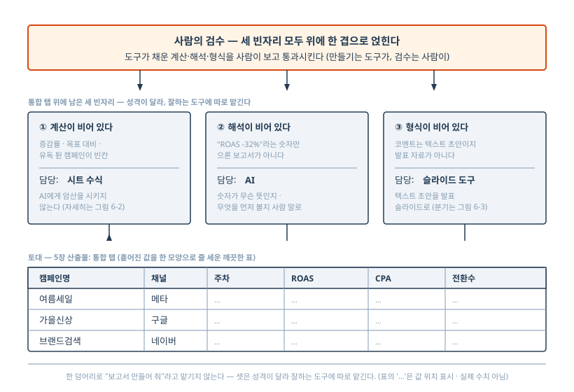

# 6장. [프로젝트 1-B] 주간 성과 보고서: 분석·초안·슬라이드 생성

월요일 오전 10시 40분. 5장의 통로가 다 깔린 김지유의 화면에는 통합 탭이 열려 있다. 네이버·메타·구글 캠페인이 한 탭에 줄 맞춰 들어와 있다 — 캠페인명, 채널, 주차, ROAS, CPA, 전환수가 칸칸이. 광고 관리자 셋을 열어 VLOOKUP으로 맞추던 1시간 38분이 사라진 자리다. 그런데 김지유는 아직 자리에서 못 일어난다. 시트에는 이번 주 숫자만 있다. 전주 대비 몇 퍼센트 떨어졌는지는 아직 어디에도 안 적혀 있고, 어느 캠페인이 왜 그랬는지 코멘트도 없고, 회의에 들고 갈 슬라이드는 빈 파일이다. 통합 탭은 깨끗한 표일 뿐, 보고서가 아니다. 김지유가 평소 여기서부터 회의 자료를 완성하는 데 쓰던 시간이 두 시간 남짓 — 증감을 계산하고, 코멘트를 쓰고, PPT로 옮기는 그 두 시간이다. 월요일 4시간 중 데이터를 나르는 첫 토막은 5장이 떼어냈다. 이 장이 떼어낼 것은 나머지, 모은 데이터를 보고서로 바꾸는 뒤 토막이다.

이 뒤 토막은 앞 토막과 결이 다르다. 데이터를 나르는 일에는 판단이 없었다(5장). 여기에는 판단이 있다. 어떤 캠페인을 먼저 짚을지, 하락을 어떻게 설명할지, 슬라이드에 무엇을 올릴지는 7년 차의 눈이 하던 일이다. 그래서 이 토막은 5장처럼 통째로 사람 손에서 떼어내지지 않는다. 떼어낼 수 있는 건 "만들기"다 — 증감을 계산하고, 초안을 쓰고, 슬라이드 골격을 채우는 일. 남겨야 하는 건 "검수"다 — 그 숫자가 맞는지, 그 코멘트가 데이터에 묶여 있는지 사람이 보는 일. 1장에서 그은 그 선이 여기서 실물이 된다. 이 장의 약속은 정확히 하나다. **모인 데이터에서 증감 분석 코멘트, 보고서 초안, 발표용 슬라이드까지 자동으로 생성되게 하고, 사람의 일은 검수로 좁힌다.**

> **2026년 6월 기준.** 이 장은 3장에서 만든 보고서 코멘트 명세 v1을 주간 보고서 전체 명세로 키우고, 그 출력을 슬라이드로 옮기는 데까지를 실제로 한 번 돌려 보고 적은 것이다. 슬라이드 변환에 쓰는 도구(Microsoft 365 Copilot, Google Workspace의 Gemini, Gamma 등)는 기능·메뉴·가격이 분기마다 바뀐다 — 특히 AI 슬라이드 도구의 가격은 가장 빨리 낡는 정보다. 그래서 이 장은 "어느 메뉴"보다 "무엇을 한다"를 적고, 가격은 시점을 박아 둔 뒤 직접 확인하라고만 한다. 어느 도구를 쓸지는 당신 회사가 켜 둔 환경에 따라 갈리는데, 그 갈림을 슬라이드 절에서 분기로 다룬다.

## 통합 탭은 깨끗한 표이지 보고서가 아니다 — 세 개의 빈자리

5장은 통합 탭을 "흩어진 값을 한 모양으로 줄 세운 깨끗한 표"까지 만들고 멈췄다. 거기서 멈춘 건 게으름이 아니라 설계다. 깨끗한 표 위에 올릴 것이 세 가지 남아 있고, 그 셋이 이 장의 차례다. 먼저 빈자리 셋이 무엇인지부터 또렷이 해 두자. 무엇을 채울지 알아야 명세를 어디까지 키울지가 정해진다.

첫째, 계산이 비어 있다. 통합 탭에는 이번 주 ROAS와 전주 ROAS가 따로 칸으로 들어와 있지만, 그 둘 사이의 증감률은 어디에도 없다. 전주 대비 몇 퍼센트인지, 목표 대비 어디쯤인지, 이번 주에 유독 튄 캠페인이 어느 것인지 — 이 숫자들이 다 빈칸이다. 둘째, 해석이 비어 있다. 증감률이 채워진다 해도 "여름세일_메타 ROAS -32%"라는 숫자만으로는 보고서가 아니다. 그 숫자가 무슨 뜻인지, 무엇을 먼저 봐야 하는지를 사람 말로 풀어 쓴 코멘트가 있어야 회의 자료가 된다. 셋째, 형식이 비어 있다. 코멘트가 다 쓰여도 그건 텍스트 초안이지 발표 자료가 아니다. 김지유의 월요일 4시간에는 "PPT 정리"가 들어 있다. 텍스트에서 멈추면 그 정리 시간이 그대로 남고, 약속이 깨진다.

이 세 빈자리를 채우는 일을 그냥 "AI에게 보고서 좀 만들어 줘"라고 한 덩어리로 맡기면 안 된다. 3장에서 본 그 화요일의 칭찬으로 시작하던 보고서가 그렇게 나온 결과다. 셋은 성격이 다르고, AI가 잘하는 정도도 다르다. 특히 첫째 계산은 AI에게 시키면 가장 위험한 자리다 — 왜 그런지는 이 장의 한가운데에서 따로 다룬다. 그래서 셋을 분리해 처리한다. 계산은 시트가 하고, 해석은 AI가 하고, 형식 변환은 슬라이드 도구가 한다. 이 분업이 이 장 전체의 골격이다.



3장에서 김지유의 코멘트 명세를 v1까지 짰고, 그 v1은 둘째 빈자리(해석) 한 토막만 다뤘다. 그때 명세 전문 끝에 "이 v1 명세는 6장에서 실제 보고서 명세로 완성된다"고 적어 두었다. 이 장이 그 약속을 지킨다. v1을 보고서 전체 명세로 키우되, 키우는 방향이 위 세 빈자리를 따른다. 다만 키우기 전에, 첫째 빈자리 — 계산 — 를 누가 맡을지부터 정해야 한다. 이 결정이 명세의 모양을 바꾸기 때문이다.

## AI에게 암산을 시키지 마라 — 계산은 시트가 한다

3장 끝에서 명세가 못 잡는 두 자리를 짚었다. 추정 원인의 표현과, 굵게 표시된 변동률 숫자의 진위였다. 4장은 그 둘을 검수의 표적으로 받았다 — 원본 대조로 숫자를 잡고, 출처 요구로 외부 사실을 잡았다. 그런데 4장 한가운데서 숫자에 대해 한 가지를 미뤄 두었다. 검수로 "결과가 맞는지"는 잡지만, 애초에 "계산을 어디서 하느냐"는 생성 단계의 문제라 6장으로 넘긴다고 했다. 미뤄 둔 그 처방을 지금 꺼낸다. 이 절이 이 장에서 가장 중요한 한 가지다.

먼저 문제부터 정확히 보자. AI에게 "전주 대비 증감률 계산해서 코멘트 써 줘"라고 시키면, AI는 그 증감률을 머릿속으로 — 정확히는 다음에 올 단어를 한 글자씩 뽑는 그 방식으로 — 계산한다. 그리고 그렇게 뽑은 숫자는 생각보다 자주 틀린다. 4장에서 인용한 Apple 연구진의 GSM-Symbolic 벤치마크가 이걸 보였다. LLM의 수학 추론은 진짜 논리 추론이라기보다 확률적 패턴 매칭에 가까워서, 입력의 사소한 변화에 흔들린다. 문제 속 숫자만 바꿔도 성능이 떨어졌고, 정답과 무관하지만 그럴듯해 보이는 문장을 한 줄 끼워 넣었더니 최첨단 모델 전반에서 정확도가 최대 65%까지 떨어졌다(4장에서 본 그 상한·시점 단서가 그대로 붙는다 — 자세한 풀이는 4장에 있다). 이게 무슨 뜻인가. AI가 보고서에 적어 준 "전주 대비 +23%"는, 그 옆 문장이 아무리 매끄럽게 읽혀도, 진짜 23%라는 보장이 없다는 뜻이다.

그러면 어떻게 하나. 4장에서는 "나온 숫자를 전수 대조하라"가 답이었다. 그건 검수 쪽 처방이고 여전히 유효하다. 하지만 검수만으로는 부족하다. AI가 틀린 숫자를 자꾸 뱉으면, 검수에서 매주 그걸 잡아 고치는 시간이 쌓인다. 더 나은 길은 애초에 AI에게 그 계산을 안 시키는 것이다. 같은 GSM-Symbolic 연구에 결정적 단서가 붙어 있었다. 위 불안정은 모델이 **머릿속으로** 계산할 때의 이야기이고, 모델이 계산을 외부 도구에 넘기면 산술 정확도는 크게 올라간다는 단서다.

이 단서를 정면으로 받친 연구가 따로 있다. 2023년에 나온 PAL이라는 접근인데, 핵심 진단이 이 장의 처방과 정확히 같다. 연구진은 LLM이 문제를 단계로 올바르게 나누고도 풀이 단계에서 논리·산술 오류를 낸다는 점을 짚었다 — "문제를 정확히 분해하고도, 푸는 부분에서 논리·산술 실수를 자주 한다"는 것이다. 그래서 이들은 분해(추론)는 LLM에 맡기되, 실제 계산은 LLM의 텍스트 생성이 아니라 결정적인 외부 계산기에 떠넘겼다. 그 결과 수학 문장제 벤치마크에서, 머릿속으로 단계를 밟아 푸는 방식보다 정확도가 15%포인트가량 올랐다(초기 연구 기준 수치다). 결론은 시점과 무관하게 남는다. **계산을 텍스트 생성에 맡기면 틀리고, 결정적인 계산 도구에 떠넘기면 정확해진다.**

여기서 한 가지 균형을 잡아야 한다. "그럼 계산은 무조건 도구에 맡기면 되겠네"로 단순화하면 안 된다. 2024년의 한 후속 연구는 계산을 도구에 맡길지 텍스트로 풀지가 과제와 모델에 따라 다르다는 것을 보였다. 수치·논리가 얽힌 과제에는 외부 계산이 유리하지만, AI 스스로 "이건 계산 도구를 써야지"를 판단하는 건 잘 못한다는 것이다. 어떤 모델은 중간 난도 문제를 굳이 머릿속으로 풀다 틀렸다. 이 단서가 우리에게 주는 교훈은 분명하다. AI에게 "알아서 계산해"라고 두면, AI가 도구를 쓸 자리에서 안 쓰고 암산하다 틀릴 수 있다. 그러니 **언제 계산을 도구에 맡길지를 AI의 즉흥에 맡기지 말고, 사람이 명세로 못 박아야 한다.** "이 칸은 AI가 계산하지 않는다"를 명세에 적는 것이다.

이 분업 — AI는 의도를 이해하고 사람 말로 풀어 쓰고, 정확한 계산은 결정적 도구가 한다 — 은 이 책의 발명이 아니라 AI 분석 자동화에서 자리 잡은 모범 패턴이다. 한 줄로 정리하면 이렇다. 다음에 올 단어를 예측하는 것과 실제로 계산하는 것은 다른 일이다. 그러니 잘하는 일을 각자에게 맡긴다.

문제는 PAL이 말하는 그 "외부 계산기"가 코드라는 점이다. PAL에서는 LLM이 직접 파이썬 코드를 써서 그 코드를 실행시킨다. 김지유는 코드를 못 읽는다. Python이라는 단어를 보면 창을 닫는다. 그래서 이 책은 그 "결정적 계산 도구"의 자리를 김지유가 이미 매일 쓰는 물건으로 바꾼다 — 스프레드시트의 수식이다. 증감률을 구하는 일을 AI에게 시키지 말고, 통합 탭에 수식 한 칸을 더해 시트가 계산하게 한다. 시트의 수식은 절대 패턴으로 추측하지 않는다. `=(이번주ROAS-전주ROAS)/전주ROAS`는 언제나 같은 답을 낸다. 우주가 두 번 끝나도 같은 답이다. PAL이 코드 인터프리터에게 맡긴 그 역할을, 김지유의 보고서에서는 익숙한 시트 수식이 대신한다. 코드 한 줄 없이, 같은 원리를 누린다.

구체적으로 무엇을 하는가. 5장에서 만든 통합 탭에 칸을 몇 개 더한다. 이번 주 ROAS와 전주 ROAS 옆에 "전주 대비 ROAS 증감률" 칸을 만들고 그 칸에 증감률 수식을 건다. 목표 ROAS를 관리하고 있다면 "목표 대비" 칸도 같은 식으로 더한다. 전환수도, CPA도 마찬가지다. 김지유가 VLOOKUP까지 한다면 이 수식들은 어렵지 않다 — 빼고, 나누고, 곱하는 사칙연산이 전부다. 어렵게 느껴진다면 시트에 "전주 대비 증감률 구하는 수식 알려 줘"라고 AI에게 물어 **수식 자체를 받는** 건 괜찮다. AI가 수식을 알려 주는 것과 AI가 숫자를 계산하는 것은 전혀 다른 일이다. 전자는 한 번 받아 시트에 박아 두면 그다음부터 계산은 시트가 결정적으로 하고, 후자는 매주 AI가 새로 암산하며 매주 틀릴 위험을 안는다. 받을 것은 숫자가 아니라 수식이다.

> [그림 6-2 | `art/ch06-fig02.mmd`] 두 갈래 길. 왼쪽 — AI에게 증감률을 시키면 매주 새로 암산하고 그럴듯하게 틀릴 수 있다(GSM-Symbolic). 오른쪽 — 시트 수식이 한 번에 결정적으로 계산하고, AI는 그 확정된 숫자를 받아 해석만 한다(시트 수식 = PAL의 결정적 계산기를 코드 없이 대신함).

정리하면 이 절의 처방은 한 문장이다. **증감률 같은 계산은 시트 수식이 하고, AI는 그 시트가 뽑아 준 확정된 숫자를 받아 해석·서술만 한다.** 통합 탭이 증감률까지 채워진 상태가 되면, AI에게 넘기는 건 "계산해"가 아니라 "이 숫자들을 읽고 코멘트를 써"가 된다. AI는 자기가 잘하는 일 — 어떤 캠페인을 먼저 짚을지 판단하고 사람 말로 풀어 쓰는 일 — 만 한다. 첫째 빈자리(계산)는 시트가 메웠다. 이제 둘째 빈자리(해석)를 채울 명세로 넘어간다.

## v1 명세를 보고서 전체 명세로 키운다

3장에서 김지유의 코멘트 명세 v1을 짰다. 그 v1은 캠페인별로 "캠페인명 — 변동률 — 추정 원인" 한 줄씩을 뽑고 마지막에 다음 주 제안 한 줄을 붙이는, 코멘트 한 토막짜리 명세였다. 회의 보고서는 그보다 크다. 한 주 전체를 요약하는 머리말이 있어야 하고, 전주 대비뿐 아니라 목표 대비도 봐야 하고, 유독 튄 캠페인을 따로 짚어야 한다. v1을 이 보고서 크기로 키운다. 키우는 일도 3장에서 쓴 그 네 칸 — 입력 형식, 판단 기준, 출력 형식, 예외 처리 — 을 다시 채우는 일이다. 새 도구가 아니라 같은 도구를 더 크게 쓰는 것이다.

키우는 방향은 앞 절의 결정이 정한다. 가장 큰 변화는 입력 형식이다. v1에서 AI에게 넘기던 입력은 이번 주·전주 ROAS가 따로 든 여섯 칸 표였다 — AI가 그 둘로 증감률을 계산해야 했다. 새 명세에서는 증감률을 시트가 이미 계산해 둔다. 그러니 AI에게 넘기는 입력 표에는 **증감률 칸이 이미 채워진 채로** 들어간다. 명세의 입력 형식 칸이 "이번 주 ROAS, 전주 ROAS, 전주 대비 증감률(시트가 계산함), 목표 대비(시트가 계산함)…"로 바뀐다. 그리고 판단 기준 칸에 한 줄을 못 박는다. **"증감률·증감폭을 직접 계산하지 마라. 입력 표에 든 계산된 값을 그대로 쓰고 해석만 하라."** 이 한 줄이 앞 절의 처방을 명세에 박는 자리다. 4장에서 명세의 예외 처리에 "무엇은 하지 마라"를 적으면 AI가 그 빈칸을 자기 식으로 안 메운다고 했는데, 계산 금지가 바로 그런 줄이다.

판단 기준은 v1보다 더 채운다. v1에는 "하락 먼저, 변동 절댓값 큰 순서로"만 있었다. 보고서는 세 가지 비교를 더 시킨다. 첫째, 전주 대비 — v1이 하던 것이다. 둘째, 목표 대비. 회사가 캠페인별·채널별 목표 ROAS나 목표 CPA를 잡아 두었다면, 전주보다 올랐어도 목표에 못 미치는 캠페인이 진짜 문제다. 판단 기준에 "목표 미달 캠페인은 전주 대비 상승했더라도 주의 항목으로 따로 묶어라"를 적는다. 셋째, 이상치 — 이번 주에 유독 튄 캠페인을 잡아내는 것이다. 다만 "유독 튄"을 AI의 감에 맡기면 매주 기준이 흔들린다. 3장에서 배운 대로 숫자로 적는다. "전주 대비 절댓값 50% 이상 변동했거나, 전환수가 전주의 두 배를 넘거나 절반 아래로 떨어진 캠페인을 '이상 신호'로 따로 표시하라." 이렇게 숫자로 적힌 이상치 기준은, 사람이 매주 눈으로 훑다 놓치는 캠페인을 AI가 기계적으로 집어 준다. 검수할 표적을 AI가 미리 줄 세워 주는 셈이다.

출력 형식도 보고서 크기로 키운다. v1의 캠페인 한 줄 묶음 위에, 한 주를 요약하는 머리말 한 단락을 얹는다. 단 이 머리말에 함정이 있다. "전반적으로 양호한 한 주였습니다" 같은 화요일의 그 칭찬이 다시 돌아올 자리가 바로 머리말이다. 그래서 머리말의 형식도 못 박는다. "머리말은 인사·총평 없이, 이번 주 주의 항목 개수와 이상 신호 캠페인 개수를 먼저 적고, 가장 큰 하락 캠페인 하나를 짚는 것으로 시작하라." 칭찬으로 시작할 칸을 양식에서 없애는 것이다. 그 아래에 v1의 캠페인 한 줄 묶음이 오고, 맨 아래에 다음 주 제안이 온다.

예외 처리는 v1의 세 가지(신규 캠페인, 전환수 0, 표 아닌 입력)를 그대로 가져오되, 키운 명세에 맞는 한 가지를 더한다. 목표 ROAS 칸이 비어 있는 캠페인의 처리다. 목표를 안 잡은 캠페인까지 AI가 억지로 목표 대비를 지어내면 안 되니, "목표 칸이 비어 있으면 목표 대비 평가를 생략하고 전주 대비만 적어라"를 더한다.

네 칸을 다 키우면 v1의 한 토막짜리 명세가 보고서 한 장짜리 명세가 된다. 길어진 게 핵심이 아니다 — 3장에서 말했듯 빈칸이 없어서 좋은 것이다. 아래에 키운 명세 전문을 싣는다. 이 책의 규칙대로, "이런 식으로 적으면 된다"가 아니라 복사해 바로 쓸 수 있는 글자 그대로를 싣는다. v1과 비교해 보면, 굵은 골격은 같고 위 결정들이 칸마다 들어간 것이 보일 것이다.

```
[김지유의 주간 보고서 명세 v2 — 3장 코멘트 명세 v1을 보고서 전체로 확장]
(2026년 6월 작성. 계산은 시트가 하고 AI는 해석만 한다는 6장의 분업을 명세에 박았다.
 도구별 동작 차이는 3장 "자기 도구로 검증하는 법"의 4단계로 확인한다.)

# 역할
너는 퍼포먼스 마케터의 주간 광고 성과 보고서 초안을 작성하는 보조자다.
회의에서 팀장에게 보고할 보고서 초안을 만든다. 판단이 필요한 곳에서
임의로 추측하지 말고, 아래 규칙을 따른다.

# 입력 형식 (내가 매번 이 모양으로 준다)
나는 다음 칸을 가진 표를 붙여넣는다. 칸 순서와 이름은 고정이다.
증감률과 목표 대비 칸은 내 시트가 이미 계산해 채운 값이다.
| 캠페인명 | 채널 | 이번 주 ROAS | 전주 ROAS | 전주 대비 증감률 |
  목표 ROAS | 목표 대비 | 이번 주 전환수 | 전주 전환수 |
표가 아닌 형태로 들어오면 분석하지 말고 예외 처리 규칙으로 간다.

# 판단 기준 (어떻게 분석할지)
1. 계산을 하지 마라. 증감률·증감폭·목표 대비는 입력 표에 든 계산된
   값을 그대로 쓰고 해석만 한다. 표에 없는 비율을 새로 계산하지 않는다.
2. 출력 순서: 하락한 캠페인을 먼저, 그 안에서 전주 대비 증감률
   절댓값이 큰 순서로. 그다음 상승한 캠페인을 같은 방식으로.
3. 목표 미달 캠페인(목표 대비가 음수)은 전주 대비 상승했더라도
   "주의 항목"으로 따로 묶어 표시한다.
4. 이상 신호: 전주 대비 절댓값 50% 이상 변동했거나, 이번 주 전환수가
   전주의 2배를 넘거나 절반 미만인 캠페인을 "이상 신호"로 표시한다.
5. "성과가 나쁘다/좋다" 같은 두루뭉술한 표현 대신 증감률 숫자로 말한다.
6. 원인은 데이터만으로 단정하지 말고 "추정"임을 밝힌다. 데이터에 없는
   외부 사실(시즌, 경쟁사 동향 등)을 지어내지 않는다.

# 출력 형식 (항상 이 골격으로)
[머리말] 인사·총평 없이 시작한다. 첫 문장에 이번 주 주의 항목 개수와
  이상 신호 캠페인 개수를 적고, 가장 큰 하락 캠페인 하나를 짚는다.
[캠페인별 코멘트] 캠페인마다 한 줄:
  캠페인명 — **전주 대비 증감률(굵게)** — (목표 미달이면 "주의",
  이상 신호면 "이상") — 추정 원인. 판단 기준 2~4의 순서대로 나열한다.
[다음 주 제안] 마지막에 "다음 주 제안:"으로 시작하는 한 문장.

[출력 예시 — 이런 모양으로 나오면 된다]
이번 주 주의 항목 2건, 이상 신호 1건. 가장 큰 하락은
여름세일_메타로 ROAS가 전주 대비 32% 떨어졌다.
- 여름세일_메타 — **ROAS -32%** — 이상 — (추정) 전환수가 전주 120→80으로 줄어든 영향
- 가을신상_구글 — **ROAS -8%** — 주의(목표 대비 -15%) — (추정) 목표 대비 -15%로 미달, 입력 표 안에서는 원인 단정 불가 — 점검 항목
- 브랜드검색_네이버 — **ROAS +11%** — (추정) 전환수가 전주 대비 늘어난 영향
다음 주 제안: 여름세일_메타 소재 2종 교체 후 재측정.

# 예외 처리
- 전주 ROAS 칸이 비어 있으면(신규 캠페인): 변동 해석을 건너뛰고
  캠페인명 옆에 "(신규)"로 표시, 원인 칸은 "측정 1주 누적 후 판단".
- 이번 주 전환수가 0이면: ROAS 대신 "전환 없음"으로 적고,
  그 줄을 "원인 점검 필요"로 끝낸다.
- 목표 ROAS 칸이 비어 있으면: 목표 대비 평가를 생략하고
  전주 대비만 적는다.
- 입력이 표 형식이 아니면: 분석을 멈추고
  "입력을 정해진 표 형식으로 맞춰 주세요"라고만 답한다.
```

이 명세가 v1과 다른 핵심은 두 군데다. 입력 표에 "전주 대비 증감률"과 "목표 대비" 칸이 시트 계산값으로 미리 들어온다는 것, 그리고 판단 기준 1번이 "계산을 하지 마라"로 못 박혔다는 것. 나머지는 v1의 골격을 보고서 크기로 늘린 것이다. 3장에서 v1을 처음 보는 사람에게 건네도 같은 골격이 나온다고 했는데, v2도 같다 — A4 한 장 테스트를 통과하는, 매주 꺼내 데이터만 갈아 끼우는 자산이다.

## 돌려 보면 어디를 검수해야 하는가

명세를 짰으니 돌려 봐야 한다. 그리고 검수해야 한다. v2 보고서 전체 명세(목표 대비·이상치·주의 태그까지)를 자기 도구에 실제로 넣으면 위 출력 형식의 골격을 따른 보고서가 나오고, 그것을 회의에 들고 가기 전에 검수한다. 이 책은 발행인이 직접 돌린 출력만 "측정"이라 부른다. v2 전체 명세 출력은 발행인이 아직 실측하지 않았으므로, 그 자리는 비워 둔다.

> [확인필요: 발행인 실측 V-7 — v2 보고서 명세(목표 대비·이상치·주의 태그 포함)를 ChatGPT/Gemini에 실제 입력해 출력·검수 수집. 가짜 출력으로 메우지 말 것.]

대신 검수가 무엇을 표적으로 하는지는, 3장에서 발행인이 **실제로 실측한 출력**으로 그대로 보일 수 있다. 검수의 표적은 명세 버전이 v1이든 v2든 같은 곳에 있기 때문이다. 3장에서 실측한 v1 코멘트 명세(여름세일_메타/브랜드검색_네이버 두 캠페인)의 출력을 다시 꺼낸다. 이건 발행인이 v1 코멘트 명세를 Gemini 3.5 Flash와 ChatGPT 무료 티어에 실제로 넣어 받은 출력이다(2026-06-13 측정). 아래 블록의 출력 세 줄은 3장에서 받은 그대로이고, 헤더 끝의 "v1 코멘트 명세 입력"이라는 꼬리표만 이 장 맥락에 맞게 덧붙인 것이다 — "받은 그대로"는 출력 세 줄을 가리킨다.

```
[Gemini 3.5 Flash — 2026-06-13 측정 — v1 코멘트 명세 입력]
- 여름세일_메타 — ROAS -32% — (추정) 타깃 피로 또는 소재 노후
- 브랜드검색_네이버 — ROAS +11% — (추정) 시즌 검색량 증가
다음 주 제안: 여름세일_메타 소재 2종 교체 후 재측정.
```

이제 검수다. 여기가 4장이 살아 돌아오는 자리다. AI가 명세를 잘 따랐다고 그 출력을 그대로 회의에 들고 가면 안 된다. 무엇을 보는가. 4장의 3원칙이 그대로 표적을 정해 준다. 그리고 이 장에서 v2 명세에 "계산을 하지 마라"를 넣은 덕분에, 그중 하나가 가벼워진다.

원칙 1, 숫자. 증감률 숫자들 — 위 출력의 -32%, +11% — 이 4장이 가장 깐깐히 보라던 자리다. v1 명세에서는 AI가 전환수(80/120, 50/45)를 받아 증감률을 직접 계산했고, 그래서 그 계산이 맞는지가 가장 무거운 검수 항목이었다. v2 명세는 여기를 바꾼다. 증감률·목표 대비 칸을 시트 수식이 미리 계산해 입력에 넣어 주고, 판단 기준 1번이 "계산을 하지 마라"로 못 박는다. 그러면 검수의 무게가 바뀐다. v2에서는 "AI가 32%를 맞게 계산했나"를 의심할 필요가 없다 — 계산은 시트가 했고 시트는 틀리지 않는다. 대신 "AI가 시트의 값을 옮겨 적는 과정에서 부호나 자릿수를 바꾸지 않았나"만 본다. 4장 도입의 그 마이너스 24%가 플러스로 뒤집힌 사고가 바로 이 옮겨 적기 단계에서 났다. 계산을 시트에 맡겨도 옮겨 적기 오류는 남으니, 출력의 숫자가 시트의 숫자와 글자 그대로 같은지는 여전히 전수로 대조한다. 단 "계산이 맞나"라는 무거운 의심이 "옮겨 적기가 맞나"라는 가벼운 대조로 줄었다. 이게 계산을 시트에 떠넘긴 두 번째 이득이다 — 정확해지는 것에 더해, 검수가 가벼워진다.

원칙 2, 출처. 추정 원인 칸을 본다. 위 실측 출력에서 Gemini는 "타깃 피로 또는 소재 노후"와 "시즌 검색량 증가"를 댔다. 이 중 "시즌 검색량 증가"는 입력 데이터에 없는 외부 사실이다. 3장에서 봤듯이 명세 판단 기준이 "데이터에 없는 외부 사실을 지어내지 마라"고 못 박았는데도 새어 들어온 자리다 — 같은 입력을 받은 ChatGPT는 원인을 "전환수가 120→80으로 줄어든 영향"처럼 표 안의 숫자에만 묶어, 외부 사실을 대지 않았다. 명세가 막아도 도구에 따라 그럴듯한 외부 원인이 샌다. 명세는 예방이고 검수는 확인이라, 둘이 한 쌍으로 작동한다(4장). 김지유는 이 "(추정) 시즌 검색량 증가"를 회의에서 사실처럼 말하면 안 된다. 데이터로 뒷받침되는지 확인하거나, 추정임을 분명히 한 채로만 쓴다. v2 명세는 목표 대비·이상치까지 다루므로 원인 칸이 더 늘지만, 이 외부 사실 검수의 표적은 똑같다.

여기서 v2 명세가 v1에서 한 가지를 더 손봤다는 점을 짚어 둔다. 명세가 "외부 사실을 지어내지 마라"고 적어 놓고, 정작 그 명세 안의 출력 예시가 "(추정) 검색량 증가" 같은 외부 원인을 시범 보이면, 독자는 그 예시를 정답으로 본떠 규칙을 어기게 된다. 그래서 위 v2 명세의 출력 예시는 추정 원인을 모두 입력 표 안의 숫자에 묶어 적었다 — "전환수가 전주 120→80으로 줄어든 영향"처럼. 예시 자신이 판단 기준 6번을 지키게 만든 것이다. 명세는 규칙만 적는 게 아니라 예시까지 그 규칙을 따라야, AI가 본뜰 모범이 규칙과 어긋나지 않는다.

원칙 3, 고유명사. 캠페인명·채널명이 통합 탭의 원본과 한 글자도 다르지 않은지 본다. 위 출력의 "여름세일_메타", "브랜드검색_네이버"를 AI가 "여름세일메타"로 슬쩍 붙이거나 "브랜드검색_네이버"를 "브랜드검색네이버"로 늘리는 일이, 숫자 오류보다 눈에 덜 띄면서 회의에서 똑같이 곤란하다. 고유명사는 종류가 한정돼 있어 전수 확인이 몇 분이면 끝난다(4장). v2에서 캠페인이 더 늘어도 이 확인은 줄당 몇 초다.

정리하면, 검수는 명세가 v2로 커져도 면제되지 않는다. 다만 검수의 무게중심이 옮겨 간다. v2에 "계산을 하지 마라"를 넣은 순간, 계산 검증이라는 가장 무거운 항목이 시트로 넘어가 가벼워졌고, 남은 표적은 옮겨 적기·외부 사실·고유명사다. 4장에서 만든 검수 체크리스트가 v2 명세에 맞게 한 줄 바뀐다 — "증감률 계산이 맞는가"가 "증감률이 시트 값과 같게 옮겨졌는가"로. 둘째 빈자리(해석)는 명세와 검수로 채웠다. 이제 셋째 빈자리, 형식이다.

## 텍스트 초안에서 슬라이드로 — 회사 환경이 길을 가른다

코멘트 초안이 검수까지 끝났다고 약속이 지켜진 건 아니다. 김지유의 월요일 4시간에는 "PPT 정리"가 들어 있다. 텍스트에서 멈추면 그 정리 시간이 그대로 남는다. 그래서 이 장은 초안을 발표용 슬라이드로 옮기는 데까지 간다. 그런데 여기서 도구를 하나로 단정할 수 없다. 슬라이드 변환의 길은 당신 회사가 어떤 환경을 켜 두었느냐에 따라 갈린다. 갈림을 먼저 이해해야 자기 자리에 맞는 길을 고른다.

여기서 페르소나의 현실을 정직하게 짚어야 한다. 김지유는 ChatGPT 유료 구독자다. 하지만 그게 회사의 슬라이드 도구를 가졌다는 뜻은 아니다. 회사 PC에서 슬라이드를 자동 생성하는 AI를 쓰려면, 보통 회사가 그 기능을 켜 둬야 한다 — Microsoft 365 Copilot이든 Google Workspace의 Gemini든, 회사가 유료로 도입하고 IT가 켜 준 환경이라야 쓸 수 있다. 개인이 ChatGPT를 결제했다고 회사 PowerPoint 안에서 AI 슬라이드가 나오지는 않는다. 그래서 첫 갈림은 이것이다. 회사가 생산성 도구의 AI 기능을 켜 줬는가, 아닌가.

**갈래 ⓐ — 회사가 Copilot이나 Workspace의 Gemini를 켜 줬다면, 회사 표준 템플릿 안에서 채운다.** 이게 보고서에 가장 좋은 길이다. 회사 발표 자료에는 보통 정해진 마스터 템플릿이 있다 — 로고 위치, 색, 폰트, 표지 양식. AI가 그 표준 안에서 슬라이드를 채워 주면, 따로 옮길 일이 없다.

Microsoft 환경이라면 Microsoft 365 Copilot이 그 길이다. 2026년 6월 확인 기준, PowerPoint에서 Copilot에게 워드(.docx) 문서를 입력으로 주면 슬라이드 초안을 자동 생성한다. PowerPoint에서 새 발표 자료를 열고 Copilot의 "파일에서 발표 자료 만들기"를 골라 워드 파일을 지정하는 식이다. 회사 표준은 두 갈래로 반영된다. 하나는 조직이 이미 쓰는 기존 발표 자료(샘플 덱)를 참조해 그 구조·레이아웃을 따르는 것이고, 다른 하나는 브랜드 키트를 설정해 회사 색·폰트·톤을 입히는 것이다. 그래서 흐름이 자연스럽다 — 앞 절에서 검수까지 끝낸 코멘트 초안을 워드 문서로 정리한 뒤, Copilot에게 그 워드를 슬라이드로 바꾸게 한다. 단 확인일 기준으로 이 "파일에서 생성"은 워드 파일만 입력으로 받고 다른 형식은 "곧 지원" 상태였다. 워드로 정리해 넘기는 게 지금은 가장 매끄럽다.

Google 환경이라면 Google Slides의 Gemini가 같은 자리다. 2026년 6월 확인 기준, Google Slides에서 "슬라이드 만들기"를 고르고 "1분기 결과를 요약하는 다섯 장짜리 덱을 만들어 줘" 같은 프롬프트를 주면 테마에 맞춰 덱을 만든다. Gemini는 사용자의 Workspace 데이터(문서·시트)를 활용해 발표 자료를 만들고, 만든 뒤에도 프롬프트나 손으로 고칠 수 있다. Google은 이 도구의 설계를 한 문장으로 요약한다 — 디자인·서식은 Gemini가 맡고 사람은 내용에 집중한다는 것이다. 이 철학이 이 장의 분업과 정확히 같다. 형식은 도구가, 내용과 검수는 사람이.

여기서 두 도구의 공통 제약을 짚어 둔다. Copilot이든 Workspace의 Gemini든, 별도 유료 라이선스가 필요하고 그 라이선스를 회사가 켜 줘야 한다. 그리고 결과 품질은 회사가 가진 표준 덱이나 브랜드 키트의 품질에 기댄다 — 좋은 표준 템플릿이 있어야 좋게 나온다. 회사가 이 환경을 안 켜 줬다면, 다음 갈래로 간다.

**갈래 ⓑ — 회사가 AI 슬라이드 기능을 안 켜 줬다면, 독립 도구나 수동이다.** 회사 PowerPoint 안에서 AI가 안 돌아도 길은 있다. Gamma 같은 독립 AI 슬라이드 도구는 회사 환경과 무관하게 개인이 쓸 수 있다. 2026년 6월 확인 기준, Gamma는 주제·개요·소스 파일을 입력하면 약 90초 만에 발표 덱을 만든다. 검수 끝낸 코멘트 초안을 붙여넣으면 슬라이드 형태로 떨궈 준다. 무료 플랜이 있지만 한 번 쓰면 소진되는 크레딧 방식이라, 매주 보고서를 돌리려면 사실상 유료가 필요하다. 가격은 분기마다 바뀌니 — 2026년 6월 확인 기준으로 유료 티어가 월 몇 달러에서 시작했지만 이 수치는 곧 낡는다 — 쓰기 전 공식 가격 페이지에서 직접 확인한다.

단 갈래 ⓑ에는 갈래 ⓐ에 없는 단계가 하나 더 붙는다. Gamma는 자체 디자인 체계로 슬라이드를 만든다 — Copilot/Gemini가 회사 표준 안에서 채우는 것과 달리, Gamma는 자기만의 룩을 입힌다. 회사 보고서 표준이 엄격한 .pptx 마스터라면, Gamma로 만든 결과를 PowerPoint로 내보낸 뒤 회사 템플릿에 다시 옮겨야 할 수 있다. 브랜드 키트로 회사 색·폰트를 근사하게 맞출 수는 있지만, 회사 마스터와 정확히 일치하지는 않는다. 그래서 갈래 ⓑ는 "빠르게 보기 좋은 초안"이 필요할 때, 또는 회사 표준이 느슨해 Gamma 결과를 그대로 써도 될 때 맞는다. 회사 표준이 빡빡하면 갈래 ⓐ가 옮기는 수고가 없어 낫다. 둘 다 막히면 가장 단순한 길이 남는다 — 검수 끝낸 코멘트를 회사 PowerPoint 표준 템플릿에 손으로 옮기는 것이다. AI가 만들기를 다 한 코멘트를 칸에 붙여넣는 일이라, 백지에서 슬라이드를 짜던 것보다는 훨씬 짧다.

> [그림 6-3 | `art/ch06-fig03.svg`] 슬라이드 변환의 분기. 첫 갈림 — 회사가 AI 슬라이드 기능을 켰는가. ⓐ 켰으면 Copilot/Gemini로 회사 표준 안에서 채운다(옮길 일 없음). ⓑ 안 켰으면 Gamma 등 독립 도구(자체 디자인 — 회사 표준이 빡빡하면 다시 옮겨야) 또는 수동. 페르소나는 ChatGPT 구독자이지 회사 Copilot 보유자가 아닐 수 있음.

## 슬라이드는 완성품이 아니라 검수할 초안이다 — 정직한 한계

어느 갈래로 가든 분명히 해 둘 것이 있다. AI가 만든 슬라이드는 완성된 발표 자료가 아니라 검수하고 다듬을 초안이다. 이 장이 "버튼 한 번에 완벽한 PPT"를 약속한다고 읽히면, 그건 이 책이 가장 싫어하는 과장이다. AI 슬라이드 도구의 한계를 정직하게 짚는다.

AI 슬라이드 도구는 속도를 크게 줄이지만 품질을 보장하지 않는다. 대부분의 도구가 정해진 템플릿에 기대고, 공간 구성이나 타이포 위계 같은 고급 디자인 원칙을 깊이 따지지 않는다. 그래서 결과가 깔끔하기는 한데 어딘가 획일적으로 나오는 경향이 있다. 한 번에 전부 생성하는 방식이라 레이아웃을 골라 볼 여지가 적고, 슬라이드를 한 장씩 따로 처리해 덱 전체의 흐름이 매끄럽지 않을 때도 있다. AI는 특정 회사의 브랜드 정체성이 아니라 일반적인 "프로페셔널해 보이는" 미감을 향해 최적화하므로, 회사 브랜드 가이드와 어긋나기 쉽다. 청중이 "AI로 뽑은 티"가 나는 획일적 슬라이드를 알아보면, 발표자의 신뢰가 깎일 수도 있다. 여기서 한 가지는 정직하게 밝혀 둔다 — 이 한계의 정도를 숫자로 잰 믿을 만한 조사는 찾지 못했다. 그래서 "디자인이 획일적으로 나올 수 있다"는 경향까지만 말하고, "몇 퍼센트가 불만족" 같은 수치는 쓰지 않는다.

이 한계는 이 장의 약속과 충돌하지 않는다. 오히려 이 장의 프레임과 정확히 맞물린다. 이 장은 "AI가 완성된 발표 자료를 만든다"고 한 적이 없다. "검수하고 다듬을 초안을 자동으로 생성한다"고 했다 — 만들기에서 검수로. 그러니 디자인의 마지막 손질은 사람이 한다. 갈래 ⓐ라면 회사 표준이 대부분을 흡수하니 손질이 적고, 갈래 ⓑ라면 회사 템플릿으로 옮기거나 핵심 슬라이드만 다듬는다. 어느 쪽이든 이 손질은 백지에서 만드는 게 아니라 다 채워진 초안을 보정하는 일이라 짧다. 그 보정 시간은 1장에서 약속한 검수 40분 안에 들어간다.

그리고 한 가지 빈자리를 정직하게 표시해 둔다. 한국 회사의 .pptx 마스터에 Copilot이나 Gemini의 브랜드 키트가 얼마나 정확히 맞는지, 공개된 실측 자료는 찾지 못했다. [확인필요: 한국 기업 표준 템플릿에 AI 슬라이드 브랜드 키트가 맞는 정도 — 실측 또는 공개 사례] 당신 회사 템플릿으로 한 번 변환해 보고, 어디가 어긋나는지 직접 확인하는 게 지금으로선 가장 정확하다. 그 한 번의 확인이, 매주 슬라이드 손질에 몇 분을 쓸지를 정한다.

## 비포/애프터 — 월요일이 "만들기 4시간"에서 "검수"로

5장과 6장을 합치면 김지유의 월요일 전체가 바뀐다. 두 장이 떼어낸 것을 한 타임라인에 올려 보자. 비포는 5장 도입에서 분 단위로 잰 그 월요일이다. 애프터는 5장의 자동 취합과 이 장의 자동 생성을 다 적용한 뒤다. PPT 변환을 별도 행으로 둔다 — 김지유의 4시간에 그게 들어 있었으니, 자동화 전후를 따로 봐야 약속의 측정 범위가 맞는다.

| 단계 | 비포 (자동화 전) | 애프터 (자동화 후) |
|---|---|---|
| 데이터 취합 (3채널 다운로드 + 합치기) | 약 1시간 38분 (5장 비포 기준) | 0분 (자동) — 플랜 B면 네이버 수동 약 5분 |
| 증감 계산 | 사람이 직접 | 0분 (시트 수식이 자동 계산) |
| 코멘트 작성 (해석) | 사람이 직접 | AI 자동 생성 |
| PPT 변환 | 사람이 직접 | AI/도구 자동 변환 (+ 디자인 손질) |
| 검수 (숫자·출처·고유명사 + 슬라이드 보정) | — (검수 단계 없음) | 이 자리에 사람의 시간이 모인다 |

> [그림 6-4 | `art/ch06-fig04.svg`] 월요일 타임라인 비포/애프터. 취합·계산·코멘트·PPT 변환 네 행이 "사람이 만들기"에서 "도구가 생성"으로 넘어가고, 사람의 시간은 맨 아래 검수 행으로 모인다. PPT 변환을 별도 행으로 둔 것은 측정 범위에 PPT가 포함됨을 못 박기 위해서다.

이 타임라인에서 한 가지를 정직하게 말해야 한다. 이 책의 컨셉은 "4시간을 40분으로"다. 그 40분이 위 표 맨 아래 검수 행이다. 그런데 "4시간→40분"이라는 그 숫자 자체는, 이 책을 쓰는 시점에 아직 단정할 수 없다. 그 수치의 유일한 근거는 실제 마케터가 이 워크플로를 따라 하며 비포/애프터 시간을 재는 실측인데 — 측정 범위에 PPT 정리 시간까지 포함해서 — 그 실측이 아직 끝나지 않았다. 공개된 통계로 메울 수도 없다. 시장 조사들은 "AI가 마케터의 주당 몇 시간을 아껴 준다"는 식의 전반적 절감은 보고한다 — 그 수치가 6시간에서 13시간까지 제각각인데, 미리 못 박아 둘 것이 있다. 이 6~13시간은 마케터가 AI를 쓰며 한 주 전체에서 아낀 시간의 추정치이지, 이 표가 다루는 "주간 광고 보고서의 취합+분석+PPT 정리"라는 한 과업의 비포/애프터가 아니다. 측정 범위가 다르므로 이 표의 "4시간→40분"의 근거가 될 수 없다. 우리 과업의 비포/애프터를 잰 공개 값은 없다. [확인필요: "4시간→40분" 수치 — 베타 리더 실측, PPT 정리 시간 포함]

그래서 이 장은 "4시간→40분"을 확정된 사실이 아니라 **목표**로 적는다. 확정된 것은 수치가 아니라 구조다. 만들기의 네 토막 — 취합·계산·코멘트·PPT — 이 사람 손에서 도구로 넘어갔고, 사람의 시간은 맨 아래 검수 한 자리로 모였다. 비포에 없던 검수 행이 애프터에 생긴 게 핵심이다. 시간이 사라진 게 아니라, 만들기에서 검수로 옮겨 갔다. 그 검수가 얼마나 걸리는지의 정확한 숫자는 당신이 자기 워크플로로 직접 잴 때 가장 정확하고, 이 책의 "40분"은 그 측정의 목표선이다. 4장에서 검수 40분이 이 책의 안전장치라고 했는데, 그 40분의 측정 범위가 바로 이 표 — 취합부터 PPT까지 — 전체다. PPT 변환을 별도 행으로 박아 둔 이유가 이것이다. 비포의 4시간에 PPT가 들어 있었으니, 애프터의 측정에도 PPT가 들어 있어야 같은 자를 댄 것이다.

## 오늘 할 일 — 자기 통합 탭에 보고서 명세를 돌려 본다

5장에서 자기 채널 한 곳을 시트에 연결했을 것이다. 그 시트의 통합 탭을 연다. 오늘 할 일은 그 위에 이 장의 분업을 한 번 돌려 코멘트 초안을 받아 보는 것이다. 30분짜리 과제다.

**1단계, 통합 탭에 증감률 칸을 더한다.** 이번 주 값과 전주 값 옆에 "전주 대비 증감률" 칸을 만들고 수식을 건다 — `=(이번주값-전주값)/전주값` 꼴이다. 목표를 관리한다면 "목표 대비" 칸도 더한다. 수식이 막히면 AI에게 "전주 대비 증감률 구하는 시트 수식 알려 줘"라고 물어 수식을 받아 박는다. 받을 것은 수식이지 숫자가 아니라는 것만 지킨다.

**2단계, v2 명세를 자기 칸에 맞춘다.** 위에 실은 명세 전문을 가져와, 입력 형식 칸의 표 머리를 자기 통합 탭의 실제 칸 이름으로 바꾼다. 판단 기준 1번("계산을 하지 마라")과 4번(이상 신호 기준 숫자)은 그대로 둔다. 이 두 줄이 이 장의 처방이 사는 자리다.

**3단계, 명세 + 증감률이 채워진 표를 AI에 넣는다.** 자기가 쓰는 도구에 명세와 통합 탭 데이터를 붙여넣어 코멘트 초안을 받는다. 받은 초안을 4장의 3원칙으로 검수한다 — 증감률이 시트 값과 같게 옮겨졌는지(원칙 1), 추정 원인에 데이터에 없는 외부 사실이 섞이지 않았는지(원칙 2), 캠페인명이 원본과 같은지(원칙 3).

**4단계(선택), 슬라이드로 한 번 옮겨 본다.** 회사가 Copilot이나 Workspace의 Gemini를 켜 줬다면 검수 끝낸 코멘트를 워드/문서로 정리해 슬라이드로 변환해 본다. 안 켜 줬다면 Gamma에 붙여넣어 본다. 어느 쪽이든 목표는 완성이 아니라, AI가 만든 슬라이드가 어디까지 쓸 만하고 어디를 손봐야 하는지를 자기 회사 표준으로 한 번 확인하는 것이다.

이 과제를 마치면 손에 두 가지가 남는다. 증감률이 시트 수식으로 채워진 통합 탭, 그리고 그 위에서 코멘트 초안을 뽑는 v2 명세다. 5장이 데이터를 모으는 통로였다면, 6장은 그 데이터를 보고서로 바꾸는 변환이다. 둘을 합치면 김지유의 월요일에서 "만들기"가 사라지고 그 자리에 "검수"가 들어선다. 통합 탭의 깨끗한 표가 회의 자료가 되기까지, 사람이 하는 일은 이제 만드는 게 아니라 보는 것이다.

주간 보고서 프로젝트는 여기서 닫힌다. 다음은 다른 업무다. 7장은 매일 아침 경쟁사 동향 브리핑이 메신저로 도착하는 모니터링 에이전트를 만들고, 8장은 콘텐츠 한 건이 채널별 초안 세 종이 되는 파이프라인을 세운다. 셋을 다 만들고 나면, 9장에서 이 보고서 시스템을 포함한 세 프로젝트를 하나의 주간 루틴으로 묶는다. 이 장에서 완성한 보고서 시스템 — 통합 탭, v2 명세, 검수 체크리스트, 슬라이드 변환 — 이 그 루틴의 첫 기둥으로 그대로 넘어간다.
